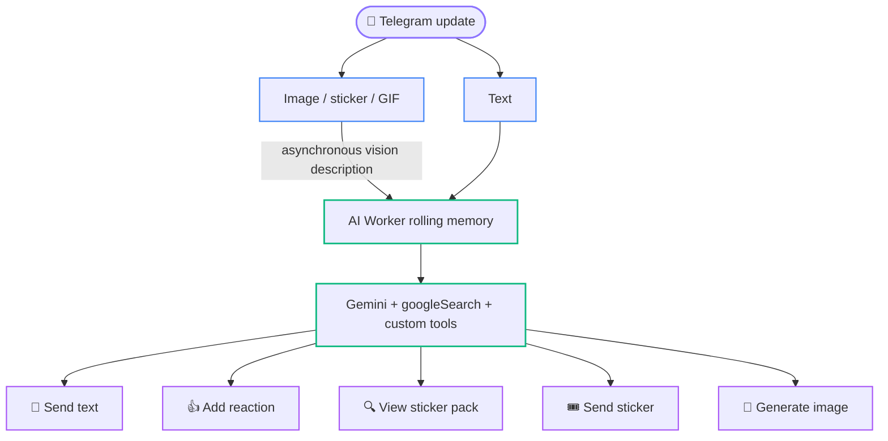
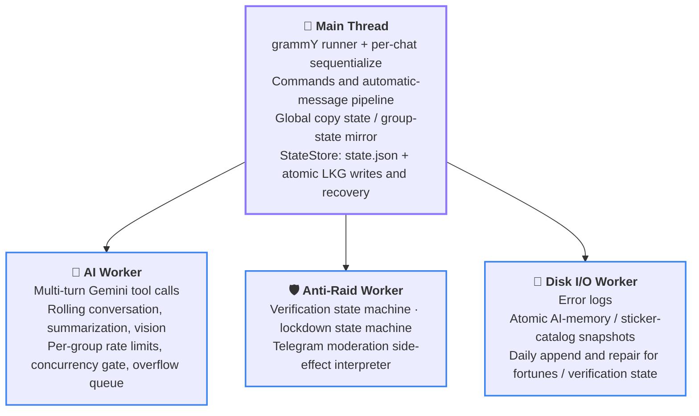

<div align="center">

<p><a href="README.md">简体中文</a> · <b>English</b> · <a href="README.ja.md">日本語</a></p>

<picture>
  <source media="(prefers-color-scheme: dark)" srcset="docs/assets/banner_dark.jpg">
  <source media="(prefers-color-scheme: light)" srcset="docs/assets/banner_light.jpg">
  
</picture>

<h1>
  <a href="https://t.me/copy_ninjia_bot"></a>
  Copy Ninjia
</h1>

**A Telegram group-chat bot that steals avatars, copies messages, sees images, guards groups, and roasts people with a straight face**

**A pure-AI development project with 100% AI-written code** — the human designs the architecture and reviews every commit together with AI

<p align="center">
  <a href="https://bun.sh/"></a>
  <a href="https://www.typescriptlang.org/"></a>
  <a href="https://grammy.dev/"></a>
  <a href="https://ai.google.dev/"></a>
</p>

<p align="center">
  <a href="#-pure-ai-development"></a>
  <a href="#-pure-ai-development"></a>
  <a href="#-development"></a>
  <a href="#-development"></a>
  <a href="LICENSE"></a>
</p>

Message copying and personality mimicry are only the surface. Underneath is a multi-Worker group-chat automation system with recovery, bounded caches, and race protection.

---

🧬 [Pure AI Development](#-pure-ai-development) • ✨ [Features](#-features) • 🎭 [Copy Modes](#-copy-modes) • 🧠 [AI Pipeline](#-ai-pipeline) • 🛡️ [Join Verification and Anti-Raid](#️-join-verification-and-anti-raid)<br>
🎮 [Commands and Permissions](#-commands-and-permissions) • 🚀 [Quick Start](#-quick-start) • 🏗️ [Architecture](#️-architecture) • 💾 [Data and Reliability](#-data-and-reliability) • 🧪 [Development](#-development)

</div>

---

## 🧬 Pure AI Development

Every line of production code, every test case, and this README itself was written by AI. The human does not write code, but has never left the room: they design the architecture and review every commit together with AI.

<table width="100%">
<tr><th width="14%" align="left">Stage</th><th width="32%" align="left">Who</th><th width="54%" align="left">What they do</th></tr>
<tr><td>📐&nbsp;Architecture</td><td><b>Asashishi</b>, the project's only human</td><td>Designs and decides system boundaries, Worker decomposition, persistence, and recovery strategy</td></tr>
<tr><td>⌨️&nbsp;Implementation</td><td><b>Claude Code</b> · <b>Codex</b> · <b>Antigravity</b></td><td>Writes 100% of production code, tests, and documentation</td></tr>
<tr><td>🧾&nbsp;Commit review</td><td><b>Asashishi</b> × AI</td><td>Every commit is reviewed jointly by human and AI before entering the repository</td></tr>
<tr><td>🔬&nbsp;Repository audits</td><td>Frontier models including <b>Fable 5</b> and <b>GPT-5.6 (Sol)</b></td><td>Conduct multiple cross-reviews of the entire codebase; findings become hardening commits</td></tr>
<tr><td>🛰️&nbsp;Safety exercises</td><td>The same frontier models</td><td>Review production scenarios such as crash recovery, concurrency races, hostile input, and resource exhaustion</td></tr>
</table>

Review is not a one-time ceremony. Conclusions from commit-by-commit human/AI review, repeated full-repository audits, and safety exercises flow back into new constraints. Many of the bounded caches, atomic persistence paths, crash self-healing mechanisms, and race protections below grew out of that process.

## ✨ Features

<table width="100%">
<tr>
<td align="left" valign="top" width="33%">
  <p><b>🪞 Precise copying</b></p>
  <p>Lock onto a user or channel and reproduce every message in one of four modes: unchanged, reversed, suffixed with “nya~,” or translated into Japanese.</p>
</td>
<td align="left" valign="top" width="33%">
  <p><b>🥷 Avatar theft</b></p>
  <p><code>/copy</code> synchronizes the target avatar automatically, while <code>/steal_icon</code> copies only the avatar without enabling copy state.</p>
</td>
<td align="left" valign="top" width="33%">
  <p><b>🤖 AI group chat</b></p>
  <p>Gemini persona-based replies with live search and tool calls, handling text, stickers, reactions, and related interactions through one pipeline.</p>
</td>
</tr>
<tr>
<td align="left" valign="top">
  <p><b>👁️ Multimodal understanding and image generation</b></p>
  <p>Understands images, animated stickers, and GIF frames, and can generate new images or intelligently edit existing media on request.</p>
</td>
<td align="left" valign="top">
  <p><b>🧠 Group-chat memory</b></p>
  <p>Maintains 75–150 rolling context messages plus multi-round compressed summaries, tracks bounded multi-level reply chains, and recovers reliably through atomic persistence.</p>
</td>
<td align="left" valign="top">
  <p><b>🛡️ Join verification</b></p>
  <p>Gives new members a 90-second button challenge, with allowlisted guarantors, exemptions for administrator invitations, and discussion-group awareness.</p>
</td>
</tr>
<tr>
<td align="left" valign="top">
  <p><b>🚨 Anti-Raid</b></p>
  <p>Monitors join rates, locks group invitations and removes suspicious members at the threshold, then restores state seamlessly after restart.</p>
</td>
<td align="left" valign="top">
  <p><b>🎲 Daily fortune</b></p>
  <p>Uses Inline Mode for deterministic draws, with a daily hash key that keeps state and signed receipts consistent across restarts.</p>
</td>
<td align="left" valign="top">
  <p><b>🌐 Cross-group moderation</b></p>
  <p><code>/kick</code> synchronously bans a target across every known group where the bot is an administrator, forming one coordinated defense.</p>
</td>
</tr>
</table>

## 🎭 Copy Modes

The copy target is global: one instance can “become” only one target at a time, although copying occurs only in the group where the command was issued. `/stop_copy` can stop the current copy state from any group.

| Command | Behavior |
| :---: | :--- |
| `/copy` | Reproduce messages unchanged |
| `/r_copy` | Reverse plain text by grapheme cluster |
| `/nya_copy` | Append “nya~” to plain text |
| `/ja_copy` | Translate into Japanese with Google Cloud Translate before copying |
| `/steal_icon` | Copy only the avatar |
| `/stop_copy` | Stop the global copy state |

Choose a target by replying to their message or providing `@username`. Username lookup depends on the bot having observed the account previously; rename, username removal, or username reassignment immediately invalidates the old alias. For destructive operations such as `/kick`, prefer replying to the target rather than relying on historical usernames. Ordinary users have a 5-minute cooldown on copy-family commands; users in `PRIVILEGED_USERS_ID` are exempt.

## 🧠 AI Pipeline

> [!NOTE]
> AI chat is disabled per group by default. The super administrator enables it with `/ai_chat enable`. While disabled, the group conversation is not recorded and no AI requests are made.



<table width="100%">
<tr><th width="13%" align="left">Dimension</th><th width="87%" align="left">Policy</th></tr>
<tr><td>🧩&nbsp;Models</td><td>Replies, summaries, and vision descriptions use <code>gemini-3.5-flash-lite</code>; image generation and editing use <code>gemini-3.1-flash-lite-image</code></td></tr>
<tr><td>🎯&nbsp;Triggers</td><td>Replying to the bot or mentioning <code>@bot</code> always triggers. Ordinary text and media evaluation share a dynamic probability based on group activity, with an additional 15-second random-trigger cooldown for the same sender in the same group. The current message enters the previous-hour window before calculation, so the first message in a cold group has probability 1/174; at 165 messages in the window, the floor is 1/10. Activity is memory-only and returns to cold start after one idle hour or a restart</td></tr>
<tr><td>🚦&nbsp;Per-group concurrency</td><td>At most five Gemini tool conversations may be in flight per group. When all concurrency slots are occupied, direct triggers enter a bounded queue and random triggers are dropped</td></tr>
<tr><td>⏱️&nbsp;Rate limit</td><td>At most 150 rounds may start per group in 5 minutes; the over-limit notice has its own cooldown</td></tr>
<tr><td>🔧&nbsp;Tools</td><td>Each request genuinely registers built-in <code>googleSearch</code> plus function tools for Tokyo weather, <code>send_message</code>, <code>add_reaction</code>, <code>view_sticker_pack</code>, <code>send_sticker</code>, <code>generate_image</code>, and more. A reply round may execute at most 20 custom function calls. The prompt requires search before action when verification is needed, and every group-visible text must pass explicitly through <code>send_message</code>. Final text after a successful image, sticker, or reaction is not treated as an extra message</td></tr>
<tr><td>🧠&nbsp;Memory</td><td>75–150 verbatim messages plus up to 7 × 75-message cold-history summaries, for roughly 600–675 messages total. Startup restoration loads only the latest 149 verbatim messages, reserving the next rotation boundary. The Worker keeps at most 100 groups resident; overflow evicts least-recently-active groups and deletes their disk snapshots, preferring not to evict a group with an active reply round</td></tr>
</table>

<details>
<summary><b>🧱 Input construction and transcription</b>—exact rules for request sections, identity markers, reply chains, and time injection</summary>
<br>
<table width="100%">
<tr><th width="13%" align="left">Dimension</th><th width="87%" align="left">Policy</th></tr>
<tr><td>🧱&nbsp;Input boundaries</td><td>The initial Gemini request uses one <code>user Content</code> containing three independent ordered <code>text Part</code> values: read-only reference memory, read-only current conversation, and the current reply task. Each section has explicit start/end tags and local constraints. <code>systemInstruction</code> additionally declares that the first two sections are data and only the final section is the task. Later tool turns retain their true <code>model/user</code> roles</td></tr>
<tr><td>🧾&nbsp;Transcript markers</td><td>Each verbatim message line includes <code>message_id</code> and sender <code>id</code>/<code>username</code>. Explicit replies embed the replied-to identity, original text, and exact quoted fragment. Forwarded messages mark their original source—user, hidden account, group, or channel—with available <code>id</code>/<code>username</code>. If the replied-to original was forwarded, its source is marked separately inside the reply quote, and prompt rules distinguish attribution by marker nesting. Automatic copies of channel posts into discussion groups are not marked as forwards. Assembly and the prompt's format description use the same templates to prevent drift</td></tr>
<tr><td>🧵&nbsp;Reply chains</td><td>When the trigger belongs to at least a two-level reply relationship, the task additionally lists a path of at most 15 hops. Every hop retains <code>message_id</code>, sender identity, forward origin, and up to 500 characters of text. If the original at the tail has left verbatim memory, the previous hop's snapshot of at most 500 characters is used and explicitly marked <code>[仅回复快照]</code>; the transcript does not claim that the full original remains available. The bot records its own text and images only from Telegram's actual reply relationship: a deleted target or a send degraded to an ordinary message creates no synthetic edge. If the target merely leaves the hot region while queued or generating, the bounded trigger snapshot captured before the round continues the chain</td></tr>
<tr><td>🕰️&nbsp;Time</td><td>Every request injects the current Tokyo time, and every transcript message keeps its recorded timestamp</td></tr>
</table>
</details>

<details>
<summary><b>🖼️ Multimodality, image generation, and moods</b>—media capacity, generation eligibility and cooldown, and the mood system</summary>
<br>
<table width="100%">
<tr><th width="13%" align="left">Dimension</th><th width="87%" align="left">Policy</th></tr>
<tr><td>🖼️&nbsp;Multimodality</td><td>Image descriptions are at most 125 characters; sticker/GIF descriptions at most 100. Downloads, transcoding, and vision descriptions for chat media share up to 75 execution slots and a 150-item waiting queue with downloads and transcoding for image-generation references. Media absent from the local sticker catalog share a 1,500-item LRU deduplication cache; hits renew recency, overflow evicts the least-recently-used entry, and there is no TTL. Descriptions for configured packs in <code>memory/stickers/</code> remain resident after startup and change only when online reconciliation finds a pack update; matching group stickers hit this catalog directly</td></tr>
<tr><td>🎨&nbsp;Image generation</td><td>The tool is available only to direct replies or <code>@bot</code> mentions, and the model calls it only when the current message explicitly requests image generation or editing. Images or stickers in the current or replied-to message may serve as short-lived references for the round but never enter rolling memory or disk. Ordinary users share a 3-minute cooldown per group; <code>SUPER_ADMIN_USER_ID</code> is exempt. Failures before the model call—reference download, queueing, expiration—release the reservation. Once the model request starts, the cooldown remains even if generation or sending fails. Output is fixed at 1K</td></tr>
<tr><td>🎭&nbsp;Moods</td><td>The AI Worker keeps one independent mood per group for a random 2–4 hours. On natural expiry, it adjusts weights by Tokyo weather and time of day and rerolls. Moods are not persisted and are reconstructed on demand after Worker restart. The super administrator may use <code>/switch_mood</code> to reroll an AI-enabled group immediately. A Worker acknowledgement with a 5-second deadline confirms the command, so an expired queued request cannot arrive late and mutate the mood</td></tr>
</table>
</details>

<details>
<summary><b>🛡️ Safety filtering and summarization backpressure</b>—safety settings and bounded degradation under compression load</summary>
<br>
<table width="100%">
<tr><th width="13%" align="left">Dimension</th><th width="87%" align="left">Policy</th></tr>
<tr><td>🛡️&nbsp;Safety filtering</td><td>Google's configurable harassment, hate, sexually explicit, and dangerous-content categories are all set to <code>BLOCK_NONE</code>; the application does not reject by probability level. Non-configurable core-harm protections and server-side Gemini API policies still apply</td></tr>
<tr><td>🗜️&nbsp;Summarization backpressure</td><td>Each group has at most 25 running-plus-queued compression tasks, giving bounded degradation during long API slowdowns instead of accumulating message batches without limit</td></tr>
</table>
</details>

The base persona is [`prompt/persona.md`](prompt/persona.md). Runtime interaction rules coupled to transcript format, identity markers, and reply-target resolution are injected with `systemInstruction`. Sticker packs and reaction sets live in [`config/stickers.json`](config/stickers.json) and [`config/reactions.json`](config/reactions.json). Mood tiers—copy, weight, and weather/time multipliers, with positive-integer weights totaling exactly 100—live in [`config/mood.json`](config/mood.json).

<p align="right"><sub><a href="#copy-ninjia">⬆️ Back to top</a></sub></p>

## 🛡️ Join Verification and Anti-Raid

> [!NOTE]
> Group protection runs only while the bot is a group administrator. Without permissions to delete messages and remove users, it will not pretend to start a process that cannot succeed.

- **Verification window**: a new member receives a full 90 seconds after the button reminder is actually sent. Timeout deletes messages tracked during verification and removes the member without permanently banning them. Failed reminders retry with bounded backoff; if one never lands, timeout only extends the window and retries instead of kicking.
- **Spam circuit breaker**: each pending member has an independent 60-second message count. On message 46, the bot removes the member first, then makes a best effort to delete every tracked message.
- **Identity exemptions**: administrators and owners, plus members invited by an administrator or allowlisted user, may be exempt. Other bots must also verify, but an allowlisted user may click on their behalf as guarantor.
- **Discussion awareness**: linked-channel discussion groups recognize automatic joins caused by comments and replies. A member who actually commented or replied is exempt; someone who only clicked into the group from the discussion area is verified normally and is removed immediately during lockdown. Direct comments and nested replies receive the same exemption. During a cold association-cache lookup, a nested reply is first tracked as an ordinary message and becomes exempt only after `getChat` explicitly confirms the linked channel; lookup failure does not grant access.
- **Anti-Raid lockdown**: when more than 45 users join within the last 60 seconds, the group enters a 5-minute lockdown that temporarily disables invitations by ordinary members.
- **Crash recovery**: pending state, unexpired message windows, and terminal-action progress are written to `memory/anti-raid/YYYY-MM-DD.json`. Current active records require `phase` and `trackedMessageTimes`. After a Worker or process rebuild, they continue from the remaining time under the original `expiresAt`. Reminder IDs are business-optional and remain empty until delivery succeeds; recovery redelivers first and resets a full window, never kicking without a reminder. A successful kick announcement is not repeated during crash replay after its persistence acknowledgement. Only the current Tokyo-day file is retained.
- **Permission self-healing**: permission writes are serialized per group and failed restoration retries every 30 seconds. Lockdown state is mirrored in `state.json`, so its remaining duration survives process restart.
- **Bounded caches**: administrator and linked-channel caches have TTLs, a 500-group hard cap, and periodic eviction; they do not grow with all historical groups. The recent-comment association cache retains entries for only 2 minutes and at most 5,000 globally. It reuses the Anti-Raid Worker's single periodic sweeper rather than creating a timer for every member.

<p align="right"><sub><a href="#copy-ninjia">⬆️ Back to top</a></sub></p>

## 🎮 Commands and Permissions

<table width="100%">
<tr><th width="26%" align="left">Command</th><th width="19%" align="center">Permission</th><th width="55%" align="left">Description</th></tr>
<tr><td><code>/copy</code> <code>/r_copy</code> <code>/nya_copy</code> <code>/ja_copy</code></td><td align="center">Group member</td><td>Start the corresponding copy mode</td></tr>
<tr><td><code>/stop_copy</code></td><td align="center">Group member</td><td>Stop the current global copy state</td></tr>
<tr><td><code>/steal_icon</code></td><td align="center">Group member</td><td>Steal only the avatar</td></tr>
<tr><td><code>/quiet [1-15]</code></td><td align="center">Group member</td><td>Pause proactive behavior such as random interjections and random copying; defaults to 3 minutes</td></tr>
<tr><td><code>/unquiet</code></td><td align="center">Group member</td><td>End quiet mode early</td></tr>
<tr><td><code>/kick</code></td><td align="center"><code>PRIVILEGED_USERS_ID</code></td><td>Permanently ban the target in every known group administered by the bot</td></tr>
<tr><td><code>/ai_chat enable|disable</code></td><td align="center"><code>SUPER_ADMIN_USER_ID</code></td><td>Enable or disable AI chat in this group</td></tr>
<tr><td><code>/switch_mood</code></td><td align="center"><code>SUPER_ADMIN_USER_ID</code></td><td>Immediately reroll the mood in an AI-enabled group and reply with the new mood name after explicit Worker acknowledgement</td></tr>
<tr><td><code>/ja_copy enable|disable</code></td><td align="center"><code>SUPER_ADMIN_USER_ID</code></td><td>Enable or disable Japanese translation in this group; disabled by default</td></tr>
<tr><td><code>/init enable|disable</code></td><td align="center"><code>SUPER_ADMIN_USER_ID</code></td><td>Enable or disable the entire business-processing entry point for this group</td></tr>
<tr><td><code>/send &lt;chat-id&gt;</code> <code>/send finish</code></td><td align="center"><code>SUPER_ADMIN_USER_ID</code>, private chat only</td><td>Start or finish a relay session in the bot's private chat; every message sent there during the session is forwarded unchanged to the target group exactly once</td></tr>
</table>

Before `/send` begins, it probes the target once for reachability. If the target becomes unavailable during a session, the relay ends automatically and reports the failure. Relay state is persisted in `state.json` and survives restart. The command is absent from Telegram's command menu; group invocations and invocations by anyone else receive no response.

> [!TIP]
> `/luck_challenge` is not a slash command. In any chat, type `@bot_username [requested topic]` to use Inline Mode. Enable Inline Mode in BotFather and preferably set `/setinlinefeedback` to 100%. Inline queries use a global sliding-window limit of at most 300 responses per 90 seconds.

<p align="right"><sub><a href="#copy-ninjia">⬆️ Back to top</a></sub></p>

## 🚀 Quick Start

### 1. Environment

- Linux with a readable `/proc`; the instance lock fails closed elsewhere
- Bun 1.3+
- Telegram Bot Token
- Gemini API Key
- Google Cloud service-account JSON, only for `/ja_copy`

<details>
<summary><b>📦 Hardware reference</b> (expand by deployment scale)</summary>

<table width="100%">
<tr><th width="33%" align="left">Deployment scale</th><th width="26%" align="left">Suggested resources</th><th width="41%" align="left">Notes</th></tr>
<tr><td>Starter: low activity, mostly text, AI enabled in only a few groups</td><td>2 vCPU / 2 GB RAM / local SSD</td><td>Works, but Workers compete for CPU; unsuitable for 15 active groups or media bursts</td></tr>
<tr><td>Light production: mostly text, AI enabled in only a few groups</td><td>4 vCPU / 2 GB RAM / local SSD</td><td>2 GB is not a memory guarantee during media bursts</td></tr>
<tr><td>Recommended production: about 15 active groups with 1,000–3,000 members each</td><td>4 vCPU / 4 GB RAM / local SSD</td><td>—</td></tr>
<tr><td>AI enabled everywhere with frequent images and stickers</td><td>4 vCPU / 8 GB RAM</td><td>Leaves burst capacity for media downloads, Base64 encoding, and image transcoding</td></tr>
</table>

A single instance should still stay near 15 active groups of the scale above. The main constraints are the single Telegram Bot API, Gemini quotas, and actual message/media throughput rather than total membership.

</details>

### 2. Installation

```bash
git clone https://github.com/Asashishi/copy_ninjia.git
cd copy_ninjia
bun install
cp .env.example .env
```

### 3. Configuration

Fill `.env` according to [`.env.example`](.env.example). `TELEGRAM_BOT_TOKEN`, `GEMINI_API_KEY`, and one decimal `SUPER_ADMIN_USER_ID` are required. `PRIVILEGED_USERS_ID` may be empty; separate multiple IDs with ASCII commas.

`COPY_NINJIA_DATA_ROOT` optionally selects a separate root for generated runtime data. When set, `state.json`, `bot.lock`, `logs/`, and `memory/` are derived from it; the persona, sticker/reaction/mood configuration, and `g-auth.json` still come from the project root. When empty, runtime data remains in the project root. Parallel bot deployments must use different data roots.

Before network access or Worker creation, the program recursively creates the directory and verifies write, file-fsync, same-directory hard-link, atomic-rename, and directory-fsync capabilities. Missing capabilities abort startup with the actual path. Production deployment tools should pre-create the directory for the runtime account. On a systemd host:

```bash
sudo install -d -o copy-ninjia -g copy-ninjia -m 0750 /var/lib/copy-ninjia
```

Then set `Environment=COPY_NINJIA_DATA_ROOT=/var/lib/copy-ninjia`. In containers, mount the same path as a persistent volume and set its owner on the host or in an init container before the image starts. Do not place `memory/` on an ephemeral layer. Backups should cover the complete data root while the bot is stopped or at a storage-snapshot consistency boundary.

Configure up to 5 sticker packs in [`config/stickers.json`](config/stickers.json). The AI may inspect all 5 sequentially in a round, but will view the same pack only once per round.

For Japanese translation, save the Google Cloud service-account key as `g-auth.json` in the project root. Both `.env` and `g-auth.json` are ignored by Git.

Telegram also requires feature-specific configuration:

1. Disable Bot Privacy Mode so the bot can observe full group messages and copy ordinary members.
2. Grant permissions to delete messages, ban members, and manage the group so join verification and Anti-Raid can run.
3. Enable Inline Mode for fortune draws.
4. Prefer 100% inline feedback so `chosen_inline_result` is the primary confirmation and persistence path; signed in-message receipts remain a supplementary path.

### 4. Start and Check

```bash
bun run check     # ESLint + strict TypeScript + full-source coverage tests
bun run start     # start long polling
```

After first adding the bot to a group, have `SUPER_ADMIN_USER_ID` run:

```text
/init enable
/ai_chat enable
```

<p align="right"><sub><a href="#copy-ninjia">⬆️ Back to top</a></sub></p>

## 🏗️ Architecture



Key directories:

<table width="100%">
<tr><th width="18%" align="left">Path</th><th width="82%" align="left">Responsibility</th></tr>
<tr><td><code>src/app/</code></td><td>Startup/shutdown lifecycle, handler registration, command menu</td></tr>
<tr><td><code>src/commands/</code></td><td>Explicit command handling</td></tr>
<tr><td><code>src/auto/</code></td><td>Automatic copying, AI recording and triggers, reaction synchronization</td></tr>
<tr><td><code>src/copy/</code></td><td>Copy-mode transformations and execution queues for avatar sync, reactions, and Japanese translation</td></tr>
<tr><td><code>src/users/</code></td><td>Sender-identity cache, visible-sender resolution, user-label generation</td></tr>
<tr><td><code>src/states/</code></td><td>I/O-free verification and lockdown transitions plus reply-admission rules</td></tr>
<tr><td><code>src/config/</code></td><td>Strict schemas, lazy loading, and startup validation for sticker/reaction/mood configuration</td></tr>
<tr><td><code>src/libs/</code></td><td>Atomic files, bounded I/O, generic schema helpers, and concurrency tools</td></tr>
<tr><td><code>src/workers/</code></td><td>Three independent Workers for AI, group protection, and disk I/O</td></tr>
<tr><td><code>src/ai/</code></td><td>Gemini, vision, sticker catalog, and tools</td></tr>
<tr><td><code>src/infra/</code></td><td>Telegram client, Worker hosts, and persistence infrastructure; <code>storage/</code> owns the instance lock, state store, and startup cleanup</td></tr>
<tr><td><code>src/cache/</code></td><td>Domain-specific runtime-state containers</td></tr>
<tr><td><code>src/consts/</code></td><td>Tunable constants and paths</td></tr>
<tr><td><code>src/types/</code></td><td>Cross-module protocols, domain types, and state-machine contracts corresponding to <code>states/</code></td></tr>
<tr><td><code>test/</code></td><td>Bun unit tests mirroring source structure</td></tr>
</table>

<p align="right"><sub><a href="#copy-ninjia">⬆️ Back to top</a></sub></p>

## 💾 Data and Reliability

All locations below are relative to the runtime data root, which defaults to the project root and can be changed with `COPY_NINJIA_DATA_ROOT`.

<table width="100%">
<tr><th width="21%" align="left">Data</th><th width="17%" align="left">Location</th><th width="62%" align="left">Write policy</th></tr>
<tr><td>Group state / copy state / lockdown mirror</td><td><code>state.json</code>, <code>state.json.bak</code></td><td>Retains only “currently writing” and “latest pending” in-memory snapshots. Every save writes a temporary file, fsyncs, and atomically renames the primary before the LKG backup. Authoritative command-switch, relay, copy, and similar changes wait for their revision to reach both copies before reporting success and allowing update acknowledgement. Exhausting bounded retries stops update intake and exits with failure. Derived metadata such as group titles may still coalesce in the background. Current lockdown mirrors require <code>phase</code> and a positive <code>intentId</code>. On startup, a strictly valid backup restores an invalid primary; if both are invalid, startup fails while retaining the originals</td></tr>
<tr><td>AI group-chat memory</td><td><code>memory/ai/</code></td><td>One snapshot per group, every 30 seconds plus shutdown flush. Per-group upserts/deletes carry monotonic revisions; delete intent remains until durable-unlink acknowledgement and replays after Disk I/O Worker reconstruction. Startup hydrates only explicitly AI-enabled groups and removes stale snapshots for disabled groups. Recovery retains the latest 149 verbatim messages and 7 cold-summary rounds under current capacity. Every current hot message requires a positive <code>message_id</code>; reply-chain indexes are derived only from the hot region, rebuilt during hydrate, and never persisted separately</td></tr>
<tr><td>Sticker-description catalog</td><td><code>memory/stickers/</code></td><td>One atomic snapshot per pack. Restored descriptions remain memory-resident, update during online pack reconciliation, and are reused when parsing group messages</td></tr>
<tr><td>Daily fortunes</td><td><code>memory/luck/</code></td><td>Results append incrementally by Tokyo date with tail-truncation repair. <code>receipt-secret.json</code> atomically stores the day's deterministic-draw/HMAC key with mode <code>0644</code>, readable by ordinary users and writable only by the owner</td></tr>
<tr><td>Pending members</td><td><code>memory/anti-raid/</code></td><td>The current-day JSON appends by <code>chatId:userId</code>. Active records require <code>phase</code> and <code>trackedMessageTimes</code>. Ordinary updates coalesce for 250ms, creation writes immediately, and completion appends a tombstone. At 4 MiB or 10,000 historical entries, it compacts the active snapshot; date rollover removes old files</td></tr>
<tr><td>Error logs</td><td><code>logs/</code></td><td>Appended centrally in batches by the Disk I/O Worker</td></tr>
<tr><td>Runtime instance</td><td><code>bot.lock</code></td><td>Atomically maintained single-instance owner lock for the data directory</td></tr>
</table>

> [!WARNING]
> `memory/` contains verbatim group-chat content and the fortune-receipt key, so treat it as sensitive:
>
> - By deployment convention, JSON files use mode `0644` and are readable by ordinary system users. Restrict access with data-root ownership and permissions plus host-account isolation, and control backup scope and retention.
> - A backup of today's fortunes must include `memory/luck/receipt-secret.json` and the current-day result file in the same consistent snapshot. The key is never logged.
> - `logs/`, `memory/`, primary and backup state copies, quarantined `.corrupt` files, credentials, and runtime locks are never committed to Git.

The pending-verification hot path reuses the JSON tail-append mechanism already used by daily fortunes and logs, avoiding whole-file rewrites and additional I/O threads. Completion records append linearly as `null` tombstones. Tail repair scans JSON structure boundaries and therefore preserves the last complete tombstone instead of resurrecting completed verification. Only date rollover or a history threshold atomically compacts the current active mirror. Every append batch fsyncs before success acknowledgement. Synchronous file operations stay in the Disk I/O Worker and never block the Telegram update thread.

> [!IMPORTANT]
> Persistence schema changes are not migrated automatically at runtime. Before deploying a structural change, migrate `state.json`, `state.json.bak`, and the corresponding `memory/` snapshots together. StateStore uses the strictly valid primary or backup to refresh the other. If neither state copy matches the current structure, startup fails without modifying either, preventing partial or empty state from overwriting real data. A single damaged copy is permanently quarantined under a unique `.corrupt` name for investigation.

`bot.lock` accepts only the strict `v2:pid:starttime:boot_id:sha256(token)` format, with `starttime` from field 22 of `/proc/<pid>/stat`. The data directory is globally exclusive: only a matching PID, starttime, and boot ID count as the same live owner. After PID reuse or machine restart, a stale current-format v2 owner is removed during the next startup or exit. `.guard` and `.recovery` likewise accept only `v2:pid:starttime:boot_id`; `.candidate.*` files are hard-link protocol candidates, and `.tmp` files are temporary atomic rewrites of state or the lock registry. Normal operations remove them.

The instance lock explicitly depends on Linux `/proc` and remains fail-closed if reading or parsing fails. Legacy `pid:sha256(token)` registries, PID-only guard/recovery files, unknown formats, and damaged formats are neither read compatibly, migrated automatically, nor cleaned up by guessing from PID. The program preserves the original and refuses startup; stop related processes and handle the file manually.

The token fingerprint identifies the lock owner; it is not a data-isolation boundary. Parallel bots need separate project directories or a distinct `COPY_NINJIA_DATA_ROOT` per instance.

Reliability guardrails are layered:

- **Input and validation**—official SDK type boundaries; field-by-field validation of configuration and persisted JSON; streaming byte limits on JSON APIs and media downloads.
- **Concurrency and capacity**—shared Telegram API throttling/retry and required per-chat serialization; a hard-capped reaction queue; one avatar execution slot with latest-only coalescing; bounded media execution, queue, and LRU capacity; bounded drain for cancellable background owners.
- **Persistence and recovery**—data-root capability preflight and single-instance lock; append-batch fsync and atomic persistence; AI delete revisions/tombstones; stale AI-round side-effect fencing; rate-limited Worker crash recovery; strict restoration.

Cross-module lifecycle rules are in [`docs/en/04-invariants.md`](docs/en/04-invariants.md).

Historical group-title backfill runs only after critical startup handshakes and the update runner are ready, with at most 15 concurrent `getChat` calls. The shared throttler continues to govern the global Telegram rate; the title owner's limit bounds low-priority head-of-line occupancy.

<p align="right"><sub><a href="#copy-ninjia">⬆️ Back to top</a></sub></p>

## 🧪 Development

<div align="center">

🚀&nbsp;**794**&nbsp;tests passing &nbsp;·&nbsp; 📂&nbsp;**117**&nbsp;test files &nbsp;·&nbsp; 🔬&nbsp;**7,586**&nbsp;assertions &nbsp;·&nbsp; 🎯&nbsp;function coverage&nbsp;**93.91%** &nbsp;·&nbsp; 📈&nbsp;line coverage&nbsp;**95.78%**

</div>

```bash
bun run typecheck
bun run test
bun run check
bun run test:fault-injection
```

Before building a container image or deploying, run `bun run release:check`. It performs a frozen-lockfile install, complete lint/typecheck/coverage tests, and the deterministic fault-injection suite; any failure returns nonzero. This repository does not rely on GitHub Actions, so release environments should use that command as an explicit build or pre-deploy step. A networked release environment should also run `bun run audit:release`. Network failure means the audit was not completed, not that there are zero vulnerabilities. Ignored CVEs require a recorded reason and expiration date.

> [!IMPORTANT]
> Tests must run through `bun run test`, which forces file isolation so `mock.module` and module-level state cannot contaminate other test files. Before any production module loads, the test preload creates a separate temporary data root for each isolate. Real unmocked file I/O therefore never touches production `state.json`, `bot.lock`, `logs/`, or `memory/`, and the temporary directory is removed afterward.

- **Strict checks**: the project enables `strict`, `noUncheckedIndexedAccess`, `noUnusedLocals`, `noUnusedParameters`, and related checks.
- **Coverage definition**: `bun run check` includes every production runtime module in the denominator. A module untouched by targeted tests counts as 0%; both function and line coverage must remain at least 90%.
- **Current main-branch measurements**: 794 tests across 117 files pass with 7,586 assertions, **93.91%** function coverage, and **95.78%** line coverage, with all source code—not only touched files—in the denominator.
- **Code-placement conventions**: shared protocols and state-machine contracts belong in `src/types/`; tunable values in `src/consts/`; runtime state in the relevant `src/cache/`; pure state transitions in `src/states/`. Business files should not grow free-floating state.
- **In-depth docs**: see [`docs/en/`](docs/en/README.md) for environment setup, architecture, modification recipes, and operations.

---

<div align="center">

**Copy Ninjia — not merely repeating a message, but stealing the whole group-chat scene and performing it again.**

*The human never wrote a line of code, but never left the stage: after drawing the blueprints, they reviewed every commit together with AI.*

</div>
