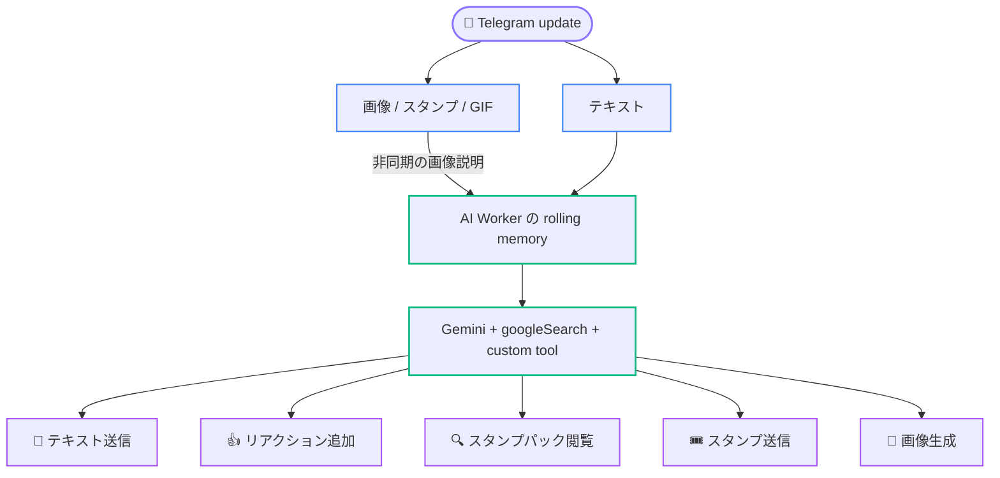
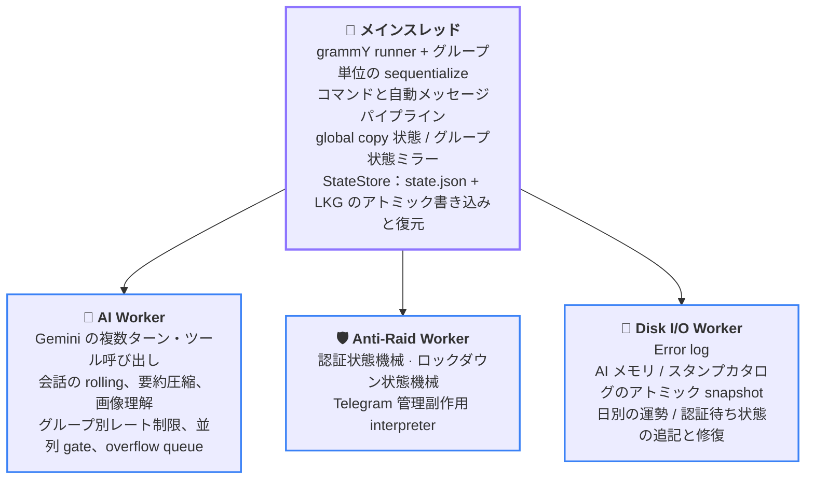

<div align="center">

<p><a href="README.md">简体中文</a> · <a href="README.en.md">English</a> · <b>日本語</b></p>

<picture>
  <source media="(prefers-color-scheme: dark)" srcset="docs/assets/banner_dark.jpg">
  <source media="(prefers-color-scheme: light)" srcset="docs/assets/banner_light.jpg">
  
</picture>

<h1>
  <a href="https://t.me/copy_ninjia_bot"></a>
  Copy Ninjia
</h1>

**アバターを盗み、メッセージを真似し、画像を見て、グループを守り、真顔で悪口まで言う Telegram グループチャット Bot**

**コードの 100% を AI が書いた純 AI 開発プロジェクト** — 人間はアーキテクチャを設計し、AI と共同で全コミットをレビュー

<p align="center">
  <a href="https://bun.sh/"></a>
  <a href="https://www.typescriptlang.org/"></a>
  <a href="https://grammy.dev/"></a>
  <a href="https://ai.google.dev/"></a>
</p>

<p align="center">
  <a href="#pure-ai-development"></a>
  <a href="#pure-ai-development"></a>
  <a href="#development"></a>
  <a href="#development"></a>
  <a href="LICENSE"></a>
</p>

メッセージの copy と人格模倣は表面にすぎません。その下には、複数 Worker、復元機能、上限付き cache、競合対策を備えたグループチャット自動化システムがあります。

---

🧬 [純 AI 開発](#pure-ai-development) • ✨ [機能](#features) • 🎭 [Copy モード](#copy-modes) • 🧠 [AI パイプライン](#ai-pipeline) • 🛡️ [参加認証と Anti-Raid](#join-verification-and-anti-raid)<br>
🎮 [コマンドと権限](#commands-and-permissions) • 🚀 [クイックスタート](#quick-start) • 🏗️ [アーキテクチャ](#architecture) • 💾 [データと信頼性](#data-and-reliability) • 🧪 [開発](#development)

</div>

---

<a id="pure-ai-development"></a>

## 🧬 純 AI 開発

このリポジトリの production コード、テストケース、そして README 自体も、すべて AI が書いています。人間はコードを書きませんが、決して席を外してはいません。アーキテクチャを設計し、すべてのコミットを AI と共同でレビューします。

<table width="100%">
<tr><th width="14%" align="left">工程</th><th width="32%" align="left">担当</th><th width="54%" align="left">内容</th></tr>
<tr><td>📐&nbsp;アーキテクチャ設計</td><td><b>Asashishi</b>（このプロジェクト唯一の人間）</td><td>システム境界、Worker 分割、永続化、復元戦略の設計と判断</td></tr>
<tr><td>⌨️&nbsp;実装</td><td><b>Claude Code</b> · <b>Codex</b> · <b>Antigravity</b></td><td>production コード、テスト、ドキュメントの 100%</td></tr>
<tr><td>🧾&nbsp;コミットレビュー</td><td><b>Asashishi</b> × AI</td><td>全コミットを人間と AI が共同レビューしてからリポジトリへ格納</td></tr>
<tr><td>🔬&nbsp;リポジトリ全体の監査</td><td><b>Fable 5</b>、<b>GPT-5.6（Sol）</b> などの frontier model</td><td>コードベース全体を複数回クロスレビューし、発見事項を hardening commit に変換</td></tr>
<tr><td>🛰️&nbsp;安全性演習</td><td>同じ frontier model 群</td><td>crash recovery、並行処理競合、悪意ある入力、資源枯渇など production scenario を個別に検証</td></tr>
</table>

レビューは一度きりの儀式ではありません。コミット単位の人間・AI 共同レビューから、frontier model による複数回の全体監査と安全性演習まで、各層の結論が新しい制約として戻ってきます。以下に登場する上限付き cache、アトミック永続化、crash の自己修復、競合防止の多くは、この過程から生まれました。

<a id="features"></a>

## ✨ 機能

<table width="100%">
<tr>
<td align="left" valign="top" width="33%">
  <p><b>🪞 正確な copy</b></p>
  <p>ユーザーまたはチャンネルを対象にし、原文、反転、「にゃ〜」追加、日本語翻訳という 4 モードで各メッセージを再現します。</p>
</td>
<td align="left" valign="top" width="33%">
  <p><b>🥷 アバター盗用</b></p>
  <p><code>/copy</code> は対象のアバターを自動同期し、<code>/steal_icon</code> は copy 状態を開始せずアバターだけを複製します。</p>
</td>
<td align="left" valign="top" width="33%">
  <p><b>🤖 AI グループチャット</b></p>
  <p>Gemini のペルソナを使った返信、リアルタイム検索、ツール呼び出しにより、テキスト、スタンプ、リアクションなどを統一処理します。</p>
</td>
</tr>
<tr>
<td align="left" valign="top">
  <p><b>👁️ マルチモーダル理解と画像生成</b></p>
  <p>画像、アニメーションスタンプ、GIF frame を認識し、要求に応じて新しい画像を生成したり既存メディアを編集したりできます。</p>
</td>
<td align="left" valign="top">
  <p><b>🧠 グループチャットメモリ</b></p>
  <p>75～150 件の rolling context と複数 round の圧縮要約を維持し、上限付きの多層返信チェーンを追跡し、アトミック永続化から確実に復元します。</p>
</td>
<td align="left" valign="top">
  <p><b>🛡️ 参加認証</b></p>
  <p>新規メンバーに 90 秒のボタン認証を行い、許可ユーザーによる保証、管理者招待の免除、ディスカッショングループ認識に対応します。</p>
</td>
</tr>
<tr>
<td align="left" valign="top">
  <p><b>🚨 Anti-Raid</b></p>
  <p>参加頻度を監視し、しきい値でグループ招待をロックして疑わしいメンバーを処理し、再起動後も状態を継続します。</p>
</td>
<td align="left" valign="top">
  <p><b>🎲 今日の運勢</b></p>
  <p>Inline Mode で決定論的な抽選を行い、日単位の hash key により再起動後も状態と署名付き receipt の整合性を保ちます。</p>
</td>
<td align="left" valign="top">
  <p><b>🌐 複数グループの一括管理</b></p>
  <p><code>/kick</code> は Bot が管理する既知の全グループで対象を同期的に BAN し、一体化した防衛線を構築します。</p>
</td>
</tr>
</table>

<a id="copy-modes"></a>

## 🎭 Copy モード

copy 対象は global に 1 つだけです。同じ instance が同時に「なりきれる」対象は 1 つですが、copy はコマンドを実行したグループ内だけで行われます。`/stop_copy` はどのグループからでも現在の copy を停止できます。

| コマンド | 動作 |
| :---: | :--- |
| `/copy` | 原文のまま再現 |
| `/r_copy` | grapheme cluster 単位でプレーンテキストを反転 |
| `/nya_copy` | プレーンテキスト末尾に「にゃ〜」を追加 |
| `/ja_copy` | Google Cloud Translate で日本語に翻訳してから再現 |
| `/steal_icon` | アバターだけを複製 |
| `/stop_copy` | global copy 状態を停止 |

対象はメッセージへの返信または `@username` で指定します。username 検索は Bot が以前その account を観測したことに依存します。名前変更、username 削除、username の再割り当てがあると、古い alias は直ちに無効になります。`/kick` のような破壊的操作では履歴 username に依存せず、対象メッセージへの返信を優先してください。一般ユーザーには copy 系コマンドで 5 分の cooldown があり、`PRIVILEGED_USERS_ID` のユーザーは免除されます。

<a id="ai-pipeline"></a>

## 🧠 AI パイプライン

> [!NOTE]
> AI チャットはグループごとに既定で無効です。スーパー管理者が `/ai_chat enable` で有効化します。無効な間はそのグループの会話を記録せず、AI request も発生しません。



<table width="100%">
<tr><th width="13%" align="left">項目</th><th width="87%" align="left">方針</th></tr>
<tr><td>🧩&nbsp;モデル</td><td>返信、要約、画像説明には <code>gemini-3.5-flash-lite</code>、画像生成・編集には <code>gemini-3.1-flash-lite-image</code> を使用</td></tr>
<tr><td>🎯&nbsp;トリガー</td><td>Bot への返信または <code>@Bot</code> は必ずトリガー。通常テキストとメディア評価はグループ活動量に基づく動的確率を共有し、同じ送信者・同じグループには 15 秒のランダムトリガー cooldown も適用します。現在のメッセージを直近 1 時間の window に先に加えるため、cold group の最初の 1 件は 1/174、window 内 165 件で下限 1/10 です。活動量はメモリだけに保持し、1 時間 idle または再起動で cold start に戻ります</td></tr>
<tr><td>🚦&nbsp;グループ内並列</td><td>グループごとに実行中の Gemini tool conversation は最大 1 round。実行中の直接トリガーは上限付きキューに入り、ランダムトリガーは破棄します</td></tr>
<tr><td>⏱️&nbsp;レート制限</td><td>グループごとに 5 分間で最大 150 round を開始。超過通知自体にも cooldown があります</td></tr>
<tr><td>🔧&nbsp;ツール</td><td>同一 request に組み込み <code>googleSearch</code> を実際に登録し、東京の天気、<code>send_message</code>、<code>add_reaction</code>、<code>view_sticker_pack</code>、<code>send_sticker</code>、<code>generate_image</code> などの function tool を提供します。1 reply round で custom function call は最大 20 回。検証が必要な場合は行動前に検索すること、グループ向けテキストはすべて明示的に <code>send_message</code> を通すことを prompt で要求します。画像、スタンプ、リアクション成功後の最終本文は追加発言として扱いません</td></tr>
<tr><td>🧠&nbsp;メモリ</td><td>逐語メッセージ 75～150 件と、最大 7 × 75 件の cold history 要約により、合計約 600～675 件を保持。起動復元は最新の逐語メッセージ 149 件だけを読み、次の rotation 境界を予約します。Worker に常駐するグループは最大 100 件で、超過時は最終活動時刻から eviction して disk snapshot を削除し、返信 round 実行中のグループをできるだけ避けます</td></tr>
</table>

<details>
<summary><b>🧱 入力構築と transcript</b> — request 分割、identity marker、返信チェーン、時刻注入の厳密な規則</summary>
<br>
<table width="100%">
<tr><th width="13%" align="left">項目</th><th width="87%" align="left">方針</th></tr>
<tr><td>🧱&nbsp;入力境界</td><td>最初の Gemini request は 1 つの <code>user Content</code> に順序付きの独立した 3 つの <code>text Part</code> を持ちます。読み取り専用の参照メモリ、読み取り専用の現在会話、今回の返信タスクです。各 section に明確な開始・終了タグと局所制約があり、<code>systemInstruction</code> は最初の 2 section がデータで最後だけが実行タスクだと宣言します。後続の tool round は実際の <code>model/user</code> role のまま追加します</td></tr>
<tr><td>🧾&nbsp;Transcript marker</td><td>逐語メッセージの各行に <code>message_id</code> と送信者の <code>id</code>/<code>username</code> を記載します。明示的な返信には返信先の identity、原文、正確な引用部分を埋め込みます。転送メッセージには元の user、hidden account、group、channel と、利用可能な <code>id</code>/<code>username</code> を付けます。返信先の元メッセージが転送なら、その転送元を引用内に別記し、prompt は marker の入れ子から帰属を区別します。チャンネル投稿がディスカッショングループへ自動転送された複製は転送扱いしません。本文の組み立てと prompt の形式説明は同じ template を使い、ずれを防ぎます</td></tr>
<tr><td>🧵&nbsp;返信チェーン</td><td>トリガーメッセージに 2 階層以上の返信関係がある場合、最大 15 hop の経路を返信タスクへ追加します。各 hop は <code>message_id</code>、送信者 identity、転送元、本文最大 500 文字を保持します。末尾の元メッセージが逐語領域から外れた場合は、直前 hop が持つ最大 500 文字の snapshot を使い、<code>[仅回复快照]</code> と明記します。完全な原文が transcript に残っているとは主張しません。Bot 自身のテキストと画像は Telegram が返した実際の返信関係だけから記録します。対象削除または通常メッセージへ fallback した送信では架空の返信 edge を作りません。キュー待ち・生成中に対象が hot region から外れただけなら、round 開始前に取得した上限付き trigger snapshot で継続します</td></tr>
<tr><td>🕰️&nbsp;時刻</td><td>各 request に現在の東京時刻を注入し、transcript の各メッセージは記録時刻を保持します</td></tr>
</table>
</details>

<details>
<summary><b>🖼️ マルチモーダル、画像生成、ムード</b> — メディア処理容量、生成資格と cooldown、ムードシステム</summary>
<br>
<table width="100%">
<tr><th width="13%" align="left">項目</th><th width="87%" align="left">方針</th></tr>
<tr><td>🖼️&nbsp;マルチモーダル</td><td>画像説明は最大 125 文字、スタンプ/GIF は最大 100 文字。チャットメディアの download・transcode・画像説明と、画像生成参照素材の download・transcode は、最大 75 execution slot と 150 件の待機キューを共有します。local sticker catalog にないメディアは 1,500 件の LRU dedup cache を共有し、hit で recency を更新し、超過時は least-recently-used を削除し、TTL は設けません。<code>memory/stickers/</code> にある設定済みパックの説明は起動後に常駐し、online pack 照合で更新を検出した場合だけ増減します。同じスタンプがグループメッセージに現れれば catalog へ直接 hit します</td></tr>
<tr><td>🎨&nbsp;画像生成</td><td>ツールを利用できるのは直接返信または <code>@Bot</code> メンションだけで、モデルは現在メッセージが画像生成・編集を明示的に要求した場合だけ呼び出します。現在または返信先の画像・スタンプを今回の短期参照素材にできますが、rolling memory や disk には保存しません。一般ユーザーはグループ共通で 3 分 cooldown、<code>SUPER_ADMIN_USER_ID</code> は免除です。参照 download、キュー、期限切れなどモデル呼び出し前の失敗は予約を解放します。モデル request 開始後は生成失敗・送信失敗でも cooldown を維持します。出力は 1K 固定です</td></tr>
<tr><td>🎭&nbsp;ムード</td><td>AI Worker はグループごとに独立したムードをランダムな 2～4 時間保持します。自然失効時に東京の天気と時間帯で重みを補正し、再抽選します。永続化せず、Worker 再起動後に必要に応じて再構築します。スーパー管理者は <code>/switch_mood</code> で AI 有効グループを即時再抽選できます。コマンドは 5 秒 deadline 付き Worker 応答で確認するため、期限切れのキュー request が遅れてムードを書き換えることはありません</td></tr>
</table>
</details>

<details>
<summary><b>🛡️ Safety filter と要約 backpressure</b> — safety 設定と圧縮負荷時の上限付き劣化</summary>
<br>
<table width="100%">
<tr><th width="13%" align="left">項目</th><th width="87%" align="left">方針</th></tr>
<tr><td>🛡️&nbsp;Safety filter</td><td>Google で調整可能な harassment、hate、sexually explicit、dangerous content はすべて <code>BLOCK_NONE</code> とし、application は確率レベルで能動拒否しません。調整できない core-harm 保護と Gemini API server-side policy は引き続き適用されます</td></tr>
<tr><td>🗜️&nbsp;要約 backpressure</td><td>グループごとの実行中 + 待機中の圧縮 task は最大 25 件。API が長時間遅延してもメッセージ batch を無制限に蓄積せず、上限付きで劣化します</td></tr>
</table>
</details>

基本ペルソナは [`prompt/persona.md`](prompt/persona.md) です。transcript 形式、identity marker、返信先判定に関わる実行時 interaction rule は `systemInstruction` とともにコードから注入します。スタンプパックとリアクション集合は [`config/stickers.json`](config/stickers.json) と [`config/reactions.json`](config/reactions.json)、ムードの文面・重み・天気/時間倍率は [`config/mood.json`](config/mood.json) にあります。重みは正の整数で合計がちょうど 100 でなければなりません。

<p align="right"><sub><a href="#copy-ninjia">⬆️ 先頭へ戻る</a></sub></p>

<a id="join-verification-and-anti-raid"></a>

## 🛡️ 参加認証と Anti-Raid

> [!NOTE]
> グループ保護機能は Bot に管理者権限がある場合だけ動作します。メッセージ削除やメンバー削除の権限がなければ、成功しない処理を起動したふりはしません。

- **認証 window**：ボタン付き reminder の送信が実際に成功してから、新規メンバーに完全な 90 秒を与えます。timeout 時は認証中に追跡したメッセージを削除してメンバーを退出させますが、永久 BAN はしません。reminder 送信失敗には上限付き backoff で再試行し、一度も送信できなければ timeout では window を延長して再送するだけで、kick しません。
- **spam circuit breaker**：認証待ちメンバーごとに直近 60 秒のメッセージ数を独立集計します。46 件目で先にメンバーを退出させ、その後に追跡済みメッセージを可能な限り削除します。
- **identity 免除**：管理者・owner、管理者または許可ユーザーが招待したメンバーは免除できます。ほかの Bot も認証が必要ですが、許可ユーザーが代わりにクリックして保証できます。
- **ディスカッショングループ認識**：連携チャンネルのディスカッショングループで、コメントまたは返信により自動参加した状況を認識します。実際にコメント・返信したメンバーは免除し、ディスカッション画面から参加しただけで発言していないメンバーは通常どおり認証し、ロックダウン中なら直ちに退出させます。直接コメントとスレッド内返信は同じ免除方針です。関連 cache が cold のとき、スレッド内返信はまず通常メッセージとして追跡し、`getChat` が連携チャンネルを明示的に確認した後だけ免除へ変更します。lookup 失敗では許可しません。
- **Anti-Raid ロックダウン**：直近 60 秒で参加者が 45 人を超えると 5 分間のロックダウンに入り、一般メンバーによる招待権限を一時的に無効にします。
- **crash recovery**：認証待ち状態、未期限切れのメッセージ window、終端処理の進捗を `memory/anti-raid/YYYY-MM-DD.json` に保存します。現行 active record には `phase` と `trackedMessageTimes` が必要です。Worker またはプロセスの再構築後、元の `expiresAt` の残り時間から継続します。reminder ID は業務上 optional で、送信成功前は空です。復元後はまず再送して完全な window を再設定し、reminder なしで kick しません。kick 成功通知は永続化確認後、crash replay で重複送信しません。東京日付の当日ファイルだけを保持します。
- **権限の自己修復**：権限書き込みはグループごとに直列化し、復元失敗は 30 秒ごとに再試行します。ロックダウン状態は `state.json` にミラーし、プロセス再起動後も残り時間を継続します。
- **上限付き cache**：管理者と連携チャンネルの cache には TTL、500 グループの hard cap、定期 eviction があり、過去の全グループ数に合わせて増え続けません。最近のコメント関連 cache は 2 分だけ保持し、全体で最大 5,000 件です。メンバーごとに timer を作らず、Anti-Raid Worker 唯一の定期 sweeper を再利用します。

<p align="right"><sub><a href="#copy-ninjia">⬆️ 先頭へ戻る</a></sub></p>

<a id="commands-and-permissions"></a>

## 🎮 コマンドと権限

<table width="100%">
<tr><th width="26%" align="left">コマンド</th><th width="19%" align="center">権限</th><th width="55%" align="left">説明</th></tr>
<tr><td><code>/copy</code> <code>/r_copy</code> <code>/nya_copy</code> <code>/ja_copy</code></td><td align="center">グループメンバー</td><td>対応する copy モードを開始</td></tr>
<tr><td><code>/stop_copy</code></td><td align="center">グループメンバー</td><td>現在の global copy 状態を停止</td></tr>
<tr><td><code>/steal_icon</code></td><td align="center">グループメンバー</td><td>アバターだけを盗用</td></tr>
<tr><td><code>/quiet [1-15]</code></td><td align="center">グループメンバー</td><td>ランダムな割り込みやランダム copy など能動動作を一時停止。既定 3 分</td></tr>
<tr><td><code>/unquiet</code></td><td align="center">グループメンバー</td><td>quiet mode を早期解除</td></tr>
<tr><td><code>/kick</code></td><td align="center"><code>PRIVILEGED_USERS_ID</code></td><td>Bot が管理する既知の全グループで対象を永久 BAN</td></tr>
<tr><td><code>/ai_chat enable|disable</code></td><td align="center"><code>SUPER_ADMIN_USER_ID</code></td><td>このグループの AI チャットを有効・無効化</td></tr>
<tr><td><code>/switch_mood</code></td><td align="center"><code>SUPER_ADMIN_USER_ID</code></td><td>AI 有効グループのムードを即時再抽選し、Worker の明示応答後に新しいムード名を返信</td></tr>
<tr><td><code>/ja_copy enable|disable</code></td><td align="center"><code>SUPER_ADMIN_USER_ID</code></td><td>このグループの日本語翻訳を有効・無効化。既定は無効</td></tr>
<tr><td><code>/init enable|disable</code></td><td align="center"><code>SUPER_ADMIN_USER_ID</code></td><td>このグループ全体の業務処理入口を有効・無効化</td></tr>
<tr><td><code>/send &lt;グループID&gt;</code> <code>/send finish</code></td><td align="center"><code>SUPER_ADMIN_USER_ID</code>（プライベートチャットのみ）</td><td>Bot とのプライベートチャットで中継 session を開始・終了。session 中に送った各メッセージをそのまま対象グループへ 1 回だけ転送</td></tr>
</table>

`/send` 開始前に対象へ到達可能か 1 回確認します。中継中に対象へ到達できなくなると、自動的に終了して通知します。中継状態は `state.json` に永続化し、再起動しても失われません。Telegram のコマンドメニューには表示せず、グループ内または本人以外の実行には応答しません。

> [!TIP]
> `/luck_challenge` はスラッシュコマンドではありません。任意のチャットで `@Botユーザー名 [所求事項]` と入力して Inline Mode を使います。BotFather で Inline Mode を有効にし、`/setinlinefeedback` を 100% にすることを推奨します。inline query は global sliding window で 90 秒あたり最大 300 response に制限されます。

<p align="right"><sub><a href="#copy-ninjia">⬆️ 先頭へ戻る</a></sub></p>

<a id="quick-start"></a>

## 🚀 クイックスタート

### 1. 環境

- `/proc` を読み取れる Linux。ほかの platform では instance lock が fail-closed
- Bun 1.3+
- Telegram Bot Token
- Gemini API Key
- Google Cloud サービスアカウント JSON（`/ja_copy` のみ）

<details>
<summary><b>📦 ハードウェア構成の目安</b>（デプロイ規模別）</summary>

<table width="100%">
<tr><th width="33%" align="left">デプロイ規模</th><th width="26%" align="left">推奨構成</th><th width="41%" align="left">説明</th></tr>
<tr><td>入門：低 activity、テキスト中心、AI を有効にするグループは少数</td><td>2 vCPU / 2 GB RAM / local SSD</td><td>動作はしますが複数 Worker が CPU を奪い合うため、15 active group やメディア burst には不向き</td></tr>
<tr><td>軽量 production：テキスト中心、AI を有効にするグループは少数</td><td>4 vCPU / 2 GB RAM / local SSD</td><td>2 GB はメディア burst 時のメモリ保証には不十分</td></tr>
<tr><td>推奨 production：約 1,000～3,000 人の active group を 15 個</td><td>4 vCPU / 4 GB RAM / local SSD</td><td>—</td></tr>
<tr><td>全グループで AI を有効化し、画像・スタンプが多い</td><td>4 vCPU / 8 GB RAM</td><td>メディア download、Base64 encode、画像 transcode の peak に余裕を確保</td></tr>
</table>

1 instance は引き続き上記規模の active group 約 15 個以内を推奨します。主な制限は総メンバー数ではなく、単一 Telegram Bot API、Gemini quota、実際のメッセージ・メディア rate です。

</details>

### 2. インストール

```bash
git clone https://github.com/Asashishi/copy_ninjia.git
cd copy_ninjia
bun install
cp .env.example .env
```

### 3. 設定

[`.env.example`](.env.example) に従って `.env` を設定します。`TELEGRAM_BOT_TOKEN`、`GEMINI_API_KEY`、1 つの十進数 `SUPER_ADMIN_USER_ID` は必須です。`PRIVILEGED_USERS_ID` は空でもよく、複数指定は ASCII comma で区切ります。

`COPY_NINJIA_DATA_ROOT` は生成される実行時データのルートを任意に指定します。設定すると `state.json`、`bot.lock`、`logs/`、`memory/` はこのディレクトリから導出されます。ペルソナ、スタンプ・リアクション・ムード設定、`g-auth.json` は引き続きプロジェクトルートから読みます。空の場合、実行時データはプロジェクトルートに置きます。複数 Bot を並列デプロイする場合、instance ごとに別のデータルートが必要です。

ネットワーク接続と Worker 作成より前に、プログラムはディレクトリを再帰作成し、書き込み、ファイル fsync、同一ディレクトリ内 hard link、アトミック rename、ディレクトリ fsync を確認します。必要な能力がなければ実パスを示して起動を拒否します。production ではデプロイツールが実行 account 用のディレクトリを事前作成してください。systemd host の例：

```bash
sudo install -d -o copy-ninjia -g copy-ninjia -m 0750 /var/lib/copy-ninjia
```

service に `Environment=COPY_NINJIA_DATA_ROOT=/var/lib/copy-ninjia` を設定します。container では同じパスを persistent volume として mount し、image 起動前に host または init container で owner を設定します。`memory/` を一時 layer に置かないでください。バックアップは Bot 停止中または storage snapshot の整合境界で、データルート全体を対象にします。

[`config/stickers.json`](config/stickers.json) で最大 5 個のスタンプパックを設定できます。AI は 1 round で 5 パックを順番に確認できますが、同じパックを同一 round で 2 回は見ません。

日本語翻訳を使う場合は Google Cloud サービスアカウントキーをプロジェクトルートの `g-auth.json` に保存します。`.env` と `g-auth.json` は Git から除外されています。

Telegram 側でも機能ごとの設定が必要です。

1. Bot Privacy Mode を無効にし、通常のグループメッセージをすべて観測して一般メンバーを copy できるようにします。
2. メッセージ削除、メンバー BAN、グループ管理権限を与え、参加認証と Anti-Raid を有効にします。
3. 運勢抽選のため Inline Mode を有効にします。
4. inline feedback は 100% を推奨します。`chosen_inline_result` を確認と永続化の主経路にし、メッセージ内の署名付き receipt を補助経路にします。

### 4. 起動と検査

```bash
bun run check     # ESLint + strict TypeScript + 全ソースカバレッジテスト
bun run start     # ロングポーリングを開始
```

初めてグループへ追加した後、`SUPER_ADMIN_USER_ID` が次を実行します。

```text
/init enable
/ai_chat enable
```

<p align="right"><sub><a href="#copy-ninjia">⬆️ 先頭へ戻る</a></sub></p>

<a id="architecture"></a>

## 🏗️ アーキテクチャ



主要ディレクトリ：

<table width="100%">
<tr><th width="18%" align="left">パス</th><th width="82%" align="left">責務</th></tr>
<tr><td><code>src/app/</code></td><td>起動・終了ライフサイクル、handler 登録、コマンドメニュー</td></tr>
<tr><td><code>src/commands/</code></td><td>明示的なコマンド処理</td></tr>
<tr><td><code>src/auto/</code></td><td>自動 copy、AI 記録とトリガー、リアクション同期</td></tr>
<tr><td><code>src/copy/</code></td><td>copy mode 変換、アバター同期・リアクション・日本語翻訳の実行キュー</td></tr>
<tr><td><code>src/users/</code></td><td>送信者 identity cache、表示上の送信者判定、ユーザーラベル生成</td></tr>
<tr><td><code>src/states/</code></td><td>I/O のない認証・ロックダウン状態遷移と返信受け入れ規則</td></tr>
<tr><td><code>src/config/</code></td><td>スタンプ・リアクション・ムード設定の厳密 schema、遅延読み込み、起動検証</td></tr>
<tr><td><code>src/libs/</code></td><td>アトミックファイル、上限付き I/O、汎用 schema helper、並行処理ツール</td></tr>
<tr><td><code>src/workers/</code></td><td>AI、グループ保護、disk の 3 つの独立 Worker</td></tr>
<tr><td><code>src/ai/</code></td><td>Gemini、画像理解、スタンプカタログ、ツール</td></tr>
<tr><td><code>src/infra/</code></td><td>Telegram クライアント、Worker ホスト、永続化基盤。<code>storage/</code> が instance lock、state store、起動 cleanup を集約</td></tr>
<tr><td><code>src/cache/</code></td><td>ドメイン別の実行時状態コンテナ</td></tr>
<tr><td><code>src/consts/</code></td><td>調整用定数とパス</td></tr>
<tr><td><code>src/types/</code></td><td>モジュール間 protocol、ドメイン型、<code>states/</code> に対応する状態機械 contract</td></tr>
<tr><td><code>test/</code></td><td>ソース構造に対応する Bun 単体テスト</td></tr>
</table>

<p align="right"><sub><a href="#copy-ninjia">⬆️ 先頭へ戻る</a></sub></p>

<a id="data-and-reliability"></a>

## 💾 データと信頼性

以下の場所はすべて実行時データルートからの相対パスです。既定はプロジェクトルートで、`COPY_NINJIA_DATA_ROOT` で変更できます。

<table width="100%">
<tr><th width="21%" align="left">データ</th><th width="17%" align="left">場所</th><th width="62%" align="left">書き込み方針</th></tr>
<tr><td>グループ状態 / copy 状態 / ロックダウンミラー</td><td><code>state.json</code>、<code>state.json.bak</code></td><td>メモリには「書き込み中」と「最新の待機中」snapshot だけを保持します。保存ごとに一時ファイル + fsync + アトミック rename を主ファイル、LKG backup の順で行います。コマンドスイッチ、中継、copy などの正式な変更は、該当 revision が主・副コピーへ書き込まれるまで成功を返さず、update の確認も許可しません。上限付き retry を使い切ると update の受け入れを停止し、失敗終了します。グループタイトルなど導出可能な metadata は background で結合保存できます。現行のロックダウンミラーには <code>phase</code> と正の <code>intentId</code> が必要です。起動時、無効な主ファイルは厳密検証を通った backup から復元し、両方無効なら元ファイルを保持して起動を拒否します</td></tr>
<tr><td>AI グループチャットメモリ</td><td><code>memory/ai/</code></td><td>グループごとの snapshot を 30 秒周期 + 停止時 flush で保存します。upsert/delete はグループごとの単調 revision を持ち、delete intent は durable unlink 応答まで保持し、Disk I/O Worker 再構築後に replay します。起動時は AI が明示的に有効なグループだけを hydrate し、無効グループの残存 snapshot を削除します。現在の容量に従い、最新の逐語メッセージ 149 件と cold summary 7 round を復元します。現行形式の hot message は正の <code>message_id</code> が必須です。返信チェーン index は hot region からのみ導出し、hydrate 時に再構築して別途永続化しません</td></tr>
<tr><td>スタンプ説明カタログ</td><td><code>memory/stickers/</code></td><td>パックごとにアトミック snapshot。起動復元後はメモリに常駐し、online pack 照合で更新し、グループメッセージ解析でも再利用します</td></tr>
<tr><td>今日の運勢</td><td><code>memory/luck/</code></td><td>東京日付ごとに結果を増分追記し、末尾切断を修復します。<code>receipt-secret.json</code> は当日の決定論的抽選/HMAC key をアトミックに保存し、通常ユーザーが読み取り可能で owner だけが書き込める <code>0644</code> 固定です</td></tr>
<tr><td>認証待ちメンバー</td><td><code>memory/anti-raid/</code></td><td>当日 JSON へ <code>chatId:userId</code> key で増分追記します。active record には <code>phase</code> と <code>trackedMessageTimes</code> が必要です。通常 update は 250ms で結合し、作成は即時書き込み、完了は tombstone を追記します。履歴が 4 MiB または 10,000 件に達すると active snapshot へ compact し、日付変更で旧ファイルを削除します</td></tr>
<tr><td>Error log</td><td><code>logs/</code></td><td>Disk I/O Worker が一元的に batch 追記</td></tr>
<tr><td>実行 instance</td><td><code>bot.lock</code></td><td>データディレクトリの単一 instance owner lock をアトミックに管理</td></tr>
</table>

> [!WARNING]
> `memory/` にはグループチャットの逐語内容と運勢 receipt key が含まれるため、機密データとして扱ってください。
>
> - デプロイ規約により JSON は通常の system user が読み取れる `0644` です。データルートの owner・permission と host account の隔離でアクセスを制限し、バックアップ範囲と保持期間を管理してください。
> - 当日の運勢をバックアップするときは、`memory/luck/receipt-secret.json` と当日の結果ファイルを同じ整合 snapshot に含めます。key はログへ書きません。
> - `logs/`、`memory/`、state の主・副コピー、`.corrupt` 隔離ファイル、資格情報、実行 lock は Git に commit しません。

認証待ちの hot path は、日次運勢とログで既に使う JSON 末尾追記機構を再利用し、毎回の全量書き換えや新しい I/O thread を増やしません。完了 record は `null` tombstone として線形追記します。末尾切断修復は JSON 構造境界を走査するため、最後の完全な tombstone を保持して、完了済み認証を復活させません。日付変更または履歴 threshold 到達時だけ、現在の active mirror をアトミックに compact します。各追記 batch は成功応答より前に fsync します。同期ファイル操作は Disk I/O Worker 内に留まり、Telegram update のメインスレッドを block しません。

> [!IMPORTANT]
> 永続化 schema 変更は実行時に自動 migration しません。構造変更版をデプロイする前に、`state.json`、`state.json.bak`、対応する `memory/` snapshot を同時に migration してください。StateStore は厳密検証を通った主または副コピーからもう一方を更新します。両方が現行構造に適合しない場合、どちらも変更せず起動を拒否し、部分状態や空状態が実データを上書きするのを防ぎます。単一の破損コピーは一意な `.corrupt` 名で永続隔離し、調査できるようにします。

`bot.lock` は厳密な `v2:pid:starttime:boot_id:sha256(token)` 形式だけを受け入れ、`starttime` は `/proc/<pid>/stat` の 22 番目の field です。データディレクトリは global に排他的です。PID、starttime、boot ID がすべて一致する場合だけ同じ active owner と見なします。PID 再利用や machine restart 後、現行 v2 形式の stale owner は次回起動または終了時に削除します。`.guard` と `.recovery` も `v2:pid:starttime:boot_id` だけを受け入れます。`.candidate.*` は hard-link lock protocol の候補、`.tmp` は state/lock registry をアトミックに書き換える一時ファイルで、正常操作後に削除します。

instance lock は Linux `/proc` に明示的に依存し、読み取り・解析失敗では fail-closed を維持します。旧 `pid:sha256(token)` registry、PID だけの guard/recovery、未知形式、破損形式は互換読み取り、自動 migration、PID からの推測削除を行いません。プログラムは元ファイルを保持して起動を拒否します。関連プロセスを停止してから手動対応してください。

token fingerprint は lock owner の識別用で、データ隔離境界ではありません。複数 Bot を並列デプロイする場合は別のプロジェクトディレクトリ、または instance ごとに異なる `COPY_NINJIA_DATA_ROOT` を使います。

信頼性の guardrail は層ごとに配置します。

- **入力と検証** — 公式 SDK の型境界、設定と永続化 JSON の field 単位検証、JSON API とメディア download の streaming byte 上限。
- **並行処理と容量** — Telegram API の共有 throttling/retry と必要なグループ単位直列化、reaction queue の hard cap、avatar の 1 execution slot と latest-only 結合、メディアの execution/queue/LRU 上限、cancel 可能な background owner の上限付き drain。
- **永続化と復元** — データルート能力の事前検査と単一 instance lock、追記 batch fsync とアトミック永続化、AI delete revision/tombstone、無効 AI round の副作用 fence、Worker crash のレート制限付き自己修復、厳密復元。

モジュール横断のライフサイクル制約は [`docs/ja/04-invariants.md`](docs/ja/04-invariants.md) を参照してください。

過去グループのタイトル補完は重要な起動 handshake と update runner の準備完了後だけ動作し、現在の `getChat` は最大 15 並列です。共有 throttler が Telegram 全体の rate を引き続き制御し、title owner の並列上限が低優先度保守による queue 先頭占有を制限します。

<p align="right"><sub><a href="#copy-ninjia">⬆️ 先頭へ戻る</a></sub></p>

<a id="development"></a>

## 🧪 開発

<div align="center">

🚀&nbsp;**794**&nbsp;テスト成功 &nbsp;·&nbsp; 📂&nbsp;**117**&nbsp;テストファイル &nbsp;·&nbsp; 🔬&nbsp;**7,586**&nbsp;assertion &nbsp;·&nbsp; 🎯&nbsp;関数カバレッジ&nbsp;**93.91%** &nbsp;·&nbsp; 📈&nbsp;行カバレッジ&nbsp;**95.78%**

</div>

```bash
bun run typecheck
bun run test
bun run check
bun run test:fault-injection
```

container image build またはデプロイ前に `bun run release:check` を実行します。frozen lockfile install、完全な lint/typecheck/coverage test、決定論的 fault injection suite を行い、どれか 1 つでも失敗すると非ゼロを返します。このリポジトリは GitHub Actions に依存しないため、リリース環境でこのコマンドを明示的な build または pre-deploy step にしてください。ネットワーク接続可能なリリース環境では `bun run audit:release` も実行します。ネットワーク失敗は監査未完了を意味し、脆弱性が 0 件という意味ではありません。CVE を無視する場合は理由と期限を記録します。

> [!IMPORTANT]
> テストは必ず `bun run test` から実行します。この入口はファイル分離を強制し、`mock.module` とモジュールレベル状態がほかのテストファイルを汚染するのを防ぎます。production モジュールのロード前に、テスト preload が isolate ごとの独立した一時データルートを作成します。そのため mock されていない実ファイル I/O も production の `state.json`、`bot.lock`、`logs/`、`memory/` を読み書きせず、終了後に一時ディレクトリを削除します。

- **厳密検査**：`strict`、`noUncheckedIndexedAccess`、`noUnusedLocals`、`noUnusedParameters` などを有効化しています。
- **カバレッジ定義**：`bun run check` はすべての production runtime モジュールを分母に入れます。個別テストから到達しないモジュールも 0% として数え、関数・行カバレッジのしきい値はどちらも 90% です。
- **現在の main branch 実測値**：117 ファイルの 794 テストがすべて成功し、7,586 assertion、関数カバレッジ **93.91%**、行カバレッジ **95.78%** です。テスト対象ファイルだけでなく全ソースコードを分母にします。
- **コード配置規約**：共有 protocol と状態機械 contract は `src/types/`、調整値は `src/consts/`、実行時状態は対応する `src/cache/`、純粋状態遷移は `src/states/` に置き、業務ファイル内に独立状態を増やしません。
- **詳細ドキュメント**：環境構築、アーキテクチャ、変更手順、運用は [`docs/ja/`](docs/ja/README.md) を参照してください。

---

<div align="center">

**Copy Ninjia — 単に復唱するのではなく、グループチャットの現場ごと盗んでもう一度演じる。**

*人間は 1 行もコードを書きませんでしたが、決して舞台を降りませんでした。設計図を描いた後も、すべてのコミットを AI と共同でレビューしています。*

</div>
