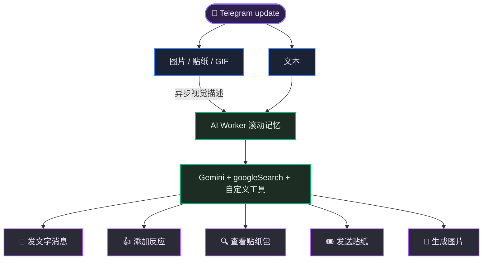
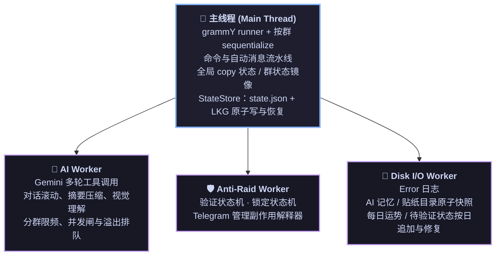

<div align="center">

<picture>
  <source media="(prefers-color-scheme: dark)" srcset="docs/assets/banner_dark.jpg">
  <source media="(prefers-color-scheme: light)" srcset="docs/assets/banner_light.jpg">
  
</picture>

<table align="center" style="border: none; border-collapse: collapse; border-spacing: 0; margin: 0 auto;">
  <tr style="border: none;">
    <td align="right" valign="middle" style="border: none; padding: 0 15px 0 0; background: transparent;">
      <a href="https://t.me/copy_ninjia_bot">
        
      </a>
    </td>
    <td align="left" valign="middle" style="border: none; padding: 0; background: transparent;">
      <h1 style="border: none; margin: 0; padding: 0; line-height: 1;">Copy Ninjia</h1>
    </td>
  </tr>
</table>

### 会偷头像、会复读、会看图、会守群，还会一本正经损人的 Telegram 群聊机器人

**代码 100% 由 AI 编写的纯 AI 开发项目** — 人类只负责架构设计，并与 AI 共同审查每一次提交

<sub>全仓另经 **Fable 5**、**GPT-5.6（Sol）** 等尖端模型多轮审查与生产环境安全情景推演</sub>

<p align="center">
  <a href="https://bun.sh/"></a>
  <a href="https://www.typescriptlang.org/"></a>
  <a href="https://grammy.dev/"></a>
  <a href="https://ai.google.dev/"></a>
</p>

<p align="center">
  <a href="#-纯-ai-开发"></a>
  <a href="#-纯-ai-开发"></a>
  <a href="#-开发"></a>
  <a href="#-开发"></a>
</p>

复读与人格模仿只是表面；底下是一套多 Worker、可恢复、有界缓存、带竞态防护的群聊自动化系统。

---

🧬 [纯 AI 开发](#-纯-ai-开发) • ✨ [它能做什么](#-它能做什么) • 🎭 [复读模式](#-复读模式) • 🧠 [AI 流水线](#-ai-流水线) • 🛡️ [入群验证与 Anti-Raid](#️-入群验证与-anti-raid) • 🎮 [命令与权限](#-命令与权限) • 🚀 [快速开始](#-快速开始) • 🏗️ [架构](#️-架构) • 💾 [数据与可靠性](#-数据与可靠性) • 🧪 [开发](#-开发)

</div>

---

## 🧬 纯 AI 开发

这个仓库里的每一行生产代码、每一个测试用例，连同这份 README 本身，都出自 AI 之手。人类不写代码，但从未离席：负责架构设计，并和 AI 一起审查了每一次提交。

<table width="100%">
<tr><th width="14%" align="left">环节</th><th width="32%" align="left">由谁完成</th><th width="54%" align="left">做了什么</th></tr>
<tr><td>📐&nbsp;架构设计</td><td><b>Asashishi</b>（本项目唯一的人类）</td><td>系统边界、Worker 拆分、持久化与恢复策略的设计与裁决</td></tr>
<tr><td>⌨️&nbsp;编码实现</td><td><b>Claude Code</b> · <b>Codex</b> · <b>Antigravity</b></td><td>100% 的生产代码、测试与文档</td></tr>
<tr><td>🧾&nbsp;提交审查</td><td><b>Asashishi</b> × AI</td><td>每一次提交都经人类与 AI 共同审查后才落库</td></tr>
<tr><td>🔬&nbsp;全仓审查</td><td><b>Fable 5</b> · <b>GPT-5.6（Sol）</b> 等尖端模型</td><td>多轮全代码仓交叉审查，发现的问题直接转化为加固提交</td></tr>
<tr><td>🛰️&nbsp;安全推演</td><td>同一批尖端模型</td><td>生产环境安全情景推演：崩溃恢复、并发竞态、恶意输入、资源耗尽等场景逐一过审</td></tr>
</table>

审查不是一次性仪式：从逐条提交的人机共审，到尖端模型的多轮全仓审查与安全推演，每一层结论都会回流成新的约束。下文出现的有界缓存、原子落盘、崩溃自愈与竞态防护，相当一部分正是这样长出来的。

## ✨ 它能做什么

<table width="100%">
<tr>
<td align="left" valign="top" width="33%">
  <h4>🪞 精准复读</h4>
  <p>锁定用户或频道后逐条复读，支持原样、反转、加「喵~」以及日语翻译等四种复读模式。</p>
</td>
<td align="left" valign="top" width="33%">
  <h4>🥷 偷头像</h4>
  <p><code>/copy</code> 自动同步目标头像，或通过 <code>/steal_icon</code> 仅复制头像而不启动复读状态。</p>
</td>
<td align="left" valign="top" width="33%">
  <h4>🤖 AI 群聊</h4>
  <p>基于 Gemini 人设进行智能回复，集成实时搜索与工具调用，统一处理文字/贴纸/反应等交互。</p>
</td>
</tr>
<tr>
<td align="left" valign="top">
  <h4>👁️ 多模态与生图</h4>
  <p>支持识别图片、动态贴纸和 GIF 帧，能按需生成新图片或对现有素材进行智能编辑。</p>
</td>
<td align="left" valign="top">
  <h4>🧠 群聊记忆</h4>
  <p>滚动维护 75~150 条上下文及多轮摘要压缩，追踪有界多层回复链，并结合原子落盘策略可靠恢复。</p>
</td>
<td align="left" valign="top">
  <h4>🛡️ 入群验证</h4>
  <p>提供新成员 90 秒限时按钮验证，并支持白名单担保点按、管理员邀请免验和评论区感知。</p>
</td>
</tr>
<tr>
<td align="left" valign="top">
  <h4>🚨 Anti-Raid</h4>
  <p>监测入群频率，触发阈值自动锁定群组邀请并自动处置可疑分子，重启后无缝恢复状态。</p>
</td>
<td align="left" valign="top">
  <h4>🎲 今日运势</h4>
  <p>采用 Inline Mode 实现确定性抽签，配合日级哈希密钥保证重启后状态与签名回执一致。</p>
</td>
<td align="left" valign="top">
  <h4>🌐 跨群管理</h4>
  <p><code>/kick</code> 命令支持对已知所有机器人管理群进行多群联动同步封禁，实现一体化群组防线。</p>
</td>
</tr>
</table>

## 🎭 复读模式

复读目标是全局唯一的：同一实例同时只能“变成”一个目标，但复读只发生在发起命令的群中。`/stop_copy` 可在任意群停止当前复读。

| 命令 | 行为 |
| :---: | :--- |
| <kbd>/copy</kbd> | 原样复读 |
| <kbd>/r_copy</kbd> | 按字形簇反转纯文本 |
| <kbd>/nya_copy</kbd> | 在纯文本末尾追加「喵~」 |
| <kbd>/ja_copy</kbd> | 使用 Google Cloud Translate 翻译为日语后复读 |
| <kbd>/steal_icon</kbd> | 只复制头像 |
| <kbd>/stop_copy</kbd> | 停止全局复读状态 |

目标可通过“回复 TA 的消息”或 `@username` 指定。按用户名查找依赖机器人此前观察到该账号；改名、移除用户名或用户名换绑会立即失效旧别名。对 `/kick` 这类破坏性操作优先回复目标消息，不依赖历史用户名。普通用户受 5 分钟 copy 类命令冷却，`PRIVILEGED_USERS_ID` 白名单不受限。

## 🧠 AI 流水线

> [!NOTE]
> AI 闲聊默认按群关闭，由超级管理员执行 `/ai_chat enable` 开启。关闭时不记录该群对话，也不会产生 AI 请求。



<table width="100%">
<tr><th width="13%" align="left">维度</th><th width="87%" align="left">策略</th></tr>
<tr><td>🧩&nbsp;模型</td><td>回复、摘要、视觉描述使用 <code>gemini-3.5-flash-lite</code>；生成或编辑图片使用 <code>gemini-3.1-flash-lite-image</code></td></tr>
<tr><td>🎯&nbsp;触发</td><td>回复机器人或 <code>@机器人</code> 时必定触发；普通文字和媒体评价共用按群活跃度的动态概率。当前消息先计入近 1 小时窗口，因此冷群第一条为 1/174；窗口内达到 165 条后封底为 1/10。活跃度只存内存，空闲满一小时或重启后回到冷启动</td></tr>
<tr><td>🚦&nbsp;同群并发</td><td>每群最多 3 轮 Gemini 工具对话在途；直接触发进入有界队列，随机触发在满载时丢弃</td></tr>
<tr><td>⏱️&nbsp;限频</td><td>每群 5 分钟最多启动 150 轮；超限提示本身也有冷却</td></tr>
<tr><td>🔧&nbsp;工具</td><td>同一请求真实注册内置 <code>googleSearch</code>，并提供东京天气、<code>send_message</code>、<code>add_reaction</code>、<code>view_sticker_pack</code>、<code>send_sticker</code>、<code>generate_image</code> 等函数工具；每轮回复最多执行 20 次自定义函数调用。提示词要求需要查证时先搜索再行动，所有面向群友的文字必须显式经过 <code>send_message</code>，图片、贴纸或反应完成后的最终正文不会被当作额外发言</td></tr>
<tr><td>🧱&nbsp;输入边界</td><td>初始 Gemini 请求使用一个 <code>user Content</code>，按顺序承载三个独立 <code>text Part</code>：只读参考记忆、只读当前会话、本轮回复任务。每段都有明确首尾标签与局部约束，<code>systemInstruction</code> 再声明前两段只作数据、只有最后一段是待执行任务；后续工具轮次仍按真实 <code>model/user</code> 角色追加</td></tr>
<tr><td>🛡️&nbsp;安全过滤</td><td>Google 可调的骚扰、仇恨、露骨和危险内容统一设为 <code>BLOCK_NONE</code>，应用不按概率等级主动拒绝；Gemini API 不可调的核心伤害保护与服务端策略仍然生效</td></tr>
<tr><td>🕰️&nbsp;时间</td><td>每次请求注入东京当前时间，每条转录消息保留记录时刻</td></tr>
<tr><td>🧾&nbsp;转录标注</td><td>每条逐字消息行内标注 <code>message_id</code> 与发送者 <code>id</code>/<code>username</code>；显式回复内嵌被回复消息的身份、原文与精确引用片段；转发消息标注原始来源（用户、隐藏账号、群组或频道，带可用的 <code>id</code>/<code>username</code>），被回复的原消息是转发时在引用内单独标注，提示词按标注层级区分转发归属；频道帖自动转进讨论组的副本不标转发。标注拼装与提示词里的格式说明共用同一份模板生成，防止两侧漂移</td></tr>
<tr><td>🧵&nbsp;回复链</td><td>触发消息处在至少两层回复关系中时，本轮任务额外列出最多 15 跳的路径；每跳保留 <code>message_id</code>、发送者身份和转发来源，正文最多 500 字。链尾原消息若已滑出逐字区，改用上一跳携带的最多 500 字快照并显式标为 <code>[仅回复快照]</code>，不会声称完整原文仍在转录中。机器人自己的文字与图片只按 Telegram 返回的实际回复关系自录：目标被删除、发送降级为普通消息时不制造回复边；目标只是在排队或生成期间滑出热区时，则由本轮开始前捕获的触发快照续接</td></tr>
<tr><td>🧠&nbsp;记忆</td><td>75～150 条逐字消息，加最多 7 × 75 条冷历史摘要，总跨度约 600～675 条；启动恢复只载入最新 149 条逐字消息并为下一条消息预留轮换边界。Worker 最多常驻 100 个群，超出按最后活动时间淘汰并删除磁盘快照，淘汰时优先避开仍有回复轮次在途的群</td></tr>
<tr><td>🖼️&nbsp;多模态</td><td>图片描述最多 125 字，贴纸/GIF 最多 100 字；聊天媒体的下载、转码、视觉描述与生图参考素材的下载、转码，共用最多 75 个执行槽与 150 项等待队列。未命中本地贴纸目录的媒体共享 1500 项 LRU 去重缓存（命中即续命，超额淘汰最久未使用的一项，不设 TTL）。<code>memory/stickers/</code> 中配置包的描述启动后常驻内存，仅在线上贴纸包对账发现更新时增删，群消息里的同款贴纸会直接命中该目录</td></tr>
<tr><td>🎨&nbsp;生图</td><td>只有直接回复或 <code>@机器人</code> 的消息才开放工具资格，且模型仅在当前消息明确要求生成或编辑图片时调用；当前或被回复的图片/贴纸可作为本轮短期参考素材，不进入滚动记忆或落盘。普通用户按群共享 3 分钟冷却，<code>SUPER_ADMIN_USER_ID</code> 不受该冷却限制；参考素材下载、队列或失效等模型调用前失败会释放占位，模型请求一旦开始（包括生成失败或发送失败）仍保留冷却；输出固定为 1K 图片</td></tr>
<tr><td>🗜️&nbsp;压缩背压</td><td>每群执行中与排队中的压缩任务合计最多 25 个，API 长时间变慢时有界降级，不无限堆积消息批次</td></tr>
</table>

基础人设在 [`prompt/persona.md`](prompt/persona.md)；与转录格式、身份标记和回复对象判定耦合的运行时互动规则由代码随 `systemInstruction` 注入。贴纸包和反应集合分别在 [`config/stickers.json`](config/stickers.json) 与 [`config/reactions.json`](config/reactions.json)，心情档位（文案、权重与天气/时段倍率，权重必须是正整数且总和恰好为 100）在 [`config/mood.json`](config/mood.json)。

<p align="right"><sub><a href="#-copy-ninjia">⬆️ 回到顶部</a></sub></p>

## 🛡️ 入群验证与 Anti-Raid

> [!NOTE]
> 守群功能只在机器人拥有群管理员权限时运行：没有删消息、踢人权限时不会假装启动一套注定失败的流程。

- 新成员在带按钮的验证提醒真正发送成功后获得完整 90 秒；超时会删除验证期内追踪到的消息并踢出，但不永久封禁。提醒失败会有界退避重试；若从未落地，超时只续窗补发，不踢人。
- 每位待验证成员独立统计最近 60 秒消息；第 46 条会先踢人止损，再尽力清理全部已追踪消息。关联频道评论区的直属评论和楼中楼回复都按既定策略豁免；楼中楼在关联缓存冷启动时先按普通消息追踪，只有 `getChat` 明确确认关联频道后才转为豁免，查询失败不放行。
- 管理员/群主身份、管理员或白名单用户拉入的成员可豁免。
- 其他机器人也必须验证，由白名单用户代点作保。
- 关联频道评论区会识别“留言或回帖导致自动入群”的场景：已经实际评论/回帖的成员直接豁免；只从评论区点击入群但没有发消息，仍按普通成员验证，锁定期间会直接踢出。
- 最近 60 秒入群人数超过 45 时进入 5 分钟锁定，临时关闭普通成员邀请权限。
- 待验证状态、未过期的消息窗口和终态处置进度写入 `memory/anti-raid/YYYY-MM-DD.json`：当前格式要求每条 active 记录包含 `phase` 和 `trackedMessageTimes`；Worker 或进程重建后按原 `expiresAt` 的剩余时间继续。reminder ID 是业务可选项，尚未成功发送提醒时为空；恢复后会先补发并重置完整窗口，不会无提醒踢人。成功踢人播报落盘确认后不会在崩溃重放时重复发送；只保留东京当天文件。
- 权限写入按群串行，恢复失败每 30 秒重试；锁定状态写入 `state.json`，进程重启后继续剩余计时。
- 管理员表与关联频道缓存都有 TTL、500 群硬顶和周期淘汰，不按历史群数永久增长。
- 最近评论关联缓存只保留 2 分钟、全局最多 5,000 条；复用 Anti-Raid Worker 的唯一周期 sweeper，不为每位成员创建 timer。

<p align="right"><sub><a href="#-copy-ninjia">⬆️ 回到顶部</a></sub></p>

## 🎮 命令与权限

<table width="100%">
<tr><th width="26%" align="left">命令</th><th width="19%" align="center">权限</th><th width="55%" align="left">说明</th></tr>
<tr><td><code>/copy</code> <code>/r_copy</code> <code>/nya_copy</code> <code>/ja_copy</code></td><td align="center">群成员</td><td>启动相应复读模式</td></tr>
<tr><td><code>/stop_copy</code></td><td align="center">群成员</td><td>停止当前全局复读</td></tr>
<tr><td><code>/steal_icon</code></td><td align="center">群成员</td><td>只偷头像</td></tr>
<tr><td><code>/quiet [1-15]</code></td><td align="center">群成员</td><td>暂停随机插话、随机复读等主动行为，默认 3 分钟</td></tr>
<tr><td><code>/unquiet</code></td><td align="center">群成员</td><td>提前解除安静模式</td></tr>
<tr><td><code>/kick</code></td><td align="center"><code>PRIVILEGED_USERS_ID</code></td><td>在所有机器人管理的群中永久封禁目标</td></tr>
<tr><td><code>/ai_chat enable|disable</code></td><td align="center"><code>SUPER_ADMIN_USER_ID</code></td><td>开关本群 AI 闲聊</td></tr>
<tr><td><code>/ja_copy enable|disable</code></td><td align="center"><code>SUPER_ADMIN_USER_ID</code></td><td>开关本群日语翻译能力（默认关闭）</td></tr>
<tr><td><code>/init enable|disable</code></td><td align="center"><code>SUPER_ADMIN_USER_ID</code></td><td>开关本群整个业务处理入口</td></tr>
<tr><td><code>/send &lt;群组id&gt;</code> <code>/send finish</code></td><td align="center"><code>SUPER_ADMIN_USER_ID</code>（仅私聊）</td><td>与机器人私聊时开启/结束一轮中转：期间这个私聊发的每条消息都会原样转发进目标群一次。开启前会先探一次目标是否可达，中转期间目标失联会自动终止并告知。中转状态随 <code>state.json</code> 持久化，重启不丢；不进 Telegram 命令菜单，群里或非本人触发均无任何反应</td></tr>
</table>

> [!TIP]
> `/luck_challenge` 不占斜杠命令：在任意聊天输入 `@机器人用户名 [所求事项]` 使用 Inline Mode。需在 BotFather 开启 Inline Mode，并建议通过 `/setinlinefeedback` 开启 100% 结果反馈。内联查询采用全局滑动窗口限流，每 90 秒最多应答 300 次。

## 🚀 快速开始

### 1. 环境

- Bun 1.3+
- Telegram Bot Token
- Gemini API Key
- Google Cloud 服务账号 JSON（仅 `/ja_copy` 需要）

<details>
<summary><b>📦 硬件配置参考</b>（按部署规模展开）</summary>

<table width="100%">
<tr><th width="33%" align="left">部署规模</th><th width="26%" align="left">建议配置</th><th width="41%" align="left">说明</th></tr>
<tr><td>入门（低活跃、文本为主、仅少量群开启 AI）</td><td>2 vCPU / 2 GB RAM / 本地 SSD</td><td>可以运行，但多 Worker 会争用 CPU，不适合 15 个活跃群或媒体洪峰</td></tr>
<tr><td>轻量生产（文本为主、仅少量群开启 AI）</td><td>4 vCPU / 2 GB RAM / 本地 SSD</td><td>2 GB 不适合作为媒体洪峰下的内存保障</td></tr>
<tr><td>推荐生产（约 15 个 1000-3000 人活跃群）</td><td>4 vCPU / 4 GB RAM / 本地 SSD</td><td>—</td></tr>
<tr><td>全部群开启 AI 且图片、贴纸较多</td><td>4 vCPU / 8 GB RAM</td><td>给媒体下载、Base64 编码和图片转码预留峰值空间</td></tr>
</table>

单实例仍建议控制在约 15 个上述规模的活跃群以内；主要限制来自 Telegram 单 Bot API、Gemini 配额和实际消息/媒体速率，而不是群成员总数。

</details>

### 2. 安装

```bash
git clone <your-repository-url>
cd copy_ninjia
bun install
cp .env.example .env
```

### 3. 配置

按 [`.env.example`](.env.example) 填写 `.env`：`TELEGRAM_BOT_TOKEN`、
`GEMINI_API_KEY` 和单个十进制数字 ID `SUPER_ADMIN_USER_ID` 必填；
`PRIVILEGED_USERS_ID` 可留空，多项之间用英文逗号分隔。

`COPY_NINJIA_DATA_ROOT` 可选，用于单独指定运行时生成数据的根目录。设置后，
`state.json`、`bot.lock`、`logs/` 和 `memory/` 都从该目录派生；人设、贴纸/反应/心情配置
与 `g-auth.json` 仍从项目根目录读取。留空时保持原行为，数据直接位于项目根目录。
并行部署多个 Bot 时，每个实例必须使用不同的数据根目录。

程序会在联网和创建 Worker 之前递归创建该目录，并验证写入、文件 fsync、同目录 hard link、
原子 rename 与目录 fsync。任一能力不满足都会带实际路径拒绝启动。生产环境应由部署工具预建
目录并交给运行账户；例如 systemd 主机可先执行：

```bash
sudo install -d -o copy-ninjia -g copy-ninjia -m 0750 /var/lib/copy-ninjia
```

再为服务设置 `Environment=COPY_NINJIA_DATA_ROOT=/var/lib/copy-ninjia`。容器部署则把同一目录
作为持久卷挂载，并在镜像启动前由宿主或 init container 设置 owner；不要把 `memory/` 放在
容器临时层。备份应覆盖整个数据根，并在 Bot 停止或存储快照一致性边界内完成。

贴纸包在 [`config/stickers.json`](config/stickers.json) 中配置，最多配置 5 个；
AI 每轮可以依次查看这 5 个包，但同一个包在一轮内只会查看一次。

如需日语翻译，将 Google Cloud 服务账号密钥保存为项目根目录的 `g-auth.json`。`.env` 与 `g-auth.json` 均已加入 `.gitignore`。

Telegram 侧还需要按功能配置：

1. 关闭 Bot Privacy Mode，机器人才能观察完整群消息并复读普通成员。
2. 授予删消息、封禁成员、管理群权限，入群验证和 Anti-Raid 才会启用。
3. 启用 Inline Mode 才能使用运势抽签。
4. 启用 inline feedback，抽签结果才能可靠确认并落盘。

### 4. 启动与检查

```bash
bun run check     # ESLint + TypeScript 严格检查 + 全源码覆盖率测试
bun run start     # 启动长轮询
```

首次拉入群后，由 `SUPER_ADMIN_USER_ID` 在群内执行：

```text
/init enable
/ai_chat enable
```

<p align="right"><sub><a href="#-copy-ninjia">⬆️ 回到顶部</a></sub></p>

## 🏗️ 架构



关键目录：

<table width="100%">
<tr><th width="18%" align="left">路径</th><th width="82%" align="left">职责</th></tr>
<tr><td><code>src/app/</code></td><td>启动/退出生命周期、handler 注册与命令菜单</td></tr>
<tr><td><code>src/commands/</code></td><td>显式命令处理</td></tr>
<tr><td><code>src/auto/</code></td><td>自动复读、AI 记录与触发、反应同步</td></tr>
<tr><td><code>src/states/</code></td><td>无 I/O 的验证、锁定状态转移与回复准入规则实现</td></tr>
<tr><td><code>src/config/</code></td><td>贴纸/反应/心情配置的严格 schema、惰性加载与启动校验</td></tr>
<tr><td><code>src/libs/</code></td><td>原子文件、有界 I/O、通用 schema 辅助及并发工具</td></tr>
<tr><td><code>src/workers/</code></td><td>AI、守群、磁盘三个独立 Worker</td></tr>
<tr><td><code>src/ai/</code></td><td>Gemini、视觉、贴纸目录及工具</td></tr>
<tr><td><code>src/infra/</code></td><td>Telegram 客户端、Worker 宿主与持久化基础设施；<code>storage/</code> 收口实例锁、状态存储和启动清理</td></tr>
<tr><td><code>src/cache/</code></td><td>按领域拆分的运行时状态容器</td></tr>
<tr><td><code>src/consts/</code></td><td>调参常量与路径</td></tr>
<tr><td><code>src/types/</code></td><td>跨模块协议、领域类型及 <code>states/</code> 对应的状态机契约</td></tr>
<tr><td><code>test/</code></td><td>与源码结构对应的 Bun 单元测试</td></tr>
</table>

## 💾 数据与可靠性

下表中的位置均相对于运行时数据根目录；默认是项目根目录，可通过
`COPY_NINJIA_DATA_ROOT` 修改。

<table width="100%">
<tr><th width="21%" align="left">数据</th><th width="17%" align="left">位置</th><th width="62%" align="left">写入策略</th></tr>
<tr><td>群状态 / copy 状态 / 锁定镜像</td><td><code>state.json</code>、<code>state.json.bak</code></td><td>只保留“在写 + 最新待写”两份内存快照；每次按主文件、LKG 备份顺序执行临时文件 + fsync + 原子 rename。命令开关、代理与 copy 等权威变更会等待对应 revision 的主备副本完成后才反馈成功并允许确认 update；有限重试耗尽会停止接收更新并以失败退出。群标题等派生元数据仍可后台合并保存。当前锁定镜像要求包含 <code>phase</code> 和正数 <code>intentId</code>。启动时主文件无效会由严格校验通过的备份恢复；两份均无效则拒绝启动且保留原件</td></tr>
<tr><td>AI 群聊记忆</td><td><code>memory/ai/</code></td><td>每群独立快照，30 秒周期 + 停机 flush；upsert/delete 按群携带单调 revision，删除意图保留到 durable unlink 回执，Disk I/O Worker 重建后会重放。启动只 hydrate 当前明确启用 AI 的群，并清理关闭群的残留快照。恢复时按当前容量保留最新 149 条逐字消息和最新 7 轮冷摘要；当前格式要求每条热区消息带正数 <code>message_id</code>，回复链索引只从当前热区派生并在 hydrate 时重建，不单独落盘</td></tr>
<tr><td>贴纸描述目录</td><td><code>memory/stickers/</code></td><td>每包独立原子快照；启动恢复后常驻内存，与线上贴纸包对账时更新，并供群消息解析复用</td></tr>
<tr><td>今日运势</td><td><code>memory/luck/</code></td><td>结果按东京日期增量追加并修复尾部截断；<code>receipt-secret.json</code> 原子保存当日确定性抽签/HMAC 密钥，权限固定为普通用户可读、仅属主可写的 <code>0644</code></td></tr>
<tr><td>待验证成员</td><td><code>memory/anti-raid/</code></td><td>当日 JSON 按 <code>chatId:userId</code> 键增量追加；当前 active 记录要求包含 <code>phase</code> 和 <code>trackedMessageTimes</code>。普通更新 250ms 合并，创建立即写，终结追加 tombstone；达到 4 MiB 或 10,000 条历史时收敛 active 快照，跨日删除旧文件</td></tr>
<tr><td>error 日志</td><td><code>logs/</code></td><td>Disk I/O Worker 统一批量追加</td></tr>
<tr><td>运行实例</td><td><code>bot.lock</code></td><td>原子维护的数据目录单实例 owner 锁</td></tr>
</table>

> [!WARNING]
> `memory/` 含群聊逐字内容与运势回执密钥，应视为敏感数据；项目按部署约定将其中的 JSON 写成普通系统用户可读的 `0644`，请用数据根目录 owner/权限和主机账户隔离限制访问，并控制备份范围与保留周期。备份当天运势时必须把 `memory/luck/receipt-secret.json` 与当天结果文件放在同一一致性备份中；密钥不会写入日志。`logs/`、`memory/`、state 主备副本及 `.corrupt` 隔离件、凭据和运行锁均不会提交到 Git。

待验证热路径复用每日运势和日志已有的 JSON 末尾追加机制，不会每次全量重写，也不会增加新的 IO 线程。终结记录以 `null` tombstone 线性追加，尾部截断修复按 JSON 结构边界扫描，因此会保留最后一条完整 tombstone，不会让已终结验证复活；只有跨日轮换或达到历史阈值时才原子收敛当前 active 镜像。每批追加在成功回执前执行 fsync。同步文件操作始终留在 Disk I/O Worker，不阻塞 Telegram 更新主线程。

> [!IMPORTANT]
> 持久化 schema 变更不在运行时自动迁移。部署包含结构变更的版本前，应同时迁移 `state.json`、`state.json.bak` 与对应 `memory/` 快照。StateStore 会用严格校验通过的主副本刷新另一份；若两份 state 副本均不符合当前结构则拒绝启动且不改动它们，避免用部分状态或空状态覆盖原文件。单份损坏副本会以唯一的 `.corrupt` 名称永久隔离，供人工排查。

`bot.lock` 只接受严格的 `v2:pid:starttime:boot_id:sha256(token)` 格式；其中
`starttime` 来自 `/proc/<pid>/stat` 第 22 字段。数据目录全局独占：只有 PID、
starttime 与 boot ID 均匹配才视为同一活跃 owner；PID 被复用或机器重启后，
当前 v2 格式的 stale owner 会在下一次启动或退出时清理。`.guard` 和
`.recovery` 同样只接受 `v2:pid:starttime:boot_id`，`.candidate.*` 与 `.tmp`
是正常操作结束即删除的并发保护文件。

实例锁明确依赖 Linux `/proc`，读取或解析失败时保持 fail-closed。旧
`pid:sha256(token)` registry、纯 PID guard/recovery、未知格式和损坏格式都
不会兼容读取、自动迁移或按 PID 猜测清理；程序保持原文件不变并拒绝启动，
必须先停掉相关进程再手工处理。

token 指纹只用于识别锁所有者，不是数据隔离边界。不同 Bot 需要并行部署时，
应使用彼此独立的项目目录，或为每个实例配置不同的 `COPY_NINJIA_DATA_ROOT`。

可靠性护栏包括：官方 SDK 类型边界、配置与持久化 JSON 逐字段校验、数据根能力预检与单实例锁、共享 Telegram API 限流/重试与必要的按群串行、Worker 崩溃节流自愈、失效 AI 轮次副作用拦截、AI 删除 revision/tombstone、反应队列硬顶、头像单执行槽与 latest-only 合并、可取消的后台 owner 有界 drain、媒体执行/排队/LRU 容量上限、JSON API 与媒体下载的流式字节上限，以及追加批次 fsync、原子落盘和严格恢复。跨模块生命周期约束见 [`docs/architecture.md`](docs/architecture.md)。

历史群标题回填只在关键启动握手和 update runner 就绪后运行，当前最多并发 15 个 `getChat`；
共享 throttler 继续控制 Telegram 全局速率，标题 owner 的并发上限用于约束低优先级维护的队头占位。

<p align="right"><sub><a href="#-copy-ninjia">⬆️ 回到顶部</a></sub></p>

## 🧪 开发

<table align="center" width="100%">
  <tr>
    <td align="center" width="20%">🚀 <b>785</b><br/>测试全部通过</td>
    <td align="center" width="20%">📂 <b>116</b><br/>测试文件</td>
    <td align="center" width="20%">🔬 <b>7,556</b><br/>断言总数</td>
    <td align="center" width="20%">🎯 <b>93.89%</b><br/>函数覆盖率</td>
    <td align="center" width="20%">📈 <b>95.76%</b><br/>行覆盖率</td>
  </tr>
</table>

```bash
bun run typecheck
bun run test
bun run check
bun run test:fault-injection
```

容器镜像构建或部署前运行 `bun run release:check`：它会执行 frozen lockfile 安装、完整
lint/typecheck/覆盖率测试和确定性故障注入套件，任一步失败都会返回非零状态。本仓库不依赖
GitHub Actions；发布环境应把这个命令作为显式构建或 pre-deploy 步骤。联网的发布环境还应运行
`bun run audit:release`，网络失败只表示审计未完成，不能解释为零漏洞；如需忽略 CVE，应记录原因
与到期时间。

> [!IMPORTANT]
> 测试必须通过 `bun run test` 执行；该入口强制启用文件隔离，避免 `mock.module` 和模块级状态污染其它测试文件。测试 preload 还会在任何生产模块加载前为每个隔离体创建独立临时数据根，因此未 mock 的真实文件 I/O 也不会读写生产 `state.json`、`bot.lock`、`logs/` 或 `memory/`，结束后临时目录会被清理。

- **严格检查**：项目启用了 `strict`、`noUncheckedIndexedAccess`、`noUnusedLocals`、`noUnusedParameters` 等检查。
- **覆盖率口径**：`bun run check` 会让所有生产运行时模块进入覆盖率分母，未被专项测试触达的模块也按 0% 计入，函数和行覆盖率门槛均为 90%。
- **当前主干实测**：785 个测试跨 116 个文件全部通过（7,556 次断言），函数覆盖率 **93.89%**、行覆盖率 **95.76%**——全源码计入分母口径，不是只统计被测文件。
- **代码放置约定**：新增共享协议与状态机契约放进 `src/types/`，调参值放进 `src/consts/`，运行时状态放进对应 `src/cache/`，纯状态转移留在 `src/states/`，避免业务文件继续长出游离状态。

---

<div align="center">

**Copy Ninjia** — 不是只会复读，是把整套群聊现场偷走再演一遍。

*人类没有写下任何一行代码，但也从未退场——画完图纸之后，还和 AI 一起审过每一次提交。*

</div>
