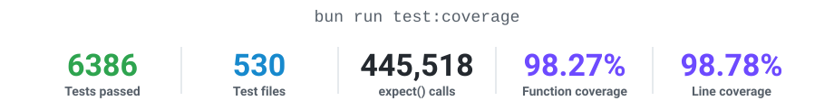

<div align="center">

<p><b>简体中文</b> · <a href="docs/en/README.md">English</a> · <a href="docs/ja/README.md">日本語</a></p>

<picture>
  <source media="(prefers-color-scheme: dark)" srcset="public/banner_dark.jpg">
  <source media="(prefers-color-scheme: light)" srcset="public/banner_light.jpg">
  
</picture>

<a id="copy-ninjia"></a>

<h1>
  <a href="https://t.me/copy_ninjia_bot" title="点击头像跳转至示例 Bot"></a>
  
</h1>

<p><sub>点击头像即可跳转至示例 Bot：<a href="https://t.me/copy_ninjia_bot">@copy_ninjia_bot</a></sub></p>

<picture>
  <source media="(prefers-color-scheme: dark)" srcset="public/tagline_dark.svg">
  <source media="(prefers-color-scheme: light)" srcset="public/tagline_light.svg">
  
</picture>

**生产代码、测试与文档均由 AI 编写的纯 AI 开发项目** — 人类负责架构设计，并与 AI 共同审查每一次提交

<p align="center">
  <a href="https://bun.sh/"></a>
  <a href="https://www.typescriptlang.org/"></a>
  <a href="https://www.sqlite.org/"></a>
  <a href="https://grammy.dev/"></a>
  <a href="https://www.anthropic.com/"></a>
  <a href="https://platform.openai.com/docs/"></a>
  <a href="https://ai.google.dev/"></a>
</p>

<p align="center">
  <a href="#-纯-ai-开发"></a>
  <a href="#-纯-ai-开发"></a>
  <a href="docs/cn/05-dev-workflow.md"></a>
  <a href="docs/cn/05-dev-workflow.md"></a>
  <a href="LICENSES/LICENSE"></a>
</p>

复读与人格模仿只是表面；其下是一套由多个 Worker 协作、支持故障恢复、采用有界缓存并具备竞态防护的群聊自动化系统。

---

🧬 [纯 AI 开发](#-纯-ai-开发) • ✨ [它能做什么](#-它能做什么) • 🎮 [命令与权限](#-命令与权限) • 🚀 [快速开始](#-快速开始) • 🤖 [BotFather 配置](#botfather-setup) • ❓ [常见问题](docs/cn/11-faq.md) • 📚 [开发者文档](docs/cn/content-table.md)

</div>

---

## 🧬 纯 AI 开发

这个仓库里的每一行生产代码、每一个测试用例，连同这份 README 本身，都出自 AI 之手：

<table width="100%">
<thead>
  <tr>
    <th width="18%" align="left">环节</th>
    <th width="32%" align="left">由谁完成</th>
    <th width="50%" align="left">做了什么</th>
  </tr>
</thead>
<tbody>
  <tr>
    <td><nobr>📐 <b>架构设计</b></nobr></td>
    <td><b>Asashishi</b></td>
    <td>负责系统边界定义、多线程 Worker 拆分、持久化与故障自愈策略的架构裁决</td>
  </tr>
  <tr>
    <td><nobr>⌨️ <b>编码实现</b></nobr></td>
    <td><b>Claude</b> · <b>Gemini</b> · <b>Grok</b></td>
    <td>编写 100% 的生产业务代码、自动化测试套件与多语言文档</td>
  </tr>
  <tr>
    <td><nobr>🧾 <b>提交审查</b></nobr></td>
    <td><nobr><b>Asashishi</b> × AI</nobr></td>
    <td>每次提交均经过人类架构师与 AI 结对核验后方可落库</td>
  </tr>
  <tr>
    <td><nobr>🔬 <b>全仓审查</b></nobr></td>
    <td><b>Claude</b> · <b>Gemini</b> · <b>Grok</b></td>
    <td>组织多轮全仓库交叉代码审查，发现的潜在缺陷直接转化为防御性代码提交</td>
  </tr>
  <tr>
    <td><nobr>🛰️ <b>安全推演</b></nobr></td>
    <td>同一批尖端模型</td>
    <td>针对真实生产环境进行严苛推演：崩溃自愈、并发竞态、恶意穿透与资源打满场景</td>
  </tr>
</tbody>
</table>

从逐条提交的人机共审，到尖端模型的多轮全仓审查与安全推演，每一项推演结论都直接沉淀为系统的运行时权威约束。

<p align="right"><sub><a href="#copy-ninjia">⬆️ 回到顶部</a></sub></p>

## 🧪 项目质量

<p align="center">
  <picture>
    <source media="(prefers-color-scheme: dark)" srcset="public/coverage_dark.svg">
    <source media="(prefers-color-scheme: light)" srcset="public/coverage_light.svg">
    
  </picture>
</p>

性能基准（冷热路径 · 总吞吐与总读写 · 端到端链路耗时）见 **[📊 10 性能基准](docs/cn/10-performance.md)**。

<p align="right"><sub><a href="#copy-ninjia">⬆️ 回到顶部</a></sub></p>

## ✨ 它能做什么

<table width="100%">
<tr>
<td align="left" valign="top" width="33%">
  <p><b>🪞 精准复读</b><br>
  <sub>锁定目标群友后，实时复读 TA 的发言并同步更换为其头像。</sub></p>
</td>
<td align="left" valign="top" width="33%">
  <p><b>🌐 多语翻译</b><br>
  <sub>为群内特定用户开启多语言翻译会话，自动译出并发送。</sub></p>
</td>
<td align="left" valign="top" width="33%">
  <p><b>🥷 偷头像</b><br>
  <sub>只将目标的头像复制到机器人身上，不触发文字复读。</sub></p>
</td>
</tr>
<tr>
<td align="left" valign="top" width="33%">
  <p><b>🤖 AI 群聊</b><br>
  <sub>是否开口、说什么、调用什么工具，均由人设自主决定。</sub></p>
</td>
<td align="left" valign="top" width="33%">
  <p><b>👁️ 多模态与创作</b><br>
  <sub>既能理解图片与语音，也能主动在群里绘图、发送语音。</sub></p>
</td>
<td align="left" valign="top" width="33%">
  <p><b>🔎 实时查证</b><br>
  <sub>涉及事实知识时自主联网检索，也能实时查询天气等信息。</sub></p>
</td>
</tr>
<tr>
<td align="left" valign="top" width="33%">
  <p><b>🧠 群聊记忆</b><br>
  <sub>保留近期逐字上下文，超出容量自动压缩为滚动摘要。</sub></p>
</td>
<td align="left" valign="top" width="33%">
  <p><b>🎭 心情与拟人化</b><br>
  <sub>AI 心情周期性自动轮换，回复前模拟真实打字停顿。</sub></p>
</td>
<td align="left" valign="top" width="33%">
  <p><b>💒 群友抽取</b><br>
  <sub>从近期发言的群友中随机抽取一位作为“老婆”并展示头像。</sub></p>
</td>
</tr>
<tr>
<td align="left" valign="top" width="33%">
  <p><b>🛡️ 入群验证</b><br>
  <sub>新成员必须在限定时间内点击按钮验证，超时自动踢出。</sub></p>
</td>
<td align="left" valign="top" width="33%">
  <p><b>🚨 Anti-Raid 防冲群</b><br>
  <sub>遭遇异常频率加入时自动开启私密模式，收回邀请权限。</sub></p>
</td>
<td align="left" valign="top" width="33%">
  <p><b>📮 智能广告检测</b><br>
  <sub>消息自动串联送审，判定为广告立即撤回并执行永久封禁。</sub></p>
</td>
</tr>
<tr>
<td align="left" valign="top" width="33%">
  <p><b>🎲 今日运势</b><br>
  <sub>支持通过 Inline Mode 抽签占卜，同一人当天结果固定保真。</sub></p>
</td>
<td align="left" valign="top" width="33%">
  <p><b>🌐 跨群联动封禁</b><br>
  <sub>一条命令即可在机器人管理的所有群组中同步拉黑并封禁。</sub></p>
</td>
<td align="left" valign="top" width="33%">
  <p><b>💬 群自定义问答</b><br>
  <sub>预设的问题命中后直接秒答，不消耗模型配额、不经过 AI。</sub></p>
</td>
</tr>
<tr>
<td align="left" valign="top" width="33%">
  <p><b>🖼️ 专用图库</b><br>
  <sub>使用 /h_image 发送带剧透遮罩的随机图；支持回复消息收图并按哈希去重。</sub></p>
</td>
<td align="left" valign="top" width="33%">
  <p><b>⏰ 定时任务系统</b><br>
  <sub>支持按时区定时推送文本、文件、语音、网页摘要、随机图或固定相册。</sub></p>
</td>
<td align="left" valign="top" width="33%">
  <p><b>🎨 人设与语气风格</b><br>
  <sub>内置调侃人设，支持通过 <code>prompt/persona.md</code> 灵活替换；系统通知风格可独立设定。</sub></p>
</td>
</tr>
<tr>
<td align="left" valign="top" width="33%">
  <p><b>🤐 限制发言（Gag）</b><br>
  <sub>限制目标直接发言，仅允许通过专属按钮发送字符混淆后的趣味文本。</sub></p>
</td>
<td align="left" valign="top" width="33%">
  <p><b>🫧 中文动作命令</b><br>
  <sub>直接发送 /咬、/贴贴 等 1~2 个汉字动作，无需事先向系统注册。</sub></p>
</td>
<td align="left" valign="top" width="33%">
  <p><b>🌊 刷屏防御控制</b><br>
  <sub>单群发言频率超过阈值自动执行阶梯禁言，白名单身份可获豁免。</sub></p>
</td>
</tr>
<tr>
<td align="left" valign="top" width="33%">
  <p><b>🔎 身份资料查询</b><br>
  <sub>使用 /info 快速查询用户、频道的公开 ID、用户名及当前头像。</sub></p>
</td>
<td align="left" valign="top" width="33%">
  <p><b>🔐 细粒度权限管控</b><br>
  <sub>支持按用户或频道灵活分配开关配置、收图、问答维护及各类管理权限。</sub></p>
</td>
<td align="left" valign="top" width="33%">
  <p><b>📨 私聊跨群中转</b><br>
  <sub>超级管理员可在私聊开启中转，直接向指定群发消息或转换为语音气泡。</sub></p>
</td>
</tr>
</table>

### AI 提示词缓存率（结合实测的保守估计）

| 模型提供商 | 保守参考范围 |
| --- | --- |
| Gemini | 70%± |
| OpenAI | 90%± |
| Claude | 90%± |

> [!TIP]
> 谷歌模型缓存率较低的问题主要来自显式与隐式缓存互斥，以及隐式缓存过期时间不可控（最快观测到 20s 左右过期）。如果在意请使用其他模型，但是 Gemini 的模型在会话效果中是最好的。

### 语音、图片与记忆

<table width="100%">
<thead>
  <tr>
    <th width="24%" align="left">能力模块</th>
    <th width="76%" align="left">当前行为与规格</th>
  </tr>
</thead>
<tbody>
  <tr>
    <td><nobr>🎙️ <b>AI 语音生成</b></nobr></td>
    <td>支持灵活配置音色与语气修饰词；单轮最多输出 <code>MAX_VOICES_PER_REPLY</code> 条，台词上限 <code>VOICE_TEXT_MAX_CHARS</code>（UTF-16 码元）；发送成功后自动沉淀进 AI 上下文记忆。</td>
  </tr>
  <tr>
    <td><nobr>📢 <b>管理中转与定时语音</b></nobr></td>
    <td>私聊 <code>/send</code> 与 cron 定时任务共享专属 TTS 配额，台词上限 <code>VOICE_OPERATOR_TEXT_MAX_CHARS</code>（UTF-16 码元）；定时任务单轮向多群广播时只合成一次并复用 Telegram <code>file_id</code>。</td>
  </tr>
  <tr>
    <td><nobr>🖼️ <b>图片多模态记忆</b></nobr></td>
    <td>AI 生图会自动记录生成结果画面；群内的 <code>/wed</code>、<code>/h_image</code> 以及定时图片先写入占位符，仅在后续有成员显式回复该图片时才按需触发视觉理解。</td>
  </tr>
</tbody>
</table>

- **TTS 语音服务接入**：需在 `config/dynamic/agent.json` 中配置 `agent.tts`（支持 Google 原生、OpenAI 兼容 `audio/speech` 及 xAI Grok `/tts`；Google 端点支持配置 `base_url` 与 `headers` 接入反向代理或网关）。可选 `bot_language`（`en` / `zh` / `ja`，缺省为 `ja`）用于指定 AI 语音台词的语言；在项目根目录放置 `prompt/voice_tool.md` 可完整覆盖 `send_voice` 工具的使用说明（重启生效，示例见 [`prompt_example/voice_tool.md`](prompt_example/voice_tool.md)）。AI 回复时会根据 `bot_language` 自动在声线后追加朗读语言指导；`style` 字段由 `/send` 与定时任务通用，建议只描述音色风格，切换 `bot_language` 时建议同步调整 `style` 与 `voice_tool.md`。
- **配额物理隔离**：每日总配额 `daily_limit`（默认 100 次）中切分出 `daily_reserve_quota`（默认 25 次）专供 `/send` 与定时任务使用，AI 闲聊仅使用剩余额度；两套额度独立统计、互不挤占。配额窗口（`TTS_USAGE_WINDOW_MS`）从窗口内首次请求开始计时，到期后的首个请求会自动清零计数开启新周期。
- **记忆准入机制**：`/send` 转发消息与定时语音不录入 AI 对话上下文；群内图片的自动记录仅在群内已启用 AI 且当前未处于复读状态时生效。详见 [11 常见问题](docs/cn/11-faq.md)。

每项功能的完整行为细节、配置指南与系统边界请参阅 **[📚 开发者文档](docs/cn/content-table.md)**。

<p align="right"><sub><a href="#copy-ninjia">⬆️ 回到顶部</a></sub></p>

## 🎮 命令与权限

系统将命令清晰划分为三个层级：

- **群成员基础权限**：复读、按群翻译、中文动作、`/info` 查资料、`/wed` 抽老婆、`/h_image` 看图等日常群聊交互命令，所有群成员均可直接使用。
- **身份策略权限（`isCanXxx`）**：群组管理与运维命令，包括 `/bot_status` 查看系统状态、`/mute` / `/unmute` 禁言控制、`/gag` 限制发言、`/block` 黑名单控制、`/h_image add` 图库入库以及各项功能的启停开关。通过细粒度权限列表单独授权。
- **超级管理员专属（`SUPER_ADMIN_USER_ID`）**：`/init` 初始化群接管、`/permission` 权限分配、`/white disable` 移除白名单身份、`/batch_kick` 批量清理新成员，以及私聊专属的 `/send` 跨群中转。拥有 `isCanWhiteOther` 权限的普通白名单用户可通过 `/white enable` 协助添加成员，但仅能赋予默认的基础权限。

图库与 cron 定时任务的配置和使用请参阅 [08 图库与定时任务](docs/cn/08-images-and-cron.md)，源码与二进制部署的离线冷迁移步骤请参阅 [运维手册](docs/cn/07-operations.md)。

完整命令列表、权限要求与详细行为说明请参阅 **[📖 09 命令与行为参考](docs/cn/09-commands.md)**。

<p align="right"><sub><a href="#copy-ninjia">⬆️ 回到顶部</a></sub></p>

## 🚀 快速开始

### 环境要求

- **操作系统**：Linux 系统（必须具备标准可读的 `/proc` 文件系统；其他平台因缺乏实例锁将自动拒绝启动）。
- **Telegram 凭据**：Bot Token 与超级管理员的 Telegram User ID。
- **运行时环境**：源码运行需 [Bun](https://bun.sh/) 1.4.3；官方二进制发行包已静态内置运行时，无需在宿主机额外安装。
- **外部依赖**：开启 AI 需准备对应服务商的 API Key；翻译功能需准备 Google Cloud 服务账号 JSON 凭据。硬件配置建议请参考 [07 运维手册](docs/cn/07-operations.md#硬件参考)。

### 一键安装

```bash
# 自动检测环境并进入交互式配置向导
curl -fsSL https://raw.githubusercontent.com/Asashishi/copy_ninjia/master/install.sh | bash

# 亦可显式指定安装模式：--binary（二进制包，推荐）或 --source（源码克隆）
curl -fsSL https://raw.githubusercontent.com/Asashishi/copy_ninjia/master/install.sh | bash -s -- --binary
```

> [!TIP]
> - **安装模式**：默认进行交互式询问。传入 `--binary` 会直接下载对应平台的预编译二进制包，无需安装系统 Bun 或 git；传入 `--source` 会克隆源码，安装器会自动尝试补齐缺失的依赖环境。
> - **引导流程**：向导会自动辅助填入关键凭据、初始化 SQLite 身份数据库；在支持 systemd 的系统上会自动注册常驻守护进程，不支持时以前台调试模式启动。若已存在旧部署，安装器会自动保护现有配置与数据，严禁静默覆盖。

### 手工源码安装

```bash
# 1. 克隆代码仓库并安装依赖
git clone https://github.com/Asashishi/copy_ninjia.git
cd copy_ninjia
bun install

# 2. 准备配置目录并复制模板（仅补充缺失文件）
mkdir -p config/static config/dynamic
for example in config_example/static/*.json config_example/dynamic/*.json; do
  case "${example##*/}" in g-auth.json | cron.json) ;; *) cp -n "$example" "config/${example#config_example/}" ;; esac
done

# 3. 编辑 config/static/bot.json，填入 bot_token 与 super_admin_user_id
```

初次运行前，请在 @BotFather 处关闭群隐私模式（Privacy Mode）并开启内联模式（Inline Mode），详见 [BotFather 与群权限配置](#botfather-setup)。配置字段规范参见 [`config_example/README/zh.md`](config_example/README/zh.md)，完整运维部署参见 [01 环境搭建与首次运行](docs/cn/01-getting-started.md)。

完成配置与[身份数据库初始化](docs/cn/01-getting-started.md#初始化身份数据库)后，运行门禁检验并启动服务：

```bash
bun run check                          # 运行全部质量门禁（约定自检、ESLint、TypeScript、测试与热路径门禁）
bun run start                          # 启动长轮询常驻服务
```

### 机器人入群初始化

将机器人加入群组后，由超级管理员在群内依次发送以下命令完成初始化接管：

```text
/init enable
/ai_chat enable
/antiraid enable
```

> [!NOTE]
> 机器人面向用户的交互文案均为简体中文。如需调整或客制化，参见 [06 修改配方](docs/cn/06-modification-guide.md)。

<p align="right"><sub><a href="#copy-ninjia">⬆️ 回到顶部</a></sub></p>

## 📚 开发者文档与架构指南

Copy Ninjia 的架构总览、模块导览、运行时权威约束、测试流程与运维手册，集中收录在 **[开发者文档中心](docs/cn/content-table.md)**：

<table width="100%">
<thead>
  <tr>
    <th width="24%" align="left">目标场景</th>
    <th width="44%" align="left">推荐路径</th>
    <th width="32%" align="center">直达链接</th>
  </tr>
</thead>
<tbody>
  <tr>
    <td><nobr>🚀 <b>首次运行</b></nobr></td>
    <td>依赖安装、部署配置、Telegram API 权限及首次启动</td>
    <td align="center"><nobr><a href="docs/cn/01-getting-started.md">📖 01 环境搭建</a></nobr></td>
  </tr>
  <tr>
    <td><nobr>🏗️ <b>理解架构</b></nobr></td>
    <td>主线程与 Worker 协作模型、消息生命周期及持久化恢复</td>
    <td align="center"><nobr><a href="docs/cn/02-architecture.md">📖 02 架构总览</a></nobr></td>
  </tr>
  <tr>
    <td><nobr>🗺️ <b>查找代码</b></nobr></td>
    <td>模块职责分工、源码目录映射及新代码放置约定</td>
    <td align="center"><nobr><a href="docs/cn/03-directory-map.md">📖 03 目录导览</a></nobr></td>
  </tr>
  <tr>
    <td><nobr>⚡ <b>遵守不变量</b></nobr></td>
    <td>跨模块权威约束、并发防护与全局状态机规则</td>
    <td align="center"><nobr><a href="docs/cn/04-invariants.md">📖 04 权威约束</a></nobr></td>
  </tr>
  <tr>
    <td><nobr>🧪 <b>开发与测试</b></nobr></td>
    <td><code>bun run check</code> 质量门禁、测试隔离机制与覆盖率口径</td>
    <td align="center"><nobr><a href="docs/cn/05-dev-workflow.md">📖 05 开发流程</a></nobr></td>
  </tr>
  <tr>
    <td><nobr>🛠️ <b>新增/修改功能</b></nobr></td>
    <td>添加命令、调参、新增 AI 工具及 schema 变更的分步指南</td>
    <td align="center"><nobr><a href="docs/cn/06-modification-guide.md">📖 06 修改配方</a></nobr></td>
  </tr>
  <tr>
    <td><nobr>🛡️ <b>生产运维</b></nobr></td>
    <td>systemd 部署、硬件参考、<code>COPY_NINJIA_DATA_ROOT</code>、备份与故障排查</td>
    <td align="center"><nobr><a href="docs/cn/07-operations.md">📖 07 运维手册</a></nobr></td>
  </tr>
  <tr>
    <td><nobr>🖼️ <b>图库与定时任务</b></nobr></td>
    <td>收图、内容去重、单图与相册发送、定时语音、时区与路径基准</td>
    <td align="center"><nobr><a href="docs/cn/08-images-and-cron.md">📖 08 图库与定时任务</a></nobr></td>
  </tr>
  <tr>
    <td><nobr>🎮 <b>查命令</b></nobr></td>
    <td>全部命令、权限口径与行为细节（根 README 只留概述）</td>
    <td align="center"><nobr><a href="docs/cn/09-commands.md">📖 09 命令参考</a></nobr></td>
  </tr>
  <tr>
    <td><nobr>📊 <b>看性能读数</b></nobr></td>
    <td>冷热路径、总吞吐与总读写、端到端链路耗时的发布基准</td>
    <td align="center"><nobr><a href="docs/cn/10-performance.md">📖 10 性能基准</a></nobr></td>
  </tr>
  <tr>
    <td><nobr>❓ <b>排查没有回复</b></nobr></td>
    <td>机器人在运行却不回应时的逐条排查清单</td>
    <td align="center"><nobr><a href="docs/cn/11-faq.md">📖 11 常见问题</a></nobr></td>
  </tr>
</tbody>
</table>

<p align="right"><sub><a href="#copy-ninjia">⬆️ 回到顶部</a></sub></p>

<a id="botfather-setup"></a>

## 🤖 BotFather 与群权限配置

### BotFather 设置

<table width="100%">
<thead>
  <tr>
    <th width="26%" align="left">设置项</th>
    <th width="32%" align="left">在 @BotFather 中的操作</th>
    <th width="42%" align="left">用途与说明</th>
  </tr>
</thead>
<tbody>
  <tr>
    <td><nobr><b>关闭群隐私模式</b></nobr></td>
    <td><kbd>/setprivacy</kbd> → <b>Disable</b></td>
    <td>允许机器人接收群内所有常规发言（复读、按群翻译、AI 闲聊、群问答均依赖此项）。<br><sub>*注：在 BotFather 中修改隐私后，需将机器人移出群组重新拉入生效；若 Bot 已是群管理员则无此限制。*</sub></td>
  </tr>
  <tr>
    <td><nobr><b>开启 Inline Mode</b></nobr></td>
    <td><kbd>/setinline</kbd></td>
    <td>支持在任意会话中输入 <code>@机器人 所求事项</code> 抽取运势，并支持 <code>/gag</code> 限制发言的交互按钮。</td>
  </tr>
  <tr>
    <td><nobr><b>内联反馈 100%</b></nobr></td>
    <td><kbd>/setinlinefeedback</kbd> → <b>100%</b></td>
    <td>今日运势结果落盘与签名校验的核心回执链路。</td>
  </tr>
  <tr>
    <td><nobr><b>允许加入群组</b></nobr></td>
    <td><kbd>/setjoingroups</kbd> → <b>Enable</b></td>
    <td>允许将机器人拉入群组（官方默认开启）。</td>
  </tr>
  <tr>
    <td><nobr><b>Bot-to-Bot 通讯</b></nobr><br><sub>（可选模式）</sub></td>
    <td>Bot Settings → Bot-to-Bot</td>
    <td>当 <code>/translate</code> 或 <code>/copy</code> 的目标是另一个机器人时必须开启此项。</td>
  </tr>
</tbody>
</table>

命令菜单无需在 BotFather 中通过 `/setcommands` 手动维护：机器人启动时会根据系统配置的通知语气自动注册对应的命令菜单（未显式配置通知语气且采用自定义人设时自动采用常规版菜单）。命令菜单仅在群聊中可见；私聊中仅向超级管理员响应 `/send` 指令，默认不展示常规命令菜单。

> [!WARNING]
> **Bot-to-Bot 跨机器人通讯模式说明**：
> 开启此模式后，机器人可以在具备管理员权限或已关闭群隐私模式的群组中接收其他第三方 Bot 的普通发言。接收到的其他 Bot 消息会经过全局入口防刷限流保护：同一个 Bot 在连续活跃期间的前 `BOT_MESSAGE_ACTIVITY_LIMIT` 条消息允许进入业务处理，超出后静默忽略；停止发言满 `BOT_MESSAGE_ACTIVITY_TTL_MS` 后重新计数。系统最多记录 `BOT_MESSAGE_ACTIVITY_MAX_ENTRIES` 个其他 Bot 的活跃状态，池满时暂不接收新 Bot；机器人自身的发言不计入该限额。详见 [消息分发约束](docs/cn/04-invariants.md)。

### 群内管理员权限

将 Bot 提升为群管理员，并根据所需功能按需勾选以下权限：

<table width="100%">
<thead>
  <tr>
    <th width="28%" align="left">管理员权限项</th>
    <th width="72%" align="left">对应触发功能</th>
  </tr>
</thead>
<tbody>
  <tr>
    <td><nobr>🗑️ <b>删除消息</b></nobr></td>
    <td><code>/gag</code> 发言管教拦截、广告检测自动撤回、自动清理黑名单频道身份发言。</td>
  </tr>
  <tr>
    <td><nobr>🚫 <b>限制与封禁成员</b></nobr></td>
    <td>入群验证超时踢出、防冲群自动切私密、<code>/block enable|disable</code>、<code>/mute</code> / <code>/unmute</code>、<code>/batch_kick</code>、刷屏自动禁言、广告处置封禁。</td>
  </tr>
</tbody>
</table>

> [!TIP]
> - **入群事件感知**：入群验证功能依赖群管理员身份（Telegram 仅向群管理员 Bot 推送成员进出群的系统事件）。
> - **权限排查诊断**：当机器人因缺少权限导致操作失败时，会在日志或回执中明确指出缺失的具体权限项。拥有 `isCanViewBotStatus` 权限的成员可发送 `/bot_status` 实时查看机器人在当前群的完整权限清单。
> - 若机器人在运行但无任何交互响应，请按 [11 常见问题](docs/cn/11-faq.md) 逐项排查。

---

<div align="center">

<picture>
  <source media="(prefers-color-scheme: dark)" srcset="public/footer_dark.svg">
  <source media="(prefers-color-scheme: light)" srcset="public/footer_light.svg">
  
</picture>

*人类没有写下任何一行代码，但也从未退场——画完图纸之后，还和 AI 一起审过每一次提交。*

</div>
