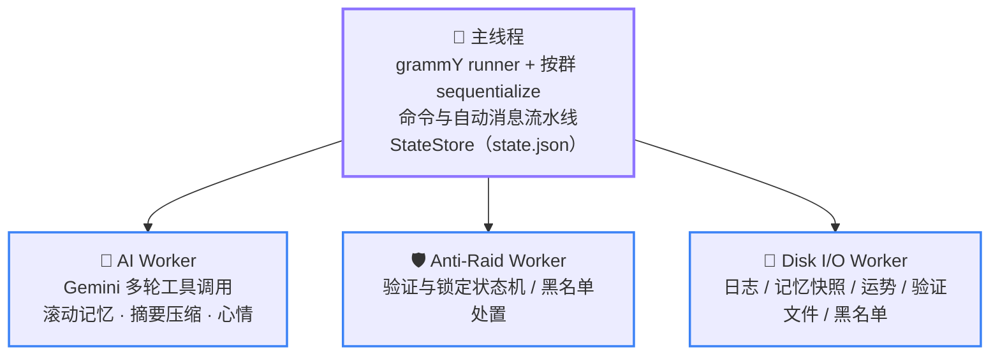
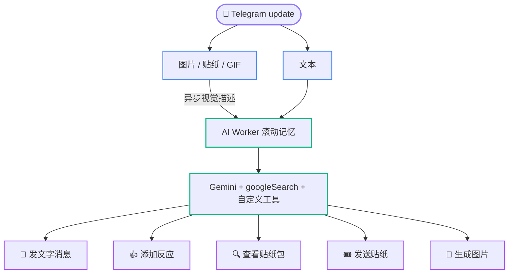

# 02 架构总览

  <b>简体中文</b> · <a href="en/02-architecture.md">English</a> · <a href="ja/02-architecture.md">日本語</a>

  <a href="README.md">📚 开发者文档首页</a> · <a href="01-getting-started.md">← 上一页：01 环境搭建</a> · <a href="03-directory-map.md">下一页：03 目录导览 →</a>

---

本页讲「系统长什么样、一条消息怎么流过去、进程怎么起来怎么停」。这里是叙述性的导览；可执行的精确约束（谁拥有什么状态、什么顺序不可颠倒）以 [04 运行时权威约束](04-invariants.md) 为准。

## 拓扑：主线程 + 三个 Worker

分工原则是**状态独占**：每份运行时状态只有一个 owner，跨线程只传消息不共享内存。

- **主线程**持有 Telegram runner、三个 Worker 的监督句柄，以及 `StateStore` 维护的 `state.json` 内存镜像（群开关、copy 状态、锁定镜像等权威状态）。
- **AI Worker** 独占群聊记忆、回复准入、媒体描述流水线、群心情与贴纸目录的运行时状态。
- **Anti-Raid Worker** 独占验证/锁定状态机与对应计时器；主线程只保留可恢复镜像。/block 黑名单的踢人也在这条线程执行（它不带状态机，判定在主线程做完后投过来），与验证超时踢人共用同一条请求队列。未收到落地回执的处置批次同时保存在主线程镜像与 `memory/blocklist-removals.json` outbox：Worker 重建时内存重投，完整进程重建时从磁盘恢复。
- **Disk I/O Worker** 独占共享目录（`logs/`、`memory/`、`config/blocklist.json`）的串行读写；`state.json` 是唯一例外，由主线程 `StateStore` 直接原子写。

Anti-Raid 主线程入口由 [`packages/antiRaid/index.ts`](../packages/antiRaid/index.ts) 编排，lockdown 恢复与验证镜像接收分别下沉到 [`packages/antiRaid/lockdownMirror.ts`](../packages/antiRaid/lockdownMirror.ts) 和 [`packages/antiRaid/verificationMirror.ts`](../packages/antiRaid/verificationMirror.ts)。Worker 侧验证解释器则按核心状态/恢复、入站事件翻译、Telegram 副作用、提醒投递 owner 拆在 [`packages/workers/antiRaid/`](../packages/workers/antiRaid/) 中；这些模块共享同一个 dispatcher，不改变状态机与 revision 的单一权威入口。

Worker 崩溃都会节流自愈，但宿主实现分成两条：AI/Anti-Raid 共用 [`packages/libs/supervisedWorker.ts`](../packages/libs/supervisedWorker.ts)，Disk I/O 因自身不能依赖落盘 logger，在 [`packages/infra/diskIO.ts`](../packages/infra/diskIO.ts) 内维护独立的 console-only 自愈逻辑。重建后由主线程镜像或磁盘快照重放恢复；重启预算耗尽再由 [`packages/infra/workerSupervisor.ts`](../packages/infra/workerSupervisor.ts) 等 fatal 边界通知生命周期停机。

## 一条消息的旅程

更新链在 [`packages/app/registerHandlers.ts`](../packages/app/registerHandlers.ts) 一次性显式安装，middleware 顺序即语义：

1. **update_id 追踪**——记录已进入处理的最大 `update_id`，停机时用于确认 Telegram offset。
2. **运势签名回执确认**——在一切网关之前，转发副本也有效。
3. **init 网关**——未 `/init enable` 的群，其普通业务 update 在这里终止；`my_chat_member`、自身 `via_bot` 消息与超级管理员的 `/init` 等显式例外由 [`packages/infra/updateGate.ts`](../packages/infra/updateGate.ts) 放行。
4. **按群串行**——`sequentialize` 保证同群消息顺序处理；反应同步走独立合并队列，不占聊天车道。
5. **私聊网关**——私聊只放行 `/send` 入口与进行中的中转会话；中转消息短路进消息流水线，避免文本被当成命令。
6. **入群验证**——必须早于命令处理，否则待验证用户发的命令不会被追踪清理。
7. **命令注册**——14 个 `bot.command(...)`，见 [06 常见修改配方](06-modification-guide.md#新增一个斜杠命令)。其中 `/x` 是菜单占位项：它只为曝光中文动作命令的用法，收到时回一句用法说明并就此终止链路。
8. **中文动作命令**——`/咬`、`/贴贴` 这类命令（动作词收 1~2 个中文字）拿不到 Telegram 的 `bot_command` 实体，`bot.command` 匹配不到，只能用 `bot.hears` 按消息原文匹配（见 [`packages/commands/cjkAction.ts`](../packages/commands/cjkAction.ts)）。**必须排在下一步的消息兜底之前**——排在后面就会被当成普通消息进入 AI/复读流水线，整个特性静默失效。因为它排在自动流水线之前，那条流水线的自发消息门禁对它无效，handler 自己要跳过机器人自己的消息；也因为被它认领的消息不再往下走，handler 要自己补上发送者身份缓存。不认领的形态（`/咬@OtherBot`、caption 形态、消息形态异常）一律 `next()` 放行。
9. **自动消息流水线**——[`packages/auto/`](../packages/auto) 处理复读、AI 转录与触发判定、反应同步等非命令行为。

AI 触发后的旅程：主线程按活跃度概率/直接触发判定 → 投递 AI Worker → Worker 组装三段式 Gemini 输入（参考记忆 / 当前会话 / 本轮任务）→ 多轮工具调用（发消息、贴纸、反应、生图，全部经主线程代理执行）→ 结果写回滚动记忆 → 周期快照落盘。

`bot.catch` 记录未处理错误后**继续抛出**——吞掉异常会让失败的 update 被确认，进程重启后 Telegram 不再重投（含持久化失败的场景）。

## AI 消息处理流水线

一条消息先按类型分流，再统一汇入 AI Worker 的滚动记忆：

- **文本**以占位文本形式即时入队，保住其在对话时序中的位置。
- **图片 / 贴纸 / GIF** 同样先占位入队，再异步下载并调用视觉模型生成描述，解析完成后原地回填同一条目的文本字段；命中贴纸白名单目录时跳过异步解析，直接写入目录里的现成描述。

触发回复时，滚动记忆被组装成上一节所述的三段式 Gemini 输入，随 `googleSearch` 与自定义工具一并发给 Gemini。`googleSearch` 在 Google 服务端执行，其提示词按本轮搜索进度三态切换、且不计入动作预算（见 [04 运行时权威约束](04-invariants.md)）。模型在一轮内可发起多次工具调用，均经主线程代理执行而非直接操作 Telegram：

- 💬 **发文字消息**——正文必须由模型显式调用发送工具；仅当整轮零成功动作时，系统才会兜底发送。
- 👍 **添加反应**——从白名单 emoji 中选择，一轮最多成功一次。
- 🔍 **查看贴纸包**——按需检索贴纸目录，调用次数独立计数。
- 🎟️ **发送贴纸**、🎨 **生成图片**——同样一轮最多成功一次。

本轮产生的文字、贴纸、反应与图片结果会写回滚动记忆，并按策略周期性快照落盘；单轮动作次数上限与防循环规则见 [04 运行时权威约束](04-invariants.md)。

## 启动顺序

入口 [`index.ts`](../index.ts) 只组装 [`packages/app/lifecycle.ts`](../packages/app/lifecycle.ts) 的 `ApplicationLifecycle`；生产模块 import 不启动 Worker、计时器、网络请求或共享目录写入，一切运行时初始化都显式发生：

1. 递归创建并**预检数据根**：写入、文件 fsync、同目录 hard link、原子 rename、目录 fsync，任一失败带路径拒绝启动。
2. 取得 **`bot.lock`** 单实例锁（格式与清理规则见 [07 运维与排障](07-operations.md#botlock-拒绝启动)）。
3. **预热配置并恢复 StateStore**：校验 `config/` 三个 JSON，清理顶层孤儿临时文件，再严格校验并恢复 `state.json` 主备副本；这些步骤都发生在联网和 Worker 创建之前。
4. 初始化 Telegram 客户端与 **Disk I/O Worker**，再恢复 `memory/` 下的 AI、贴纸、运势、待验证数据与黑名单移除 outbox，以及 `config/blocklist.json` 里的 /block 黑名单；任何领域恢复失败都拒绝以部分状态启动。
5. 注册 handler、设置命令菜单并执行 `bot.init()`。
6. 初始化 **AI Worker**，只 hydrate `state.json` 中明确启用 AI 的群；随后恢复运势与待验证镜像、初始化 **Anti-Raid Worker**，最后启动 acknowledgement-safe runner。
7. 一切就绪后才起**低优先级群标题回填**（受并发上限约束，不挤占共享限流器）。

失败与退出统一由 `ApplicationLifecycle` 收口：只有已取得的资源才会释放或 flush。

## 停机顺序

正常与异常停机由同一个生命周期收口：先 **quiesce** 标题/反应/头像/翻译入口并停止 runner，再 **有界 drain** 各队列与 mailbox。runner 为每个 update 持有独立取消 signal；正常 drain 超时会 abort 仍在途的 Telegram 请求并等待一个短的取消收敛阶段，仍不合作的 handler 在最佳努力 flush 后触发强制非零退出。正常路径会在确认最终 Telegram offset 前依次 flush AI、Disk I/O 与 StateStore；最终 dispose 固定按「flush AI → 终止 AI → flush Disk I/O → 终止 Anti-Raid/Disk I/O → flush StateStore → 释放实例锁」收尾。任一关键 quiesce、drain、flush 或锁释放失败都会阻止最终 offset 确认和实例锁释放，并以非零状态退出；未确认的 update 由 Telegram 重投。普通 dispose 已在途时若又发生致命异常，异常路径虽复用同一 Promise，但由独立的 15 秒绝对 deadline 保证最终强制退出。dispose 的每个 owner 各自失败隔离：单点抛错只记为 `failed`，不会跳过后续 owner、`flushStateToDisk` 与实例锁处置。

各步骤的完整不变量（哪些失败必须 fatal、哪些顺序不可交换）见 [04 运行时权威约束](04-invariants.md)。

---

[← 上一页：01 环境搭建](01-getting-started.md) · [📚 开发者文档首页](README.md) · [⬆️ 回到顶部](#02-架构总览) · [下一页：03 目录导览 →](03-directory-map.md)

