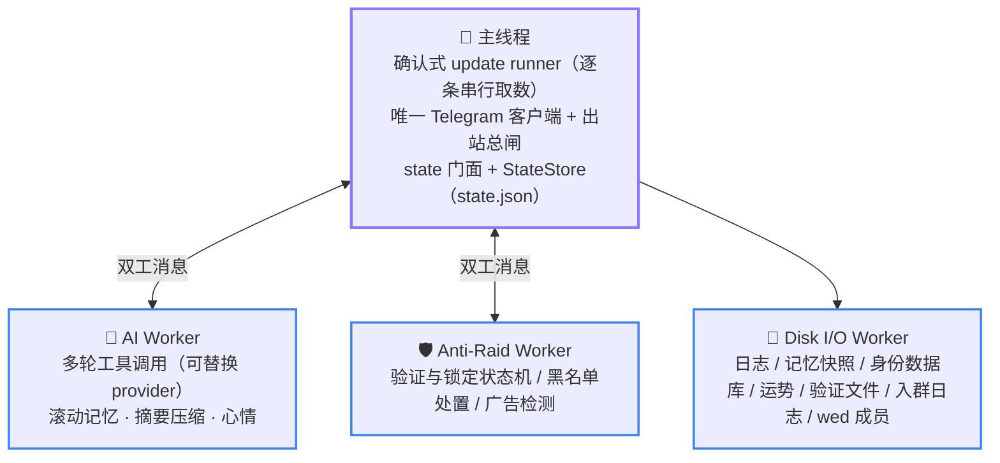
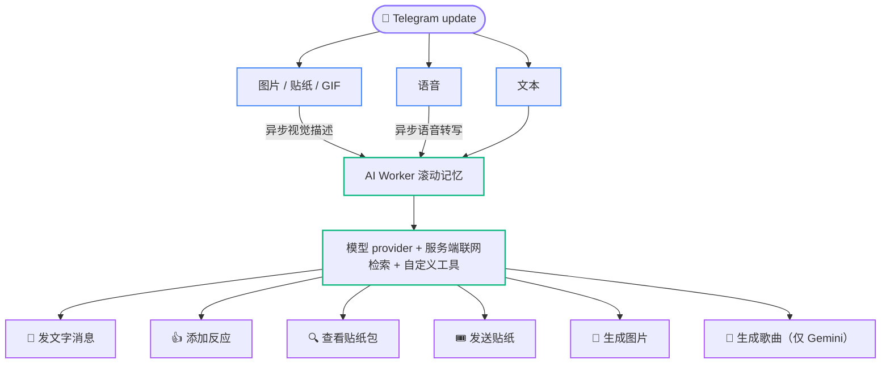

# 02 架构总览

  <b>简体中文</b> · <a href="../en/02-architecture.md">English</a> · <a href="../ja/02-architecture.md">日本語</a>

  <a href="content-table.md">📚 开发者文档首页</a> · <a href="01-getting-started.md">← 上一页：01 环境搭建</a> · <a href="03-directory-map.md">下一页：03 目录导览 →</a>

---

本页讲「系统长什么样、一条消息怎么流过去、进程怎么起来怎么停」。这里是叙述性的导览；可执行的精确约束（谁拥有什么状态、什么顺序不可颠倒）以 [04 运行时权威约束](04-invariants.md) 为准。

## 拓扑：主线程 + 三个 Worker

分工原则是**状态独占**：每份运行时状态只有一个 owner，跨线程只传消息不共享内存。

- **主线程**持有 Telegram runner、唯一真实 grammY Bot、Telegram 出站总闸、三个 Worker 的监督句柄，以及两份权威内存镜像：`cache/main/storage.ts` 的 `state.json` 全局镜像（copy 状态与素材直链），和 `cache/main/chatState.ts` 的 `chat_states` 群状态热读副本（群开关、锁定记录、权限快照、群名与中转标记，容量恰为 25）。AI/Anti-Raid Worker 只通过受监督双工消息请求 Telegram 能力；Bot API 和 Telegram 文件下载最终都由主线程发起。`stateStore.ts` 负责业务访问与快照，`statePersistence.ts` 中的 `StateStore` 负责严格恢复和落盘生命周期。
- **AI Worker** 独占群聊记忆、回复准入、媒体描述流水线、群心情与贴纸目录的运行时状态。
- **Anti-Raid Worker** 独占验证/锁定状态机与对应计时器；主线程只保留可恢复镜像。Worker 解释踢人、查询、禁言和删除等动作，但网络请求经双工边界回到主线程，并分别进入独立的 429 退避类别。未收到落地回执的黑名单处置批次同时保存在主线程镜像与 SQLite `pending_blocked_removals` 表；验证踢人则以 `kickPending` 复用每日验证快照：Worker 重建时内存重投，完整进程重建时从磁盘恢复。
- **Disk I/O Worker** 独占 `database/storage.sqlite`、`logs/`，以及 `memory/` 下 `ai/`、`stickers/`、`luck/`、`anti-raid/`、`ad-detected/`、`joinlog/`、`wed/` 七个领域目录的串行读写；`state.json` 由主线程通过业务门面调用 `StateStore` 原子写。各持久化形态、恢复与保留职责见 [07 数据根](07-operations.md#数据根)。

[`packages/aiChat/index.ts`](../../packages/aiChat/index.ts) 与 [`packages/antiRaid/index.ts`](../../packages/antiRaid/index.ts) 都只是稳定公开面的薄显式导出，不再持有实现或状态。AI 的监督生命周期与跨线程代理归 [`workerBridge.ts`](../../packages/aiChat/workerBridge.ts)，每消息入口归 [`messageIngress.ts`](../../packages/aiChat/messageIngress.ts)；Anti-Raid 的监督生命周期归 [`workerBridge.ts`](../../packages/antiRaid/workerBridge.ts)，durable 投递归 [`durableDelivery.ts`](../../packages/antiRaid/durableDelivery.ts)，update 路由归 [`updateIngress.ts`](../../packages/antiRaid/updateIngress.ts)。广告检测继续按「主线程投递门禁与候选字段投影、Worker 判定与副作用、不可丢的拉黑与封禁回主线程」分工，候选构造见 [`adCandidate.ts`](../../packages/antiRaid/adCandidate.ts)，投递与排空见 [`adDetect.ts`](../../packages/antiRaid/adDetect.ts)，Worker 流水线见 [`packages/workers/antiRaid/adDetect/`](../../packages/workers/antiRaid/adDetect/)。

验证领域仍由同一个 dispatcher 与 revision 入口保证单一权威，但纯状态转移已按 join、pending 与 terminal 生命周期拆到 [`packages/states/verification/`](../../packages/states/verification/)，[`packages/states/verification.ts`](../../packages/states/verification.ts) 只保留完整事件路由；Worker 的 Telegram 副作用进一步把踢人与终态处置拆到 [`packages/workers/antiRaid/verificationEffects/`](../../packages/workers/antiRaid/verificationEffects/)。lockdown 恢复与验证镜像接收分别由 [`lockdownMirror.ts`](../../packages/antiRaid/lockdownMirror.ts) 和 [`verificationMirror.ts`](../../packages/antiRaid/verificationMirror.ts) 承担。

Worker 崩溃都会节流自愈，但宿主实现分成两条：AI/Anti-Raid 共用 [`packages/infra/supervisedWorker.ts`](../../packages/infra/supervisedWorker.ts)，Disk I/O 因自身不能依赖落盘 logger，在 [`packages/infra/diskIO.ts`](../../packages/infra/diskIO.ts) 内维护独立的 console-only 自愈逻辑。重建后由主线程镜像或磁盘快照重放恢复；Disk I/O 在恢复 load、各领域镜像重放与恢复窗口 FIFO 排空全部成功前保持不可写，任一步失败都会终止该代际并触发 fatal 停机。重启预算耗尽再由 [`packages/infra/workerSupervisor.ts`](../../packages/infra/workerSupervisor.ts) 等 fatal 边界通知生命周期停机。

## 一条消息的旅程

更新链在 [`packages/app/registerHandlers.ts`](../../packages/app/registerHandlers.ts) 一次性显式安装，middleware 顺序即语义。链上**没有** `sequentialize`：顺序保证来自取数侧的确认式 runner（[`packages/app/updateRunner.ts`](../../packages/app/updateRunner.ts)），它每次只取一条 update，且该条的 middleware 完成前不再调用 `getUpdates`——因此保证比「按群串行」更强，是全局逐条串行。反应同步在当前 middleware 内等待统一 Telegram 动作边界结算，成功、失败与取消都属于本条 update 的确认边界。

1. **update_id 追踪**——记录已进入处理的最大 `update_id`，停机时用于确认 Telegram offset。
2. **运势签名回执确认**——在一切网关之前，转发副本也有效。
3. **init 网关**——未 `/init enable` 的群，其普通业务 update 在这里终止；`my_chat_member`、自身 `via_bot` 消息与超级管理员的 `/init` 等显式例外由 [`packages/infra/updateGate.ts`](../../packages/infra/updateGate.ts) 放行。
4. **私聊网关**——私聊只放行 `/send` 入口与进行中的中转会话；中转消息短路进消息流水线，避免文本被当成命令。
5. **入群验证**——必须早于命令处理，否则待验证用户发的命令不会被追踪清理。整条链路（验证 + 防冲群私密模式）按群缺省关闭，由 `/antiraid enable` 打开；关着的群在这一步就不投递任何入群事件。
6. **命令注册**——所有命令都注册在同一条 `bot.on(":entities:bot_command")` 子链上，不逐条挂到 `bot`，见 [06 常见修改配方](06-modification-guide.md#新增一个斜杠命令)。这层外闸是承重的：grammY 的 `command` 经 `filter → branch → lazy` 注册，每条注册都要在**每条** update 上 `await` 一次工厂、建一个数组并 `new` 一个 Composer；平铺注册等于每条普通群消息为它一次都用不上的命令层白付这笔开销。外闸判据与 `Context.has.command()` 自己的第一步完全相同，因此命中集合、相对顺序与「命中即终止」的语义都不变。其中 `/x` 是菜单占位项：它只为曝光中文动作命令的用法，收到时回一句用法说明并就此终止链路。
7. **中文动作命令**——`/咬`、`/贴贴` 这类命令（动作词收 1~2 个中文字）拿不到 Telegram 的 `bot_command` 实体，`bot.command` 匹配不到，只能用 `bot.hears` 按消息原文匹配（见 [`packages/commands/cjkAction.ts`](../../packages/commands/cjkAction.ts)）。**必须排在下一步的消息兜底之前**——排在后面就会被当成普通消息进入 AI/复读流水线，整个特性静默失效。因为它排在自动流水线之前，那条流水线的自发消息门禁对它无效，handler 自己要跳过机器人自己的消息；也因为被它认领的消息不再往下走，handler 要自己补上发送者身份缓存。不认领的形态（`/咬@OtherBot`、caption 形态、消息形态异常）一律 `next()` 放行。
8. **自动消息流水线**——[`packages/auto/`](../../packages/auto) 处理复读、AI 转录与触发判定、反应同步等非命令行为。

AI 触发后的旅程：主线程按活跃度概率/直接触发判定 → 投递 AI Worker → Worker 组装四段式模型输入（参考记忆 / 当前会话 / 本轮运行时状态 / 本轮任务）→ 多轮工具调用（发消息、贴纸、反应，以及直接触发轮可用的生图/生歌，全部经主线程代理执行）→ 结果写回滚动记忆 → 周期快照落盘。活跃度概率只是一道**随机主动搭话闸门**：按群观察近期消息，冷群保持低触发率，同群越活跃触发率越高但有硬上限；@、回复机器人等直接触发不由这道概率闸决定。

`bot.catch` 记录未处理错误后**继续抛出**——吞掉异常会让失败的 update 被确认，进程重启后 Telegram 不再重投（含持久化失败的场景）。

## AI 消息处理流水线

一条消息先按类型分流，再统一汇入 AI Worker 的滚动记忆：

- **文本**以占位文本形式即时入队，保住其在对话时序中的位置。
- **图片 / 贴纸 / GIF** 同样先占位入队，再异步下载并调用视觉模型生成描述，解析完成后原地回填同一条目的文本字段；命中贴纸白名单目录时跳过异步解析，直接写入目录里的现成描述。
- **语音**走同一条占位—回填管线，只是把视觉描述换成逐字转写（使用 `config/agent.json` 的 `media` 能力）。转录行由 `[语音]` 变成 `[语音：<原话>]`。超过时长或体积上限的语音在下载之前就被拦掉；视觉与语音支持度分别由首次真实请求探测：明确不支持、或端点以 404/405 表明模型/路径不存在（记一行指向 `$.agent.media` 的诊断）之后都不再下载该模态；超时、429、5xx 这类端点故障只按连续次数做有限指数退避，退避期内直接降级为占位、不下载也不占执行器槽位，一次成功即清零。单份媒体自身的问题不改变模态结论。

触发回复时，滚动记忆被组装成上一节所述的四段式模型输入，随服务端联网检索工具与自定义工具一并发给 `agent.text` 配置的 provider；摘要、媒体、生图与生歌各自读取自己的能力配置，不做运行时故障切换。检索在 provider 服务端执行（Gemini 的 `googleSearch` / OpenAI 的 hosted `web_search`）；同一回复始终使用固定的联网规则，每轮次数上限作为软限制写在那份规则里；真实调用数由回复循环记账并在跨过上限时点名，但检索工具在一轮内恒挂（见 [04 运行时权威约束](04-invariants.md)）。模型在一轮内可发起多次工具调用。发送类工具先校验并返回乐观接纳回执，每次调用的生成、停顿、主线程 Telegram 代理和真实发送回调由独立链持有；模型可继续查询、调用其它工具或结束。查看与查询直接返回真实数据，不等待发送队列：

- 💬 **发文字消息**——正文必须由模型显式调用发送工具；仅当整轮零接纳动作时，系统才会兜底发送。
- 👍 **添加反应**——从白名单 emoji 中选择，一轮最多接纳一次。
- 🔍 **查看贴纸包**——同步返回本轮真实贴纸清单，调用次数独立计数，发送必须先查看对应包。
- 🎟️ **发送贴纸**——一轮最多接纳一次。
- 🎨 **生成图片**、🎵 **生成歌曲**——只在群友直接 @/回复机器人或用媒体直接唤起时，按对应供应商能力挂进工具集；随机插话与非直接媒体评价不暴露这两个工具。两者各自一轮最多接纳一次。生歌使用群内共享的 15 分钟冷却，superAdmin 不受限；发出去的是一条带曲名/演唱者/时长的音乐消息，封面由生图侧的 provider 另画一张（那是消息装帧，不占生图冷却、不计动作预算）。

文字、贴纸、图片与歌曲只在真实发送成功后写回滚动记忆，并按策略周期性快照落盘；单轮动作次数上限与防循环规则见 [04 运行时权威约束](04-invariants.md)。

同群最多同时处理 `REPLY_ROUND_MAX_CONCURRENT`（当前为 5）轮 AI 请求，尚未开始处理的直接触发保留在容量为 `REPLY_TRIGGER_QUEUE_MAX`（当前为 15）的 FIFO 中，开始轮次即出队。每轮启动时按入站顺序预留发送位置，媒体在异步识别前占位。发送侧使用 5 个固定桶，每桶可追加多条链，积压链数不参与模型并发准入。模型结束时 commit 完整动作链并立即释放模型位、补跑待处理请求；发送只执行最前面的就绪轮次，等待未就绪占位，跳过已完成项。同轮动作按工具调用顺序串联，附加动作等待真实结果。发送、心跳与贴纸锁仍由该轮任务持有至实际收尾，之后回收发送顺位。触发限频、供应商配额、Telegram 控流、429 重试和取消边界继续生效。

## 启动顺序

入口 [`index.ts`](../../index.ts) 只组装 [`packages/app/lifecycle.ts`](../../packages/app/lifecycle.ts) 的 `ApplicationLifecycle`；生产模块 import 不启动 Worker、计时器、网络请求或共享目录写入，一切运行时初始化都显式发生：

`runApplication()` 以 `"main"` 模式调用统一的 `ApplicationLifecycle.run(mode)`，只在 `import.meta.main` 为真时自动执行；该模式安装进程信号/异常 handler，并把未处理的运行错误记录为非零退出。测试或嵌入式宿主必须显式调用 `runTest()`：它选择 `"test"` 模式，不接管进程 handler，并在完成 `dispose()` 后把启动/轮询异常原样交还调用方。两种模式共用同一条 `init()` → `wait()` → `dispose()` 边界，普通 import 仍无副作用。

1. 递归创建并**预检数据根**：写入、文件 fsync、同目录 hard link、原子 rename、目录 fsync，任一失败带路径拒绝启动。
2. 取得 **`bot.lock`** 单实例锁（格式与清理规则见 [07 运维与排障](07-operations.md#botlock-拒绝启动)）。
3. **恢复 state 持久化边界与校验已存在的部署输入**：清理顶层孤儿临时文件，严格校验并恢复 `state.json` 主备副本，再由业务门面填充权威内存；`telegram.json` 是进程级必填，其余可选输入**只要文件存在就必须严格解析通过**，缺省则交给各功能自己的 readiness 判定（见 [`packages/config/readiness.ts`](../../packages/config/readiness.ts) 的 `validateExistingDeploymentInputs`，出口在 [`packages/app/featurePreflight.ts`](../../packages/app/featurePreflight.ts)）。SQLite `chat_states` 里的群开关不参与这道核对，只在下一步的持久化恢复边界解码。
4. 初始化 **Disk I/O Worker**。日志、AI、贴纸、运势、待验证、入群日志、wed 成员与 `database/storage.sqlite` 先完成全域只读 inspect 和严格解码；全部成功后才统一 adopt owner，成功回执之后再清理临时/孤儿/过期文件、执行 compact，并注册一个显式使用 `Asia/Tokyo` 的 Bun 原生零点维护 cron。该 cron 先经 `midnightMaintenance` 通知主线程接纳 `/wed` 每日成员复核，再维护运势、日志、入群日志、广告样本归档、待验证日文件和临时白名单累计；各领域原有的启动或业务事件触发清理继续作为兜底，待验证轮换失败只保留不阻止退出的一秒重试 timer。任何 inspect 失败都保留所有领域现场，不 chmod、rewrite、unlink，也不留下维护 cron。主线程接管 wed 成员集合，并接收 `chat_states`、永久名单计数和未完成处置，不复制永久白名单、黑名单或临时白名单活动整表。随后初始化 Telegram 客户端，并断言超级管理员不在黑名单内。
5. 注册 handler、设置命令菜单并执行 `bot.init()`。
6. 初始化 **AI Worker**（AI 配置不可用时这一步只记一行日志并整体跳过），只 hydrate `chat_states` 中明确启用 AI 的群；随后恢复贴纸目录、运势与待验证镜像，初始化 **Anti-Raid Worker** 与黑名单补扫调度，并对已托管的群补扫一轮黑名单。
7. 把 `state.global.assets` 的缺项补成内置缺省值（后台落盘，不阻塞启动），启动 acknowledgement-safe runner，最后才起**低优先级群标题回填**（受并发上限约束，不会无界占用 query 类请求与连接）。

失败与退出统一由 `ApplicationLifecycle` 收口：只有已取得的资源才会释放或 flush。

## 停机顺序

正常与异常停机由同一个生命周期收口，顺序固定：

1. **Quiesce**：停下标题、头像、翻译、gag 新预约与 blocklist 补扫调度器，并停止 runner。五个 quiesce 入口各自失败隔离——任一入口抛错仍须尝试其余入口。**「已经 quiesce 过」不得被缓存**：`init()` 会把这五个 owner 重新武装，启动期到达的停止信号若把成功记成一次性完成，此后每一次 quiesce 都会被短路，owner 整个停机期间继续收活，而停机结果照报成功。五次调用都是幂等赋值，重复执行没有代价。
2. **有界 drain**：排空各队列与 mailbox。runner 为每个 update 持有独立取消 signal；在途 handler 超过 drain 期限时 abort 这些 signal 并给最后一段有界收敛时间，仍不收敛的 handler 会阻止最终 offset 确认，并在最佳努力 dispose 后强制非零退出。
3. **Flush 与 dispose**：正常路径先排空 Anti-Raid、gag 提示与统一延迟删除，再 flush AI、排空 Telegram 出站、flush Disk I/O 与 StateStore；最终 dispose 固定按同一维护排空顺序，再执行「flush AI → 终止 AI → 排空 Telegram 出站 → flush Disk I/O → 终止 Anti-Raid/Disk I/O → flush StateStore → 释放实例锁」。

生命周期与 Anti-Raid drain 的进程内耗时预算统一通过 [`packages/libs/monotonicDeadline.ts`](../../packages/libs/monotonicDeadline.ts) 和 `performance.now()` 计算，系统时钟回拨不能延长关停或排空期限；业务状态与持久化所需的绝对时间戳仍使用 `Date.now()`。

失败语义：

- 任一关键 quiesce、drain、flush 或锁释放失败都会阻止最终 offset 确认，并以非零状态退出，让 Telegram 重投未确认的 update、或由运维处理仍被持有的锁。
- 普通 dispose 已在途时若又发生致命异常，异常路径复用同一 Promise，但由独立的 15 秒绝对 deadline 保证最终强制退出。时间预算耗尽时先 abort 在途请求再结算未开始的工作，abort 之后不再发送任何消息。
- 异常退出路径的维护预算恰好为 0，drain 不再等待，直接 abort 并立即结算。
- dispose 的每个 owner 各自失败隔离：单点抛错只记为 `failed`，不会跳过后续 owner、`flushStateToDisk` 与实例锁处置。

各步骤的完整不变量（哪些失败必须 fatal、哪些顺序不可交换）见 [04 运行时权威约束](04-invariants.md)。

---

[← 上一页：01 环境搭建](01-getting-started.md) · [📚 开发者文档首页](content-table.md) · [⬆️ 回到顶部](#02-架构总览) · [下一页：03 目录导览 →](03-directory-map.md)

