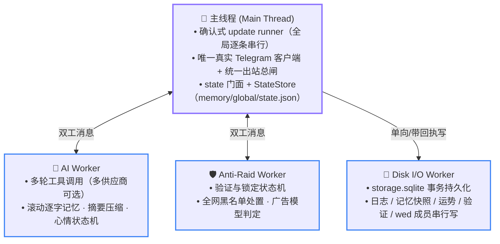
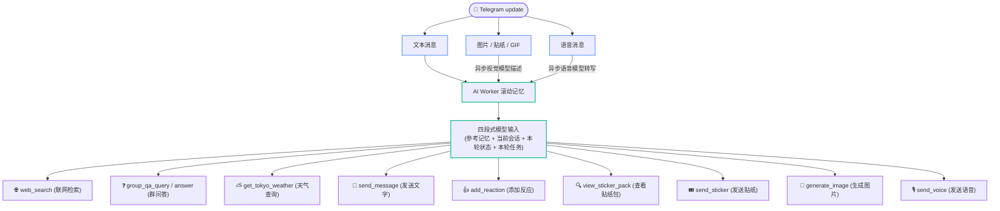

# 02 架构总览

<p align="center">
  <b>简体中文</b> · <a href="../en/02-architecture.md">English</a> · <a href="../ja/02-architecture.md">日本語</a>
</p>

<p align="center">
  <a href="content-table.md">📚 开发者文档首页</a> · <a href="01-getting-started.md">← 上一页：01 环境搭建</a> · <a href="03-directory-map.md">下一页：03 目录导览 →</a>
</p>

---

本文全面介绍 Copy Ninjia 的系统多线程架构、消息处理流水线，以及进程的启动与停机生命周期。若需查阅底层的精确约束与状态归属规则，请参阅 [04 权威约束](04-invariants.md)。

## 拓扑：主线程 + 三个 Worker


```mermaid
flowchart TD
    classDef main stroke:#8e75ff,stroke-width:2.5px;
    classDef worker stroke:#3b82f6,stroke-width:2px;

    MAIN["🧵 主线程 (Main Thread)<br/>• 确认式 update runner（全局逐条串行）<br/>• 唯一真实 Telegram 客户端 + 统一出站总闸<br/>• state 门面 + StateStore（memory/global/state.json）"]:::main
    AI["🤖 AI Worker<br/>• 多轮工具调用（多供应商可选）<br/>• 滚动逐字记忆 · 摘要压缩 · 心情状态机"]:::worker
    RAID["🛡️ Anti-Raid Worker<br/>• 验证与锁定状态机<br/>• 全网黑名单处置 · 广告模型判定"]:::worker
    DISK["💾 Disk I/O Worker<br/>• storage.sqlite 事务持久化<br/>• 日志 / 记忆快照 / 运势 / 验证 / wed 成员串行写"]:::worker

    MAIN <-->|双工消息| AI
    MAIN <-->|双工消息| RAID
    MAIN -->|单向/带回执写| DISK
```

系统的核心设计原则是**状态单宿主（Single Ownership）**：任何一份运行时状态，在同一时刻只能由一个指定的线程独占持有。不同线程之间严格通过结构化消息通信，不共享可变内存，从而彻底消除竞态条件与多线程锁竞争。

### 四大线程职责分工

- **🧵 主线程 (Main Thread)**
  - **网络与分发**：负责运行 Telegram 长轮询 Runner、持有唯一的 grammY Bot 客户端实例、管控所有发往 Telegram 的请求出站总闸，并监督管理三个 Worker 的生命周期。
  - **只读缓存镜像**：
    - `cache/main/storage.ts`：全局运行状态镜像（如复读目标与语音合成每日用量）。
    - `cache/main/assets.ts`：静态素材路径与专用图库配置快照。
    - `cache/main/chatState.ts`：群组运行时状态热读副本（托管上限 `STATE_MANAGED_CHAT_LIMIT` 个群：功能开关、锁定状态、权限快照、群名称及翻译会话等）。
  - **全局状态落盘门面**：通过 `stateStore.ts` 门面原子化写入 `memory/global/state.json`。
  - **Telegram 代理出站**：所有 Telegram API 请求及需要 Bot Token 的媒体下载均由主线程出站总闸代理执行；而 AI 与 Anti-Raid Worker 则直接与外部模型 API 通信。

- **🤖 AI Worker**
  - **独占状态**：群聊记忆（逐字上下文热区与摘要冷区）、AI 回复准入计数、多模态媒体描述流水线、全局唯一的心情挡位及贴纸包白名单。
  - **核心职责**：多轮模型交互、工具调用调度、拟人化打字停顿与动作编排，以及长上下文的滚动压缩。

- **🛡️ Anti-Raid Worker**
  - **独占状态**：新成员入群验证状态机、防冲群锁定（私密模式）状态机及其计时器。
  - **核心职责**：入群验证流程、超时踢人编排、进群消息广告识别与全网黑名单处置。需要调用 Telegram API 时将动作交回主线程代理出站。
  - **崩溃自愈**：Worker 重启时由主线程推送镜像恢复内存状态；进程级重启则从磁盘日志重建。

- **💾 Disk I/O Worker**
  - **独占持久化**：独占操作 SQLite 数据库（`database/storage.sqlite`）、运行日志（`logs/`）以及 `memory/` 下除 `global/` 外的持久化数据（如贴纸、运势、防冲群记录、广告样本、AI 用量等）。
  - **事务提交**：通过写透（write-through）、批量事务提交与版本号确认（revision ACK）机制确保数据耐久性。

### 模块边界与 Worker 监督

- **对外接口解耦**：[`packages/aiChat/index.ts`](../../packages/aiChat/index.ts) 与 [`packages/antiRaid/index.ts`](../../packages/antiRaid/index.ts) 均为薄公开导出模块，不保存内部实现状态：
  - AI 模块：通过 [`workerBridge.ts`](../../packages/aiChat/workerBridge.ts) 管理 Worker 生命周期与状态镜像，通过 [`messageIngress.ts`](../../packages/aiChat/messageIngress.ts) 接收并分发待处理的消息。
  - Anti-Raid 模块：通过 [`workerBridge/controller.ts`](../../packages/antiRaid/workerBridge/controller.ts) 监控 Worker 状态，并通过 [`durableDelivery.ts`](../../packages/antiRaid/durableDelivery.ts) 保证关键状态的可靠投递。
- **纯状态机分离**：
  - 入群验证：按加入（join）、等待（pending）、终态（terminal）、禁用（disable）以及恢复（adopt）阶段拆分为纯函数逻辑（位于 `packages/states/verification/`）。
  - 防冲群锁定：按生效（apply）、持久化（persistence）、恢复（restore）、播报（announcement）以及重新接纳（adopt）阶段拆分（位于 `packages/states/lockdown/`）。
- **故障自愈机制**：
  - AI 与 Anti-Raid Worker 共用 [`packages/infra/supervisedWorker.ts`](../../packages/infra/supervisedWorker.ts)，发生未捕获异常崩溃时，会在设定的重启预算内节流重启，并由主线程重新推送最新镜像恢复状态。
  - Disk I/O Worker 的自愈在 [`packages/infra/diskIO.ts`](../../packages/infra/diskIO.ts) 中独立实现，在数据加载、镜像恢复和等待队列排空完成前保持只读状态；若恢复阶段失败则直接安全停机。

---

## 一条消息的旅程

系统所有消息中间件在 [`packages/app/registerHandlers.ts`](../../packages/app/registerHandlers.ts) 中显式装配。前置处理链通过 `bot.use(...preamble)` 批量注册，由 grammY 统一调度；表情反应、成员变更、内联回调等非消息事件则通过独立的 `bot.on` 注册。

系统没有使用并发队列中间件，而是直接在拉取消息的 Runner（[`packages/app/updateRunner.ts`](../../packages/app/updateRunner.ts)）层面保证顺序：每次长轮询只拉取 1 条更新（`UPDATE_POLL_LIMIT`），必须等当前消息的整条处理链路完全执行完毕后，才会发起下一次 `getUpdates`。这种设计在根源上实现了全局逐条串行处理。

```text
[Telegram Update]
       │
       ▼
 1. update_id 追踪       ── 记录最大已处理 update_id，停机时确立 offset
       │
       ▼
 2. Bot 发言限流         ── 其他 Bot 的 message 按 ID 跨群计数，超额的更新静默丢弃
       │
       ▼
 3. 运势签名回执确认    ── 优先结算内联抽签落地回执（转发副本同样有效）
       │
       ▼
 4. /init 门禁 + 私聊网关 ── 未 /init enable 的群拦截普通业务；私聊仅放行超管 /send
       │
       ▼
 5. 身份预热            ── 一次性补齐本条 update 可见身份的冷缺失
       │
       ▼
 6. 私聊 /send 中转      ── 活动中转会话的非命令私聊消息直接交给自动消息流水线
       │
       ▼
 7. 入群验证 Ingress     ── 早于命令处理，待验证成员的所有发言在此被捕获与追踪
       │
       ▼
 8. gag 禁言 Ingress     ── 被 gag 用户的发言在此被捕获并删除，直接终止链路
       │
       ▼
 9. /qa 表单 Ingress    ── 捕获并认领正在填写的「问题:」「回答:」表单消息
       │
       ▼
10. 命令子链 (:entities:bot_command)
       │                 ── 外闸过滤，不含命令实体的消息单次跳过整组命令
       ├─ /permission, /white, /copy, /translate, /wed, /block, /ai_chat ...
       └─ /x (菜单占位项，引导中文动作命令用法)
       │
       ▼
11. 中文动作命令 (hears) ── 匹配 /咬、/贴贴 等 1~2 字动作词；在消息兜底前截获
       │
       ▼
12. 自动消息流水线       ── auto/message/ 处理复读、群问答直答、AI 触发与转录等
```

表情反应同步由 `message_reaction` 的独立 handler（`auto/reactionSync.ts`）处理，不经过上面的消息链。

> [!NOTE]
> `bot.catch` 记录错误日志后必须继续向上抛出异常，防止未成功处理的 update 被误认为已完成；如果静默吞掉异常，该消息的 offset 会被错误推进，导致消息丢失。

---

---

## AI 消息处理流水线


```mermaid
flowchart TD
    classDef input stroke:#8e75ff,stroke-width:2px;
    classDef process stroke:#3b82f6,stroke-width:1.5px;
    classDef ai stroke:#10b981,stroke-width:2px;
    classDef action stroke:#a855f7,stroke-width:1.5px;

    U(["📨 Telegram update"]):::input --> TXT["文本消息"]:::process
    U --> MED["图片 / 贴纸 / GIF"]:::process
    U --> VOC["语音消息"]:::process

    TXT --> MEM["AI Worker 滚动记忆"]:::ai
    MED -- 异步视觉模型描述 --> MEM
    VOC -- 异步语音模型转写 --> MEM

    MEM --> G["四段式模型输入<br/>(参考记忆 + 当前会话 + 本轮状态 + 本轮任务)"]:::ai

    G --> T1["🌐 web_search (联网检索)"]:::action
    G --> T2["❓ group_qa_query / answer (群问答)"]:::action
    G --> T3["⛅ get_tokyo_weather (天气查询)"]:::action
    G --> A1["💬 send_message (发送文字)"]:::action
    G --> A2["👍 add_reaction (添加反应)"]:::action
    G --> A3["🔍 view_sticker_pack (查看贴纸包)"]:::action
    G --> A4["🎟️ send_sticker (发送贴纸)"]:::action
    G --> A5["🎨 generate_image (生成图片)"]:::action
    G --> A6["🎙️ send_voice (发送语音)"]:::action
```

### 1. 媒体分流与占位回填管线

- **文本消息**：直接作为占位记录插入对话队列，确保上下文的时间先后顺序完全准确。
- **图片 / 贴纸 / GIF**：先在对话队列中写入占位符，后台异步下载并调用视觉模型生成画面描述，解析完成后原地回填；若命中本地贴纸白名单，则直接使用预置说明。
- **语音消息**：同样采用占位-回填管线，后台调用音频转写模型将语音转换为文本（内容标注为 `[语音：<原话>]`）。过长或体积过大的语音在下载前会被拦截；模型对音频的支持度由首次真实请求探测决定。

### 2. 回复触发与四段式上下文

AI 触发包含两种途径：
- **直接唤醒**：群友 `@机器人`、直接回复机器人的消息，或发送指定媒体。
- **随机主动插话**：根据群内近期的发言活跃度动态计算概率；冷群插话概率低，活跃群插话概率适度提升（设有人性化上限）；执行 `/quiet` 安静模式期间完全不主动插话。

触发回复后，AI Worker 会组装**四段式模型输入**（系统提示词中包含预设人设）：
1. **参考记忆**：机器人的基础身份设定，以及早期对话压缩得到的长程冷记忆摘要。
2. **当前会话**：近期多模态滚动的逐字聊天记录与群友发言人名单。
3. **本轮运行时状态**：今日心情、当前实际时间，以及本轮工具状态（可用性、生图冷却、语音剩余额度、已登记问答等）。
4. **本轮任务**：触发回复的用户身份、针对不同触发类型的应答要求，以及偶尔模拟人类手滑打错字的拟人化指令。

### 3. 工具调用体系与动作预算

大模型在单轮对话中可触发多次工具调用。系统在单轮回复内保持工具清单稳定，并在执行层对各项操作进行权限和额度校验：

| 工具名称 | 类型 | 行为规则与额度限制 |
| :--- | :--- | :--- |
| **`send_message`** | 动作 | 发送纯文本消息。仅当整轮调用未生成任何可见动作时，系统才会自动兜底发送文字回复。 |
| **`add_reaction`** | 动作 | 从白名单 emoji 中选取并为消息添加表情反应；单轮上限为 `MAX_REACTIONS_PER_REPLY`。 |
| **`view_sticker_pack`** | 查询 | 查看指定贴纸包内的贴纸列表；不消耗动作额度，发送贴纸前模型必须先查询清单。 |
| **`send_sticker`** | 动作 | 发送指定的贴纸；单轮上限为 `MAX_STICKERS_PER_REPLY`。 |
| **`generate_image`** | 动作 | 生成并向群内发送图片。校验群冷却时间；单轮上限为 `MAX_GENERATED_IMAGES_PER_REPLY`。 |
| **`send_voice`** | 动作 | 按配置语言合成台词语音；后台异步合成并由动作链排队发送；单轮上限为 `MAX_VOICES_PER_REPLY`。 |
| **`web_search`** | 查询 | 本地联网检索工具（配置了 `agent.web_search` 时挂载）；受单轮最大调用次数约束。 |
| **`group_qa_query`** | 查询 | 查询本群预先登记的问题清单；不占用动作额度。 |
| **`group_qa_answer`** | 查询 | 获取 `group_qa_query` 中特定问题的预置答案；由模型根据语义自行决定是否引用。 |
| **`get_tokyo_weather`** | 查询 | 查询东京当日天气与温度；仅在时区为 `Asia/Tokyo` 时挂载。 |

> [!TIP]
> **动作链与拟人化聊天状态**：
> - 模型调用发送类工具时，系统当场校验并预扣额度，随即向模型返回成功回执；而实际的拟人打字停顿、语音合成等待与真实的 Telegram API 发送，则由后台的**串行动作链**按调用顺序依次平滑执行。
> - Telegram 顶部的状态提示（正在输入、正在录音、正在选贴纸、正在上传图片）由动作链当前执行的步骤实时驱动；上一段状态结束后会静默一段缓冲时间，再切换到下一个动作状态。

---

## 启动顺序

程序入口 [`index.ts`](../../index.ts) 仅负责装配 [`ApplicationLifecycle`](../../packages/app/lifecycle.ts)。模块在 import 时保证无副作用（不启动 Worker、不建定时器、不发起网络连接、不写磁盘）。真正的启动流程由 `ApplicationLifecycle.init()` 串行推进：

0. **配置目录布局检查**：由 `layout.ts` 检查 `config/` 目录结构，禁止文件散落根目录，确认 `config/dynamic/` 目录存在，随后严格解析 `bot.json`。
1. **数据根预检与排他锁**：检查运行时数据根目录的写权限、文件 fsync、hard link 与原子 rename 能力，随后获取 `bot.lock` 单实例文件锁（基于系统 `/proc/<pid>/stat` 与内核 boot ID）；任一步失败立即安全退出。接着初始化头像队列、群标题回填、翻译、口球及延迟命令的运行时环境。
2. **全局状态与配置校验**：
   - 清理中断残留的临时文件。
   - 严格加载恢复 `memory/global/state.json`；若数据根根目录下遗留有未迁移的旧格式文件则报错退出。
   - 对所有已存在的部署配置文件进行严格校验；缺少可选配置由对应功能降级处理，存在但格式非法则直接报错退出。
   - 检查并确保专用图库目录就绪（核对权限与文件格式）。
3. **启动 Disk I/O Worker 并恢复持久化数据**：
   - Worker 启动时对所有持久化数据（SQLite 数据库、日志、AI 用量、贴纸、运势、入群日志等）进行只读检查与格式校验；校验全部通过后才接管状态并注册每日零点维护任务。
   - 主线程同步填充群状态、群问答等热读缓存副本，初始化 Telegram 客户端，确认超级管理员未被拉黑。
4. **注册中间件与握手**：挂载全部消息中间件、注册命令菜单，并执行 `bot.init()` 与 Telegram 服务器完成连接握手。
5. **初始化业务 Worker 与调度器**：
   - 启动 AI Worker（若 AI 配置就绪），加载对话记忆快照与贴纸目录。
   - 启动 Anti-Raid Worker，恢复入群验证与防冲群锁定镜像。
   - 启动定时任务调度器（`cron.json`）与配置文件动态热重载监听，并对已有群组执行一轮黑名单补扫。
6. **启动消息拉取 Runner**：启动长轮询逐条串行 Runner 开始消费 updates，开启老婆抽取成员复核与群标题异步更新。

---

## 停机顺序

停机统一由 `ApplicationLifecycle` 的 `dispose()` 收口，无论是收到 `SIGINT` / `SIGTERM` 正常退出还是发生未捕获异常退出，均按严格的串行屏障依序关停：

1. **入口关闸（Quiesce）**：
   - 停止群标题回填、头像队列、翻译、口球、定时任务与配置文件热重载监听；每个入口独立清理，任何错误均记录并阻止最终 offset 确认。
   - 停止 Telegram 长轮询 Runner，不再拉取新的 update。
2. **有界队列排空（Drain）**：
   - 为正在处理的消息 handler 注入超时取消信号，在限定时间内等待其自然执行完毕；若超时则强制中止当前消息处理，并扣住该消息的 offset 不向 Telegram 提交，确保重启后 Telegram 能够重新推送重试。
3. **数据落盘与确认 Offset**：
   - 按依赖顺序排空各 Worker 的等待队列并将所有脏数据刷新到磁盘（flush）。
   - 全部数据确认安全落盘后，通过一次轻量 `getUpdates` 向 Telegram 正式提交最后处理完毕的 update_id 作为 offset。若前面的落盘步骤发生任何异常，则坚决不提交 offset，并以非零状态码退出。
4. **资源释放（Dispose）**：
   - 依次释放各模块资源：AI Worker 退出、出站队列关闸、终止 Anti-Raid 与 Disk I/O Worker（Disk I/O Worker 终止前提交残余写、执行 WAL checkpoint 并关闭共享 SQLite）、保存最终全局状态。
   - 最终释放 `bot.lock` 单实例锁（若退出过程发生异常未结算，则保持锁直至操作系统回收进程，防止故障态下被 supervisor 盲目秒级拉起）。

---

<div align="center">

[← 上一页：01 环境搭建](01-getting-started.md) · [📚 开发者文档首页](content-table.md) · [⬆️ 回到顶部](#02-架构总览) · [下一页：03 目录导览 →](03-directory-map.md)

</div>
