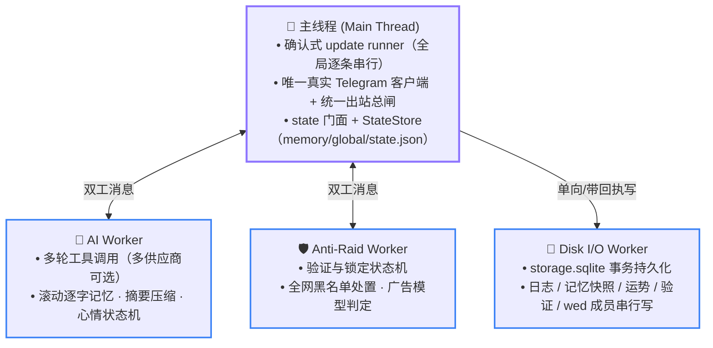

# 02 架构总览

<p align="center">
  <b>简体中文</b> · <a href="../en/02-architecture.md">English</a> · <a href="../ja/02-architecture.md">日本語</a>
</p>

<p align="center">
  <a href="content-table.md">📚 开发者文档首页</a> · <a href="01-getting-started.md">← 上一页：01 环境搭建</a> · <a href="03-directory-map.md">下一页：03 目录导览 →</a>
</p>

---

本页系统化介绍系统架构拓扑、消息处理流水线以及进程的启动与停机生命周期。关于精确的执行约束与状态归属契约，请以 [04 运行时权威约束](04-invariants.md) 为准。

## 拓扑：主线程 + 三个 Worker


```mermaid
flowchart TD
    classDef main stroke:#8e75ff,stroke-width:2.5px;
    classDef worker stroke:#3b82f6,stroke-width:2px;

    MAIN["🧵 主线程 (Main Thread)<br/>• 确认式 update runner（全局逐条串行）<br/>• 唯一真实 Telegram 客户端 + 统一出站总闸<br/>• state 门面 + StateStore（memory/global/state.json）"]:::main
    AI["🤖 AI Worker<br/>• 多轮工具调用（多供应商可选）<br/>• 滚动逐字记忆 · 摘要压缩 · 心情状态机"]:::worker
    RAID["🛡️ Anti-Raid Worker<br/>• 验证与锁定状态机<br/>• 全网黑名单处置 · 广告模型判定"]:::worker
    DISK["💾 Disk I/O Worker<br/>• storage.sqlite 事务持久化<br/>• 日志 / 记忆快照 / 运势 / 验证 / wed 成员串行写"]:::worker

    MAIN <-->|双工消息| AI
    MAIN <-->|双工消息| RAID
    MAIN -->|单向/带回执写| DISK
```

系统的核心设计原则是**状态独占（Single Ownership）**：每份运行时状态在同一时刻有且仅有一个权威宿主线程，跨线程仅通过结构化消息通信，**严禁共享可变内存**。

### 四大线程分工

- **🧵 主线程 (Main Thread)**
  - **网络与分发**：持有 Telegram runner、唯一真实 grammY Bot 实例、出站请求总闸与三个 Worker 的监督句柄。
  - **内存镜像**：
    - `cache/main/storage.ts`：`memory/global/state.json` 全局镜像（复读状态与语音每日计数）。
    - `cache/main/assets.ts`：`config/dynamic/assets.json` 素材与图库快照。
    - `cache/main/chatState.ts`：`chat_states` 群状态热读副本（托管上限 25 群：开关、锁定记录、权限快照、群名、中转会话与翻译会话）。
  - **数据写入门面**：通过 `stateStore.ts` 业务门面调用 `StateStore` 原子写 `state.json`。
  - **Telegram 代理执行**：Telegram API 操作与需要 Bot 身份的媒体下载由主线程出站边界执行；AI 与 Anti-Raid Worker 各自直接调用所配模型服务。

- **🤖 AI Worker**
  - **独占状态**：群聊记忆（逐字热区 + 摘要冷区）、回复准入计数、媒体描述流水线、全局唯一的当前心情及贴纸包白名单目录。
  - **职责**：多轮模型交互、工具调用调度、拟人化动作编排及记忆滚动压缩。

- **🛡️ Anti-Raid Worker**
  - **独占状态**：入群验证状态机、私密模式锁定状态机及其对应计时器。
  - **职责**：执行入群判定、超时踢人编排、广告识别流水线与黑名单处置。网络动作经双工边界交回主线程出站，并按独立 429 分类退避。
  - **自愈与重放**：Worker 重建时通过主线程可恢复镜像重建内存状态；进程级重启则从磁盘日志恢复。

- **💾 Disk I/O Worker**
  - **独占持久化**：独占操作 `database/storage.sqlite`、`logs/`，以及 `memory/` 下的 7 个领域目录（`stickers/`、`luck/`、`anti-raid/`、`ad-detected/`、`ai-daily-usage/`、`joinlog/`、`wed/`）的串行读写。
  - **事务提交**：通过 write-through、攒批事务与精准 revision ACK 保证数据耐久性。

### 模块边界与 Worker 监督

- **公开面解耦**：[`packages/aiChat/index.ts`](../../packages/aiChat/index.ts) 与 [`packages/antiRaid/index.ts`](../../packages/antiRaid/index.ts) 均为薄公开导出，不持有实现状态。AI 监督归 [`workerBridge.ts`](../../packages/aiChat/workerBridge.ts)，消息入口归 [`messageIngress.ts`](../../packages/aiChat/messageIngress.ts)；Anti-Raid 监督归 [`workerBridge/controller.ts`](../../packages/antiRaid/workerBridge/controller.ts)，durable 投递归 [`durableDelivery.ts`](../../packages/antiRaid/durableDelivery.ts)。
- **纯状态转移分离**：验证状态转移拆分为 join、pending、terminal、disable 阶段（位于 `packages/states/verification/`）；锁定状态机拆分为 apply、persistence、restore、announcement、adopt 五阶段（位于 `packages/states/lockdown/`）。
- **故障自愈机制**：
  - AI/Anti-Raid Worker 共用 [`packages/infra/supervisedWorker.ts`](../../packages/infra/supervisedWorker.ts)，发生崩溃时在重启预算内节流拉起，并由主线程重放最新镜像。
  - Disk I/O Worker 因自身不能依赖落盘 logger，在 [`packages/infra/diskIO.ts`](../../packages/infra/diskIO.ts) 内自持 console-only 自愈逻辑。Disk I/O 在恢复阶段完成数据加载、镜像重放与 FIFO 排空前保持只读不可写；任一步失败直接 fatal 停机。

---

## 一条消息的旅程

所有消息中间件在 [`packages/app/registerHandlers.ts`](../../packages/app/registerHandlers.ts) 中显式装配：下图 1–10 的前置链按顺序收进一个数组，通过 `bot.use(...preamble)` 批量注册，由 grammY 管理顺序、认领与 next 契约；反应、成员变更、回调与 inline 等非消息 update 随后各自 `bot.on` 注册。
链路中**没有使用** `sequentialize`，全局消息顺序由取数侧的确认式 runner（[`packages/app/updateRunner.ts`](../../packages/app/updateRunner.ts)）保证：**每次仅拉取一条 update，且在该条中间件链路完全结算前不发起下一次 `getUpdates`**，实现全局逐条串行。

```text
[Telegram Update]
       │
       ▼
 1. update_id 追踪       ── 记录最大已处理 update_id，停机时确立 offset
       │
       ▼
 2. 运势签名回执确认    ── 优先结算内联抽签落地回执（转发副本同样有效）
       │
       ▼
 3. /init 门禁          ── 未 /init enable 的群拦截普通业务；超管 /init 等显式放行
       │
       ▼
 4. 私聊网关            ── 仅放行超管 /send 入口与活跃中转会话
       │
       ▼
 5. 入群验证 Ingress     ── 早于命令处理，待验证成员的所有发言在此被捕获与追踪
       │
       ▼
 6. gag 禁言 Ingress     ── 被 gag 用户的发言在此被捕获并删除，直接终止链路
       │
       ▼
 7. /qa 表单 Ingress    ── 捕获并认领正在填写的「问题:」「回答:」表单消息
       │
       ▼
 8. 命令子链 (:entities:bot_command)
       │                 ── 外闸过滤，不含命令实体的消息单次跳过整组命令
       ├─ /permission, /white, /copy, /translate, /wed, /block, /ai_chat ...
       └─ /x (菜单占位项，引导中文动作命令用法)
       │
       ▼
 9. 中文动作命令 (hears) ── 匹配 /咬、/贴贴 等 1~2 字动作词；在消息兜底前截获
       │
       ▼
10. 自动消息流水线       ── auto/ 处理复读、AI 触发与转录、表情反应同步等
```

> [!NOTE]
> `bot.catch` 捕获未处理异常后**必须继续向上抛出**：静默吞掉异常会导致 Telegram 误认为该 update 已成功消费，进程重启后 Telegram 将不会重投，进而产生数据丢失隐患。

---

## AI 消息处理流水线


```mermaid
flowchart TD
    classDef input stroke:#8e75ff,stroke-width:2px;
    classDef process stroke:#3b82f6,stroke-width:1.5px;
    classDef ai stroke:#10b981,stroke-width:2px;
    classDef action stroke:#a855f7,stroke-width:1.5px;

    U(["📨 Telegram update"]):::input --> TXT["文本消息"]:::process
    U --> MED["图片 / 贴纸 / GIF"]:::process
    U --> VOC["语音消息"]:::process

    TXT --> MEM["AI Worker 滚动记忆"]:::ai
    MED -- 异步视觉模型描述 --> MEM
    VOC -- 异步语音模型转写 --> MEM

    MEM --> G["四段式模型输入<br/>(参考记忆 + 当前会话 + 本轮状态 + 本轮任务)"]:::ai

    G --> T1["🌐 web_search (联网检索)"]:::action
    G --> T2["❓ group_qa_query / answer (群问答)"]:::action
    G --> T3["⛅ get_tokyo_weather (天气查询)"]:::action
    G --> A1["💬 send_message (发送文字)"]:::action
    G --> A2["👍 add_reaction (添加反应)"]:::action
    G --> A3["🔍 view_sticker_pack (查看贴纸包)"]:::action
    G --> A4["🎟️ send_sticker (发送贴纸)"]:::action
    G --> A5["🎨 generate_image (生成图片)"]:::action
    G --> A6["🎙️ send_voice (发送语音)"]:::action
```

### 1. 媒体分流与占位管线

- **文本**：以占位文本形式即时入队，锁定在对话上下文中的物理时序。
- **图片 / 贴纸 / GIF**：先占位入队，后台异步下载并调用视觉模型生成描述，解析完毕后原地回填；命中本地贴纸白名单目录时直接填入现成描述。
- **语音**：走占位—回填管线，异步调用音频模型逐字转写（转写行标记为 `[语音：<原话>]`）。超长或超大语音在下载前拦截；模态支持度由首次真实请求探测决定。

### 2. 回复触发与四段式上下文

AI 触发由两套机制决定：
- **直接触发**：群友 @ 机器人、回复机器人消息或发送直接唤起媒体。
- **随机主动插话**：按群近期活跃度动态计算概率，冷群保持低概率，活跃群概率随之提升（受硬上限保护）；`/quiet` 期间静默。

触发后，AI Worker 组装四段式模型输入：
1. **参考记忆**：从冷记忆摘要与长期画像提取。
2. **当前会话**：近期多模态滚动逐字对话记录。
3. **本轮运行时状态**：包含工具可用性、生图冷却、语音剩余额度、群问答状态等。
4. **本轮任务**：包含模型人设、语气约束、手滑错字要求（若抽中）等。

### 3. 工具调用体系与动作预算

模型一轮内可执行多次工具调用。工具清单在单轮内严格保持不变，执行侧对各项操作施加硬性准入校验：

| 工具名称 | 类型 | 额度限制与行为规则 |
| :--- | :--- | :--- |
| **`send_message`** | 动作 | 发送文字消息。仅当整轮未接纳任何可见动作时，系统才会自动兜底发送。 |
| **`add_reaction`** | 动作 | 从白名单 emoji 中选取并添加反应；每轮最多接纳 1 次。 |
| **`view_sticker_pack`** | 查询 | 查看指定贴纸包内的贴纸清单；不消耗可见动作预算，发送前必须先查看。 |
| **`send_sticker`** | 动作 | 发送指定贴纸；每轮最多接纳 1 次。 |
| **`generate_image`** | 动作 | 生成并发送图片。仅限直接触发轮可用；每轮最多接纳 1 次，受群冷却约束。 |
| **`send_voice`** | 动作 | 按 `agent.tts.bot_language`（默认 `ja`）的语言合成台词语音；工具说明可由 `prompt/voice_tool.md` 整份覆盖。后台异步合成并由动作链排队发送；每轮最多接纳 1 次。 |
| **`web_search`** | 查询 | 本地联网检索工具（配了 `agent.web_search` 时挂载）；受 `max_calls_per_use` 约束。 |
| **`group_qa_query`** | 查询 | 查询本群已登记的问题列表；不计入动作预算。 |
| **`group_qa_answer`** | 查询 | 依据精确问题原文检索登记答案；由模型根据语义自律调用。 |
| **`get_tokyo_weather`** | 查询 | 查询东京当日天气与温度；仅在 `bot.json.time_zone` 为 `Asia/Tokyo`（含缺省）时挂载。 |

> [!TIP]
> **动作链与聊天状态**：
> - 发送类工具在调用时当场校验并预占额度，立即向模型交回接纳回执；拟人停顿、语音合成等待与真实 Telegram 发送由本轮**串行动作链**按调用顺序依次执行。
> - Telegram 聊天状态（输入中、录音中、选贴纸中、发图中）严格由动作链上正在执行的步骤驱动，步骤结束后静默 500 ms 切回空闲，避免状态重叠。

---

## 启动顺序

入口 [`index.ts`](../../index.ts) 仅装配 [`ApplicationLifecycle`](../../packages/app/lifecycle.ts)。生产模块 import 不产生任何副作用，系统生命周期按严格步骤依次执行：

0. **配置布局检查**：导入 `bot.ts` 时由 `layout.ts` 检查 `config/` 目录结构；严禁顶层散落部署文件，`config/dynamic/` 必须存在。随后严格读取 `bot.json`。
1. **数据根预检**：递归创建数据根，预检写文件、文件 fsync、同目录 hard link、原子 rename 及目录 fsync；任一失败直接 fail-closed 退出。
2. **获取实例锁**：取得 `bot.lock` 单实例文件锁（基于 `/proc/<pid>/stat` 与 boot ID）。
3. **全局状态与配置预检**：
   - 清理顶层孤儿临时文件；拒绝数据根下遗留的 14.x `state.json`/`state.json.bak`。
   - 严格恢复 `memory/global/state.json`，业务门面填充权威内存。
   - 预检所有已存在的部署配置文件；缺失项由功能 readiness 处理，存在但写坏直接退出。
   - 检查并准备 `h_image` 专用图库目录（校验 SHA-256 文件名与权限）。
4. **初始化 Disk I/O Worker**：
   - 全领域只读 inspect（数据库、日志、AI 记忆、贴纸、运势、验证记录、wed 成员等）并严格解码。
   - 验证通过后 adopt owner，按 `bot.json` 的 `time_zone` 注册零点维护 cron，初始化主线程 Telegram 客户端并核验超管身份。
5. **注册 Handlers & 握手**：安装全局中间件、注册命令菜单，执行 `bot.init()` 与 Telegram 网关握手。
6. **初始化业务 Workers & 调度**：
   - 初始化 AI Worker（仅在 AI 凭据可用时启动，只 hydrate 启用了 AI 的群）。
   - 初始化 Anti-Raid Worker，恢复验证与锁定镜像。
   - 启动 `cron.json` 定时任务调度器与 `config/dynamic/` 目录热重载文件监听。
   - 执行黑名单全网补扫。
7. **启动 Update Runner**：启动逐条串行 runner，最后开启低优先级群标题异步回填。

---

## 停机顺序

停机由 `ApplicationLifecycle` 统一收口，无论正常退出或异常终止均按串行屏障优雅关停：

1. **Quiesce（入口关闸）**：
   - 立即停止群标题回填、头像队列、翻译、gag、wed 预约、延迟命令、定时任务调度器、黑名单补扫与配置热重载监听。
   - 关停 Telegram runner，停止接纳新的 update。
2. **有界 Drain（队列排空）**：
   - 为在途 update handler 赋予带超时的取消 signal。
   - 在限定时间内等待在途任务收敛；若超时则 abort 请求并阻止最终 offset 提交，确保重启后 Telegram 可重新派发。
3. **Flush & Dispose（落盘与释放）**：
   - 排空 Anti-Raid 任务与统一延迟删除队列。
   - Flush AI 滚动记忆快照至磁盘。
   - 排空主线程 Telegram 统一出站队列。
   - Flush Disk I/O Worker 全部待写缓冲，终止业务 Worker。
   - Flush `StateStore` 全局状态。
   - 释放 `bot.lock` 实例锁并退出进程。

---

<div align="center">

[← 上一页：01 环境搭建](01-getting-started.md) · [📚 开发者文档首页](content-table.md) · [⬆️ 回到顶部](#02-架构总览) · [下一页：03 目录导览 →](03-directory-map.md)

</div>
