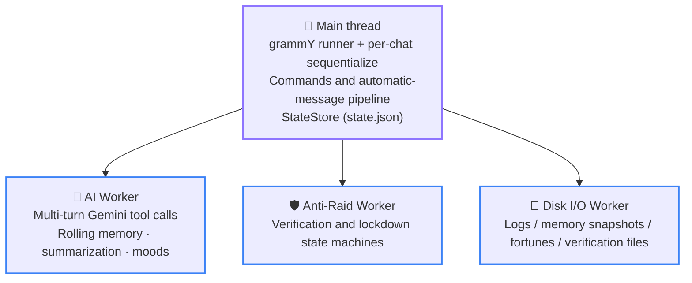
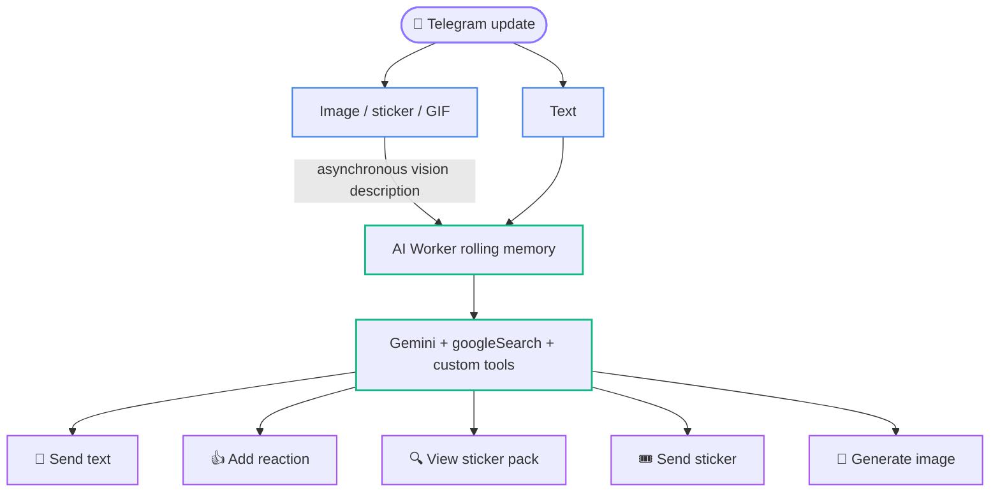

# 02 Architecture Overview

  <a href="../02-architecture.md">简体中文</a> · <b>English</b> · <a href="../ja/02-architecture.md">日本語</a>

  <a href="README.md">📚 Developer Docs Home</a> · <a href="01-getting-started.md">← Prev: 01 Setup</a> · <a href="03-directory-map.md">Next: 03 Directory Map →</a>

---

This page explains what the system looks like, how a message flows through it, and how the process starts and stops. It is a narrative overview; [04 Authoritative Runtime Invariants](04-invariants.md) defines the exact executable constraints, including state ownership and ordering that must not change.

## Topology: Main Thread + Three Workers

The organizing principle is **exclusive state ownership**: every piece of runtime state has exactly one owner, and threads exchange messages rather than sharing memory.

- The **main thread** owns the Telegram runner, supervision handles for all three Workers, and the in-memory `state.json` mirror managed by `StateStore`—including group switches, copy state, and lockdown mirrors.
- The **AI Worker** exclusively owns group-chat memory, reply admission, the media-description pipeline, per-group moods, and runtime sticker-catalog state.
- The **Anti-Raid Worker** exclusively owns the verification/lockdown state machines and their timers. The main thread keeps only recoverable mirrors.
- The **Disk I/O Worker** exclusively serializes reads and writes to shared directories such as `logs/` and `memory/`. `state.json` is the sole exception and is written atomically by the main-thread `StateStore`.

The main-thread Anti-Raid entry point remains [`packages/antiRaid/index.ts`](../../packages/antiRaid/index.ts), while lockdown recovery and verification-mirror intake live in [`packages/antiRaid/lockdownMirror.ts`](../../packages/antiRaid/lockdownMirror.ts) and [`packages/antiRaid/verificationMirror.ts`](../../packages/antiRaid/verificationMirror.ts). Inside the Worker, the verification interpreter is split under [`packages/workers/antiRaid/`](../../packages/workers/antiRaid/) into core state/recovery, inbound event translation, Telegram effects, and the reminder-delivery owner. Those modules share one dispatcher, preserving a single authoritative state-machine and revision entry point.

Worker crashes are rate-limited and self-healing, but the hosts have two implementations. AI and Anti-Raid share [`packages/libs/supervisedWorker.ts`](../../packages/libs/supervisedWorker.ts). Because Disk I/O cannot depend on the disk-backed logger, [`packages/infra/diskIO.ts`](../../packages/infra/diskIO.ts) contains its own console-only recovery logic. After reconstruction, main-thread mirrors or disk snapshots are replayed. If the restart budget is exhausted, fatal boundaries such as [`packages/infra/workerSupervisor.ts`](../../packages/infra/workerSupervisor.ts) notify the application lifecycle to shut down.

## The Journey of a Message

[`packages/app/registerHandlers.ts`](../../packages/app/registerHandlers.ts) installs the update chain explicitly in one place; middleware order is part of the semantics:

1. **`update_id` tracking**—records the highest update ID that has entered processing so shutdown can acknowledge the correct Telegram offset.
2. **Signed fortune-receipt confirmation**—runs before every gateway and also accepts forwarded copies.
3. **Init gateway**—ordinary business updates from groups without `/init enable` stop here. Explicit exceptions such as `my_chat_member`, the bot's own `via_bot` messages, and the super administrator's `/init` are allowed by [`packages/infra/updateGate.ts`](../../packages/infra/updateGate.ts).
4. **Per-chat serialization**—`sequentialize` preserves message order within a chat. Reaction synchronization uses a separate coalescing queue and does not occupy the chat lane.
5. **Private-chat gateway**—private chats allow only the `/send` entry point and active relay sessions. Relay messages short-circuit into the message pipeline so their text is not interpreted as commands.
6. **Join verification**—must run before command handlers, or commands sent by pending users would not be tracked for cleanup.
7. **Command registration**—13 `bot.command(...)` registrations; see [06 Common Modification Recipes](06-modification-guide.md#adding-a-slash-command).
8. **Automatic-message pipeline**—[`packages/auto/`](../../packages/auto) handles copying, AI transcription and trigger decisions, reaction synchronization, and other non-command behavior.

After an AI trigger, the main thread evaluates the activity-based probability or direct trigger, dispatches to the AI Worker, and the Worker assembles the three-part Gemini input: reference memory, current conversation, and the reply task. Gemini then performs multi-turn tool calls—messages, stickers, reactions, and image generation, all executed through main-thread proxies—before the result is written back to rolling memory and periodically snapshotted.

`bot.catch` logs unhandled errors and then **rethrows them**. Swallowing an exception would acknowledge the failed update, preventing Telegram from redelivering it after restart—including when persistence failed.

## AI Message Processing Pipeline

A message first splits by type, then converges into the AI Worker's rolling memory:

- **Text** is enqueued immediately as-is, preserving its position in the conversation timeline.
- **Images / stickers / GIFs** are enqueued with a placeholder first, then downloaded and described by a vision model asynchronously; once parsing finishes, the same entry's text field is backfilled in place. A hit against the sticker allowlist catalog skips the asynchronous parse and writes the catalog's existing description directly.

When a reply is triggered, rolling memory is assembled into the three-part Gemini input described in the previous section, and sent to Gemini together with `googleSearch` and the custom tools. `googleSearch` runs on Google's servers; its instruction switches between three states based on this round's search progress and does not count against the action budget (see [04 Runtime Invariants](04-invariants.md)). The model may issue multiple tool calls within one round, each executed through main-thread proxies rather than talking to Telegram directly:

- 💬 **Send text**—the model must call the send tool explicitly for any body text; the system only falls back to sending on its own when the whole round produced zero successful actions.
- 👍 **Add reaction**—chosen from an allowlist of emoji, at most one success per round.
- 🔍 **View sticker pack**—looks up the sticker catalog on demand, counted independently from other tool calls.
- 🎟️ **Send sticker** and 🎨 **Generate image**—likewise capped at one success per round.

Text, sticker, reaction, and image results produced this round are written back to rolling memory and periodically snapshotted to disk. See [04 Authoritative Runtime Invariants](04-invariants.md) for the per-round action cap and anti-loop rules.

## Startup Order

The entry point [`index.ts`](../../index.ts) only assembles `ApplicationLifecycle` from [`packages/app/lifecycle.ts`](../../packages/app/lifecycle.ts). Importing production modules does not start Workers, timers, network requests, or shared-directory writes; all runtime initialization is explicit:

1. Recursively create and **preflight the data root**: write, file fsync, same-directory hard link, atomic rename, and directory fsync. Any failure aborts startup with the actual path.
2. Acquire the **`bot.lock`** single-instance lock. See [07 Operations and Troubleshooting](07-operations.md#botlock-refuses-startup) for its format and cleanup rules.
3. **Warm configuration and restore StateStore**: validate all three JSON files under `config/`, remove orphaned top-level temporary files, then strictly validate and restore the primary and backup `state.json` copies. All of this occurs before network access or Worker creation.
4. Initialize the Telegram client and **Disk I/O Worker**, then restore AI, sticker, fortune, and pending-verification data under `memory/`. A failure in any domain prevents startup with partial state.
5. Register handlers, set the command menu, and run `bot.init()`.
6. Initialize the **AI Worker**, hydrating only groups explicitly enabled in `state.json`; then restore fortune and pending-verification mirrors, initialize the **Anti-Raid Worker**, and finally start the acknowledgement-safe runner.
7. Only after everything is ready, start the **low-priority group-title backfill**, bounded so it cannot monopolize the shared rate limiter.

`ApplicationLifecycle` owns both failures and normal exits, releasing or flushing only resources that were actually acquired.

## Shutdown Order

Normal and abnormal shutdown converge on the same lifecycle. It first **quiesces** title, reaction, avatar, and translation entry points and stops the runner, then performs **bounded drains** of all queues and mailboxes. The four quiesce entry points are failure-isolated: a throw from one does not prevent the others from closing, and quiescence is not cached as complete until every entry point succeeds. The normal path flushes AI, Disk I/O, and StateStore in order before acknowledging the final Telegram offset. Final disposal is fixed as: flush AI → terminate AI → flush Disk I/O → terminate Anti-Raid and Disk I/O → flush StateStore → release the instance lock. Any critical quiesce, drain, or flush failure prevents final-offset acknowledgement and lock release, and exits nonzero so Telegram can redeliver unacknowledged updates. If a fatal error occurs while normal disposal is already in progress, the emergency path reuses that Promise but enforces an independent 15-second absolute deadline before forced exit. When the time budget expires, in-flight requests are aborted before pending work is settled, and no messages are sent after abort. The abnormal-exit path's maintenance budget is exactly 0, so drains abort and settle immediately instead of waiting. Every owner in disposal is likewise failure-isolated: a single throw is recorded as `failed` and never skips the owners that follow it, `flushStateToDisk`, or instance-lock disposal.

See [04 Authoritative Runtime Invariants](04-invariants.md) for the complete rules, including which failures are fatal and which ordering constraints cannot be exchanged.

---

[← Prev: 01 Setup](01-getting-started.md) · [📚 Developer Docs Home](README.md) · [⬆️ Back to Top](#02-architecture-overview) · [Next: 03 Directory Map →](03-directory-map.md)

