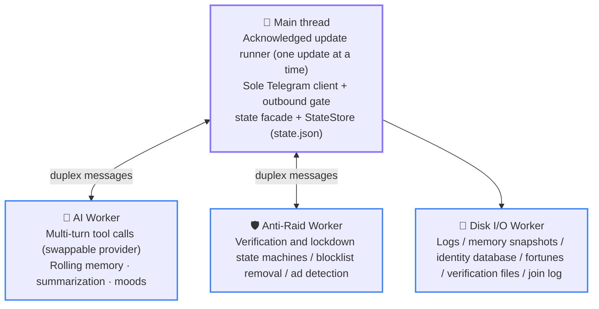
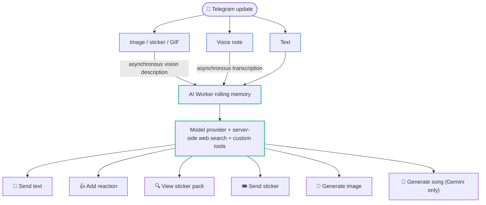

# 02 Architecture Overview

  <a href="../cn/02-architecture.md">简体中文</a> · <b>English</b> · <a href="../ja/02-architecture.md">日本語</a>

  <a href="content-table.md">📚 Developer Docs Home</a> · <a href="01-getting-started.md">← Prev: 01 Setup</a> · <a href="03-directory-map.md">Next: 03 Directory Map →</a>

---

This page explains what the system looks like, how a message flows through it, and how the process starts and stops. It is a narrative overview; [04 Authoritative Runtime Invariants](04-invariants.md) defines the exact executable constraints, including state ownership and ordering that must not change.

## Topology: Main Thread + Three Workers

The organizing principle is **exclusive state ownership**: every piece of runtime state has exactly one owner, and threads exchange messages rather than sharing memory.

- The **main thread** owns the Telegram runner, the sole real grammY Bot, the Telegram outbound gate, supervision handles for all three Workers, and two authoritative in-memory mirrors: the global `state.json` mirror under `cache/main/storage.ts` (copy state and asset URLs), and the `chat_states` hot read copy under `cache/main/chatState.ts` (group switches, lockdown records, permission snapshots, titles and the relay flag, capacity exactly 25). AI and Anti-Raid request Telegram capabilities only through supervised duplex messages; all Bot API calls and Telegram file downloads ultimately originate here. `stateStore.ts` owns business access and snapshots; `StateStore` in `statePersistence.ts` owns strict recovery and persistence lifecycle.
- The **AI Worker** exclusively owns group-chat memory, reply admission, the media-description pipeline, per-group moods, and runtime sticker-catalog state.
- The **Anti-Raid Worker** exclusively owns the verification/lockdown state machines and their timers. The main thread keeps only recoverable mirrors. The Worker interprets kicks, queries, restrictions, and deletions, while duplex requests return their network execution to separate main-thread 429 categories. Unsettled blocklist batches remain mirrored in the SQLite `pending_blocked_removals` table; verification kicks reuse daily verification snapshots through `kickPending`.
- The **Disk I/O Worker** exclusively serializes reads and writes to `database/storage.sqlite`, `logs/`, and six domains under `memory/`: `ai/`, `stickers/`, `luck/`, `anti-raid/`, `ad-detected/`, and `joinlog/`. The main thread writes `state.json` atomically through the business facade and `StateStore`. See [07 Data Root](07-operations.md#data-root) for every persistence shape and its recovery and retention role.

[`packages/aiChat/index.ts`](../../packages/aiChat/index.ts) and [`packages/antiRaid/index.ts`](../../packages/antiRaid/index.ts) are now thin explicit exports that provide stable public surfaces; neither owns implementation or state. AI supervision and the cross-thread proxy live in [`workerBridge.ts`](../../packages/aiChat/workerBridge.ts), while per-message intake lives in [`messageIngress.ts`](../../packages/aiChat/messageIngress.ts). Anti-Raid supervision lives in [`workerBridge.ts`](../../packages/antiRaid/workerBridge.ts), durable delivery in [`durableDelivery.ts`](../../packages/antiRaid/durableDelivery.ts), and update routing in [`updateIngress.ts`](../../packages/antiRaid/updateIngress.ts). Ad detection remains split between main-thread admission and final-field projection, Worker verdict/effects, and the main-thread durable blocklist/ban path: see [`adCandidate.ts`](../../packages/antiRaid/adCandidate.ts), [`adDetect.ts`](../../packages/antiRaid/adDetect.ts), and [`packages/workers/antiRaid/adDetect/`](../../packages/workers/antiRaid/adDetect/).

Verification still preserves one authoritative dispatcher and revision entry point, but its pure transitions are split by join, pending, and terminal lifecycle under [`packages/states/verification/`](../../packages/states/verification/); [`packages/states/verification.ts`](../../packages/states/verification.ts) retains the exhaustive event router. Worker-side Telegram effects further separate kick and terminal disposal under [`packages/workers/antiRaid/verificationEffects/`](../../packages/workers/antiRaid/verificationEffects/). Lockdown recovery and verification-mirror intake remain in [`lockdownMirror.ts`](../../packages/antiRaid/lockdownMirror.ts) and [`verificationMirror.ts`](../../packages/antiRaid/verificationMirror.ts).

Worker crashes are rate-limited and self-healing, but the hosts have two implementations. AI and Anti-Raid share [`packages/infra/supervisedWorker.ts`](../../packages/infra/supervisedWorker.ts). Because Disk I/O cannot depend on the disk-backed logger, [`packages/infra/diskIO.ts`](../../packages/infra/diskIO.ts) contains its own console-only recovery logic. After reconstruction, main-thread mirrors or disk snapshots are replayed. Disk I/O remains non-writable until recovery load, every domain-mirror replay, and the recovery-window FIFO drain have all succeeded; any failure terminates that generation and triggers fatal shutdown. If the restart budget is exhausted, fatal boundaries such as [`packages/infra/workerSupervisor.ts`](../../packages/infra/workerSupervisor.ts) notify the application lifecycle to shut down.

## The Journey of a Message

[`packages/app/registerHandlers.ts`](../../packages/app/registerHandlers.ts) installs the update chain explicitly in one place; middleware order is part of the semantics. The chain contains **no** `sequentialize`: ordering comes from the acknowledged update runner on the fetch side ([`packages/app/updateRunner.ts`](../../packages/app/updateRunner.ts)), which fetches one update at a time and does not call `getUpdates` again until that update's middleware has finished—a stronger guarantee than per-chat serialization, namely global one-at-a-time. Reaction synchronization awaits the unified Telegram action boundary inside the current middleware, so success, failure, and cancellation all remain part of that update's acknowledgement boundary.

1. **`update_id` tracking**—records the highest update ID that has entered processing so shutdown can acknowledge the correct Telegram offset.
2. **Signed fortune-receipt confirmation**—runs before every gateway and also accepts forwarded copies.
3. **Init gateway**—ordinary business updates from groups without `/init enable` stop here. Explicit exceptions such as `my_chat_member`, the bot's own `via_bot` messages, and the super administrator's `/init` are allowed by [`packages/infra/updateGate.ts`](../../packages/infra/updateGate.ts).
4. **Private-chat gateway**—private chats allow only the `/send` entry point and active relay sessions. Relay messages short-circuit into the message pipeline so their text is not interpreted as commands.
5. **Join verification**—must run before command handlers, or commands sent by pending users would not be tracked for cleanup. The whole chain (verification plus the anti-raid private mode) is off by default per chat and opened with `/antiraid enable`; a disabled chat delivers no join events at all from this step.
6. **Command registration**—every command is registered on one shared `bot.on(":entities:bot_command")` sub-chain rather than directly on `bot`; see [06 Common Modification Recipes](06-modification-guide.md#adding-a-slash-command). That outer gate is load-bearing: grammY registers `command` through `filter → branch → lazy`, so each registration awaits a factory, allocates an array, and constructs a Composer on **every** update. Registering them flat means every ordinary group message pays that cost once per command layer it can never match. The gate's predicate is exactly the first step `Context.has.command()` performs itself, so the matched set, the relative order, and the claim-and-terminate semantics are unchanged. `/x` among them is a menu placeholder: it exists only to advertise the CJK action commands, and answers with a usage hint before terminating the chain.
7. **CJK action commands**—commands such as `/咬` and `/贴贴` (the action word is one or two Chinese characters) never receive a Telegram `bot_command` entity, so `bot.command` cannot match them; they are matched against the raw message text with `bot.hears` (see [`packages/commands/cjkAction.ts`](../../packages/commands/cjkAction.ts)). This **must be registered before the message fallback below**—placed after it, every action command is swallowed as an ordinary message into the AI/copy pipeline and the whole feature silently stops working. Because it precedes the automatic pipeline, that pipeline's self-sent guard does not cover it and the handler must skip the bot's own messages itself; and because a claimed message no longer travels further, the handler must also record the sender identity itself. Forms it does not claim (`/咬@OtherBot`, caption-only, malformed updates) call `next()`.
8. **Automatic-message pipeline**—[`packages/auto/`](../../packages/auto) handles copying, AI transcription and trigger decisions, reaction synchronization, and other non-command behavior.

After an AI trigger, the main thread evaluates the activity-based probability or direct trigger, dispatches to the AI Worker, and the Worker assembles the three-part model input: reference memory, current conversation, and the reply task. The model then performs multi-turn tool calls—messages, stickers, reactions, plus image and song generation when a direct-trigger round is eligible—all executed through main-thread proxies before results are written back to rolling memory and periodically snapshotted. The activity probability is only a **random proactive-reply gate**: it observes recent messages per chat, keeps cold chats unlikely to trigger, raises the chance as that chat becomes active, and stops at a hard ceiling. Direct triggers such as an @-mention or a reply to the bot do not depend on this probability gate.

`bot.catch` logs unhandled errors and then **rethrows them**. Swallowing an exception would acknowledge the failed update, preventing Telegram from redelivering it after restart—including when persistence failed.

## AI Message Processing Pipeline

A message first splits by type, then converges into the AI Worker's rolling memory:

- **Text** is enqueued immediately as-is, preserving its position in the conversation timeline.
- **Images / stickers / GIFs** are enqueued with a placeholder first, then downloaded and described by a vision model asynchronously; once parsing finishes, the same entry's text field is backfilled in place. A hit against the sticker allowlist catalog skips the asynchronous parse and writes the catalog's existing description directly.
- **Voice notes** use the same placeholder-then-backfill pipeline, with `agent.media` performing transcription. Oversized notes are rejected before download. Vision and voice support are probed independently on the first real request. A modality stops being downloaded once it is explicitly unsupported, or once the endpoint answers 404/405 for a missing model or wrong path (which logs one diagnostic pointing at `$.agent.media`). Endpoint failures — timeouts, 429, 5xx — only drive a bounded exponential backoff: inside the window the media degrades to its placeholder without a download or an executor slot, and one success clears the counter. Problems with a single piece of media never change the modality verdict.

When a reply is triggered, rolling memory is assembled into the three-part model input and sent to the provider configured by `agent.text`. Summary, media, image, and song each use their own capability configuration, with no runtime failover. Search runs on the provider's servers (Gemini's `googleSearch` or OpenAI's hosted `web_search`). Every request in one reply uses the same fixed search policy; the reply loop accounts for the real budget and removes search after exhaustion. Custom tool calls execute through main-thread proxies rather than talking to Telegram directly:

- 💬 **Send text**—the model must call the send tool explicitly for any body text; the system only falls back to sending on its own when the whole round produced zero successful actions.
- 👍 **Add reaction**—chosen from an allowlist of emoji, at most one success per round.
- 🔍 **View sticker pack**—looks up the sticker catalog on demand, counted independently from other tool calls.
- 🎟️ **Send sticker**—capped at one success per round.
- 🎨 **Generate image** and 🎵 **Generate song**—mounted by the corresponding provider capability only when a member directly mentions/replies to the bot or directly invokes it with media. Random interjections and non-direct media comments expose neither tool. Each is capped at one success per round. Songs use a 15-minute group-wide cooldown, with superAdmin exempt, and arrive as music messages carrying title, performer, and duration. Cover art is drawn separately by the image-side provider as message chrome, so it consumes neither the image cooldown nor the action budget.

Text, sticker, reaction, image, and song results produced this round are written back to rolling memory and periodically snapshotted to disk. See [04 Authoritative Runtime Invariants](04-invariants.md) for the per-round action cap and anti-loop rules.

## Startup Order

The entry point [`index.ts`](../../index.ts) only assembles `ApplicationLifecycle` from [`packages/app/lifecycle.ts`](../../packages/app/lifecycle.ts). Importing production modules does not start Workers, timers, network requests, or shared-directory writes; all runtime initialization is explicit:

`runApplication()` calls the unified `ApplicationLifecycle.run(mode)` in `"main"` mode and runs automatically only when `import.meta.main` is true. That mode installs process-level signal and exception handlers and records unhandled runtime errors as nonzero exits. A test or embedded host must call `runTest()` explicitly: it selects `"test"` mode, does not take ownership of process handlers, and returns startup or polling errors unchanged after `dispose()` completes. Both modes share the same `init()` → `wait()` → `dispose()` boundary, so a normal import remains inert.

1. Recursively create and **preflight the data root**: write, file fsync, same-directory hard link, atomic rename, and directory fsync. Any failure aborts startup with the actual path.
2. Acquire the **`bot.lock`** single-instance lock. See [07 Operations and Troubleshooting](07-operations.md#botlock-refuses-startup) for its format and cleanup rules.
3. **Restore the state persistence boundary and validate the deployment inputs that exist**: remove orphaned top-level temporary files, strictly validate and restore both `state.json` copies, and hydrate authoritative memory through the business facade. `telegram.json` is process-level mandatory, and every other optional input **must parse strictly whenever the file is present**; a genuinely absent one is left to that feature's own readiness verdict (see `validateExistingDeploymentInputs` in [`packages/config/readiness.ts`](../../packages/config/readiness.ts), exported through [`packages/app/featurePreflight.ts`](../../packages/app/featurePreflight.ts)). Chat switches in SQLite `chat_states` take no part in this check; they are decoded only at the persistence-recovery boundary in the next step.
4. Initialize the **Disk I/O Worker**. Logs, AI memory, sticker catalogs, fortune state, pending verification, join logs, and `database/storage.sqlite` first undergo read-only inspection and strict decoding as one unit. Only after every domain succeeds are the owners adopted; temporary/orphan/expired-file cleanup and compaction run after the success reply, followed by one Bun-native midnight maintenance cron with an explicit `Asia/Tokyo` timezone. That cron jointly maintains fortune files, logs, join logs, ad-sample archives, pending-verification day files, and temporary-allowlist activity. Existing startup- or business-event-driven cleanup remains as a fallback, while a failed verification rollover keeps only an unref'ed one-second retry timer. Any inspection failure preserves every domain without chmod, rewrite, unlink, or a surviving maintenance cron. The main thread receives only `chat_states`, permanent-policy counts, and pending removals rather than copying the permanent allowlist, blocklist, or temporary-activity tables. Then initialize the Telegram clients and assert that the super administrator is not on the blocklist.
5. Register handlers, set the command menu, and run `bot.init()`.
6. Initialize the **AI Worker** (when the AI configuration is unavailable this step logs one line and is skipped wholesale), hydrating only groups explicitly enabled in `chat_states`; then restore the sticker catalog, fortune, and pending-verification mirrors, initialize the **Anti-Raid Worker** and the blocklist sweep scheduler, and sweep the already-managed chats once.
7. Seed the missing `state.global.assets` entries with their built-in defaults (persisted in the background, never blocking startup), start the acknowledgement-safe runner, and only then start the **low-priority group-title backfill**, bounded so it cannot occupy an unbounded number of query-category requests or connections.

`ApplicationLifecycle` owns both failures and normal exits, releasing or flushing only resources that were actually acquired.

## Shutdown Order

Normal and abnormal shutdown converge on the same lifecycle, in a fixed order:

1. **Quiesce**: close the title, avatar, translation, new-gag, and blocklist-resweep entry points and stop the runner. The five quiesce entry points are failure-isolated — a throw from one does not prevent the others from closing. **Quiescence must never be cached as done**: `init()` re-arms all five owners, so a stop signal that lands during startup would otherwise latch success and short-circuit every later quiesce, leaving owners accepting work for the whole shutdown while the result still reports clean. All five calls are idempotent assignments, so repeating them costs nothing.
2. **Bounded drain**: drain all queues and mailboxes. The runner holds a per-update cancellation signal; if active handlers exceed the drain deadline, it aborts those signals and grants one final bounded settlement window. A handler that still does not settle prevents final-offset acknowledgement and forces a nonzero exit after best-effort disposal.
3. **Flush and dispose**: the normal path first drains Anti-Raid, gag notices, and unified delayed deletions, then flushes AI, drains Telegram outbound work, and flushes Disk I/O plus StateStore. Final disposal uses the same maintenance order before: flush AI → terminate AI → drain Telegram outbound → flush Disk I/O → terminate Anti-Raid and Disk I/O → flush StateStore → release the instance lock.

In-process elapsed-time budgets for lifecycle and Anti-Raid draining are computed through [`packages/libs/monotonicDeadline.ts`](../../packages/libs/monotonicDeadline.ts) and `performance.now()`, so wall-clock rollback cannot extend shutdown or drain deadlines. Business state and persisted absolute timestamps continue to use `Date.now()`.

Failure semantics:

- Any critical quiesce, drain, flush, or lock-release failure prevents final-offset acknowledgement and exits nonzero, so Telegram can redeliver unacknowledged updates or an operator can resolve the retained lock.
- If a fatal error occurs while normal disposal is already in progress, the emergency path reuses that Promise but enforces an independent 15-second absolute deadline before forced exit. When the time budget expires, in-flight requests are aborted before pending work is settled, and no messages are sent after abort.
- The abnormal-exit path's maintenance budget is exactly 0, so drains abort and settle immediately instead of waiting.
- Every owner in disposal is likewise failure-isolated: a single throw is recorded as `failed` and never skips the owners that follow it, `flushStateToDisk`, or instance-lock disposal.

See [04 Authoritative Runtime Invariants](04-invariants.md) for the complete rules, including which failures are fatal and which ordering constraints cannot be exchanged.

---

[← Prev: 01 Setup](01-getting-started.md) · [📚 Developer Docs Home](content-table.md) · [⬆️ Back to Top](#02-architecture-overview) · [Next: 03 Directory Map →](03-directory-map.md)

