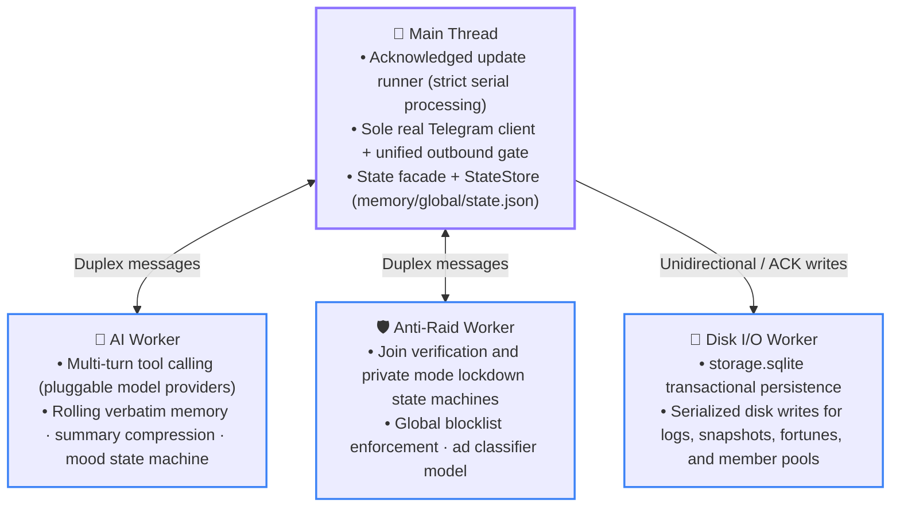
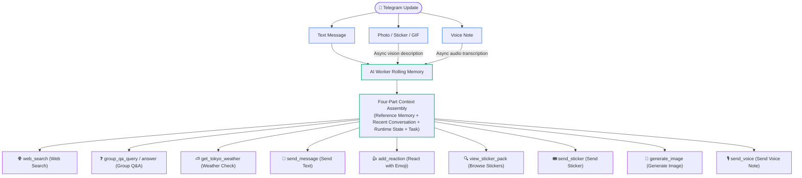

# 02 Architecture Overview

<p align="center">
  <a href="../cn/02-architecture.md">简体中文</a> · <b>English</b> · <a href="../ja/02-architecture.md">日本語</a>
</p>

<p align="center">
  <a href="content-table.md">📚 Developer Docs Home</a> · <a href="01-getting-started.md">← Prev: 01 Setup</a> · <a href="03-directory-map.md">Next: 03 Directory Map →</a>
</p>

---

This document describes Copy Ninjia's core system architecture, multi-threaded topology, end-to-end message lifecycle, and startup/shutdown state machines. For authoritative execution contracts and state ownership boundaries, see [04 Authoritative Runtime Invariants](04-invariants.md).

## Topology: Main Thread + Three Workers


```mermaid
flowchart TD
    classDef main stroke:#8e75ff,stroke-width:2.5px;
    classDef worker stroke:#3b82f6,stroke-width:2px;

    MAIN["🧵 Main Thread<br/>• Acknowledged update runner (strict serial processing)<br/>• Sole real Telegram client + unified outbound gate<br/>• State facade + StateStore (memory/global/state.json)"]:::main
    AI["🤖 AI Worker<br/>• Multi-turn tool calling (pluggable model providers)<br/>• Rolling verbatim memory · summary compression · mood state machine"]:::worker
    RAID["🛡️ Anti-Raid Worker<br/>• Join verification and private mode lockdown state machines<br/>• Global blocklist enforcement · ad classifier model"]:::worker
    DISK["💾 Disk I/O Worker<br/>• storage.sqlite transactional persistence<br/>• Serialized disk writes for logs, snapshots, fortunes, and member pools"]:::worker

    MAIN <-->|Duplex messages| AI
    MAIN <-->|Duplex messages| RAID
    MAIN -->|Unidirectional / ACK writes| DISK
```

The system strictly follows the principle of **Single Ownership**: every piece of mutable runtime state is owned by exactly one authoritative thread at any given instant. Threads communicate exclusively via structured messages across process boundaries and never share mutable memory.

### Division of Labor Across Four Threads

- **🧵 Main Thread**
  - **Networking & Coordination**: Hosts the long-polling Telegram update runner, maintains the sole grammY Bot instance, orchestrates the unified outbound request gate, and supervises all three Worker threads.
  - **Authoritative In-Memory Mirrors**:
    - `cache/main/storage.ts`: Mirrored global state (`memory/global/state.json`) for copying targets and daily speech synthesis usage.
    - `cache/main/assets.ts`: Hot snapshot of `config/dynamic/assets.json` (avatars, thumbnails, image library path).
    - `cache/main/chatState.ts`: Hot read cache for `chat_states` (up to `STATE_MANAGED_CHAT_LIMIT` managed chats: feature switches, lockdown records, permission snapshots, titles, relays, and translation sessions).
  - **Direct State Writing**: Atomically updates `state.json` via the `StateStore` business facade.
  - **Proxy Execution for Telegram**: Handles all Telegram Bot API calls and media downloads requiring bot identity on behalf of workers. AI and Anti-Raid Workers call external model provider APIs directly.

- **🤖 AI Worker**
  - **Exclusive State**: Conversational memory (verbatim hot window + cold rolling summaries), reply admission quotas, media description queues, global AI mood, and whitelisted sticker catalogs.
  - **Responsibilities**: Multi-turn model interactions, dynamic tool orchestration, human-like typing simulation, and automated memory summarization.

- **🛡️ Anti-Raid Worker**
  - **Exclusive State**: Join verification challenge state machine, group lockdown state machine, and associated countdown timers.
  - **Responsibilities**: New member evaluation, challenge timeout kicking, spam classification pipelines, and global blocklist enforcement. Network side-effects are routed back to the main thread's outbound gate via duplex IPC messages.
  - **Self-Healing & Replay**: Automatically re-populates in-memory states from main-thread recovery mirrors if the worker crashes; recovers historical state from disk logs on process restart.

- **💾 Disk I/O Worker**
  - **Exclusive Persistence**: Exclusively serializes all disk reads and writes for `database/storage.sqlite`, `logs/`, and all domain subdirectories under `memory/` (except `global/`).
  - **Transactional Guarantees**: Enforces durability via atomic Write-Through transactions and exact revision acknowledgements.

### Module Boundaries and Worker Supervision

- **Thin Public Decoupling**: [`packages/aiChat/index.ts`](../../packages/aiChat/index.ts) and [`packages/antiRaid/index.ts`](../../packages/antiRaid/index.ts) serve as stateless public facades. Actual AI supervision resides in [`workerBridge.ts`](../../packages/aiChat/workerBridge.ts); Anti-Raid supervision is managed by [`workerBridge/controller.ts`](../../packages/antiRaid/workerBridge/controller.ts).
- **Pure State Transition Separation**: Verification logic is strictly partitioned across join, pending, terminal, disable, and adopt phases (in `packages/states/verification/`); lockdown logic is partitioned across apply, persistence, restore, announcement, and adopt phases (in `packages/states/lockdown/`).
- **Supervision & Recovery Mechanism**:
  - AI and Anti-Raid Workers utilize [`packages/infra/supervisedWorker.ts`](../../packages/infra/supervisedWorker.ts), which throttles restarts within a rate-limited restart budget on crashes and replays the latest state mirror from the main thread.
  - Disk I/O Worker crash recovery is independently managed in [`packages/infra/diskIO.ts`](../../packages/infra/diskIO.ts). The recovery phase remains strictly read-only until database verification, mirror replay, and queue drains succeed; any failure triggers an immediate fail-fast process exit.

---

## The Journey of a Message

All incoming update handlers are explicitly registered in [`packages/app/registerHandlers.ts`](../../packages/app/registerHandlers.ts). Rather than relying on concurrent middleware frameworks like `sequentialize`, global message ordering is strictly enforced by the single-update polling runner ([`packages/app/updateRunner.ts`](../../packages/app/updateRunner.ts)): it pulls one update at a time (`UPDATE_POLL_LIMIT = 1`) and awaits full middleware completion before requesting the next update.

```text
[Telegram Update]
       │
       ▼
 1. update_id Tracking       ── Records highest processed update_id to set offset upon graceful shutdown
       │
       ▼
 2. Inbound Bot Rate Limiting── Messages from other bots are rate-limited per ID across chats; excess drops silently
       │
       ▼
 3. Signed Fortune Receipt   ── Resolves inline draw confirmation receipts immediately
       │
       ▼
 4. /init & Private Gateways ── Blocks uninitialized groups; private chat strictly permits super-admin /send
       │
       ▼
 5. Identity Warm-Up         ── Prefills in-memory identity caches for all visible participants in this update
       │
       ▼
 6. Private /send Relay      ── Active private relay sessions route non-command messages directly to group dispatch
       │
       ▼
 7. Join Verification Ingress── Runs before commands; captures and evaluates messages from unverified users
       │
       ▼
 8. Gag Muting Ingress       ── Intercepts and purges direct chat messages from restricted users
       │
       ▼
 9. /qa Form Ingress         ── Claims and parses in-progress "问题:" / "回答:" question-answer form submissions
       │
       ▼
10. Command Sub-Chain (:entities:bot_command)
       │                     ── Filters non-commands; ordinary messages bypass this composer entirely
       ├─ /permission, /white, /copy, /translate, /wed, /block, /ai_chat ...
       └─ /x (menu placeholder guiding CJK action command usage)
       │
       ▼
11. CJK Action Commands      ── Matches 1-2 character Chinese actions (e.g. /咬, /贴贴) before fallback
       │
       ▼
12. Automatic Message Pipeline── auto/message/ handles copying, Q&A direct answering, and AI conversation triggers
```

Reactions (`message_reaction`) are handled by an independent listener (`auto/reactionSync.ts`) outside the primary message pipeline.

> [!NOTE]
> `bot.catch` re-throws errors after logging them to ensure unhandled exceptions do not accidentally acknowledge failed updates.

---

## AI Message Processing Pipeline


```mermaid
flowchart TD
    classDef input stroke:#8e75ff,stroke-width:2px;
    classDef process stroke:#3b82f6,stroke-width:1.5px;
    classDef ai stroke:#10b981,stroke-width:2px;
    classDef action stroke:#a855f7,stroke-width:1.5px;

    U(["📨 Telegram Update"]):::input --> TXT["Text Message"]:::process
    U --> MED["Photo / Sticker / GIF"]:::process
    U --> VOC["Voice Note"]:::process

    TXT --> MEM["AI Worker Rolling Memory"]:::ai
    MED -- Async vision description --> MEM
    VOC -- Async audio transcription --> MEM

    MEM --> G["Four-Part Context Assembly<br/>(Reference Memory + Recent Conversation + Runtime State + Task)"]:::ai

    G --> T1["🌐 web_search (Web Search)"]:::action
    G --> T2["❓ group_qa_query / answer (Group Q&A)"]:::action
    G --> T3["⛅ get_tokyo_weather (Weather Check)"]:::action
    G --> A1["💬 send_message (Send Text)"]:::action
    G --> A2["👍 add_reaction (React with Emoji)"]:::action
    G --> A3["🔍 view_sticker_pack (Browse Stickers)"]:::action
    G --> A4["🎟️ send_sticker (Send Sticker)"]:::action
    G --> A5["🎨 generate_image (Generate Image)"]:::action
    G --> A6["🎙️ send_voice (Send Voice Note)"]:::action
```

### 1. Media Routing and Placeholder Pipeline

- **Text**: Immediately inserted into the context queue with physical timeline timestamps.
- **Photos / Stickers / GIFs**: Inserted with a placeholder first, then downloaded asynchronously in the background and described by the vision model. Once analyzed, descriptions backfill the placeholder in place. Whitelisted stickers hit an instant in-memory catalog description.
- **Voice Notes**: Queued with a placeholder and transcribed asynchronously by the audio model (prefixed as `[语音：<原话>]`). Oversized audio is rejected before downloading.

### 2. Reply Triggering and Four-Part Context

AI conversation is triggered via two paths:
- **Direct Trigger**: Mentions (@bot), explicit replies to the bot, or direct media messages.
- **Proactive Interjection**: Dynamically calculated probability based on recent chat velocity; cold chats have low participation probability, while active conversations scale up naturally (subject to cooldowns; suppressed during `/quiet`).

Upon trigger, the AI Worker assembles a four-part model prompt:
1. **Reference Memory** (`CURRENT_REFERENCE_MEMORY`): The bot's identity and rolling summaries of earlier conversations.
2. **Current Conversation** (`CURRENT_CONVERSATION`): Recent verbatim multimodal transcript and participant roster.
3. **Current Runtime State** (`CURRENT_RUNTIME_STATE`): Active mood, current time, and available tool quotas for this round (image cooldowns, remaining voice budget, Q&A status).
4. **Current Reply Task** (`CURRENT_REPLY_TASK`): Trigger metadata, reply instructions, and deliberate typo requirements (if drawn).

### 3. Tool Calling System and Action Budget

The model can execute multiple tool calls within a single round. All visible side-effect tools are subject to strict per-round quotas:

| Tool Name | Type | Behavioral Rules & Quota Limits |
| :--- | :--- | :--- |
| **`send_message`** | Action | Sends a text message. A fallback text is sent only if zero visible actions were produced during the turn. |
| **`add_reaction`** | Action | Adds an emoji reaction from the allowlist; bounded by `MAX_REACTIONS_PER_REPLY`. |
| **`view_sticker_pack`** | Query | Inspects stickers within a whitelisted pack; free query budget; must be inspected before sending. |
| **`send_sticker`** | Action | Sends a specific sticker; bounded by `MAX_STICKERS_PER_REPLY`. |
| **`generate_image`** | Action | Synthesizes and sends an image; verified against group cooldowns; bounded by `MAX_GENERATED_IMAGES_PER_REPLY`. |
| **`send_voice`** | Action | Synthesizes voice audio matching `agent.tts.bot_language`; queued on the serial action chain; bounded by `MAX_VOICES_PER_REPLY`. |
| **`web_search`** | Query | Local web search tool (mounted when `agent.web_search` is configured); bounded by `max_calls_per_use`. |
| **`group_qa_query`** | Query | Lists registered Q&A questions in the current group; does not consume action budget. |
| **`group_qa_answer`** | Query | Fetches pre-registered answers for specific questions discovered via `group_qa_query`. |
| **`get_tokyo_weather`** | Query | Queries Tokyo daily weather and temperature; mounted only when configured time zone is `TOKYO_TIME_ZONE`. |

> [!TIP]
> **Action Chain and Chat Action Simulation**:
> - Action tools reserve quota immediately at call time and return acceptance receipts to the model; typing pauses, speech synthesis, and Telegram API dispatches execute sequentially along a **serial action chain**.
> - Telegram chat status indicators (typing, recording voice, choosing sticker, uploading photo) reflect the action currently executing on the chain. After one status completes, at least `CHAT_ACTION_REST_MS` of quiet time elapses before the next status lights up.

---

## Startup Order

The entry point [`index.ts`](../../index.ts) solely delegates to [`ApplicationLifecycle`](../../packages/app/lifecycle.ts). Merely importing modules never starts background workers, timers, or network connections. `ApplicationLifecycle.init()` orchestrates startup sequentially:

0. **Configuration Layout Verification**: When `config/bot.ts` is imported, `layout.ts` ensures deployment files are organized strictly in `config/static/` and `config/dynamic/`.
1. **Data Root Preflight & Instance Locking**: `acquireSingleInstanceLock` tests data root capabilities (writable, fsync, same-directory hard-links, atomic renames), then acquires the `/proc`-based `bot.lock` single-instance lock.
2. **Global State & Configuration Preflight**:
   - Cleans up orphaned temporary files from previous unexpected terminations.
   - Restores and strictly validates `memory/global/state.json` via `StateStore`.
   - Validates all dynamic and static deployment JSON inputs.
   - Verifies permissions and filenames in the dedicated random image library directory.
3. **Disk I/O Worker Initialization & Data Recovery**:
   - Disk I/O Worker performs a read-only integrity scan across all persistence domains (database, logs, fortune secrets, verification records, member pools).
   - Once all domains validate cleanly, it takes ownership of data and schedules midnight maintenance crons.
   - The main thread seeds hot read caches (chat states, Q&A pairs, wed candidates).
4. **Handler Registration & Telegram Handshake**: Mounts global middlewares, registers command menus, and executes `bot.init()`.
5. **Business Worker Initialization & Scheduling**:
   - Launches AI Worker and hydrates conversation context, sticker caches, and fortune state.
   - Launches Anti-Raid Worker and restores verification and lockdown mirrors.
   - Starts the `cron.json` scheduler and configuration hot-reload file watchers.
   - Performs an initial blocklist sweep across groups where admin rights are confirmed.
6. **Start Update Runner**: Starts the single-update long-polling runner.

---

## Shutdown Order

Shutdown is managed centrally by `ApplicationLifecycle` via sequential barriers to ensure zero message loss or data corruption:

1. **Quiesce (Close Ingress Gates)**:
   - Halts cron tasks, blocklist sweeps, title syncs, and configuration hot-reload watchers.
   - Stops the Telegram update runner to prevent pulling new updates.
2. **Bounded Drain (Drain In-Flight Work)**:
   - Signals cancellation to in-flight update handlers, allowing them to converge within a graceful deadline. If the deadline expires, pending updates are aborted so Telegram will redeliver them upon reboot.
3. **Flush & Acknowledge Update Offset**: `flushAllToDisk` drains all worker mailboxes and forces disk fsync. When all components are verified clean, the final processed `update_id` is acknowledged to Telegram. If any step fails, acknowledgement is withheld.
4. **Dispose (Terminate Workers & Release Lock)**:
   - Terminates AI, Anti-Raid, and Disk I/O Workers sequentially (before terminating, the Disk I/O Worker commits remaining writes, runs a WAL checkpoint, and closes the shared SQLite database).
   - Commits final `StateStore` global state.
   - Releases the `bot.lock` instance lock upon a clean exit. If an abnormal outcome occurred, the lock is retained until process exit to prevent supervisor thrashing.

---

<div align="center">

[← Prev: 01 Setup](01-getting-started.md) · [📚 Developer Docs Home](content-table.md) · [⬆️ Back to Top](#02-architecture-overview) · [Next: 03 Directory Map →](03-directory-map.md)

</div>
