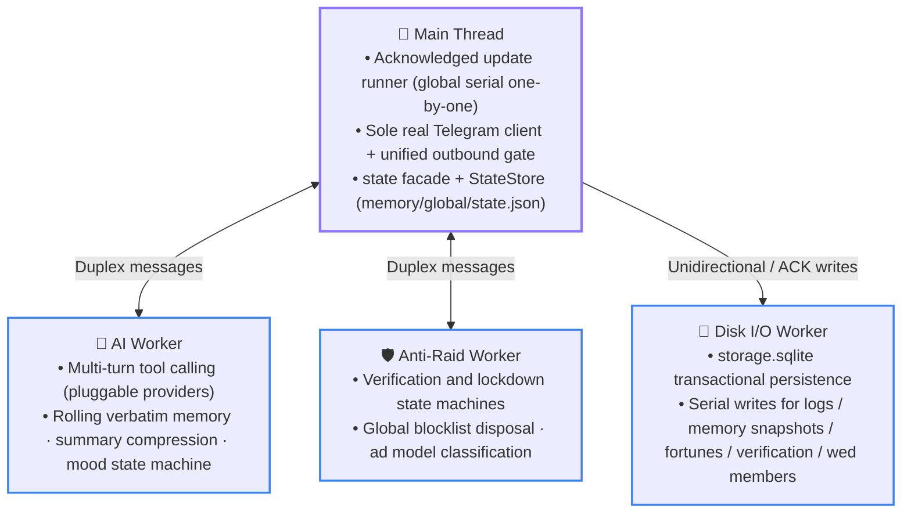
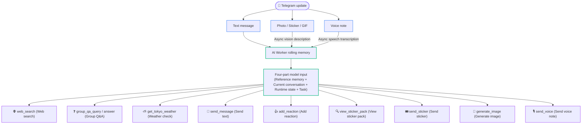

# 02 Architecture Overview

<p align="center">
  <a href="../cn/02-architecture.md">简体中文</a> · <b>English</b> · <a href="../ja/02-architecture.md">日本語</a>
</p>

<p align="center">
  <a href="content-table.md">📚 Developer Docs Home</a> · <a href="01-getting-started.md">← Prev: 01 Setup</a> · <a href="03-directory-map.md">Next: 03 Directory Map →</a>
</p>

---

This page systematically introduces system architecture topology, message processing pipelines, and process startup and shutdown lifecycles. For exact execution constraints and state ownership contracts, refer to [04 Authoritative Runtime Invariants](04-invariants.md).

## Topology: Main Thread + Three Workers


```mermaid
flowchart TD
    classDef main stroke:#8e75ff,stroke-width:2.5px;
    classDef worker stroke:#3b82f6,stroke-width:2px;

    MAIN["🧵 Main Thread<br/>• Acknowledged update runner (global serial one-by-one)<br/>• Sole real Telegram client + unified outbound gate<br/>• state facade + StateStore (memory/global/state.json)"]:::main
    AI["🤖 AI Worker<br/>• Multi-turn tool calling (pluggable providers)<br/>• Rolling verbatim memory · summary compression · mood state machine"]:::worker
    RAID["🛡️ Anti-Raid Worker<br/>• Verification and lockdown state machines<br/>• Global blocklist disposal · ad model classification"]:::worker
    DISK["💾 Disk I/O Worker<br/>• storage.sqlite transactional persistence<br/>• Serial writes for logs / memory snapshots / fortunes / verification / wed members"]:::worker

    MAIN <-->|Duplex messages| AI
    MAIN <-->|Duplex messages| RAID
    MAIN -->|Unidirectional / ACK writes| DISK
```

The core architectural principle is **Single Ownership**: every piece of runtime state has exactly one authoritative owner thread at any given instant. Threads communicate strictly via structured messages, and **shared mutable memory is strictly forbidden**.

### Division of Labor Across Four Threads

- **🧵 Main Thread**
  - **Networking and dispatch**: Holds the Telegram runner, the sole real grammY Bot instance, the outbound request gate, and supervision handles for all three Workers.
  - **In-memory mirrors**:
    - `cache/main/storage.ts`: `memory/global/state.json` global mirror (copy state and daily speech-synthesis count).
    - `cache/main/assets.ts`: `config/dynamic/assets.json` assets and library snapshot.
    - `cache/main/chatState.ts`: `chat_states` hot read copy (capacity 25 groups: switches, lockdown records, permission snapshots, titles, relay sessions, and translation sessions).
  - **Data writing facade**: Calls `StateStore` to write `state.json` atomically through the `stateStore.ts` business facade.
  - **Telegram proxy execution**: The main thread handles Telegram API operations and media downloads that require the Bot identity. AI and Anti-Raid Workers call their configured model services directly.

- **🤖 AI Worker**
  - **Exclusive state**: Group chat memory (verbatim hot window + cold summary zone), reply admission counter, media description pipeline, group mood tiers, and sticker pack allowlist catalog.
  - **Responsibilities**: Multi-turn model interactions, tool call scheduling, anthropomorphic action orchestration, and rolling memory compression.

- **🛡️ Anti-Raid Worker**
  - **Exclusive state**: Join verification state machine, private mode lockdown state machine, and their timers.
  - **Responsibilities**: Join evaluation, timeout kick orchestration, ad classification pipeline, and blocklist enforcement. Network effects return to the main thread across duplex boundaries with separate 429 backoff categories.
  - **Self-healing and replay**: Rebuilds in-memory state on Worker respawn from main-thread recoverable mirrors; recovers from disk logs on process restart.

- **💾 Disk I/O Worker**
  - **Exclusive persistence**: Exclusively serializes reads and writes for `database/storage.sqlite`, `logs/`, and 7 domain directories under `memory/` (`stickers/`, `luck/`, `anti-raid/`, `ad-detected/`, `ai-daily-usage/`, `joinlog/`, `wed/`).
  - **Transaction commits**: Guarantees durability via write-through, batched transactions, and exact revision ACKs.

### Module Boundaries and Worker Supervision

- **Public surface decoupling**: [`packages/aiChat/index.ts`](../../packages/aiChat/index.ts) and [`packages/antiRaid/index.ts`](../../packages/antiRaid/index.ts) are thin public exports without implementation state. AI supervision belongs to [`workerBridge.ts`](../../packages/aiChat/workerBridge.ts), message ingress to [`messageIngress.ts`](../../packages/aiChat/messageIngress.ts); Anti-Raid supervision belongs to [`workerBridge/controller.ts`](../../packages/antiRaid/workerBridge/controller.ts), durable delivery to [`durableDelivery.ts`](../../packages/antiRaid/durableDelivery.ts).
- **Pure state transition separation**: Verification transitions are split into join, pending, terminal, and disable phases (located in `packages/states/verification/`); lockdown transitions are split into apply, persistence, restore, announcement, and adopt phases (located in `packages/states/lockdown/`).
- **Fault self-healing mechanism**:
  - AI and Anti-Raid Workers share [`packages/infra/supervisedWorker.ts`](../../packages/infra/supervisedWorker.ts), throttling restarts within a restart budget on crashes and replaying the latest mirror from the main thread.
  - Disk I/O Worker cannot rely on the disk-backed logger, maintaining console-only recovery in [`packages/infra/diskIO.ts`](../../packages/infra/diskIO.ts). Disk I/O remains non-writable until data loading, mirror replay, and FIFO drain succeed; any failure triggers a fatal shutdown.

---

## The Journey of a Message

All message middlewares are explicitly mounted in [`packages/app/registerHandlers.ts`](../../packages/app/registerHandlers.ts).
The pipeline contains **no** `sequentialize`; global message order is guaranteed by the fetch-side acknowledged runner ([`packages/app/updateRunner.ts`](../../packages/app/updateRunner.ts)): **it fetches one update at a time and does not issue the next `getUpdates` until that update's middleware has fully completed**, achieving global serial one-by-one execution.

```text
[Telegram Update]
       │
       ▼
 1. update_id tracking       ── Record highest processed update_id, establish offset on shutdown
       │
       ▼
 2. Signed fortune receipt   ── Settle inline draw confirmation receipt first (forwarded copies valid)
       │
       ▼
 3. /init gate               ── Block ordinary business in uninitialized groups; superadmin /init allowed
       │
       ▼
 4. Private chat gateway     ── Only allow superadmin /send and active relay sessions
       │
       ▼
 5. Join verification ingress── Precedes commands; captures and tracks messages from pending users
       │
       ▼
 6. gag muting ingress       ── Captures and deletes messages from gagged users, terminating chain
       │
       ▼
 7. /qa form ingress         ── Captures and claims in-progress "问题:" / "回答:" form messages
       │
       ▼
 8. Command sub-chain (:entities:bot_command)
       │                     ── Outer gate filtering; non-command messages skip entire command group
       ├─ /permission, /white, /copy, /translate, /wed, /block, /ai_chat ...
       └─ /x (menu placeholder guiding CJK action command usage)
       │
       ▼
 9. CJK action commands (hears) ── Matches 1-2 char action words like /咬, /贴贴 before message fallback
       │
       ▼
10. Automatic message pipeline  ── auto/ handles copying, AI trigger & transcription, reaction sync
```

> [!NOTE]
> `bot.catch` **must re-throw unhandled exceptions**: swallowing an exception causes Telegram to treat the update as successfully consumed; after restart, Telegram will not redeliver it, risking data loss.

---

## AI Message Processing Pipeline


```mermaid
flowchart TD
    classDef input stroke:#8e75ff,stroke-width:2px;
    classDef process stroke:#3b82f6,stroke-width:1.5px;
    classDef ai stroke:#10b981,stroke-width:2px;
    classDef action stroke:#a855f7,stroke-width:1.5px;

    U(["📨 Telegram update"]):::input --> TXT["Text message"]:::process
    U --> MED["Photo / Sticker / GIF"]:::process
    U --> VOC["Voice note"]:::process

    TXT --> MEM["AI Worker rolling memory"]:::ai
    MED -- Async vision description --> MEM
    VOC -- Async speech transcription --> MEM

    MEM --> G["Four-part model input<br/>(Reference memory + Current conversation + Runtime state + Task)"]:::ai

    G --> T1["🌐 web_search (Web search)"]:::action
    G --> T2["❓ group_qa_query / answer (Group Q&A)"]:::action
    G --> T3["⛅ get_tokyo_weather (Weather check)"]:::action
    G --> A1["💬 send_message (Send text)"]:::action
    G --> A2["👍 add_reaction (Add reaction)"]:::action
    G --> A3["🔍 view_sticker_pack (View sticker pack)"]:::action
    G --> A4["🎟️ send_sticker (Send sticker)"]:::action
    G --> A5["🎨 generate_image (Generate image)"]:::action
    G --> A6["🎙️ send_voice (Send voice note)"]:::action
```

### 1. Media Routing and Placeholder Pipeline

- **Text**: Enqueued immediately as a text placeholder, fixing physical timeline order in the context.
- **Photos / Stickers / GIFs**: Enqueued with a placeholder first, then downloaded asynchronously in the background and described by the vision model; once described, backfilled in place. Allowlisted sticker hits immediately use pre-existing catalog descriptions.
- **Voice notes**: Follows the placeholder-then-backfill pipeline; asynchronously transcribed by the audio model (prefixed with `[语音：<原话>]`). Oversized notes are rejected before download; modality support is probed on the first real request.

### 2. Reply Triggering and Four-Part Context

AI replies are triggered through two mechanisms:
- **Direct trigger**: Mentioning the bot (@bot), replying to bot messages, or sending direct invocation media.
- **Random proactive interjection**: Dynamically calculated probability based on recent group activity; cold chats remain low, active chats scale up (subject to a hard ceiling); silent during `/quiet`.

When triggered, the AI Worker assembles four-part model inputs:
1. **Reference memory**: Extracted from cold memory summaries and long-term user portraits.
2. **Current conversation**: Recent rolling verbatim multimodal dialog log.
3. **Current runtime state**: Tool availability, image generation cooldown, remaining voice quota, Q&A status, etc.
4. **Current reply task**: Persona, tone constraints, typo requirements (if drawn), etc.

### 3. Tool Calling System and Action Budget

The model can execute multiple tool calls within one round. The tool list remains strictly identical within a single round; the execution side applies hard admission checks:

| Tool Name | Type | Quota Limits and Behavioral Rules |
| :--- | :--- | :--- |
| **`send_message`** | Action | Sends a text message. The system sends a fallback message only if the entire round accepted zero visible actions. |
| **`add_reaction`** | Action | Selects and adds a reaction from allowlisted emoji; accepted at most once per round. |
| **`view_sticker_pack`** | Query | Inspects sticker list in a specified pack; does not consume visible action budget; must be inspected before sending. |
| **`send_sticker`** | Action | Sends a specified sticker; accepted at most once per round. |
| **`generate_image`** | Action | Generates and sends an image. Only available in direct-trigger rounds; at most once per round; subject to chat cooldown. |
| **`send_voice`** | Action | Synthesizes Japanese voice line. Synthesized asynchronously in background and queued on serial action chain; at most once per round. |
| **`web_search`** | Query | Local web search tool (mounted when `agent.web_search` configured); bounded by `max_calls_per_use`. |
| **`group_qa_query`** | Query | Queries list of registered questions in the group; does not count against action budget. |
| **`group_qa_answer`** | Query | Retrieves registered answer based on exact question text; invoked autonomously by model based on semantics. |
| **`get_tokyo_weather`** | Query | Query for Tokyo weather and temperature of the day; mounted only when `bot.json.time_zone` is `Asia/Tokyo`, including the omitted default. |

> [!TIP]
> **Action Chain and Chat Status**:
> - Sending tools validate and reserve quota immediately at call time, returning an acceptance receipt to the model right away; anthropomorphic pauses, voice synthesis waits, and actual Telegram sends are executed sequentially by the round's **serial action chain** in call order.
> - Telegram chat status (typing, recording voice, choosing sticker, uploading photo) is driven strictly by the active action chain step, pausing 500 ms between steps to avoid overlapping.

---

## Startup Order

The entry point [`index.ts`](../../index.ts) only assembles [`ApplicationLifecycle`](../../packages/app/lifecycle.ts). Importing production modules introduces no side effects; runtime initialization proceeds through strict sequential steps:

0. **Configuration layout check**: When importing `bot.ts`, `layout.ts` checks the `config/` directory structure: deployment files at top level are rejected; `config/dynamic/` must exist. `bot.json` is then strictly read.
1. **Data root preflight**: Recursively creates data root and preflights file write, file fsync, hard link, atomic rename, and directory fsync; any failure fails closed and exits.
2. **Acquire instance lock**: Obtains the `bot.lock` single-instance lock (based on `/proc/<pid>/stat` and boot ID).
3. **Global state and configuration preflight**:
   - Cleans up orphaned top-level temporary files; rejects legacy 14.x `state.json`/`state.json.bak`.
   - Strictly restores `memory/global/state.json`; business facade hydrates authoritative in-memory state.
   - Preflights all existing deployment configuration files; missing files handled by readiness; malformed files exit immediately.
   - Prepares dedicated `h_image` library directory (validates SHA-256 filenames and permissions).
4. **Initialize Disk I/O Worker**:
   - Read-only inspects all domains (database, logs, AI memory, stickers, fortunes, verification, wed members, etc.) and strictly decodes them.
   - Adopts owners upon validation, registers configured local midnight maintenance cron, initializes main-thread Telegram client, and verifies super administrator identity.
5. **Register handlers & handshake**: Mounts global middlewares, registers command menu, and runs `bot.init()` to complete the Telegram gateway handshake.
6. **Initialize business Workers & scheduling**:
   - Initializes AI Worker (started only when credentials exist; hydrates only groups with AI enabled).
   - Initializes Anti-Raid Worker; restores verification and lockdown mirrors.
   - Starts `cron.json` task scheduler and `config/dynamic/` hot-reload file watcher.
   - Executes blocklist cross-chat sweep.
7. **Start update runner**: Starts the acknowledgement-safe runner, and finally starts low-priority asynchronous group title backfill.

---

## Shutdown Order

Shutdown is unified under `ApplicationLifecycle`, executing gracefully via sequential barriers for both normal exits and abnormal terminations:

1. **Quiesce (close entry gates)**:
   - Immediately stops title backfill, avatar queue, translation, gag, wed registrations, deferred commands, cron scheduler, blocklist sweep, and hot-reload watcher.
   - Stops Telegram runner, refusing new incoming updates.
2. **Bounded Drain (drain queues)**:
   - Assigns a timeout-bounded cancellation signal to in-flight update handlers.
   - Waits for pending tasks to converge within the deadline; if timed out, aborts requests and prevents final offset acknowledgement so Telegram can redeliver updates after restart.
3. **Flush & Dispose (flush and release)**:
   - Drains Anti-Raid tasks and unified delayed deletions queue.
   - Flushes AI rolling memory snapshots to disk.
   - Drains main-thread Telegram outbound queue.
   - Flushes all pending buffers in Disk I/O Worker; terminates business Workers.
   - Flushes `StateStore` global state.
   - Releases `bot.lock` instance lock and exits process.

---

<div align="center">

[← Prev: 01 Setup](01-getting-started.md) · [📚 Developer Docs Home](content-table.md) · [⬆️ Back to Top](#02-architecture-overview) · [Next: 03 Directory Map →](03-directory-map.md)

</div>
