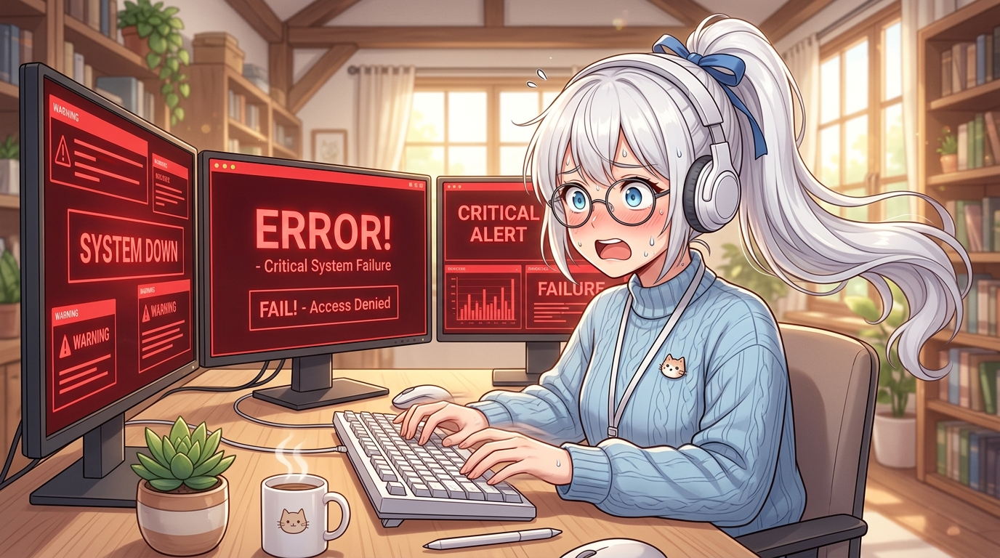
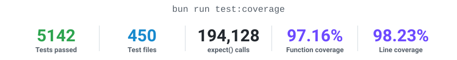

<div align="center">

<p><a href="../../README.md">简体中文</a> · <b>English</b> · <a href="../ja/README.md">日本語</a></p>

<picture>
  <source media="(prefers-color-scheme: dark)" srcset="../../public/banner_dark.jpg">
  <source media="(prefers-color-scheme: light)" srcset="../../public/banner_light.jpg">
  
</picture>

<h1>
  <a href="https://t.me/copy_ninjia_bot" title="Click the avatar to open the example bot"></a>
  Copy Ninjia
</h1>

<p><sub>Click the avatar to open the example bot: <a href="https://t.me/copy_ninjia_bot">@copy_ninjia_bot</a></sub></p>

<picture>
  <source media="(prefers-color-scheme: dark)" srcset="../../public/tagline_en_dark.svg">
  <source media="(prefers-color-scheme: light)" srcset="../../public/tagline_en_light.svg">
  
</picture>

**A pure-AI development project whose production code, tests, and documentation are written entirely by AI** — the human designs the architecture and reviews every commit together with AI

<p align="center">
  <a href="https://bun.sh/"></a>
  <a href="https://www.typescriptlang.org/"></a>
  <a href="https://www.sqlite.org/"></a>
  <a href="https://grammy.dev/"></a>
  <a href="https://ai.google.dev/"></a>
  <a href="https://platform.openai.com/docs/"></a>
</p>

<p align="center">
  <a href="#-pure-ai-development"></a>
  <a href="#-pure-ai-development"></a>
  <a href="05-dev-workflow.md"></a>
  <a href="05-dev-workflow.md"></a>
  <a href="../../LICENSES/LICENSE"></a>
</p>

Message copying and personality mimicry are only the surface. Underneath is a multi-Worker group-chat automation system with recovery, bounded caches, and race protection.

---

🧬 [Pure AI Development](#-pure-ai-development) • ✨ [Features](#-features) • 🎮 [Commands and Permissions](#-commands-and-permissions) • 🚀 [Quick Start](#-quick-start) • 🤖 [BotFather Setup](#botfather-setup) • ❓ [FAQ](10-faq.md) • 📚 [Developer Docs](content-table.md)

</div>

---

## 🧬 Pure AI Development

Every line of production code, every test case, and this README itself was written by AI; the table below lists who does what.

<table width="100%">
<tr><th width="18%" align="left">Stage</th><th width="32%" align="left">Who</th><th width="50%" align="left">What they do</th></tr>
<tr><td>📐&nbsp;Architecture</td><td><b>Asashishi</b></td><td>Designs and decides system boundaries, Worker decomposition, persistence, and recovery strategy</td></tr>
<tr><td>⌨️&nbsp;Implementation</td><td><b>Claude Code</b> · <b>Codex</b> · <b>Antigravity</b></td><td>Writes 100% of production code, tests, and documentation</td></tr>
<tr><td>🧾&nbsp;Commit&nbsp;review</td><td><b>Asashishi</b> × AI</td><td>Every commit is reviewed jointly by human and AI before entering the repository</td></tr>
<tr><td>🔬&nbsp;Repository&nbsp;audits</td><td><b>GPT</b> · <b>Claude</b></td><td>Conduct multiple cross-reviews of the entire codebase; findings become hardening commits</td></tr>
<tr><td>🛰️&nbsp;Safety&nbsp;exercises</td><td>The same frontier models</td><td>Review production scenarios such as crash recovery, concurrency races, hostile input, and resource exhaustion</td></tr>
</table>

Review is not a one-time ceremony. Conclusions from commit-by-commit human/AI review, repeated full-repository audits, and safety exercises flow back into new constraints.

<p align="right"><sub><a href="#copy-ninjia">⬆️ Back to top</a></sub></p>

## 🧪 Project Quality

<p align="center">
  <picture>
    <source media="(prefers-color-scheme: dark)" srcset="../../public/coverage_dark.svg">
    <source media="(prefers-color-scheme: light)" srcset="../../public/coverage_light.svg">
    
  </picture>
</p>

Benchmark figures (cold/hot paths · total throughput and I/O · end-to-end chain latency) live in **[📊 09 Performance Benchmark](09-performance.md)**.

<p align="right"><sub><a href="#copy-ninjia">⬆️ Back to top</a></sub></p>

## ✨ Features

<table width="100%">
<tr>
<td align="left" valign="top" width="33%">
  <p><b>🪞 Precise copying</b><br>
  <sub>Locks one target and echoes its messages one by one, avatar included.</sub></p>
</td>
<td align="left" valign="top" width="33%">
  <p><b>🌐 Multilingual translation</b><br>
  <sub>Opens a per-chat session that renders messages into five languages.</sub></p>
</td>
<td align="left" valign="top" width="33%">
  <p><b>🥷 Avatar theft</b><br>
  <sub>Takes only the target's avatar, without starting a copy session.</sub></p>
</td>
</tr>
<tr>
<td align="left" valign="top" width="33%">
  <p><b>🤖 AI group chat</b><br>
  <sub>The persona decides whether to speak, what to say, and which tool to use.</sub></p>
</td>
<td align="left" valign="top" width="33%">
  <p><b>👁️ Multimodal understanding and creation</b><br>
  <sub>Reads images and voice notes, and replies with pictures or voice messages.</sub></p>
</td>
<td align="left" valign="top" width="33%">
  <p><b>🔎 Live fact-checking</b><br>
  <sub>Reaches for web search and weather tools when an answer needs facts.</sub></p>
</td>
</tr>
<tr>
<td align="left" valign="top" width="33%">
  <p><b>🧠 Group-chat memory</b><br>
  <sub>Keeps verbatim context and compacts older turns into summaries.</sub></p>
</td>
<td align="left" valign="top" width="33%">
  <p><b>🎭 Mood and human touches</b><br>
  <sub>Rotates the group mood and pauses as if it were typing the reply.</sub></p>
</td>
<td align="left" valign="top" width="33%">
  <p><b>💒 Partner draws</b><br>
  <sub>Draws a random member who has spoken and shows their avatar.</sub></p>
</td>
</tr>
<tr>
<td align="left" valign="top" width="33%">
  <p><b>🛡️ Join verification</b><br>
  <sub>New members must press a button in time, or they are kicked out.</sub></p>
</td>
<td align="left" valign="top" width="33%">
  <p><b>🚨 Anti-Raid</b><br>
  <sub>Flips the group into private mode when the join rate spikes.</sub></p>
</td>
<td align="left" valign="top" width="33%">
  <p><b>📮 Ad detection</b><br>
  <sub>Screens threads of messages and acts the moment one is an ad.</sub></p>
</td>
</tr>
<tr>
<td align="left" valign="top" width="33%">
  <p><b>🎲 Daily fortune</b><br>
  <sub>Draws over Inline Mode, fixed for the same person on the same day.</sub></p>
</td>
<td align="left" valign="top" width="33%">
  <p><b>🌐 Cross-group moderation</b><br>
  <sub>One command bans the same identity across several managed groups.</sub></p>
</td>
<td align="left" valign="top" width="33%">
  <p><b>💬 Group Q&amp;A</b><br>
  <sub>Answers pre-registered questions directly, without going through the AI.</sub></p>
</td>
</tr>
<tr>
<td align="left" valign="top" width="33%">
  <p><b>🖼️ Random Image Library</b><br>
  <sub>Use /h_image to send a random spoiler-covered image; authorized members can save replied images or albums with content deduplication.</sub></p>
</td>
<td align="left" valign="top" width="33%">
  <p><b>⏰ Scheduled Posts</b><br>
  <sub>Schedule text, files, voice, random images or 1–10 fixed images with time zones, one-shot tasks and random intervals.</sub></p>
</td>
<td align="left" valign="top" width="33%">
  <p><b>🎨 Personas &amp; Notice Styles</b><br>
  <sub>Set an AI persona per group and choose teasing or ordinary Bot notices; custom-persona groups use ordinary notices.</sub></p>
</td>
</tr>
<tr>
<td align="left" valign="top" width="33%">
  <p><b>🤐 Speech Control</b><br>
  <sub>Use /gag to route a target's text through a dedicated button that transforms it, until expiry or release.</sub></p>
</td>
<td align="left" valign="top" width="33%">
  <p><b>🫧 Chinese Actions</b><br>
  <sub>Reply with one- or two-character Chinese actions such as /咬 or /贴贴, with no prior registration.</sub></p>
</td>
<td align="left" valign="top" width="33%">
  <p><b>🌊 Flood Control</b><br>
  <sub>Enable per-group message-rate checks and temporary mutes, with a separate exemption permission.</sub></p>
</td>
</tr>
<tr>
<td align="left" valign="top" width="33%">
  <p><b>🔎 Identity Lookup</b><br>
  <sub>Use /info for public user or channel profiles and avatars, or group details; results disappear after 30 seconds.</sub></p>
</td>
<td align="left" valign="top" width="33%">
  <p><b>🔐 Granular Permissions</b><br>
  <sub>Grant feature switches, image collection, group Q&amp;A and moderation permissions by identity, with a queryable dashboard.</sub></p>
</td>
<td align="left" valign="top" width="33%">
  <p><b>📨 Private Relay</b><br>
  <sub>The super administrator can start /send in private chat to relay messages to a managed group, or have the bot speak a line there as a voice message.</sub></p>
</td>
</tr>
</table>

### Voice, images, and memory

| Capability | Behavior |
| :--- | :--- |
| AI voice | Configurable voice and per-line tone; one voice per round, up to 64 UTF-16 code units; remembers the line after a successful send |
| Operator and scheduled voice | `/send` and cron share TTS with a 256 UTF-16 code-unit limit; cron synthesizes once per round and reuses the Telegram `file_id` |
| Image memory | Generated images are described; `/wed`, `/h_image`, and scheduled images start as placeholders and are described when someone replies |

Voice requires explicit `agent.tts` configuration (currently provided by Google; `base_url` and `headers` allow calling it through a third-party gateway). The three entry points share a daily request limit `daily_limit` (default 100), of which `daily_reserve_quota` (default 25) is reserved for `/send` and cron; once it is used up no further requests are issued. `/send` copies and voice, and scheduled text and voice, are not automatically added to AI memory. Image self-recording requires AI to be enabled in the chat with no active copy session. Configuration, errors, and limits: [FAQ](10-faq.md).

> [!IMPORTANT]
> [14.0.0 → 15.0.0 upgrade steps](07-operations.md#upgrade-15)

Behavior details, configuration and boundaries for each feature live in the **[📚 developer docs](content-table.md)**.

<p align="right"><sub><a href="#copy-ninjia">⬆️ Back to top</a></sub></p>

## 🎮 Commands and Permissions

Command access follows the entry point: **group members** can use copy, translation, action commands, quiet mode, `/info`, `/wed`, `/h_image` and more. **Identity permission keys** (`isCanXxx`) control `/bot_status`, `/prompt`, `/mute`, `/gag`, `/block`, `/h_image add` and each feature switch. **`SUPER_ADMIN_USER_ID` only** operations include `/init`, permission changes, allowlist removal, and `/batch_kick`; `/send` requires the super administrator in private chat.

Image-library and `config/dynamic/cron.json` fields and rules are in [deployment configuration](../../config_example/README/en.md); source and binary cold migrations are in the [operations guide](07-operations.md).

The full command table, permission semantics and per-command behaviour live in **[📖 08 Command and Behaviour Reference](08-commands.md)**.

<p align="right"><sub><a href="#copy-ninjia">⬆️ Back to top</a></sub></p>

## 🚀 Quick Start

You need Linux (with a readable `/proc`; the instance lock fails closed elsewhere), a Bot token and a super-admin user ID. Source installations require Bun 1.4.2; binary packages include the runtime. Enabled AI capabilities each need their provider's API key, and `/translate` additionally needs a Google Cloud service-account JSON. Hardware guidance is in [07 Operations](07-operations.md#hardware-guidance).

One-shot install (installs whatever is missing, asks for config, then starts):

```bash
curl -fsSL https://raw.githubusercontent.com/Asashishi/copy_ninjia/master/install.sh | bash
```

New installations prompt for source or binary mode; replace the final `bash` with `bash -s -- --binary` or `bash -s -- --source` to select it explicitly. Binary mode downloads the platform package and SHA-256 file from **GitHub's Latest Release**, without checking out or building source on the installation host. Source mode obtains that tag and installs locked dependencies. Existing deployments keep their current version. Both modes run the target directory's installer, ask for Telegram and AI configuration, initialize a missing identity database, and register or reuse a systemd unit with startup observation; without systemd they run in the foreground. Configuration replacement requires an explicit request and uses backup, validation, and atomic replacement. See [Getting Started](01-getting-started.md) for platforms, directory options, and backup retention.

Manual install:

```bash
git clone https://github.com/Asashishi/copy_ninjia.git
cd copy_ninjia
bun install
mkdir -p config/static config/dynamic
for example in config_example/static/*.json config_example/dynamic/*.json; do   # copy missing examples only; g-auth.json and cron.json are illustrative
  case "${example##*/}" in g-auth.json | cron.json) ;; *) cp -n "$example" "config/${example#config_example/}" ;; esac
done                                       # fill in bot_token and super_admin_user_id in bot.json
```

With a manual install, before the first start you also initialise the identity database and, on the
BotFather side, turn Privacy Mode off and Inline Mode on (full list in [BotFather & Group Rights Setup](#botfather-setup)). Field-by-field meanings, required combinations and the strict
validation rules are in [`config_example/README/en.md`](../../config_example/README/en.md); the full
walkthrough (runtime data root, asset URLs, migration commands) is in
[01 Getting Started](01-getting-started.md).

After initializing identity storage and completing configuration, run:

```bash
bun run check                          # conventions + ESLint + strict TypeScript + coverage + hot-path gate
bun run start                          # start long polling
```

Once the bot has joined a group, `SUPER_ADMIN_USER_ID` runs there:

```text
/init enable
/ai_chat enable
/antiraid enable
```

> **On languages**: user-facing copy is Simplified Chinese only and the repository maintains no i18n
> layer. The reasoning and the way to change it are in [06 Modification Guide](06-modification-guide.md).

<p align="right"><sub><a href="#copy-ninjia">⬆️ Back to top</a></sub></p>

## 📚 Developer Documentation & Architecture Guide

Comprehensive architecture overviews, module maps, authoritative runtime invariants, test workflows, and operation manuals live in the **[Developer Documentation Index](content-table.md)**:

| Topic | Description & Contents | Direct Link |
| :--- | :--- | :---: |
| 🏗️ **Architecture** | Main thread + 3 Workers topology, message journey, startup & shutdown order | [📖 02 Architecture](02-architecture.md) |
| 🗺️ **Directory Map** | Responsibilities of the `packages/` subdomains and the code-placement decision tree | [📖 03 Directory Map](03-directory-map.md) |
| ⚡ **Invariants** | Cross-module state isolation, concurrency limits, atomic storage contracts | [📖 04 Invariants](04-invariants.md) |
| 🧪 **Development** | `bun run check` quality gates, test isolation & fault injection suite | [📖 05 Workflow](05-dev-workflow.md) |
| 🛠️ **Recipes** | Guides for commands, parameter tuning, AI tools & schema migration | [📖 06 Recipes](06-modification-guide.md) |
| 🛡️ **Operations** | systemd deployment, hardware guidance, `COPY_NINJIA_DATA_ROOT`, backup & troubleshooting | [📖 07 Operations](07-operations.md) |
| 🎮 **Commands** | Every command, permission semantics and behavioural details | [📖 08 Commands](08-commands.md) |
| 📊 **Performance** | Cold/hot paths, throughput, I/O and chain latency, rerun on every release | [📖 09 Performance](09-performance.md) |
| ❓ **FAQ** | Checklist for a running bot that does not reply | [📖 10 FAQ](10-faq.md) |

<p align="right"><sub><a href="#copy-ninjia">⬆️ Back to top</a></sub></p>

<a id="botfather-setup"></a>

## 🤖 BotFather & Group Rights Setup

### BotFather Settings

| Setting | In @BotFather | Used for |
| :--- | :--- | :--- |
| Disable group privacy | `/setprivacy` → Disable | Receiving ordinary group messages; copying, translation, AI memory and interjections, and chat Q&A all depend on it. After changing it, remove the bot from the group and add it back; a bot that is a group administrator already receives every message |
| Enable Inline Mode | `/setinline` | Daily fortune `@bot requested topic`, and the "speak" button of `/gag` targets |
| Inline feedback at 100% | `/setinlinefeedback` | The primary path for confirming and persisting fortune draws |
| Allow groups | `/setjoingroups` → Enable (on by default) | Adding the bot to groups |
| Bot-to-Bot Communication Mode (optional) | Enable it in the bot's settings | Needed when the target of `/translate` or `/copy` is another bot; see the note below |

There is no need to run `/setcommands` in BotFather: the bot registers the menu in its configured notice style at startup, with plain menus for chats with a custom persona. The menu appears only in group chats; private chats accept only the super administrator's `/send`, so they show no menu.

> **About Bot-to-Bot**: by default Telegram does not deliver other bots' messages to this bot. Even when the other bot has the mode on, only its replies to this bot and `/command@thisbot` messages arrive, which is why translating another bot works only intermittently. Once this bot enables the mode, it receives every message from other bots in chats where it is an administrator or has privacy disabled, and AI interjections, copying, ad detection and flood counting do not distinguish bot senders. If a chat contains a bot that answers automatically, the two bots may keep replying to each other, so check before enabling it.

### Administrator Rights in the Group

Make the bot a group administrator and grant the rights for the features you use:

| Administrator right | Features that use it |
| :--- | :--- |
| Delete messages | `/gag`, deleting ads found by ad detection, deleting messages from blocklisted channel identities |
| Restrict and ban members | Kicking unverified members, Anti-Raid private mode, `/block enable\|disable`, `/mute`, `/unmute`, `/batch_kick`, flood muting, bans from ad detection |

Join verification also depends on the administrator status itself: Telegram sends member join and leave events only to administrator bots. When a right is missing, the bot's notice names that right; identities holding `isCanViewBotStatus` can run `/bot_status` to see the rights granted in the current chat.

If the bot is running but does not reply, work through [10 FAQ](10-faq.md).

---

<div align="center">

<picture>
  <source media="(prefers-color-scheme: dark)" srcset="../../public/footer_en_dark.svg">
  <source media="(prefers-color-scheme: light)" srcset="../../public/footer_en_light.svg">
  
</picture>

*The human never wrote a line of code, but never left the stage: after drawing the blueprints, they reviewed every commit together with AI.*

</div>
