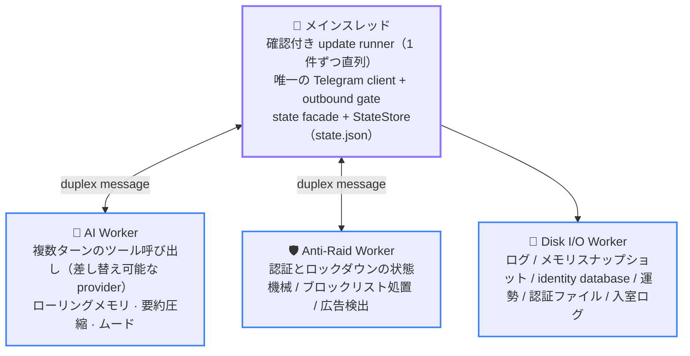
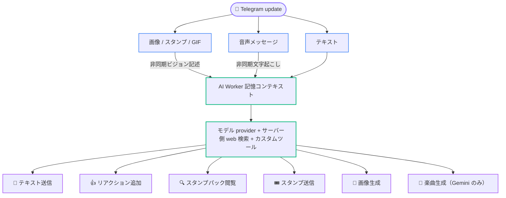

# 02 アーキテクチャ概要

  <a href="../cn/02-architecture.md">简体中文</a> · <a href="../en/02-architecture.md">English</a> · <b>日本語</b>

  <a href="conntent-table.md">📚 開発者ドキュメント TOP</a> · <a href="01-getting-started.md">← 前のページ：01 環境構築</a> · <a href="03-directory-map.md">次のページ：03 ディレクトリマップ →</a>

---

このページでは、システム全体の形、メッセージが処理される流れ、プロセスの起動と停止を説明します。ここは案内用の概要であり、状態の所有者や変更できない順序など、実行可能な厳密な制約は [04 実行時の正式な不変条件](04-invariants.md) を正本とします。

## トポロジー：メインスレッド + 3 つの Worker

基本原則は**状態の排他的所有**です。各実行時状態には所有者が 1 つだけ存在し、スレッド間ではメモリを共有せずメッセージだけを渡します。

- **メインスレッド**は Telegram runner、唯一の実 grammY Bot、Telegram outbound gate、3 つの Worker の監視ハンドル、`cache/main/storage.ts` の正式な `state.json` メモリミラーを所有します。AI/Anti-Raid Worker は監視付き duplex message だけで Telegram capability を要求し、Bot API と Telegram file download は最終的にすべてメインスレッドから開始されます。`stateStore.ts` は業務アクセスと snapshot、`statePersistence.ts` の `StateStore` は厳密な復元と永続化 lifecycle を担当します。
- **AI Worker**はグループチャットのメモリ、返信の受け入れ制御、メディア説明パイプライン、グループごとのムード、スタンプカタログの実行時状態を排他的に所有します。
- **Anti-Raid Worker**は認証・lockdown 状態機械と timer を所有します。kick、query、restriction、delete の意味は Worker が解釈しますが、network request は duplex 境界から main thread の独立 429 category へ戻ります。未着地の blocklist batch は SQLite `pending_blocked_removals` table、認証 kick は日次認証 snapshot の `kickPending` で再投入します。
- **Disk I/O Worker**は `database/storage.sqlite`、`logs/`、`memory/` 配下の 6 domain `ai/`、`stickers/`、`luck/`、`anti-raid/`、`ad-detected/`、`joinlog/` の読み書きを直列化して排他的に扱います。`state.json` は main thread が業務 facade 経由で `StateStore` を呼び出して atomic write します。全 persistence 形態と復元・保持の役割は [07 データルート](07-operations.md#データルート) を参照してください。

[`packages/aiChat/index.ts`](../../packages/aiChat/index.ts) と [`packages/antiRaid/index.ts`](../../packages/antiRaid/index.ts) は、安定した公開面を提供する薄い明示的 export であり、実装や状態を所有しません。AI の監督 lifecycle とスレッド間 proxy は [`workerBridge.ts`](../../packages/aiChat/workerBridge.ts)、メッセージごとの入口は [`messageIngress.ts`](../../packages/aiChat/messageIngress.ts) が所有します。Anti-Raid の監督 lifecycle は [`workerBridge.ts`](../../packages/antiRaid/workerBridge.ts)、durable delivery は [`durableDelivery.ts`](../../packages/antiRaid/durableDelivery.ts)、update routing は [`updateIngress.ts`](../../packages/antiRaid/updateIngress.ts) が所有します。広告検出は引き続き、メインスレッドの admission と最終フィールド投影、Worker の判定と副作用、メインスレッドの durable blocklist/BAN 経路に分かれます。実装は [`adCandidate.ts`](../../packages/antiRaid/adCandidate.ts)、[`adDetect.ts`](../../packages/antiRaid/adDetect.ts)、[`packages/workers/antiRaid/adDetect/`](../../packages/workers/antiRaid/adDetect/) を参照してください。

認証 domain は 1 つの正式な dispatcher と revision 入口を維持しつつ、純粋な transition を join、pending、terminal の lifecycle 別に [`packages/states/verification/`](../../packages/states/verification/) へ分割しています。[`packages/states/verification.ts`](../../packages/states/verification.ts) は全 event の router を保持します。Worker 側の Telegram effect も kick と terminal disposal を [`packages/workers/antiRaid/verificationEffects/`](../../packages/workers/antiRaid/verificationEffects/) へ分離しました。ロックダウン復旧と認証ミラー受信は [`lockdownMirror.ts`](../../packages/antiRaid/lockdownMirror.ts) と [`verificationMirror.ts`](../../packages/antiRaid/verificationMirror.ts) が担当します。

Worker のクラッシュはレート制限付きで自己修復しますが、ホスト実装は 2 系統です。AI と Anti-Raid は [`packages/infra/supervisedWorker.ts`](../../packages/infra/supervisedWorker.ts) を共有します。Disk I/O 自身はディスクへ書く logger に依存できないため、[`packages/infra/diskIO.ts`](../../packages/infra/diskIO.ts) に console-only の独自復旧処理があります。再構築後はメインスレッドのミラーまたはディスクスナップショットから再生します。Disk I/O は recovery load、全 domain mirror の replay、復旧窓の FIFO 排出がすべて成功するまで writable にならず、どれか 1 つでも失敗すればその世代を終了して fatal shutdown を要求します。再起動予算を使い切ると、[`packages/infra/workerSupervisor.ts`](../../packages/infra/workerSupervisor.ts) などの fatal 境界がライフサイクルへ停止を通知します。

## 1 件のメッセージが通る経路

[`packages/app/registerHandlers.ts`](../../packages/app/registerHandlers.ts) が update チェーンを 1 か所で明示的に登録し、middleware の順序そのものが意味を持ちます。チェーンに `sequentialize` は**ありません**。順序保証は取得側の確認付き runner（[`packages/app/updateRunner.ts`](../../packages/app/updateRunner.ts)）から来ます。1 回に 1 件だけ取得し、その update の middleware が完了するまで `getUpdates` を再呼び出ししないため、グループ単位の直列化より強い「全体で 1 件ずつ」の保証になります。リアクション同期は独立した結合キューを使い、このレーンを占有しません。

1. **`update_id` の追跡** — 処理に入った最大の update ID を記録し、停止時に正しい Telegram offset を確認できるようにします。
2. **運勢の署名付き receipt 確認** — すべてのゲートウェイより前に実行し、転送された複製も有効です。
3. **init ゲートウェイ** — `/init enable` されていないグループの通常業務 update はここで終了します。`my_chat_member`、Bot 自身の `via_bot` メッセージ、スーパー管理者の `/init` など明示的な例外は [`packages/infra/updateGate.ts`](../../packages/infra/updateGate.ts) が許可します。
4. **プライベートチャット・ゲートウェイ** — プライベートチャットでは `/send` の入口と進行中の中継セッションだけを許可します。中継メッセージはメッセージパイプラインへ直接入り、本文がコマンドとして解釈されるのを防ぎます。
5. **参加認証** — コマンド処理より前でなければなりません。後ろに置くと、認証待ちユーザーのコマンドを追跡して削除できません。この系列全体（認証と対レイド private mode）はチャットごとに既定で無効で、`/antiraid enable` で開きます。無効なチャットではこの段階で参加イベントを一切投函しません。
6. **コマンド登録** — すべての `bot.command(...)` handler をここで明示的に登録します。詳細は [06 よくある変更手順](06-modification-guide.md#スラッシュコマンドの追加) を参照してください。うち `/x` はメニュー用のプレースホルダーで、漢字アクションコマンドの使い方を見せるためだけに存在し、受信時は使い方を 1 行返してチェーンを終了します。
7. **漢字アクションコマンド** — `/咬` や `/贴贴` のようなコマンド（アクション語は漢字 1~2 文字）は Telegram の `bot_command` エンティティを得られず `bot.command` では一致しないため、`bot.hears` でメッセージ原文と照合します（[`packages/commands/cjkAction.ts`](../../packages/commands/cjkAction.ts) を参照）。**次のメッセージ・フォールバックより前に登録しなければなりません**。後ろに置くと通常メッセージとして AI／copy パイプラインに飲み込まれ、機能全体が静かに動かなくなります。自動パイプラインより前にあるため、そのパイプラインの自己送信ガードは効かず、handler 自身が Bot 自身のメッセージを除外する必要があります。また受理したメッセージは先へ進まないので、送信者 ID のキャッシュも handler 自身が行います。受理しない形（`/咬@OtherBot`、caption のみ、不正な update）は `next()` で通します。
8. **自動メッセージパイプライン** — [`packages/auto/`](../../packages/auto) が copy、AI の文字起こしとトリガー判定、リアクション同期などコマンド以外の動作を処理します。

AI がトリガーされた後は、メインスレッドが活動量に基づく確率または直接トリガーを判定し、AI Worker に送信します。Worker はモデル入力を参照メモリ、現在の会話、今回の返信タスクという 3 部構成にし、複数ターンのツール呼び出しを実行します。メッセージ、スタンプ、リアクション、画像生成はすべてメインスレッドのプロキシ経由で行い、結果をローリングメモリへ戻して定期的にスナップショットへ保存します。活動量に基づく確率は、あくまで**ランダムな自発返信の関門**です。チャットごとの最近のメッセージを観測し、静かなチャットでは低い発火率を保ち、同じチャットが活発になるほど確率を上げますが、硬い上限を越えません。@メンションや Bot への返信などの直接トリガーは、この確率関門には依存しません。

`bot.catch` は未処理エラーを記録した後に**再 throw**します。例外を握りつぶすと失敗した update が確認済みになり、永続化失敗を含めて、再起動後に Telegram から再配信されなくなります。

## AI メッセージ処理パイプライン

1 件のメッセージはまず種類ごとに分岐し、その後 AI Worker のローリングメモリへ合流します。

- **テキスト**はそのままプレースホルダーとして即時キューに入り、会話上の時系列位置を確保します。
- **画像 / スタンプ / GIF** も同様にまずプレースホルダーでキューに入り、非同期でダウンロードして vision モデルに説明を生成させ、解析が終わり次第同じエントリの text フィールドをその場で書き換えます。スタンプがホワイトリストカタログにヒットした場合は非同期解析を省略し、カタログ内の既存の説明をそのまま書き込みます。
- **音声メッセージ**も同じ placeholder → backfill pipeline を通り、`agent.media` 能力で文字起こしします。上限超過は download 前に拒否します。vision と voice の対応可否は最初の実 request で別々に probe します。明示的に非対応の場合、および endpoint が 404/405 で model や path の不在を示した場合（`$.agent.media` を指す診断を 1 行記録）は以後その modality を download しません。timeout・429・5xx といった endpoint 障害は連続回数に応じた有限の指数 backoff だけを課し、その窓の間は download も executor slot も使わず placeholder に degrade し、1 回成功すれば counter は clear されます。個々の media 自体の問題は modality の結論を変えません。

返信時は rolling memory を組み立て、`agent.text` に設定した provider へ送ります。summary、media、image、song は各自の能力設定を使い、runtime failover はしません。検索は provider 側で実行し、custom tool は main-thread proxy 経由で処理します。

- 💬 **テキスト送信** — 本文はモデルが送信ツールを明示的に呼び出す必要があります。ラウンド全体で成功した動作がゼロだった場合に限り、システムが最終的な本文を代わりに送信します。
- 👍 **リアクション追加** — ホワイトリストの emoji から選択し、1 ラウンドにつき最大 1 回成功します。
- 🔍 **スタンプパック閲覧** — 必要に応じてスタンプカタログを検索し、他のツール呼び出しとは独立に回数をカウントします。
- 🎟️ **スタンプ送信**、🎨 **画像生成** — こちらも 1 ラウンドにつき最大 1 回成功します。
- 🎵 **楽曲生成** — 同じく 1 ラウンドにつき最大 1 回成功し、さらに**毎ラウンド存在するとは限りません**：現在の雑談 provider が楽曲生成能力を実装している場合にのみ toolset に載ります。グループ内共有の 15 分 cooldown があり、superAdmin は対象外です。送られるのは曲名・演奏者・再生時間を持つ音楽メッセージで、カバー画像は画像側の provider が別途 1 枚描きます（これはメッセージの装丁であり、画像生成の cooldown も action budget も消費しません）。

このラウンドで生成されたテキスト・スタンプ・リアクション・画像・楽曲の結果はローリングメモリへ書き戻され、方針に従って定期的にディスクへスナップショットされます。1 ラウンドあたりの動作回数の上限と無限ループ防止のルールは [04 実行時の正式な不変条件](04-invariants.md) を参照してください。

## 起動順序

エントリポイントの [`index.ts`](../../index.ts) は [`packages/app/lifecycle.ts`](../../packages/app/lifecycle.ts) の `ApplicationLifecycle` を組み立てるだけです。production モジュールの import では Worker、タイマー、ネットワーク要求、共有ディレクトリへの書き込みを開始せず、実行時の初期化はすべて明示的に行います。

1. データルートを再帰的に作成して**事前検査**します。書き込み、ファイル fsync、同一ディレクトリ内 hard link、アトミック rename、ディレクトリ fsync のどれかが失敗すると、実パスを示して起動を拒否します。
2. **`bot.lock`** の単一インスタンスロックを取得します。形式と後処理は [07 運用とトラブルシューティング](07-operations.md#botlock-が起動を拒否する場合) を参照してください。
3. **state 永続化境界と global security configuration を復元**します。トップレベルの孤立した一時ファイルを削除し、`state.json` の主・副コピーを厳密に検証して復元し、業務 facade から正式なメモリを hydrate します。`telegram.json` など global startup input が不正なら network 接続や Worker 作成より前に拒否します。`config/` の残り 4 つの optional feature JSON は**ここでは事前読み込みしません**。chat ごとの opt-in feature に属するため、検証は対応する toggle command へ移しました（[`packages/config/readiness.ts`](../../packages/config/readiness.ts) を参照）。`state.json` の復元後にもう一度照合し、有効なままの optional feature に credential または設定が欠けていれば chat id を示して起動を拒否します（[`packages/app/featurePreflight.ts`](../../packages/app/featurePreflight.ts) を参照）。
4. Telegram クライアントと **Disk I/O Worker** を初期化し、`memory/` の AI、スタンプ、運勢、認証待ちデータを復元し、`database/storage.sqlite` から allowlist/blocklist count と未完了 removal を厳密 hydrate します。main thread は policy 2 table 全体を複製せず、有界 LRU から開始します。どれかの domain で復元に失敗すると、部分状態での起動を拒否します。
4. handler を登録し、コマンドメニューを設定して `bot.init()` を実行します。
5. **AI Worker** を初期化し、`state.json` で AI が明示的に有効なグループだけを hydrate します。その後、運勢と認証待ちのミラーを復元し、**Anti-Raid Worker** を初期化して、最後に acknowledgement-safe runner を開始します。
6. すべての準備完了後にだけ、query category の request と connection を無制限に占有しないよう上限を設けた**低優先度のグループタイトル補完**を開始します。

失敗と終了は `ApplicationLifecycle` が一元管理し、実際に取得したリソースだけを解放または flush します。

## 停止順序

正常停止と異常停止は同じライフサイクルに合流し、順序は固定です。

1. **Quiesce**：タイトル、リアクション、アバター、翻訳、新規 gag の入口を閉じ、runner を止めます。5 つの quiesce 入口は個別に失敗隔離され、1 つが例外を投げても残りの入口を閉じます。**「quiesce 済み」を cache してはなりません**：`init()` は 5 つの owner を再度武装するため、起動中に届いた停止シグナルで成功を一度きりの完了として記録すると、以降の quiesce はすべて短絡され、owner は停止処理の間ずっと新しい仕事を受け付け続けるのに結果はクリーンだと報告されます。5 つの呼び出しはいずれも冪等な代入なので、繰り返しても代償はありません。
2. **上限付き drain**：各キューと mailbox を drain します。runner は update ごとの cancellation signal を持ち、実行中の handler が drain deadline を超えた場合はそれらを abort して最後の上限付き settle 時間を与えます。それでも settle しない handler は最終 offset の確認を止め、best-effort dispose 後の非ゼロ終了を強制します。
3. **Flush と dispose**：正常経路では Anti-Raid、gag 通知、統一 delayed deletion を先に drain し、続いて AI を flush、Telegram outbound を drain、Disk I/O と StateStore を flush します。最終 dispose も同じ maintenance 順序の後、「AI を flush → AI を終了 → Telegram outbound を drain → Disk I/O を flush → Anti-Raid と Disk I/O を終了 → StateStore を flush → インスタンスロックを解放」で固定です。

lifecycle と Anti-Raid drain のプロセス内経過時間 budget は [`packages/libs/monotonicDeadline.ts`](../../packages/libs/monotonicDeadline.ts) と `performance.now()` で計算するため、wall clock の巻き戻しで shutdown や drain の期限が延びることはありません。業務状態と永続化する絶対 timestamp は引き続き `Date.now()` を使います。

失敗時のセマンティクス：

- 重要な quiesce、drain、flush、lock release が 1 つでも失敗すると最終 offset の確認を行わず、未確認 update の再配信または保持された lock の operator 対応を促すため非ゼロで終了します。
- 通常 dispose の進行中に fatal error が発生した場合、emergency 経路は同じ Promise を再利用しますが、独立した絶対 15 秒の deadline で最終強制終了を保証します。時間予算を使い切った場合は実行中の要求を abort してから未開始作業を精算し、abort 後はメッセージを送信しません。
- 異常終了経路の maintenance 予算はちょうど 0 で、drain は待たずに直ちに abort して精算します。
- dispose の各 owner も個別に失敗隔離され、1 か所の throw は `failed` として記録されるだけで、後続 owner、`flushStateToDisk`、インスタンスロックの処理を飛ばしません。

どの失敗が fatal か、どの順序を入れ替えられないかを含む完全な規則は [04 実行時の正式な不変条件](04-invariants.md) を参照してください。

---

[← 前のページ：01 環境構築](01-getting-started.md) · [📚 開発者ドキュメント TOP](conntent-table.md) · [⬆️ トップへ戻る](#02-アーキテクチャ概要) · [次のページ：03 ディレクトリマップ →](03-directory-map.md)

