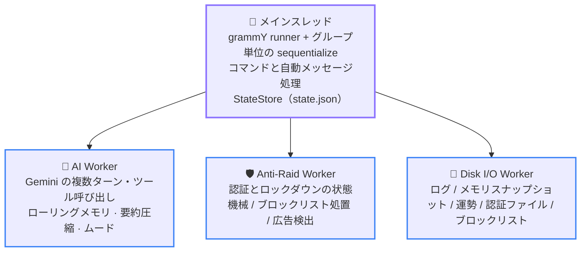
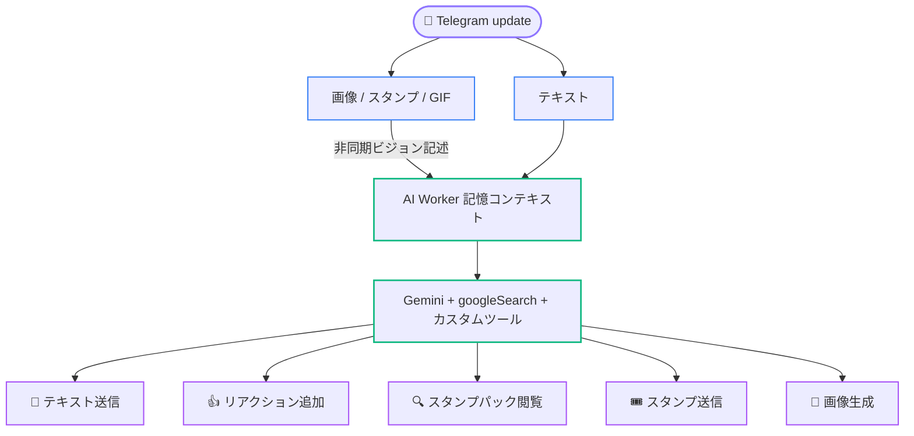

# 02 アーキテクチャ概要

  <a href="../02-architecture.md">简体中文</a> · <a href="../en/02-architecture.md">English</a> · <b>日本語</b>

  <a href="README.md">📚 開発者ドキュメント TOP</a> · <a href="01-getting-started.md">← 前のページ：01 環境構築</a> · <a href="03-directory-map.md">次のページ：03 ディレクトリマップ →</a>

---

このページでは、システム全体の形、メッセージが処理される流れ、プロセスの起動と停止を説明します。ここは案内用の概要であり、状態の所有者や変更できない順序など、実行可能な厳密な制約は [04 実行時の正式な不変条件](04-invariants.md) を正本とします。

## トポロジー：メインスレッド + 3 つの Worker

基本原則は**状態の排他的所有**です。各実行時状態には所有者が 1 つだけ存在し、スレッド間ではメモリを共有せずメッセージだけを渡します。

- **メインスレッド**は Telegram runner、3 つの Worker の監視ハンドル、`StateStore` が管理する `state.json` のメモリミラーを所有します。ミラーにはグループのスイッチ、copy 状態、ロックダウンのミラーなどの正式な状態が含まれます。
- **AI Worker**はグループチャットのメモリ、返信の受け入れ制御、メディア説明パイプライン、グループごとのムード、スタンプカタログの実行時状態を排他的に所有します。
- **Anti-Raid Worker**は認証・ロックダウン状態機械とタイマーを排他的に所有し、メインスレッドは復元可能なミラーだけを保持します。`/ad_detect` の広告検出パイプライン（送信者ごとに 90 秒間のメッセージ列をまとめ、毎秒 1 バッチを DeepSeek へ送って判定し、命中したらメッセージを削除してグループに BAN 理由を告知する）も同じスレッドで動き、判定結果はメインスレッドへ返されて /block と同等のブロックリスト登録と各グループ BAN に変換されます。ブロックリストの処置もこのスレッドで実行します（状態機械を持たず、メインスレッドが判定して投げるだけです）。request queue は認証 timeout の kick と共通です。状態機械がないからこそ、着地の受領が返っていない batch はメインスレッドのミラーが保持し、送信前に durable Disk I/O outbox へ snapshot を保存し、process 起動時または Worker 再生成時に丸ごと再投入します。
- **Disk I/O Worker**は `logs/` と、`memory/` 配下の 6 ドメイン `ai/`、`stickers/`、`luck/`、`anti-raid/`、`blocklist/`、`ad-detected/` の読み書きを直列化して排他的に扱います。唯一の例外は `state.json` で、メインスレッドの `StateStore` が直接アトミックに書き込みます。全ファイル形態と復元・保持の役割は [07 データルート](07-operations.md#データルート) を参照してください。

メインスレッド側 Anti-Raid の入口は引き続き [`packages/antiRaid/index.ts`](../../packages/antiRaid/index.ts) が編成し、ロックダウン復旧と認証ミラー受信は [`packages/antiRaid/lockdownMirror.ts`](../../packages/antiRaid/lockdownMirror.ts) と [`packages/antiRaid/verificationMirror.ts`](../../packages/antiRaid/verificationMirror.ts) が担当します。Worker 内の認証 interpreter は [`packages/workers/antiRaid/`](../../packages/workers/antiRaid/) で、状態・復元の core、受信 event 変換、Telegram 副作用、reminder delivery owner に分割されています。各モジュールは同じ dispatcher を共有し、状態機械と revision の正式な入口を 1 つに保ちます。

Worker のクラッシュはレート制限付きで自己修復しますが、ホスト実装は 2 系統です。AI と Anti-Raid は [`packages/libs/supervisedWorker.ts`](../../packages/libs/supervisedWorker.ts) を共有します。Disk I/O 自身はディスクへ書く logger に依存できないため、[`packages/infra/diskIO.ts`](../../packages/infra/diskIO.ts) に console-only の独自復旧処理があります。再構築後はメインスレッドのミラーまたはディスクスナップショットから再生します。再起動予算を使い切ると、[`packages/infra/workerSupervisor.ts`](../../packages/infra/workerSupervisor.ts) などの fatal 境界がライフサイクルへ停止を通知します。

## 1 件のメッセージが通る経路

[`packages/app/registerHandlers.ts`](../../packages/app/registerHandlers.ts) が update チェーンを 1 か所で明示的に登録し、middleware の順序そのものが意味を持ちます。

1. **`update_id` の追跡** — 処理に入った最大の update ID を記録し、停止時に正しい Telegram offset を確認できるようにします。
2. **運勢の署名付き receipt 確認** — すべてのゲートウェイより前に実行し、転送された複製も有効です。
3. **init ゲートウェイ** — `/init enable` されていないグループの通常業務 update はここで終了します。`my_chat_member`、Bot 自身の `via_bot` メッセージ、スーパー管理者の `/init` など明示的な例外は [`packages/infra/updateGate.ts`](../../packages/infra/updateGate.ts) が許可します。
4. **グループ単位の直列化** — `sequentialize` が同一チャット内のメッセージ順を保証します。リアクション同期は独立した結合キューを使い、チャットレーンを占有しません。
5. **プライベートチャット・ゲートウェイ** — プライベートチャットでは `/send` の入口と進行中の中継セッションだけを許可します。中継メッセージはメッセージパイプラインへ直接入り、本文がコマンドとして解釈されるのを防ぎます。
6. **参加認証** — コマンド処理より前でなければなりません。後ろに置くと、認証待ちユーザーのコマンドを追跡して削除できません。
7. **コマンド登録** — 14 個の `bot.command(...)`。詳細は [06 よくある変更手順](06-modification-guide.md#スラッシュコマンドの追加) を参照してください。うち `/x` はメニュー用のプレースホルダーで、漢字アクションコマンドの使い方を見せるためだけに存在し、受信時は使い方を 1 行返してチェーンを終了します。
8. **漢字アクションコマンド** — `/咬` や `/贴贴` のようなコマンド（アクション語は漢字 1~2 文字）は Telegram の `bot_command` エンティティを得られず `bot.command` では一致しないため、`bot.hears` でメッセージ原文と照合します（[`packages/commands/cjkAction.ts`](../../packages/commands/cjkAction.ts) を参照）。**次のメッセージ・フォールバックより前に登録しなければなりません**。後ろに置くと通常メッセージとして AI／copy パイプラインに飲み込まれ、機能全体が静かに動かなくなります。自動パイプラインより前にあるため、そのパイプラインの自己送信ガードは効かず、handler 自身が Bot 自身のメッセージを除外する必要があります。また受理したメッセージは先へ進まないので、送信者 ID のキャッシュも handler 自身が行います。受理しない形（`/咬@OtherBot`、caption のみ、不正な update）は `next()` で通します。
9. **自動メッセージパイプライン** — [`packages/auto/`](../../packages/auto) が copy、AI の文字起こしとトリガー判定、リアクション同期などコマンド以外の動作を処理します。

AI がトリガーされた後は、メインスレッドが活動量に基づく確率または直接トリガーを判定し、AI Worker に送信します。Worker は Gemini 入力を参照メモリ、現在の会話、今回の返信タスクという 3 部構成にし、複数ターンのツール呼び出しを実行します。メッセージ、スタンプ、リアクション、画像生成はすべてメインスレッドのプロキシ経由で行い、結果をローリングメモリへ戻して定期的にスナップショットへ保存します。

`bot.catch` は未処理エラーを記録した後に**再 throw**します。例外を握りつぶすと失敗した update が確認済みになり、永続化失敗を含めて、再起動後に Telegram から再配信されなくなります。

## AI メッセージ処理パイプライン

1 件のメッセージはまず種類ごとに分岐し、その後 AI Worker のローリングメモリへ合流します。

- **テキスト**はそのままプレースホルダーとして即時キューに入り、会話上の時系列位置を確保します。
- **画像 / スタンプ / GIF** も同様にまずプレースホルダーでキューに入り、非同期でダウンロードして vision モデルに説明を生成させ、解析が終わり次第同じエントリの text フィールドをその場で書き換えます。スタンプがホワイトリストカタログにヒットした場合は非同期解析を省略し、カタログ内の既存の説明をそのまま書き込みます。

返信がトリガーされると、ローリングメモリは前節で説明した 3 部構成の Gemini 入力に組み立てられ、`googleSearch` とカスタムツールとともに Gemini へ送られます。`googleSearch` は Google のサーバー側で実行され、その説明文はその round の検索進捗に応じて 3 状態を切り替え、action budget には計上されません（[04 ランタイム不変条件](04-invariants.md) を参照）。モデルは 1 ラウンド内で複数回ツールを呼び出せますが、いずれも Telegram を直接操作せずメインスレッドのプロキシ経由で実行されます。

- 💬 **テキスト送信** — 本文はモデルが送信ツールを明示的に呼び出す必要があります。ラウンド全体で成功した動作がゼロだった場合に限り、システムが最終的な本文を代わりに送信します。
- 👍 **リアクション追加** — ホワイトリストの emoji から選択し、1 ラウンドにつき最大 1 回成功します。
- 🔍 **スタンプパック閲覧** — 必要に応じてスタンプカタログを検索し、他のツール呼び出しとは独立に回数をカウントします。
- 🎟️ **スタンプ送信**、🎨 **画像生成** — こちらも 1 ラウンドにつき最大 1 回成功します。

このラウンドで生成されたテキスト・スタンプ・リアクション・画像の結果はローリングメモリへ書き戻され、方針に従って定期的にディスクへスナップショットされます。1 ラウンドあたりの動作回数の上限と無限ループ防止のルールは [04 実行時の正式な不変条件](04-invariants.md) を参照してください。

## 起動順序

エントリポイントの [`index.ts`](../../index.ts) は [`packages/app/lifecycle.ts`](../../packages/app/lifecycle.ts) の `ApplicationLifecycle` を組み立てるだけです。production モジュールの import では Worker、タイマー、ネットワーク要求、共有ディレクトリへの書き込みを開始せず、実行時の初期化はすべて明示的に行います。

1. データルートを再帰的に作成して**事前検査**します。書き込み、ファイル fsync、同一ディレクトリ内 hard link、アトミック rename、ディレクトリ fsync のどれかが失敗すると、実パスを示して起動を拒否します。
2. **`bot.lock`** の単一インスタンスロックを取得します。形式と後処理は [07 運用とトラブルシューティング](07-operations.md#botlock-が起動を拒否する場合) を参照してください。
3. **設定を事前読み込みし StateStore を復元**します。`config/` の 3 つの JSON を検証し、トップレベルの孤立した一時ファイルを削除してから、`state.json` の主・副コピーを厳密に検証して復元します。すべてネットワーク接続や Worker 作成より前です。
4. Telegram クライアントと **Disk I/O Worker** を初期化し、`memory/` の AI、スタンプ、運勢、認証待ちデータに加え、`memory/blocklist/blocklist.json` の `/block` 正式リストと `memory/blocklist/removals.json` の未完了 removal outbox を復元します。どれかのドメインで復元に失敗すると、部分状態での起動を拒否します。
5. handler を登録し、コマンドメニューを設定して `bot.init()` を実行します。
6. **AI Worker** を初期化し、`state.json` で AI が明示的に有効なグループだけを hydrate します。その後、運勢と認証待ちのミラーを復元し、**Anti-Raid Worker** を初期化して、最後に acknowledgement-safe runner を開始します。
7. すべての準備完了後にだけ、共有レート制限を占有しないよう上限を設けた**低優先度のグループタイトル補完**を開始します。

失敗と終了は `ApplicationLifecycle` が一元管理し、実際に取得したリソースだけを解放または flush します。

## 停止順序

正常停止と異常停止は同じライフサイクルに合流します。最初にタイトル、リアクション、アバター、翻訳の入口を **quiesce** して runner を止め、次に各キューと mailbox を**上限付きで drain**します。4 つの quiesce 入口は個別に失敗隔離されます。1 つが例外を投げても残りの入口を閉じ、すべて成功するまでは quiesce 完了として記録しません。正常経路では最終 Telegram offset の確認前に AI、Disk I/O、StateStore の順で flush します。実行中の update handler が drain deadline を超えた場合、runner は各 update の signal を abort して最後の上限付き settle 時間を与えます。それでも settle しない handler は最終 offset の確認を止め、best-effort dispose 後の非ゼロ終了を強制します。最終 dispose の順序は「AI を flush → AI を終了 → Disk I/O を flush → Anti-Raid と Disk I/O を終了 → StateStore を flush → インスタンスロックを解放」で固定です。重要な quiesce、drain、flush、lock release が 1 つでも失敗すると最終 offset の確認を行わず、未確認 update の再配信または保持された lock の operator 対応を促すため非ゼロで終了します。通常 dispose の進行中に fatal error が発生した場合、emergency 経路は同じ Promise を再利用しますが、独立した絶対 15 秒の deadline で最終強制終了を保証します。時間予算を使い切った場合は実行中の要求を abort してから未開始作業を精算し、abort 後はメッセージを送信しません。異常終了経路の maintenance 予算はちょうど 0 で、drain は待たずに直ちに abort して精算します。dispose の各 owner も個別に失敗隔離され、1 か所の throw は `failed` として記録されるだけで、後続 owner、`flushStateToDisk`、インスタンスロックの処理を飛ばしません。

どの失敗が fatal か、どの順序を入れ替えられないかを含む完全な規則は [04 実行時の正式な不変条件](04-invariants.md) を参照してください。

---

[← 前のページ：01 環境構築](01-getting-started.md) · [📚 開発者ドキュメント TOP](README.md) · [⬆️ トップへ戻る](#02-アーキテクチャ概要) · [次のページ：03 ディレクトリマップ →](03-directory-map.md)

