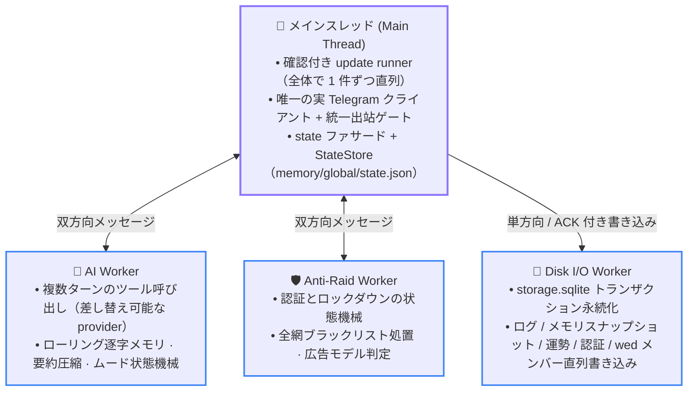

# 02 アーキテクチャ概要

<p align="center">
  <a href="../cn/02-architecture.md">简体中文</a> · <a href="../en/02-architecture.md">English</a> · <b>日本語</b>
</p>

<p align="center">
  <a href="content-table.md">📚 開発者ドキュメント TOP</a> · <a href="01-getting-started.md">← 前のページ：01 環境構築</a> · <a href="03-directory-map.md">次のページ：03 ディレクトリマップ →</a>
</p>

---

このページでは、システムアーキテクチャのトポロジー、メッセージ処理パイプライン、ならびにプロセスの起動と停止のライフサイクルを体系的に説明します。厳密な実行制約や状態所有の契約については、[04 実行時の正式な不変条件](04-invariants.md) を正本とします。

## トポロジー：メインスレッド + 3 つの Worker


```mermaid
flowchart TD
    classDef main stroke:#8e75ff,stroke-width:2.5px;
    classDef worker stroke:#3b82f6,stroke-width:2px;

    MAIN["🧵 メインスレッド (Main Thread)<br/>• 確認付き update runner（全体で 1 件ずつ直列）<br/>• 唯一の実 Telegram クライアント + 統一出站ゲート<br/>• state ファサード + StateStore（memory/global/state.json）"]:::main
    AI["🤖 AI Worker<br/>• 複数ターンのツール呼び出し（差し替え可能な provider）<br/>• ローリング逐字メモリ · 要約圧縮 · ムード状態機械"]:::worker
    RAID["🛡️ Anti-Raid Worker<br/>• 認証とロックダウンの状態機械<br/>• 全網ブラックリスト処置 · 広告モデル判定"]:::worker
    DISK["💾 Disk I/O Worker<br/>• storage.sqlite トランザクション永続化<br/>• ログ / メモリスナップショット / 運勢 / 認証 / wed メンバー直列書き込み"]:::worker

    MAIN <-->|双方向メッセージ| AI
    MAIN <-->|双方向メッセージ| RAID
    MAIN -->|単方向 / ACK 付き書き込み| DISK
```

本システムの核となる設計原則は**状態の排他的所有（Single Ownership）**です。各実行時状態には同一時点で唯一の権威ホストスレッドが存在し、スレッド間は構造化メッセージ通信のみを行い、**可変メモリの共有は固く禁止**されています。

### 4 大スレッドの役割分担

- **🧵 メインスレッド (Main Thread)**
  - **ネットワークとディスパッチ**：Telegram runner、唯一の実物 grammY Bot インスタンス、出站リクエストゲート、および 3 つの Worker の監視ハンドルを保持。
  - **メモリミラー**：
    - `cache/main/storage.ts`：`memory/global/state.json` のグローバルミラー（リピート状態と音声の 1 日あたり利用回数）。
    - `cache/main/assets.ts`：`config/dynamic/assets.json` の素材と画像ライブラリスナップショット。
    - `cache/main/chatState.ts`：`chat_states` グループ状態ホット読み取りコピー（ホスト上限 25 グループ：スイッチ、ロックダウン記録、権限スナップショット、グループ名、中継フラグ、翻訳セッション）。
  - **データ書き込みファサード**：`stateStore.ts` 業務ファサード経由で `StateStore` を呼び出し、`state.json` をアトミックに書き込み。
  - **Telegram プロキシ実行**：Telegram API 操作と Bot の身元が必要なメディアのダウンロードはメインスレッドの送信境界で実行します。AI と Anti-Raid Worker は設定済みのモデルサービスをそれぞれ直接呼び出します。

- **🤖 AI Worker**
  - **排他的所有状態**：グループチャットのメモリ（逐字ホット領域 + 要約コールド領域）、返信受け入れカウンタ、メディア解説パイプライン、グループムード段階、スタンプパックホワイトリスト目録。
  - **責務**：複数ターンのモデル対話、ツール呼び出しのスケジューリング、擬人化アクションのオーケストレーション、およびメモリのローリング圧縮。

- **🛡️ Anti-Raid Worker**
  - **排他的所有状態**：グループ参加認証状態機械、プライベートモードロックダウン状態機械、およびそれらに対応するタイマー。
  - **責務**：参加判定、タイムアウトキックのオーケストレーション、広告識別パイプライン、ブラックリスト処置。ネットワークアクションは双方向境界を通じてメインスレッドの出站へ戻り、独立した 429 カテゴリでバックオフ。
  - **自己修復とリプレイ**：Worker 再構築時はメインスレッドの復元可能ミラーからメモリ状態を再構築。プロセスレベルの再起動時はディスクログから復元。

- **💾 Disk I/O Worker**
  - **排他的永続化**：`database/storage.sqlite`、`logs/`、および `memory/` 配下の 7 つの領域ディレクトリ（`stickers/`、`luck/`、`anti-raid/`、`ad-detected/`、`ai-daily-usage/`、`joinlog/`、`wed/`）の直列読み書きを排他的に処理。
  - **トランザクションコミット**：write-through、バッチトランザクション、および厳密な revision ACK によりデータの耐久性を保証。

### モジュール境界と Worker 監視

- **公開インターフェースの疎結合**：[`packages/aiChat/index.ts`](../../packages/aiChat/index.ts) と [`packages/antiRaid/index.ts`](../../packages/antiRaid/index.ts) は薄い公開エクスポートであり、実装状態を保持しません。AI の監視は [`workerBridge.ts`](../../packages/aiChat/workerBridge.ts)、メッセージ入口は [`messageIngress.ts`](../../packages/aiChat/messageIngress.ts) が担当します。Anti-Raid の監視は [`workerBridge/controller.ts`](../../packages/antiRaid/workerBridge/controller.ts)、durable な投函は [`durableDelivery.ts`](../../packages/antiRaid/durableDelivery.ts) が担当します。
- **純粋な状態遷移の分離**：認証状態の遷移は join、pending、terminal、disable の各フェーズ（`packages/states/verification/`）に分離。ロックダウン状態機械は apply、persistence、restore、announcement、adopt の 5 フェーズ（`packages/states/lockdown/`）に分離されています。
- **障害自己修復メカニズム**：
  - AI/Anti-Raid Worker は [`packages/infra/supervisedWorker.ts`](../../packages/infra/supervisedWorker.ts) を共用し、クラッシュ時は再起動予算内でレート制限付きで再起動され、メインスレッドから最新ミラーがリプレイされます。
  - Disk I/O Worker は自身がディスク永続化 logger に依存できないため、[`packages/infra/diskIO.ts`](../../packages/infra/diskIO.ts) 内で独自に console-only の自己修復ロジックを保持します。Disk I/O は復旧フェーズでデータ読み込み、ミラーリプレイ、FIFO 排出が完了するまで書き込み不可となり、いずれかの段階で失敗した場合は致命的シャットダウン（fatal shutdown）となります。

---

## 1 件のメッセージが通る経路

すべてのメッセージミドルウェアは [`packages/app/registerHandlers.ts`](../../packages/app/registerHandlers.ts) で明示的に組み立てられます。
パイプライン内では `sequentialize` を**使用しておらず**、グローバルなメッセージ順序は取得側の確認付き runner（[`packages/app/updateRunner.ts`](../../packages/app/updateRunner.ts)）によって保証されます：**一度に 1 件の update のみを取得し、そのミドルウェアチェーンが完全に精算されるまで次の `getUpdates` を呼び出さない**ことで、グローバルで厳格な 1 件ずつの直列処理を実現しています。

```text
[Telegram Update]
       │
       ▼
 1. update_id 追跡       ── 最大処理済み update_id を記録し、停止時に offset を確定
       │
       ▼
 2. 運勢署名レシート確認  ── インラインおみくじ結果レシートを優先精算（転送コピーも有効）
       │
       ▼
 3. /init ゲートウェイ   ── 未 /init enable グループの通常業務を遮断。超管 /init 等は明示許可
       │
       ▼
 4. プライベートチャットゲートウェイ ── 超管 /send 入口とアクティブな中継セッションのみ通過
       │
       ▼
 5. 参加認証 Ingress     ── コマンド処理より前に配置。認証待ちメンバーの発言をすべて捕捉・追跡
       │
       ▼
 6. gag 禁言 Ingress     ── gag 規制中のユーザーの発言を捕捉して削除し、直ちにリンクを終了
       │
       ▼
 7. /qa フォーム Ingress  ── 入力中の「问题:」「回答:」フォームメッセージを捕捉・受領
       │
       ▼
 8. コマンドサブチェーン (:entities:bot_command)
       │                 ── 外部ゲートでフィルタリング。コマンドエンティティを含まないメッセージは一括スキップ
       ├─ /permission, /white, /copy, /translate, /wed, /block, /ai_chat ...
       └─ /x (メニュー用プレースホルダー、漢字アクションコマンドの使い方を案内)
       │
       ▼
 9. 漢字アクションコマンド (hears) ── /咬、/贴贴 などの 1〜2 文字アクション語に一致。フォールバック直前で捕捉
       │
       ▼
10. 自動メッセージパイプライン   ── auto/ がリピート、AI トリガーと文字起こし、リアクション同期などを処理
```

> [!NOTE]
> `bot.catch` が未処理例外を捕捉した際は**必ず上位へ再スロー**します。例外を握りつぶすと、Telegram 側はその update を正常消費したと誤認し、プロセス再起動後に再配信されなくなるため、データ損失の危険が生じます。

---

## AI メッセージ処理パイプライン


```mermaid
flowchart TD
    classDef input stroke:#8e75ff,stroke-width:2px;
    classDef process stroke:#3b82f6,stroke-width:1.5px;
    classDef ai stroke:#10b981,stroke-width:2px;
    classDef action stroke:#a855f7,stroke-width:1.5px;

    U(["📨 Telegram update"]):::input --> TXT["テキストメッセージ"]:::process
    U --> MED["画像 / スタンプ / GIF"]:::process
    U --> VOC["音声メッセージ"]:::process

    TXT --> MEM["AI Worker ローリングメモリ"]:::ai
    MED -- 非同期ビジョンモデル解説 --> MEM
    VOC -- 非同期音声モデル文字起こし --> MEM

    MEM --> G["4 段構成モデル入力<br/>(参照メモリ + 現在の会話 + 本ターンの状態 + 本ターンのタスク)"]:::ai

    G --> T1["🌐 web_search (Web 検索)"]:::action
    G --> T2["❓ group_qa_query / answer (グループ Q&A)"]:::action
    G --> T3["⛅ get_tokyo_weather (天気照会)"]:::action
    G --> A1["💬 send_message (テキスト送信)"]:::action
    G --> A2["👍 add_reaction (リアクション追加)"]:::action
    G --> A3["🔍 view_sticker_pack (スタンプパック閲覧)"]:::action
    G --> A4["🎟️ send_sticker (スタンプ送信)"]:::action
    G --> A5["🎨 generate_image (画像生成)"]:::action
    G --> A6["🎙️ send_voice (音声送信)"]:::action
```

### 1. メディア分流とプレースホルダーパイプライン

- **テキスト**：プレースホルダーテキストとして即座にキューへ入り、対話コンテキスト内の時系列順序を確定します。
- **画像 / スタンプ / GIF**：まずプレースホルダーとしてキューへ入り、バックグラウンドで非同期ダウンロードしてビジョンモデルにより説明を生成し、解析完了後にインプレースで書き戻します。ローカルのスタンプホワイトリストカタログに一致した場合は即座に既存の説明を書き込みます。
- **音声**：プレースホルダー・書き戻しパイプラインを通り、音声モデルで非同期文字起こしを行います（文字起こし行は `[语音：<原話>]` と表記）。規定超過の音声はダウンロード前に遮断されます。モダリティの対応可否は初回リクエストのプローブにより判定されます。

### 2. 返信トリガーと 4 段構成コンテキスト

AI の発火は 2 つのメカニズムによって決まります：
- **直接トリガー**：グループメンバーが Bot を @メンションする、Bot のメッセージに返信する、または直接呼び出しメディアを送信する。
- **ランダム自発割り込み**：グループの直近のアクティビティに基づいて動的に確率を算出。過疎グループでは低確率を保ち、活発なグループでは確率が上昇します（ハード上限あり）。`/quiet` 期間中は沈黙します。

トリガー後、AI Worker は以下の 4 段構成モデル入力を組み立てます：
1. **参照メモリ**：コールド要約と長期ペルソナから抽出。
2. **現在の会話**：直近のマルチモーダル逐字対話ログ。
3. **本ターンの実行時状態**：ツールの利用可否、画像生成クールダウン、音声の残り枠、グループ Q&A 状態など。
4. **本ターンのタスク**：モデルのペルソナ、口調の制約、誤字要求（当選時）など。

### 3. ツール呼び出し体系とアクション予算

モデルは 1 ターン内で複数回のツール呼び出しを実行できます。ツール一覧は 1 ターン内では厳格に不変であり、実行側で各操作に対して厳密な受け入れ検証を行います：

| ツール名 | 種別 | 上限・動作ルール |
| :--- | :--- | :--- |
| **`send_message`** | アクション | テキストメッセージを送信。ターン全体で可視アクションが一切受領されなかった場合にのみ、システムが最終フォールバックとして自動送信。 |
| **`add_reaction`** | アクション | ホワイトリスト emoji から選択してリアクションを追加。1 ターンにつき最大 1 回受領。 |
| **`view_sticker_pack`** | 照会 | 指定スタンプパック内のスタンプ一覧を照会。可視アクション予算を消費しない。送信前に閲覧が必須。 |
| **`send_sticker`** | アクション | 指定スタンプを送信。1 ターンにつき最大 1 回受領。 |
| **`generate_image`** | アクション | 画像を生成して送信。直接トリガーされたターンのみ利用可能。1 ターン最大 1 回、グループクールダウンの制約を受ける。 |
| **`send_voice`** | アクション | 日本語セリフの音声合成。バックグラウンドで非同期合成し、アクションチェーンで整列送信。1 ターンにつき最大 1 回受領。 |
| **`web_search`** | 照会 | ローカル Web 検索ツール（`agent.web_search` 設定時に有効）。`max_calls_per_use` の制約を受ける。 |
| **`group_qa_query`** | 照会 | グループ内に登録された質問リストを照会。アクション予算には計上されない。 |
| **`group_qa_answer`** | 照会 | 質問原文に一致する登録済み回答を照会。モデルが文脈に応じて自律的に呼び出す。 |
| **`get_tokyo_weather`** | 照会 | 東京の当日の天気と気温を照会。`bot.json.time_zone` が `Asia/Tokyo`（省略時を含む）の場合だけ載せる。 |

> [!TIP]
> **アクションチェーンとチャットステータス**：
> - 送信系ツールは呼び出し時に即座に検証と枠の予約を行い、直ちに受領レシートをモデルへ返却します。擬人化のためのウェイト、音声合成の完了待ち、および実際の Telegram 送信は、本ターンの**直列アクションチェーン**が呼び出し順に順次実行します。
> - Telegram のチャットステータス（入力中、録音中、スタンプ選択中、写真送信中）は、アクションチェーン上で現在実行されているステップによって厳格に駆動され、ステップ完了後は 500 ms の沈黙を挟んでアイドルへ戻ることで、ステータスの重複を防ぎます。

---

## 起動順序

エントリポイントの [`index.ts`](../../index.ts) は [`packages/app/lifecycle.ts`](../../packages/app/lifecycle.ts) の `ApplicationLifecycle` を組み立てるだけです。本番モジュールの import は一切の副作用を伴わず、システムのライフサイクルは厳格な手順に従って順次実行されます：

0. **設定レイアウト検査**：`bot.ts` をインポートする際、`layout.ts` が `config/` のディレクトリ構造を検査します。トップレベルに設定ファイルが散乱している場合や `config/dynamic/` が欠落している場合は拒否し、その後 `bot.json` を厳格に読み込みます。
1. **データルート事前検査**：データルートを再帰的に作成し、ファイルの書き込み、ファイル fsync、同一ディレクトリ内 hard link、アトミック rename、およびディレクトリ fsync を事前検査します。いずれか 1 つでも失敗すれば直ちに fail-closed で終了します。
2. **インスタンスロック取得**：`bot.lock` の単一インスタンスファイルロックを取得します（`/proc/<pid>/stat` と boot ID に基づく）。
3. **グローバル状態と設定の事前検証**：
   - トップレベルの孤立した一時ファイルを削除。データルート下に残存する 14.x の旧 `state.json`/`state.json.bak` を拒否。
   - `memory/global/state.json` を厳格に復元し、業務ファサードから権威メモリを満たす。
   - 存在するすべてのデプロイ設定ファイルを事前検証。欠落項目は機能の readiness 判定で処理し、存在しても壊れている場合は直ちに終了。
   - `h_image` 専用画像ライブラリディレクトリを検査・準備（SHA-256 ファイル名とパーミッションの検証）。
4. **Disk I/O Worker の初期化**：
   - 全領域（データベース、ログ、AI 記憶、スタンプ、運勢、認証記録、wed メンバーなど）を一括読み取り専用 inspect して厳格デコード。
   - 検証成功後に owner を adopt し、`bot.json` の `time_zone` で 0 時のメンテナンス cron を登録。メインスレッドの Telegram クライアントを初期化し、スーパー管理者の権限を検証。
5. **ハンドラー登録 & ハンドシェイク**：グローバルミドルウェアの登録、コマンドメニューの登録を行い、`bot.init()` で Telegram ゲートウェイとハンドシェイク。
6. **業務 Worker の初期化 & スケジューリング**：
   - AI Worker を初期化（AI 認証情報が利用可能な場合のみ起動し、AI が有効化されたグループのみ hydrate）。
   - Anti-Raid Worker を初期化し、認証およびロックダウンのミラーを復元。
   - `cron.json` 定時タスクスケジューラと `config/dynamic/` ディレクトリのホットリロードファイル監視を開始。
   - ブラックリストの全グループ再スキャンを実行。
7. **Update Runner の開始**：1 件ずつ直列に処理する runner を開始し、最後に低優先度のグループタイトル非同期補完を起動。

---

## 停止順序

停止処理は `ApplicationLifecycle` が一元的に収束させ、正常終了・異常停止を問わず直列バリアに沿って安全にグレースフルシャットダウンします：

1. **Quiesce（入口の遮断）**：
   - グループタイトル補完、アバターキュー、翻訳、gag、wed 予約、遅延コマンド、定時タスクスケジューラ、ブラックリスト再スキャン、設定ホットリロード監視を直ちに停止。
   - Telegram runner を停止し、新たな update の受け入れを終了。
2. **有界 Drain（キューの排空）**：
   - 処理中の update ハンドラーにタイムアウト付きのキャンセレーションシグナルを付与。
   - 制限時間内で実行中タスクの収束を待機。タイムアウト時はリクエストを abort して最終 offset のコミットを阻止し、再起動後に Telegram から再配信できるように保証。
3. **Flush & Dispose（永続化とリソース解放）**：
   - Anti-Raid タスクと統一遅延削除キューを排空。
   - AI のローリングメモリスナップショットをディスクへ flush。
   - メインスレッドの Telegram 統一出站キューを排空。
   - Disk I/O Worker の保留中書き込みバッファをすべて flush し、業務 Worker を終了。
   - `StateStore` のグローバル状態を flush。
   - `bot.lock` インスタンスロックを解放してプロセスを終了。

---

<div align="center">

[← 前のページ：01 環境構築](01-getting-started.md) · [📚 開発者ドキュメント TOP](content-table.md) · [⬆️ トップへ戻る](#02-アーキテクチャ概要) · [次のページ：03 ディレクトリマップ →](03-directory-map.md)

</div>
