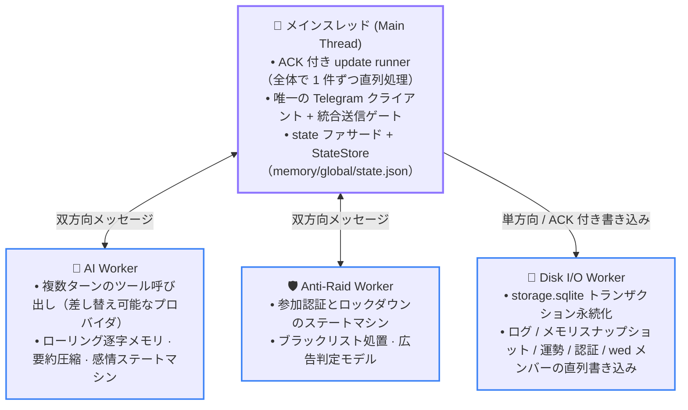
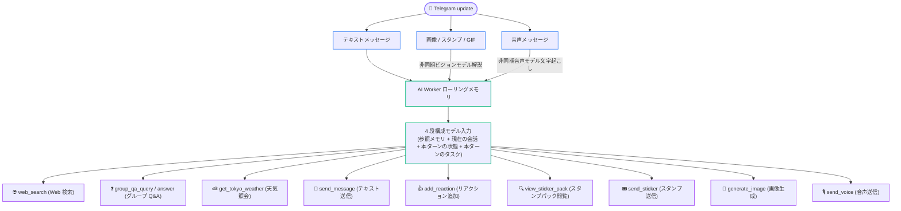

# 02 アーキテクチャ概要

<p align="center">
  <a href="../cn/02-architecture.md">简体中文</a> · <a href="../en/02-architecture.md">English</a> · <b>日本語</b>
</p>

<p align="center">
  <a href="content-table.md">📚 開発者ドキュメント TOP</a> · <a href="01-getting-started.md">← 前のページ：01 環境構築</a> · <a href="03-directory-map.md">次のページ：03 ディレクトリマップ →</a>
</p>

---

このドキュメントでは、システム全体のトポロジー構成、メッセージ処理パイプライン、ならびにプロセスの起動・終了ライフサイクルを体系的に解説します。厳密な実行制約や状態の所有権ルールについては、[04 実行時の正式な不変条件](04-invariants.md) を正本として参照してください。

## トポロジー：メインスレッド + 3 つの Worker


```mermaid
flowchart TD
    classDef main stroke:#8e75ff,stroke-width:2.5px;
    classDef worker stroke:#3b82f6,stroke-width:2px;

    MAIN["🧵 メインスレッド (Main Thread)<br/>• ACK 付き update runner（全体で 1 件ずつ直列処理）<br/>• 唯一の Telegram クライアント + 統合送信ゲート<br/>• state ファサード + StateStore（memory/global/state.json）"]:::main
    AI["🤖 AI Worker<br/>• 複数ターンのツール呼び出し（差し替え可能なプロバイダ）<br/>• ローリング逐字メモリ · 要約圧縮 · 感情ステートマシン"]:::worker
    RAID["🛡️ Anti-Raid Worker<br/>• 参加認証とロックダウンのステートマシン<br/>• ブラックリスト処置 · 広告判定モデル"]:::worker
    DISK["💾 Disk I/O Worker<br/>• storage.sqlite トランザクション永続化<br/>• ログ / メモリスナップショット / 運勢 / 認証 / wed メンバーの直列書き込み"]:::worker

    MAIN <-->|双方向メッセージ| AI
    MAIN <-->|双方向メッセージ| RAID
    MAIN -->|単方向 / ACK 付き書き込み| DISK
```

本システムの基本設計原則は**状態の単一所有権（Single Ownership）**です。実行時のあらゆる可変状態には同一時点で唯一のホストスレッドのみが存在し、スレッド間はシリアライズされた構造化メッセージのみで通信します。共有可変メモリは一切使用しません。

### 4 大スレッドの役割分担

- **🧵 メインスレッド (Main Thread)**
  - **ネットワークとディスパッチ**：Telegram runner、唯一の実体 grammY Bot インスタンス、外部送信リクエストゲート、および 3 つの Worker の監視ハンドルを統括管理。
  - **インメモリキャッシュ**：
    - `cache/main/storage.ts`：`memory/global/state.json` のグローバルミラー（リピート状態と音声の 1 日あたり利用量）。
    - `cache/main/assets.ts`：`config/dynamic/assets.json` のアセットと画像ライブラリスナップショット。
    - `cache/main/chatState.ts`：`chat_states` グループ状態の高速読み取り用インメモリコピー（上限 `STATE_MANAGED_CHAT_LIMIT` グループ：各種有効化フラグ、ロックダウン履歴、権限スナップショット、グループ名、中継セッション、翻訳状態）。
  - **状態書き込みファサード**：`stateStore.ts` 業務ファサード経由で `StateStore` を呼び出し、`state.json` をアトミックに永続化。
  - **Telegram 操作の集約**：すべての Telegram API 操作および Bot の権限が必要なメディアダウンロードは、メインスレッドの送信境界に集約して実行。AI および Anti-Raid Worker は、設定された各モデル API のみを直接呼び出します。

- **🤖 AI Worker**
  - **排他的所有状態**：グループチャットの会話メモリ（逐字記録ホット領域 + 要約圧縮コールド領域）、返信受付カウンタ、メディア解説パイプライン、現在の感情（ムード）ステート、許可スタンプパックの目録。
  - **責務**：マルチターンのモデル対話、ツール呼び出しのスケジューリング、擬人化アクションの順序制御、および会話メモリのローリング圧縮。

- **🛡️ Anti-Raid Worker**
  - **排他的所有状態**：グループ参加認証ステートマシン、プライベートモード（ロックダウン）ステートマシン、および付随する各種タイマー。
  - **責務**：参加適格性の判定、タイムアウトキックの実行制御、広告判定パイプライン、ブラックリスト処置。Telegram へのアクションは双方向境界を介してメインスレッドの送信ゲートに委譲し、リクエスト種別ごとに 429 レート制限のバックオフを制御。
  - **自己修復とリプレイ**：Worker 再構築時はメインスレッドが保持する復元可能ミラーからメモリ状態を再構築。プロセス全体の再起動時はディスク上のログから復元。

- **💾 Disk I/O Worker**
  - **排他的永続化**：`database/storage.sqlite`、`logs/`、および `memory/` 配下の `global/` 以外の各領域ディレクトリ（`stickers/`、`luck/`、`anti-raid/`、`ad-detected/`、`ai-daily-usage/`、`joinlog/`、`wed/`）への直列化された読み書きを一手に担当。
  - **トランザクション制御**：write-through、バッチトランザクション、および厳格な revision ACK によりデータの耐久性を保証。

### モジュール境界と Worker 監視

- **公開インターフェースの疎結合**：[`packages/aiChat/index.ts`](../../packages/aiChat/index.ts) と [`packages/antiRaid/index.ts`](../../packages/antiRaid/index.ts) は薄いエクスポートレイヤーであり、内部実装状態を保持しません。AI の監視は [`workerBridge.ts`](../../packages/aiChat/workerBridge.ts)、メッセージ入口は [`messageIngress.ts`](../../packages/aiChat/messageIngress.ts) が担当します。Anti-Raid の監視は [`workerBridge/controller.ts`](../../packages/antiRaid/workerBridge/controller.ts)、確実なメッセージ配信（durable delivery）は [`durableDelivery.ts`](../../packages/antiRaid/durableDelivery.ts) が担当します。
- **純粋な状態遷移の分離**：認証状態の遷移は join、pending、terminal、disable、adopt の各フェーズ（`packages/states/verification/`）に、ロックダウンステートマシンは apply、persistence、restore、announcement、adopt の各フェーズ（`packages/states/lockdown/`）にモジュール分割されています。
- **障害監視と自己修復**：
  - AI / Anti-Raid Worker は [`packages/infra/supervisedWorker.ts`](../../packages/infra/supervisedWorker.ts) を共用し、クラッシュ時には再起動予算の範囲内でレート制限付きで自動再起動され、メインスレッドから最新のスナップショットがリプレイされます。
  - Disk I/O Worker のクラッシュ復旧は [`packages/infra/diskIO.ts`](../../packages/infra/diskIO.ts) および `packages/infra/diskIO/` 内で独立して実装されています。診断ログは `logger` を経由せず `console.error` にのみ直接出力されます。復旧フェーズではデータ読み込み、ミラーリプレイ、FIFO キューのドレインがすべて完了するまで新規書き込みが遮断され、いずれかの段階でエラーが発生した場合はプロセス全体が安全に異常終了（fatal shutdown）します。

---

## 1 件のメッセージが通る経路

すべてのメッセージミドルウェアは [`packages/app/registerHandlers.ts`](../../packages/app/registerHandlers.ts) で明示的に組み立てられます。下図の前置チェーンは 1 つの配列にまとめられ、`bot.use(...preamble)` で一括登録されます。実行順序と next() の伝播契約は grammY のミドルウェア仕様に従います。リアクション、メンバー増減、コールバック、インラインクエリなど、通常のメッセージ以外の update は個別の `bot.on` で登録されます。
本パイプラインは `sequentialize` を使用せず、メッセージのグローバルな処理順序は取得側の ACK 付き runner（[`packages/app/updateRunner.ts`](../../packages/app/updateRunner.ts)）によって保証されます。一度に 1 件の update のみを取得し（`UPDATE_POLL_LIMIT`）、そのミドルウェアチェーンが完全に完了するまで次の `getUpdates` を呼び出さないことで、システム全体で厳格な 1 件ずつの直列処理を実現しています。

```text
[Telegram Update]
       │
       ▼
 1. update_id 追跡       ── 最大処理済み update_id を記録し、終了時に offset を確定
       │
       ▼
 2. Bot 発言レート制限    ── 他の Bot による発言を送信元 ID ごとに集計し、上限超過時はサイレントに破棄
       │
       ▼
 3. おみくじ署名レシート確認 ── インラインおみくじ結果の確定レシートを優先精算（転送メッセージも有効）
       │
       ▼
 4. /init ゲート + プライベートチャットゲート ── /init enable 未実行グループの通常業務を遮断。プライベートチャットはスーパー管理者の /send のみ通過
       │
       ▼
 5. ユーザー情報ウォームアップ ── update に含まれる未キャッシュの身元情報を一括補完
       │
       ▼
 6. プライベート /send 中継 ── アクティブな中継セッション中の通常メッセージを自動メッセージパイプラインへ直接バイパス
       │
       ▼
 7. 参加認証 Ingress     ── コマンド処理より前に配置。認証待ちメンバーの発言をすべて捕捉・追跡
       │
       ▼
 8. gag 制限 Ingress     ── gag 規制中のユーザーの発言を捕捉して削除し、直ちにミドルウェアチェーンを終了
       │
       ▼
 9. /qa フォーム Ingress  ── 入力中の「问题:」「回答:」フォームメッセージを捕捉・受領
       │
       ▼
10. コマンドサブチェーン (:entities:bot_command)
       │                 ── 外部ゲートでフィルタリング。コマンドエンティティを含まないメッセージは一括スキップ
       ├─ /permission, /white, /copy, /translate, /wed, /block, /ai_chat ...
       └─ /x (メニュー用プレースホルダー、漢字アクションコマンドの使い方を案内)
       │
       ▼
11. 漢字アクションコマンド (hears) ── /咬、/贴贴 などの 1〜2 文字アクション語に一致。フォールバック直前で捕捉
       │
       ▼
12. 自動メッセージパイプライン   ── auto/message/ がリピート、グループ Q&A 即答、AI 会話トリガーと文字起こしなどを処理
```

リアクション同期は `message_reaction` 専用のハンドラー（`auto/reactionSync.ts`）が処理し、上記のメッセージチェーンは通りません。

> [!NOTE]
> `bot.catch` はエラーログを記録したあと必ず例外を上位へ再スローし、失敗した update を勝手にコミット（確認済み）しません。例外を握りつぶしてしまうと、未処理の update が消費済みとして失われてしまうためです。

---

## AI メッセージ処理パイプライン


```mermaid
flowchart TD
    classDef input stroke:#8e75ff,stroke-width:2px;
    classDef process stroke:#3b82f6,stroke-width:1.5px;
    classDef ai stroke:#10b981,stroke-width:2px;
    classDef action stroke:#a855f7,stroke-width:1.5px;

    U(["📨 Telegram update"]):::input --> TXT["テキストメッセージ"]:::process
    U --> MED["画像 / スタンプ / GIF"]:::process
    U --> VOC["音声メッセージ"]:::process

    TXT --> MEM["AI Worker ローリングメモリ"]:::ai
    MED -- 非同期ビジョンモデル解説 --> MEM
    VOC -- 非同期音声モデル文字起こし --> MEM

    MEM --> G["4 段構成モデル入力<br/>(参照メモリ + 現在の会話 + 本ターンの状態 + 本ターンのタスク)"]:::ai

    G --> T1["🌐 web_search (Web 検索)"]:::action
    G --> T2["❓ group_qa_query / answer (グループ Q&A)"]:::action
    G --> T3["⛅ get_tokyo_weather (天気照会)"]:::action
    G --> A1["💬 send_message (テキスト送信)"]:::action
    G --> A2["👍 add_reaction (リアクション追加)"]:::action
    G --> A3["🔍 view_sticker_pack (スタンプパック閲覧)"]:::action
    G --> A4["🎟️ send_sticker (スタンプ送信)"]:::action
    G --> A5["🎨 generate_image (画像生成)"]:::action
    G --> A6["🎙️ send_voice (音声送信)"]:::action
```

### 1. メディア分流とプレースホルダーパイプライン

- **テキスト**：プレースホルダーとして即座にキューへ追加され、会話コンテキスト内の時系列順序を確定します。
- **画像 / スタンプ / GIF**：まずプレースホルダーとしてキューへ入り、バックグラウンドで非同期ダウンロードしてビジョンモデルにより説明文を生成し、解析完了後にインプレースで書き戻します。ローカルのスタンプホワイトリストカタログに一致した場合は即座に既存の説明を適用します。
- **音声**：プレースホルダー・書き戻しパイプラインを通り、音声認識モデルで非同期に文字起こしを行います（文字起こし結果は `[语音：<原话>]` と記録）。サイズ上限を超過した音声はダウンロード前に遮断されます。モダリティの対応可否は初回の実リクエストによる自動プローブで判定され、失敗した場合は該当エンドポイント単位でバックオフします。

### 2. 返信トリガーと 4 段構成コンテキスト

AI の発火は 2 つの契機によって制御されます：
- **明示的トリガー**：グループメンバーが Bot を @メンションする、Bot のメッセージに返信する、または直接呼び出し用のメディアを送信する。
- **自発的割り込み**：グループの直近のアクティビティに基づいて動的に確率を算出。静かなグループでは確率が低く、活発なグループでは確率が上昇します（上限あり）。`/quiet` による静穏化期間中は発動しません。

トリガー発生時、AI Worker は以下の 4 段構成モデル入力（各セクション名は `REPLY_CONTEXT_SECTION_NAMES`）を組み立てます。なお、モデルのペルソナはシステムプロンプトに配置されます：
1. **参照メモリ**（`CURRENT_REFERENCE_MEMORY`）：Bot アカウントの自己識別情報と、古い対話の要約圧縮データ。
2. **現在の会話**（`CURRENT_CONVERSATION`）：直近のマルチモーダル逐字トランスクリプトと発言者リスト。
3. **本ターンの実行時状態**（`CURRENT_RUNTIME_STATE`）：本日の感情ステータス、現在時刻、本ターンのツール状態（各ツールの利用可否、画像生成クールダウン、音声の残り枠、グループ Q&A の登録状況など）。
4. **本ターンのタスク**（`CURRENT_REPLY_TASK`）：呼び出しユーザーの身元、トリガー種別ごとの返信指示、誤字指示（当選時）。

### 3. ツール呼び出し体系とアクション予算

モデルは 1 ターン内で複数回のツール呼び出しを実行できます。ツール一覧の定義は 1 ターン内で不変であり、実行側で各操作の受け入れ可否を厳格に検証します：

| ツール名 | 種別 | 上限・動作ルール |
| :--- | :--- | :--- |
| **`send_message`** | アクション | テキストメッセージを送信。ターン全体で可視アクションが一切受領されなかった場合にのみ、システムが最終フォールバックとして自動送信。 |
| **`add_reaction`** | アクション | 許可された絵文字から選択してリアクションを追加。1 ターンあたりの受領回数上限は `MAX_REACTIONS_PER_REPLY`。 |
| **`view_sticker_pack`** | 照会 | 指定スタンプパック内のスタンプ一覧を照会。可視アクション予算を消費しない。スタンプ送信前の閲覧が必須。 |
| **`send_sticker`** | アクション | 指定スタンプを送信。1 ターンあたりの受領回数上限は `MAX_STICKERS_PER_REPLY`。 |
| **`generate_image`** | アクション | 画像を生成して送信。直接トリガーの資格およびグループ単位のクールダウンは本ターンのツール状態に記録され、エグゼキューターが呼び出し時に検証。1 ターンあたりの受領回数上限は `MAX_GENERATED_IMAGES_PER_REPLY`。 |
| **`send_voice`** | アクション | `agent.tts.bot_language` の言語でセリフを音声合成。ツール説明文は `prompt/voice_tool.md` で全体置換が可能。バックグラウンドで非同期合成され、アクションチェーンで整列送信。1 ターンあたりの受領回数上限は `MAX_VOICES_PER_REPLY`。 |
| **`web_search`** | 照会 | ローカル Web 検索ツール（`agent.web_search` 設定時に有効）。1 ターンあたりの呼び出し回数は `max_calls_per_use` で制限。 |
| **`group_qa_query`** | 照会 | グループ内に登録された質問一覧を照会。アクション予算は消費しない。 |
| **`group_qa_answer`** | 照会 | `group_qa_query` で得られた質問に対応する登録回答を取得。呼び出しの要否はモデルが文脈に応じて自律判断。 |
| **`get_tokyo_weather`** | 照会 | 東京の当日の天気と気温を照会。設定タイムゾーンが `TOKYO_TIME_ZONE`（`bot.json` の `time_zone`、省略時を含む）の場合にのみツールセットへ追加。 |

> [!TIP]
> **アクションチェーンとチャットステータス**：
> - 送信系ツールは呼び出し時に即座にバリデーションと枠の予約を行い、モデルへ受領レシートを返却します。人間らしい自然な送信間隔（ウェイト）、音声合成の完了待機、および実際の Telegram 送信は、本ターンの**直列アクションチェーン**が呼び出し順に 1 件ずつ実行します。
> - Telegram のチャットステータス表示（入力中、録音中、スタンプ選択中、写真送信中）は、アクションチェーン上で現在実行されているステップに応じて駆動されます。1 つのアクションが完了したあと、少なくとも `CHAT_ACTION_REST_MS` のインターバルを置いてから次のステータスを点灯させます。

---

## 起動順序

エントリポイントの [`index.ts`](../../index.ts) は [`packages/app/lifecycle.ts`](../../packages/app/lifecycle.ts) の `ApplicationLifecycle` を組み立てて初期化を委譲します。各本番モジュールの import 自体は Worker の起動、タイマー登録、ネットワーク接続、ディスク書き込みなどの副作用を一切持ちません。`ApplicationLifecycle.init()` は以下のステップを順次実行します。各手順の厳密な制約は [04 実行時の正式な不変条件](04-invariants.md) を参照してください：

0. **設定レイアウト検査**：`config/bot.ts` の読み込み時、`layout.ts` が `config/` のディレクトリ構造を検証します。ルート直下に設定ファイルが配置されていないこと、および `config/dynamic/` が存在することを確認した上で、`bot.json` を厳格にパースします。
1. **データルート事前検査とインスタンスロック**：`acquireSingleInstanceLock` がデータルートの基本 I/O（ファイル作成・書き込み、fsync、同一ディレクトリ内ハードリンク、アトミック rename、ディレクトリ fsync）を事前検証し、`/proc/<pid>/stat` と boot ID に基づく `bot.lock` の単一インスタンスロックを取得します。いずれかの検証に失敗した場合は直ちに fail-closed で終了します。その後 Worker の致命的エラーコールバックを登録し、アバター、グループタイトル、翻訳、gag、wed、遅延コマンドの各ランタイムを初期化します。
2. **グローバル状態と設定の事前検証**：
   - ディレクトリ直下に残存する孤立した一時ファイルをクリーンアップ。
   - `memory/global/state.json` を厳格にデコードしてインメモリ状態を復元。データルート直下に `state.json` または `state.json.bak` が残存している場合は起動を拒否。
   - 存在するすべての設定入力を事前検証。未設定の任意ファイルは機能単位の準備フラグで処理されますが、ファイルが存在しながら内容が不正な場合は直ちに起動を中止。
   - 検証済みの `assets.json` に基づき、ランダム画像ライブラリディレクトリを検査・準備（パーミッション、ファイル名、エントリ形式を確認）。
3. **Disk I/O Worker の初期化とデータ復元**：
   - Disk I/O Worker は全永続化領域（データベース、ログ、AI キャッシュ使用量、スタンプ目録、運勢、認証記録、参加ログ、wed メンバー等）をまず読み取り専用で検査・厳格デコードし、整合性を確認した後に所有権を確立（adopt）。レシート返却と起動時メンテナンスタスクを実行し、設定タイムゾーンに基づく午前 0 時の定期メンテナンス cron を登録。
   - メインスレッドはグループ状態、グループ Q&A、wed メンバーのインメモリキャッシュを読み込み、Telegram クライアントを初期化し、スーパー管理者がブラックリストに登録されていないことを確認した上で、発言者キャッシュと翻訳ターゲットを初期投入（シード）。
4. **ハンドラー登録とハンドシェイク**：グローバルミドルウェアの登録、コマンドメニューの登録を行い、`bot.init()` で Telegram とハンドシェイク。
5. **業務 Worker の初期化とスケジューリング**：
   - AI Worker を初期化（前提設定が有効な場合のみ）し、会話メモリ、スタンプ目録、運勢、認証待ち記録をハイドレーション。
   - Anti-Raid Worker を初期化し、認証およびロックダウンのミラー状態を復元。
   - `cron.json` 定期タスクスケジューラと `config/dynamic/` のホットリロード監視を開始し、ブラックリスト再スキャンのスケジューラを準備。
   - runner が新たな update の受信を開始する前に、管理者権限が確認済みの全グループに対してブラックリスト再スキャンを 1 回先行実行。
6. **Update Runner の開始**：1 件ずつ直列処理する update runner を起動し、wed メンバーの再確認をスケジュールし、最後に低優先度のグループタイトル非同期補完タスクを開始。

---

## 停止順序

プロセスの停止処理は `ApplicationLifecycle`（`wait()` および `dispose()`）が一元的に統括し、正常終了・異常停止を問わず直列バリアに沿って安全にシャットダウンします。各コンポーネントの停止順序とゲートは `packages/app/lifecycle/shutdown.ts` の `SHUTDOWN_DRAIN_OWNERS` が厳密に定めています（詳細は [04 実行時の正式な不変条件](04-invariants.md) を参照）：

1. **Quiesce（受付の遮断）**：
   - グループタイトル補完、アバターキュー、翻訳、gag、wed 予約、遅延コマンド、定期タスクスケジューラ、ブラックリスト再スキャン、設定ホットリロード監視を順次停止。各コンポーネントは独立して完了処理され、いずれかで例外が発生した場合は最終 update offset のコミットが阻止されます。
   - Telegram runner を停止し、新たな update の受信を遮断。
2. **有界 Drain（インフライト処理の完了待機）**：
   - 処理中の update ハンドラーにキャンセレーションシグナルを通知し、制限時間内で完了を待機。タイムアウトに達した場合は処理中の update を中断し、最終 offset のコミットを阻止（次回起動時に Telegram から再受信させるため）。
   - グループタイトルの非同期補完タスクの完了を待機。
3. **永続化と offset コミット**：`flushAllToDisk` が `SHUTDOWN_DRAIN_OWNERS` の順序に従って各 owner および Worker のメッセージキューをドレインしてディスクへ flush。すべての書き込みが正常完了した場合にのみ、`getUpdates` で最後に処理した update の offset をコミット。途中でエラーが発生した場合は offset をコミットせず、プロセスは非ゼロのステータスで終了。
4. **Dispose（リソースの解放と Worker 停止）**：
   - 定められた順序で最終クリーンアップ：アバターキュー、翻訳（完了後 close）、Anti-Raid、gag 通知、`/qa set` フォーム、wed、遅延コマンド、定期タスク、統合遅延削除キュー、AI メモリの flush（完了後 AI Worker を終了）、Telegram 送信キュー（完了後送信ゲートを閉鎖）、Disk I/O の flush。
   - Anti-Raid および Disk I/O の Worker プロセスを終了し（Disk I/O Worker は終了前に残りの書き込みをコミットし、WAL checkpoint を実行して共有 SQLite を閉じる）、`StateStore` のグローバル状態を最終 flush。
   - シャットダウン結果は `clean`、`offsetWithheld`、`unsettled` の 3 状態に分類されます。`unsettled` ではプロセス終了まで `bot.lock` を保持し続け、それ以外ではインスタンスロックを正常に解放します。`clean` 以外の状態ではプロセスは必ず非ゼロコードで終了します。

---

<div align="center">

[← 前のページ：01 環境構築](01-getting-started.md) · [📚 開発者ドキュメント TOP](content-table.md) · [⬆️ トップへ戻る](#02-アーキテクチャ概要) · [次のページ：03 ディレクトリマップ →](03-directory-map.md)

</div>
