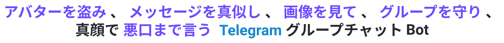

<div align="center">

<p><a href="../../README.md">简体中文</a> · <a href="../en/README.md">English</a> · <b>日本語</b></p>

<picture>
  <source media="(prefers-color-scheme: dark)" srcset="../../public/banner_dark.jpg">
  <source media="(prefers-color-scheme: light)" srcset="../../public/banner_light.jpg">
  
</picture>

<h1>
  <a href="https://t.me/copy_ninjia_bot" title="アバターをクリックしてサンプル Bot を開く"></a>
  Copy Ninjia
</h1>

<p><sub>アバターをクリックすると、サンプル Bot に移動できます：<a href="https://t.me/copy_ninjia_bot">@copy_ninjia_bot</a></sub></p>

<picture>
  <source media="(prefers-color-scheme: dark)" srcset="../../public/tagline_ja_dark.svg">
  <source media="(prefers-color-scheme: light)" srcset="../../public/tagline_ja_light.svg">
  
</picture>

**本番コード、テスト、ドキュメントをすべて AI が書く純 AI 開発プロジェクト** — 人間はアーキテクチャを設計し、AI と共同で全コミットをレビュー

<p align="center">
  <a href="https://bun.sh/"></a>
  <a href="https://www.typescriptlang.org/"></a>
  <a href="https://www.sqlite.org/"></a>
  <a href="https://grammy.dev/"></a>
  <a href="https://ai.google.dev/"></a>
  <a href="https://platform.openai.com/docs/"></a>
</p>

<p align="center">
  <a href="#pure-ai-development"></a>
  <a href="#pure-ai-development"></a>
  <a href="05-dev-workflow.md"></a>
  <a href="05-dev-workflow.md"></a>
  <a href="../../LICENSES/LICENSE"></a>
</p>

メッセージの復唱と人格模倣は表面にすぎません。その下では、複数の Worker が、障害復旧、上限付きキャッシュ、競合対策を備えたグループチャット自動化システムを支えています。

---

🧬 [純 AI 開発](#pure-ai-development) • ✨ [機能](#features) • 🎮 [コマンドと権限](#commands-and-permissions) • 🚀 [クイックスタート](#quick-start) • 🤖 [BotFather 設定](#botfather-setup) • ❓ [よくある質問](10-faq.md) • 📚 [開発者ドキュメント](content-table.md)

</div>

---

<a id="pure-ai-development"></a>

## 🧬 純 AI 開発

このリポジトリの production コード、テストケース、そして README 自体も、すべて AI が書いています。人間はコードを書きませんが、決して席を外してはいません。アーキテクチャを設計し、すべてのコミットを AI と共同でレビューします。

<table width="100%">
<tr><th width="18%" align="left">工程</th><th width="32%" align="left">担当者</th><th width="50%" align="left">役割</th></tr>
<tr><td>📐&nbsp;設計</td><td><b>Asashishi</b></td><td>システム境界、Worker 分割、永続化・復元戦略の決定</td></tr>
<tr><td>⌨️&nbsp;実装</td><td><b>Claude Code</b> · <b>Codex</b> · <b>Antigravity</b></td><td>100% の production コード、テスト、ドキュメントを作成</td></tr>
<tr><td>🧾&nbsp;レ&#8288;ビ&#8288;ュ&#8288;ー</td><td><b>Asashishi</b> × AI</td><td>全コミットを人間と AI が共同レビューしたうえで取り込み</td></tr>
<tr><td>🔬&nbsp;監査</td><td><b>Fable-5.1</b> · <b>Gpt-6-astra</b> 等の先端モデル</td><td>リポジトリ全体の交差レビューを重ね、指摘項目を堅牢化コミットへ即時還元</td></tr>
<tr><td>🛰️&nbsp;安&#8288;全&#8288;演&#8288;習</td><td>同上の先端モデル群</td><td>クラッシュ復元・競合・悪意ある入力・資源枯渇などのシナリオ演習をすべて通過</td></tr>
</table>

レビューは一回限りの儀式ではありません。毎回のコミットレビュー、先端モデルによるリポジトリ全体の監査、安全演習から得た知見を、新たな制約としてコードへ反映しています。

<p align="right"><sub><a href="#copy-ninjia">⬆️ ページ上部へ</a></sub></p>

## 🧪 プロジェクト品質

<p align="center">
  <picture>
    <source media="(prefers-color-scheme: dark)" srcset="../../public/coverage_dark.svg">
    <source media="(prefers-color-scheme: light)" srcset="../../public/coverage_light.svg">
    
  </picture>
</p>

ベンチマークの計測値（コールド/ホットパス · 総スループットと総 I/O · エンドツーエンドのチェーン遅延）は **[📊 09 パフォーマンスベンチマーク](09-performance.md)** にあります。

<p align="right"><sub><a href="#copy-ninjia">⬆️ ページ上部へ</a></sub></p>

<a id="features"></a>

## ✨ 機能

<table width="100%">
<tr>
<td align="left" valign="top" width="33%">
  <p><b>🪞 高精度な復唱</b><br>
  <sub>対象を 1 つ固定し、その発言を 1 件ずつ復唱してアバターも同期。</sub></p>
</td>
<td align="left" valign="top" width="33%">
  <p><b>🌐 多言語翻訳</b><br>
  <sub>群ごとに翻訳 session を開き、以後の発言を 5 言語へ翻訳。</sub></p>
</td>
<td align="left" valign="top" width="33%">
  <p><b>🥷 アバター盗用</b><br>
  <sub>復唱は始めず、相手のアバターだけを自分に写します。</sub></p>
</td>
</tr>
<tr>
<td align="left" valign="top" width="33%">
  <p><b>🤖 AI チャット</b><br>
  <sub>話すかどうかも何の tool を使うかも人格が自分で決めます。</sub></p>
</td>
<td align="left" valign="top" width="33%">
  <p><b>👁️ マルチモーダル &amp; 創作</b><br>
  <sub>画像と音声を理解し、画像や楽曲を作って群へ返します。</sub></p>
</td>
<td align="left" valign="top" width="33%">
  <p><b>🔎 リアルタイム事実確認</b><br>
  <sub>事実が要るときは web 検索や天気 tool を自分で呼びます。</sub></p>
</td>
</tr>
<tr>
<td align="left" valign="top" width="33%">
  <p><b>🧠 コンテキスト記憶</b><br>
  <sub>逐語 context を保ち、溢れた分は圧縮要約にして引き継ぎます。</sub></p>
</td>
<td align="left" valign="top" width="33%">
  <p><b>🎭 気分と人間らしさ</b><br>
  <sub>気分が時間で切り替わり、入力中の間を置いてから返します。</sub></p>
</td>
<td align="left" valign="top" width="33%">
  <p><b>💒 グループ内抽選</b><br>
  <sub>発言したことのあるメンバーを 1 人選び、アバターを表示。</sub></p>
</td>
</tr>
<tr>
<td align="left" valign="top" width="33%">
  <p><b>🛡️ 参加認証</b><br>
  <sub>新規メンバーは制限時間内に button を押さないと退出させます。</sub></p>
</td>
<td align="left" valign="top" width="33%">
  <p><b>🚨 Anti-Raid</b><br>
  <sub>参加頻度が異常なら私密モードへ切り替え、招待権限を回収。</sub></p>
</td>
<td align="left" valign="top" width="33%">
  <p><b>📮 広告検出</b><br>
  <sub>連続する message を束ねて判定し、広告なら即削除して処理。</sub></p>
</td>
</tr>
<tr>
<td align="left" valign="top" width="33%">
  <p><b>🎲 今日のおみくじ</b><br>
  <sub>Inline Mode で抽選し、同じ人の同じ日は結果が変わりません。</sub></p>
</td>
<td align="left" valign="top" width="33%">
  <p><b>🌐 複数グループ連携</b><br>
  <sub>1 つの command で、管理下の複数の群を横断して BAN します。</sub></p>
</td>
<td align="left" valign="top" width="33%">
  <p><b>💬 chat Q&amp;A</b><br>
  <sub>登録済みの質問に当たれば、AI を通さずそのまま答えます。</sub></p>
</td>
</tr>
</table>

各機能の挙動・設定・境界は **[📚 開発者ドキュメント](content-table.md)** を参照してください。

<p align="right"><sub><a href="#copy-ninjia">⬆️ ページ上部へ</a></sub></p>

<a id="commands-and-permissions"></a>

## 🎮 コマンドと権限

コマンドは入口で認可します。**群メンバー**は Copy、アクション、静音モード、`/info` によるプロフィール照会を使用できます。**identity 権限キー**は `/bot_status`、`/prompt`、`/clear_context`、`/mute`、`/gag`、`/block` と機能スイッチを制御します。**`SUPER_ADMIN_USER_ID` 専用**は `/init`、権限変更、allowlist からの削除、`/batch_kick`。`/white enable` は `isCanWhiteOther` で委任でき、`/send` はスーパー管理者の個人チャットだけで使用できます。

本群 AI プロンプトは `/prompt config <プロンプト>` で設定し、`/prompt remove` で `prompt/persona.md` に戻します。両方とも既定 false の `isCanConfigAiPrompt` が必要です。`/bot_status` で本群の設定有無を確認できます。

Copy の対象はグローバルに 1 つだけで、`/copy` 系はコマンドを実行したグループで 1 通ずつ復唱しアイコンも同期します。`/luck_challenge` は Inline Mode、中国語のアクションコマンド（`/咬`、`/揪住`）は事前登録不要です。

`/wed` は初期化済みグループの個人アカウントに対応し、ランダムな相手のアイコンと確認・変更・削除ボタンを表示します。各グループは発言済みメンバー ID を最大 15 万件保持し、実際の増減をまとめて `memory/wed/<chatId>.json` に保存して再起動時に復元します。結果のセッションはメモリ内だけに保持します。コマンドとボタンは全体で同時 32 件まで処理し、共通の出力キューと 429 待機を使います。

`/h_image` はランダム画像ディレクトリ（`state.json` の `global.assets.randomImageDir`、既定はデータルート直下の `images/`、起動時に自動作成）から一様に 1 枚引いてグループへ送り、画像は残ります。対象は `jpg`、`jpeg`、`png`、`webp` だけで、画像の追加に再起動は不要です。`isCanAddHImage` を持つ身元は画像付きメッセージに返信して `/h_image add` を送ると、その画像（アルバムならまとめて）をライブラリに追加できます。

完全なコマンド表、権限の読み方、コマンドごとの挙動は **[📖 08 コマンドと挙動リファレンス](08-commands.md)** にあります。

<p align="right"><sub><a href="#copy-ninjia">⬆️ トップへ戻る</a></sub></p>

<a id="quick-start"></a>

## 🚀 クイックスタート

必要なものは Linux（`/proc` が読めること。他の OS ではインスタンスロックが fail closed になります）、Bot Token、スーパー管理者のユーザー ID です。ソースからのインストールには Bun 1.4.2 が必要で、バイナリ配布物にはランタイムが含まれます。有効化する AI 機能ごとにその provider の API Key が要り、`/translate` には Google Cloud サービスアカウント JSON も必要です。ハードウェアの目安は [07 運用とトラブルシュート](07-operations.md#ハードウェアの目安) を参照してください。

ワンショット install（足りないものを導入し、設定を尋ねてそのまま起動）：

```bash
curl -fsSL https://raw.githubusercontent.com/Asashishi/copy_ninjia/master/install.sh | bash
```

新規インストールではソースかバイナリを選択します。末尾を `bash -s -- --binary` または `bash -s -- --source` に変えて明示指定もできます。バイナリ方式は **GitHub Latest Release** の対象プラットフォーム用パッケージと SHA-256 ファイルを直接取得し、インストール先でソースの checkout やビルドを行いません。ソース方式はその tag と固定済み依存関係を取得します。既存デプロイの版は保持します。両方式とも対象ディレクトリのインストーラーで Telegram・AI 設定と不足する身分 database の初期化を行い、systemd unit を登録または再利用して稼働を観察します。systemd が無い場合は前面実行します。既存設定の置換は明示的な再入力時だけ、バックアップ・検証を経て原子的に行います。プラットフォーム、ディレクトリ指定、バックアップ保持は [環境構築](01-getting-started.md) を参照してください。

手動 install：

```bash
git clone https://github.com/Asashishi/copy_ninjia.git
cd copy_ninjia
bun install
mkdir -p config
for example in config_example/*.json; do   # 不足分だけコピー。g-auth.json と cron.json は書き方の例なのでコピーしない
  case "${example##*/}" in g-auth.json | cron.json) ;; *) cp -n "$example" config/ ;; esac
done                                       # telegram.json の bot_token と super_admin_user_id を記入
bun run check                          # 規約 + ESLint + TypeScript 厳格チェック + カバレッジ + hot path gate
bun run start                          # ロングポーリング開始
```

手動 install の場合、初回起動の前に identity database の初期化と、BotFather 側での Privacy Mode
無効化・Inline Mode 有効化も必要です（一覧は [BotFather とグループ権限の設定](#botfather-setup)）。設定項目の意味、必須の組み合わせ、厳格な検証ルールは
[`config_example/README/ja.md`](../../config_example/README/ja.md)、手順の全体（ランタイム data root、
素材の直リンク、移行コマンド）は [01 環境構築と初回起動](01-getting-started.md) にあります。

Bot をグループに追加したら、`SUPER_ADMIN_USER_ID` がそのグループで実行します：

```text
/init enable
/ai_chat enable
/antiraid enable
```

> **言語について**：ユーザー向けの文言は簡体字中国語のみで、リポジトリは i18n レイヤーを持ちません。
> 理由と変更方法は [06 変更レシピ](06-modification-guide.md) を参照してください。

<p align="right"><sub><a href="#copy-ninjia">⬆️ トップへ戻る</a></sub></p>

## 📚 開発者ドキュメントとアーキテクチャガイド

Copy Ninjia のアーキテクチャ概要、モジュールマップ、実行時の正式な不変条件、テストフロー、運用マニュアルは、**[開発者ドキュメント TOP](content-table.md)** にまとめています：

| トピック | 内容と概要 | リンク |
| :--- | :--- | :---: |
| 🏗️ **アーキテクチャ** | メインスレッド + 3 Worker トポロジー、メッセージ処理と起動・停止順序 | [📖 02 アーキテクチャ](02-architecture.md) |
| 🗺️ **ソースコード案内** | `packages/` 各サブドメインの役割分担とコード配置ツリー | [📖 03 ディレクトリマップ](03-directory-map.md) |
| ⚡ **権威的不変条件** | モジュール間状態隔離、並行上限、アトミック保存契約 | [📖 04 権威的不変条件](04-invariants.md) |
| 🧪 **開発とテスト** | `bun run check` 品質ゲート、テスト環境隔離と障害注入スイート | [📖 05 開発フロー](05-dev-workflow.md) |
| 🛠️ **変更レシピ** | コマンド追加、パラメータ調整、AI ツール追加、schema 移行手順 | [📖 06 変更レシピ](06-modification-guide.md) |
| 🛡️ **運用マニュアル** | systemd デプロイ、ハードウェアの目安、`COPY_NINJIA_DATA_ROOT`、バックアップとトラブルシューティング | [📖 07 運用マニュアル](07-operations.md) |
| 🎮 **コマンド** | 全コマンド、権限の読み方、挙動の詳細 | [📖 08 コマンドリファレンス](08-commands.md) |
| 📊 **パフォーマンス** | リリースごとに再計測するコールド/ホットパス、スループット、I/O、チェーン遅延 | [📖 09 パフォーマンス](09-performance.md) |
| ❓ **よくある質問** | Bot が動いているのに返信しないときの確認リスト | [📖 10 よくある質問](10-faq.md) |

<p align="right"><sub><a href="#copy-ninjia">⬆️ トップへ戻る</a></sub></p>

<a id="botfather-setup"></a>

## 🤖 BotFather とグループ権限の設定

### BotFather の設定

| 設定 | @BotFather での操作 | 用途 |
| :--- | :--- | :--- |
| グループのプライバシーモードを無効化 | `/setprivacy` → Disable | グループの通常メッセージを受信します。copy、翻訳、AI メモリと割り込み、グループ Q&A がこれに依存します。変更後は Bot をグループから外して追加し直す必要があります。グループ管理者の Bot は元から全メッセージを受信します |
| Inline Mode を有効化 | `/setinline` | 今日の運勢 `@Bot 所求事項` と、`/gag` 対象の「発言」ボタン |
| インラインフィードバック 100% | `/setinlinefeedback` | 運勢結果の確認と永続化の主経路 |
| グループ参加を許可 | `/setjoingroups` → Enable（既定で有効） | Bot をグループに追加できるようにします |
| Bot-to-Bot Communication Mode（任意） | Bot の設定で有効化 | `/translate` や `/copy` の対象が別の Bot のときに必要です。下の説明を参照してください |

BotFather で `/setcommands` を実行する必要はありません。Bot は起動時にコマンドメニューを登録し、カスタムペルソナを設定したグループでは通常版メニューに切り替えます。

> **Bot-to-Bot について**：Telegram は既定で他の Bot のメッセージをこの Bot に配信しません。相手の Bot がこのモードを有効にしていても、届くのはこの Bot への返信と `/コマンド@この Bot` だけなので、別の Bot の翻訳は届いたり届かなかったりします。この Bot で有効にすると、管理者であるかプライバシーモードを無効にしたグループでは他の Bot の全メッセージを受信し、AI の割り込み、copy、広告検出、連投カウントは送信者が Bot かどうかを区別しません。自動で返答する Bot がいるグループでは両者が応答し合う可能性があるため、有効にする前に確認してください。

### グループ内の管理者権限

Bot をグループ管理者にし、使う機能に応じて権限を付与します：

| 管理者権限 | 使う機能 |
| :--- | :--- |
| メッセージの削除 | `/gag`、広告検出による広告の削除、ブロックリスト入りチャンネル identity の発言の削除 |
| メンバーの制限と BAN | 未認証メンバーのキック、Anti-Raid のプライベートモード、`/block enable|disable`、`/mute`、`/unmute`、`/batch_kick`、連投ミュート、広告検出による BAN |

参加認証は管理者であること自体にも依存します。Telegram はメンバーの参加・退出イベントを管理者の Bot にしか送りません。権限が足りないときは、Bot の通知が欠けている権限を示します。`isCanViewBotStatus` を持つ identity は `/bot_status` で現在のグループに付与された権限を確認できます。

Bot が動いているのに返信しない場合は、[10 よくある質問](10-faq.md) を順に確認してください。

---

<div align="center">

<picture>
  <source media="(prefers-color-scheme: dark)" srcset="../../public/footer_ja_dark.svg">
  <source media="(prefers-color-scheme: light)" srcset="../../public/footer_ja_light.svg">
  
</picture>

*人間は 1 行もコードを書きませんが、決して舞台を降りませんでした。設計図を描いた後も、すべてのコミットを AI と共同でレビューしています。*

</div>
