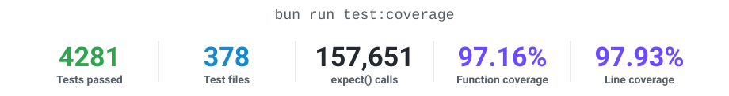

<div align="center">

<p><a href="../../README.md">简体中文</a> · <a href="../en/README.md">English</a> · <b>日本語</b></p>

<picture>
  <source media="(prefers-color-scheme: dark)" srcset="../../pictures/banner_dark.jpg">
  <source media="(prefers-color-scheme: light)" srcset="../../pictures/banner_light.jpg">
  
</picture>

<h1>
  <a href="https://t.me/copy_ninjia_bot" title="アバターをクリックしてサンプル Bot を開く"></a>
  Copy Ninjia
</h1>

<p><sub>アバターをクリックすると、サンプル Bot に移動できます：<a href="https://t.me/copy_ninjia_bot">@copy_ninjia_bot</a></sub></p>

<picture>
  <source media="(prefers-color-scheme: dark)" srcset="../../pictures/tagline_ja_dark.svg">
  <source media="(prefers-color-scheme: light)" srcset="../../pictures/tagline_ja_light.svg">
  
</picture>

**本番コード、テスト、ドキュメントをすべて AI が書く純 AI 開発プロジェクト** — 人間はアーキテクチャを設計し、AI と共同で全コミットをレビュー

<p align="center">
  <a href="https://bun.sh/"></a>
  <a href="https://www.typescriptlang.org/"></a>
  <a href="https://grammy.dev/"></a>
  <a href="https://ai.google.dev/"></a>
  <a href="https://platform.openai.com/docs/"></a>
  <a href="https://api-docs.deepseek.com/"></a>
</p>

<p align="center">
  <a href="#pure-ai-development"></a>
  <a href="#pure-ai-development"></a>
  <a href="05-dev-workflow.md"></a>
  <a href="05-dev-workflow.md"></a>
  <a href="../../LICENSE"></a>
</p>

メッセージの復唱と人格模倣は表面にすぎません。その下では、複数の Worker が、障害復旧、上限付きキャッシュ、競合対策を備えたグループチャット自動化システムを支えています。

---

🧬 [純 AI 開発](#pure-ai-development) • ✨ [機能](#features) • 🎭 [Copy モード](#copy-modes) • 🎮 [コマンドと権限](#commands-and-permissions) • 🚀 [クイックスタート](#quick-start) • 📚 [開発者ドキュメント](conntent-table.md)

</div>

---

<a id="pure-ai-development"></a>

## 🧬 純 AI 開発

このリポジトリの production コード、テストケース、そして README 自体も、すべて AI が書いています。人間はコードを書きませんが、決して席を外してはいません。アーキテクチャを設計し、すべてのコミットを AI と共同でレビューします。

<table width="100%">
<tr><th width="18%" align="left">工程</th><th width="32%" align="left">担当者</th><th width="50%" align="left">役割</th></tr>
<tr><td>📐&nbsp;設計</td><td><b>Asashishi</b>（本プロジェクト唯一の人間）</td><td>システム境界、Worker 分割、永続化・復元戦略の決定</td></tr>
<tr><td>⌨️&nbsp;実装</td><td><b>Claude Code</b> · <b>Codex</b> · <b>Antigravity</b></td><td>100% の production コード、テスト、ドキュメントを作成</td></tr>
<tr><td>🧾&nbsp;レ&#8288;ビ&#8288;ュ&#8288;ー</td><td><b>Asashishi</b> × AI</td><td>全コミットを人間と AI が共同レビューしたうえで取り込み</td></tr>
<tr><td>🔬&nbsp;監査</td><td><b>Fable 5</b> · <b>GPT-5.6（Sol）</b> · <b>Opus 5</b> 等の先端モデル</td><td>リポジトリ全体の交差レビューを重ね、指摘項目を堅牢化コミットへ即時還元</td></tr>
<tr><td>🛰️&nbsp;安&#8288;全&#8288;演&#8288;習</td><td>同上の先端モデル群</td><td>クラッシュ復元・競合・悪意ある入力・資源枯渇などのシナリオ演習をすべて通過</td></tr>
</table>

レビューは一回限りの儀式ではありません。毎回のコミットレビュー、先端モデルによるリポジトリ全体の監査、安全演習から得た知見を、新たな制約としてコードへ反映しています。

### 🧪 プロジェクト品質

<p align="center">
  <picture>
    <source media="(prefers-color-scheme: dark)" srcset="../../pictures/coverage_dark.svg">
    <source media="(prefers-color-scheme: light)" srcset="../../pictures/coverage_light.svg">
    
  </picture>
</p>

<p align="right"><sub><a href="#copy-ninjia">⬆️ ページ上部へ</a></sub></p>

<a id="features"></a>

## ✨ 機能

<table width="100%">
<tr>
<td align="left" valign="top" width="33%">
  <p><b>🪞 高精度な復唱</b></p>
  <p>ユーザーやチャンネルを指定してメッセージを復唱します。そのまま、反転、「nya~」追加、日本語翻訳の 4 モードに対応します。</p>
</td>
<td align="left" valign="top" width="33%">
  <p><b>🥷 アバター盗用</b></p>
  <p><code>/copy</code> でアバターを自動同期。<code>/steal_icon</code> で copy 状態に入らずアバターのみ複製も可能。</p>
</td>
<td align="left" valign="top" width="33%">
  <p><b>🤖 AI チャット</b></p>
  <p>ペルソナに基づく自律行動。発言、スタンプ、リアクション、画像生成、作曲はすべてツールで、そのラウンドで何をいくつどの順に行うかはモデル自身が決めます。モデル層は差し替え可能な provider で、既定は Gemini、鍵が無い場合は OpenAI に fallback します。</p>
</td>
</tr>
<tr>
<td align="left" valign="top">
  <p><b>👁️ マルチモーダル & 創作</b></p>
  <p>画像、動くスタンプ、GIF フレーム、そして音声メッセージ（逐語で文字起こしして文脈に取り込み）を理解し、要求に応じて新規画像生成や既存素材の編集を実行。Gemini 側ではリクエストに応じてボーカル入りの 1 曲を書き上げ、カバー画像ごとグループへ投稿します。</p>
</td>
<td align="left" valign="top">
  <p><b>🔎 リアルタイム事実確認</b></p>
  <p>Google 検索や東京の天気などのツールに接続。検索済みのラウンドではサンプリング温度を下げ、結果に沿って回答させます。</p>
</td>
<td align="left" valign="top">
  <p><b>🧠 コンテキスト記憶</b></p>
  <p>上限付きの逐語コンテキストと複数ラウンドの圧縮要約を保持し、多層の返信チェーンを追跡します。アトミックな永続化により確実に復元できます。</p>
</td>
</tr>
<tr>
<td align="left" valign="top">
  <p><b>🎭 気分と人間らしさ</b></p>
  <p>グループの気分は 2〜4 時間ごとに再抽選され、東京の天気と時間帯で重み付けされます。発言前には文字数に応じた入力の間を挟み、たまにタイプミスして直します。</p>
</td>
<td align="left" valign="top">
  <p><b>🛡️ 参加認証</b></p>
  <p>新規メンバーに 90 秒のボタン認証。人間は本人だけがクリックでき、Bot アカウントに限り許可リストのユーザーが代理認証できます。招待者を特定できる非匿名管理者からの招待と、連携ディスカッショングループでの活動は免除されます。</p>
</td>
<td align="left" valign="top">
  <p><b>🚨 Anti-Raid</b></p>
  <p>参加頻度を監視し、閾値に達するとグループへの招待を停止して異常な参加者を処置します。再起動後も状態を復元できます。</p>
</td>
</tr>
<tr>
<td align="left" valign="top">
  <p><b>📮 広告検出</b></p>
  <p>送信者ごとに 90 秒間のメッセージ列へまとめ、設定した広告検出 model が判定。protected identity 以外が命中した場合は <code>/block</code> と同じ処分を行います。</p>
</td>
<td align="left" valign="top">
  <p><b>🎲 今日のおみくじ</b></p>
  <p>Inline Mode による決定論的なくじ引きです。日ごとに切り替わる HMAC 署名鍵により、再起動後も状態と署名レシートの一貫性を保ちます。</p>
</td>
<td align="left" valign="top">
  <p><b>🌐 複数グループ連携</b></p>
  <p><code>/block</code> 一つで管理下の全グループから同期 BAN し、id を永続ブロックリストへ記録。以降は監視中のどのグループに入室しても即 kick され、新たに管理者になったグループも自動で掃除します。</p>
</td>
</tr>
</table>

<p align="right"><sub><a href="#copy-ninjia">⬆️ ページ上部へ</a></sub></p>

<a id="copy-modes"></a>

## 🎭 Copy モード

copy 対象はグローバルで唯一です。1 つのインスタンスは同時に 1 つの対象にしか「変身」できませんが、copy 自体はコマンドを実行したグループでのみ発生します。`/stop_copy` は任意のグループから停止できます。

| コマンド | 挙動 |
| :---: | :--- |
| `/copy` | メッセージをそのまま復唱 |
| `/r_copy` | 書記素クラスタ単位でテキストを反転 |
| `/nya_copy` | テキストの末尾に「nya~」を追加 |
| `/ja_copy` | Google Cloud Translate で日本語翻訳してから復唱 |
| `/steal_icon` | アバターのみコピー |
| `/reset_icon` | bot 本来のアバターに戻す |
| `/stop_copy` | グローバル copy 状態を停止し、アバターも元に戻す |

対象は「メッセージへの返信」または `@username` で指定します。

- **ユーザー名での検索には、Bot がそのアカウントを以前に観測している必要があります。** 改名、ユーザー名の削除、ユーザー名の再割り当てが行われると、古い別名は直ちに無効になります。`/block` や `/unblock` のような破壊的操作では、過去のユーザー名に頼らず、対象メッセージへの返信か、ユーザー id の直接指定（この 2 つのコマンドは裸の id も受け付けます）を優先してください。
- **匿名管理者が現在のグループとして発言した場合、そのグループ自体が copy 対象**となるため、グループのアバターを取得してその「外見」を再現できます。`/block` は現在のグループをメンバー対象として扱うことを拒否します。
- **一般ユーザーの copy 系コマンドには 5 分間のグローバル cooldown があり**、allowlist 境界の内側にいる identity は対象外です（SQLite allowlist table の entry と、常に内側にいる `SUPER_ADMIN_USER_ID`）。

<p align="right"><sub><a href="#copy-ninjia">⬆️ ページ上部へ</a></sub></p>

<a id="commands-and-permissions"></a>

## 🎮 コマンドと権限

<table width="100%">
<tr><th width="26%" align="left">コマンド</th><th width="19%" align="center">権限</th><th width="55%" align="left">説明</th></tr>
<tr><td><code>/copy</code> <code>/r_copy</code> <code>/nya_copy</code> <code>/ja_copy</code></td><td align="center">メンバー</td><td>各 copy モードを開始</td></tr>
<tr><td><code>/stop_copy</code></td><td align="center">メンバー</td><td>現在のグローバル copy を停止し、アバターも復元</td></tr>
<tr><td><code>/steal_icon</code></td><td align="center">メンバー</td><td>アバターのみ取得</td></tr>
<tr><td><code>/reset_icon</code></td><td align="center">メンバー</td><td>既定アバターに戻す</td></tr>
<tr><td><code>/&lt;漢字 1~2 文字&gt;</code></td><td align="center">メンバー</td><td>アクションコマンド。<code>/咬</code> や <code>/揪住</code> で「実行者 咬了 対象！」と応答し、成功結果は長期保持</td></tr>
<tr><td><code>/quiet [1-15]</code></td><td align="center">メンバー</td><td>自発的発言を N 分間停止（既定 3 分）</td></tr>
<tr><td><code>/unquiet</code></td><td align="center">メンバー</td><td>静寂モードを早期解除</td></tr>
<tr><td><code>/mute … &lt;期間&gt;</code> <code>/unmute</code></td><td align="center"><code>isCanMute</code> / <code>isCanUnMute</code></td><td>スーパーグループで一時ミュート／早期解除。返信、<code>@username</code>、user id を対象にでき、期間は <code>m/h/d</code> で指定します</td></tr>
<tr><td><code>/gag … [5|10|15] [道具]</code><br><code>/ungag …</code></td><td align="center"><code>isCanGag</code></td><td>user/channel identity の発言を Bot の inline 経路だけに制限、または対象を指定して早期解除。返信、<code>@username</code>、user id、channel の負の id を指定できます</td></tr>
<tr><td><code>/block</code></td><td align="center"><code>isCanBlock</code></td><td>ブロックリスト登録：永続的に記録し、全管理グループで BAN。対象はメッセージへの返信・<code>@username</code>・ユーザー id のいずれでも指定できます</td></tr>
<tr><td><code>/unblock</code></td><td align="center"><code>isCanUnBlock</code></td><td>完全解除：動的ブロックリストから id を削除し、Bot が管理する全グループの BAN を解除します。対象指定は <code>/block</code> と同じで、チャンネルの負の id も受け付けます。静的ブロックリストの identity は拒否します</td></tr>
<tr><td><code>/ai_chat enable|disable</code></td><td align="center"><code>isCanControllAIPermission</code></td><td>このグループの AI チャットを切り替え</td></tr>
<tr><td><code>/ad_detect enable|disable</code></td><td align="center"><code>isCanControllAdDetectPermission</code></td><td>このグループの広告検出を切り替え。protected identity 以外の命中時は <code>/block</code> と同じ処分</td></tr>
<tr><td><code>/bot_status</code></td><td align="center">メンバー</td><td>グローバル model capability、Telegram 429 outbound queue、有効な gag 数、このグループで有効な機能を表示</td></tr>
<tr><td><code>/query_mood</code></td><td align="center">メンバー</td><td>このグループで現在有効な AI の気分を、再抽選せずに表示</td></tr>
<tr><td><code>/switch_mood</code></td><td align="center"><code>isCanSwitchMood</code></td><td>AI 有効グループの気分を即時再抽選</td></tr>
<tr><td><code>/ja_copy enable|disable</code></td><td align="center"><code>isCanControllJATranslatePermission</code></td><td>日本語翻訳機能を切り替え（既定 OFF）</td></tr>
<tr><td><code>/init enable|disable</code></td><td align="center"><code>SUPER_ADMIN_USER_ID</code></td><td>このグループの主要処理ゲートを切り替え</td></tr>
<tr><td><code>/batch_kick &lt;Nm|Nh|Nd&gt;</code></td><td align="center"><code>SUPER_ADMIN_USER_ID</code></td><td>スーパーグループで、rolling 24 時間以内の指定 window に入室し、まだ在室しているメンバーを kick。blocklist には追加しません</td></tr>
<tr><td><code>/permission query</code><br><code>/permission help</code></td><td align="center">allowlist identity</td><td>呼び出し元自身の全 permission を表示、または permission 説明を JSON で一覧表示。<code>help</code> は長期保持し、<code>query</code> は 30 秒後に削除</td></tr>
<tr><td><code>/permission …</code></td><td align="center"><code>SUPER_ADMIN_USER_ID</code></td><td>既存 allowlist user/channel の個別 permission を変更。<code>all</code> ですべて有効化</td></tr>
<tr><td><code>/white … enable|disable</code></td><td align="center"><code>SUPER_ADMIN_USER_ID</code></td><td>返信、<code>@username</code>、user id、channel id で allowlist identity を追加・削除</td></tr>
<tr><td><code>/send &lt;group_id&gt;</code> <code>/send finish</code></td><td align="center"><code>SUPER_ADMIN_USER_ID</code>（PM 限定）</td><td>Bot との個人チャットから指定グループへの転送セッションを開始/終了</td></tr>
</table>

> **permission 列の読み方**：`isCanXxx` を挙げた行はその permission key で認可されます。`SUPER_ADMIN_USER_ID` という identity 自体が**すべて**の permission key を持つため、SQLite allowlist table に entry がなくてもこれらの行はすべて使えます。`SUPER_ADMIN_USER_ID` を挙げた行だけが identity のみで決まり、allowlist では付与できません。

### 挙動の詳細

- **コマンドの入口ゲート**：グループコマンドは一律 `/init` ゲートを通ります。未初期化グループで受け付けるのはスーパー管理者の `/init` だけなので、`/permission` と `/white` も初期化済みグループで使う必要があります。private chat で許可される slash command は `/send` だけです。
- **アクションコマンド**：名前は `first_name last_name` 形式で、公開ユーザー名があればプロフィールへリンクします。対象の指定方法は他のコマンドと同じで、返信または `@username` です。成功したアクション結果は `/permission help` と同様に長期保持し、対象不足・引数エラー・`/x` の使い方提示は引き続き 30 秒後に削除します。
- **`/gag` の発言制限**：グローバルで同時に有効な対象は最大 5 件です。同一 chat に複数対象を置けますが、同じ identity は重複できません。入口は初期化済みで Bot がメッセージを削除できるグループだけに作成します。通常 user には、まずボタンなしの公開 status を送り、続いて `receiver_user_id` で限定された「发言」ボタン付きの一時入口を送ります。channel にはボタン付きの公開 status を 1 通だけ送ります。通常の `@bot` query は常におみくじだけへ進みます。user と channel のボタンはいずれも `gag:<対象 Telegram id>`（user は正数、channel は負数）だけを prefill します。最初の空白より前に MD5、digest、random token、group id、その他の metadata を追加してはいけません。Telegram の inline query は現在の具体的な chat id を公開せず、Bot が送信前に遮断できる hook もないため、そのような追加フィールドでは実際の入力 chat を認証できません。通常入口は current-chat button を使います。生成結果は hidden text link に `<対象プロフィール>#<セッション chat id>` を保持します。この公開 URL は検証材料であり、秘密や認証 token ではありません。着地後は、リンク内の対象とセッション chat、実際の `from.id`/`sender_chat.id`、実際の `message.chat.id` を同時に検証し、identity または chat が不一致なら直ちに削除します。channel 候補の title にグループ名は表示しません。`gag:` を持つ query はすべて gag domain が排他的に処理し、不正・期限切れ・identity 不一致では空結果だけを返して、おみくじへ fallback しません。開始 status は 30 秒の command cleanup を通らず、対象指定の `/ungag`、timeout、chat-runtime teardown のいずれかで各 message id を使って削除します。いずれかの削除失敗時は上限付き ending state を保持して有限回 retry し、すべての status が実際に消えるまで同じ対象を再 gag できません。そのため `/ungag` には返信、`@username`、identity id のいずれかが必須です。発言 rendering は各 grapheme に対して 75% の確率で後ろへ `...` を追加し、残り 25% では grapheme 全体を六つの filler のいずれかへ等確率で置き換えます。
- **`/block` ブロックリスト**：対象は返信・`@username`・ユーザー id の直接指定（正の整数。グループやチャンネルの負の id は対象外）で指名できます。id が最も確実です——手放されたユーザー名は他人が再登録でき、一方このコマンドは取り消せません。id が永続ブロックリストに入ると、監視中のどのグループの入室更新でも即 kick されます。あるグループで「管理者権限がある」と「`/init enable` 済み」が揃った瞬間には（どちらが先でも）、すでに在室しているリスト該当者もまとめて掃除します。`/unblock` はリスト全体をファイルへ原子的に書き直し、既定で Bot が管理する全グループの BAN も解除します。対象が動的リストにいなくてもチャット横断解除は実行します。`/unblock` は `/block` にはない指定方法をもう 1 つ受け付けます——**チャンネルの負の id** です。チャンネル被りは `sender_chat` としてリストに入りますが（チャンネルのメッセージへ返信しての `/block`、広告検出の命中）、広告検出は元メッセージを削除し、公開 username の無いチャンネルはキャッシュにも載りません。負の id を拒否したままだと、そうした項目は二度と消せなくなります。逆方向を開かないのは、`/block` で会話 id を貼り間違えると会話 identity 全体を、しかも取り消せない形で BAN してしまうからです。
- **`/batch_kick` の低速 wave cleanup**：初期化済みスーパーグループでスーパー管理者だけが使用できます。引数は `30m`、`2h`、`1d` のような 24 時間以内の window 1 個です。入室ログから window 内の user ごとの最終入室を取り、まだ在室している対象を小さい固定並行数で kick します。blocklist へは追加せず、スーパー管理者・allowlist identity・恒久 blocklist の対象は通常の kick 対象として扱いません。
- **`/ad_detect` 広告検出**：送信者ごとの 90 秒 message bundle を `agent.ad_detect` の model が判定し、命中時は `/block` と同じ処分を行います。Bot が管理者の chat だけで発火し、判定基準は [`config/ad_samples.json`](../../config_example/ad_samples.json) です。
- **連投ミュート**：チャットごとに既定で無効で、`isCanControllFloodControlPermission` を持つ identity（スーパー管理者は常に持ちます）が `/flood_control enable` で有効化します。同一人物が同一スーパーグループで 1 分以内に 15 件発言すると、その場で 3 分間ミュートし、グループに一言告知します（告知はミュート解除時に自動削除）。解除は Telegram 側が自動で行い、ブロックリストにも載せず、メッセージも削除しません。Bot が実際に「メンバーを制限」権限を持つときだけ発火し、オーナー/管理者、チャンネル名義と匿名管理者はカウントしません。bypass は `isCanBypassFloodControl` だけで決まり、allowlist entry では既定 `true`、明示的に `false` にした場合だけカウント対象になります。`SUPER_ADMIN_USER_ID` は常にこれを持つためカウントされません。
- **`/send` 転送**：開始前に対象へ到達できるか確認し、期間中はスーパー管理者の各メッセージを対象グループへ 1 回ずつ転送します。到達できなくなった場合はセッションを終了して通知します。転送状態は `state.json` に保存され、再起動後も復元されます。このコマンドは Telegram のコマンドメニューには表示されず、グループ内や他のユーザーから呼び出されても応答しません。

> [!TIP]
> **漢字 1~2 文字のアクションコマンドは事前登録が不要**で、どの漢字でも使えます。Telegram のコマンド名は ASCII（ラテン文字・数字・アンダースコア）のみのため：
> - コマンドメニューにも補完にも現れません。メニューにはプレースホルダー項目 `/x` だけを置いています。コマンド名の `x` がその変数であり、任意の漢字 1~2 文字に置き換えることを示します。実行すると使い方を 1 行返して処理を終え、通常メッセージとして AI/copy pipeline へは流しません。
> - `/咬人人` のような 3 文字以上はアクションコマンドとして扱わず、通常のメッセージ処理へ流します。
> - 登録不要で誰でも自由に作れるため、グローバルな sliding window 制限があり、グループ・ユーザーを合算して 90 秒あたり最大 450 回まで応答します。超過分は通知なしで黙って破棄されます。

> [!TIP]
> **`/luck_challenge` はスラッシュコマンドではありません。** 任意のチャットで `@Botのユーザー名 [お願い]` と入力して Inline Mode を使用します。BotFather で Inline Mode を有効にし、`/setinlinefeedback` を 100% に設定することをお勧めします。Inline query にはグローバルな sliding window 制限があり、応答は 90 秒あたり最大 300 回です。

<p align="right"><sub><a href="#copy-ninjia">⬆️ ページ上部へ</a></sub></p>

<a id="quick-start"></a>

## 🚀 クイックスタート

### 1. 環境

- Linux（読み取り可能な `/proc` が必要。ほかのプラットフォームではインスタンスロックが fail closed）
- Bun 1.3+
- Telegram Bot Token
- `config/agent.json` で有効にした各 AI 能力の API Key
- Google Cloud サービスアカウント JSON（`/ja_copy` 使用時のみ）

<details>
<summary><b>📦 ハードウェア構成の目安</b>（展開して表示）</summary>

<table width="100%">
<tr><th width="33%" align="left">規模</th><th width="26%" align="left">推奨スペック</th><th width="41%" align="left">備考</th></tr>
<tr><td>入門（低アクティブ、テキスト中心）</td><td>2 vCPU / 2 GB RAM / ローカル SSD</td><td>動作可能ですがメディアピーク時は CPU 競合が発生します。2 GB のスワップ領域を推奨します</td></tr>
<tr><td>軽量本番（テキスト中心）</td><td>4 vCPU / 2 GB RAM / ローカル SSD</td><td>2 GB はメディア処理ピーク時のメモリ確保に適しません。2 GB のスワップ領域を推奨します</td></tr>
<tr><td>推奨本番（1 グループあたり 1 日平均 1,000〜3,000 メッセージのアクティブグループ約 15 個）</td><td>4 vCPU / 4 GB RAM / ローカル SSD</td><td>2 GB のスワップ領域を推奨します</td></tr>
<tr><td>全群 AI 有効かつ画像・スタンプ多数</td><td>4 vCPU / 8 GB RAM</td><td>メディア処理と Base64 符号化に十分な余裕を確保</td></tr>
</table>

単一インスタンスでは、上記規模のアクティブグループを約 15 個以内に抑えることを推奨します。主な制約は総メンバー数ではなく、Telegram Bot API、設定した AI provider の quota、実際のメッセージ/メディア流量です。

</details>

### 2. インストール

```bash
git clone https://github.com/Asashishi/copy_ninjia.git
cd copy_ninjia
bun install
mkdir -p config
cp -n config_example/*.json config/
```

### 3. 設定

各 field、能力、必須関係、検証 rule は
[`config_example/README/ja.md`](../../config_example/README/ja.md) を参照してください。
`config/` は deployment 所有で Git の追跡対象外です。example で既存 file を上書きしてはいけません。

| ファイル / フィールド | 必須 | 説明 |
| :--- | :---: | :--- |
| `config/telegram.json` / `bot_token` | ✅ | BotFather が発行する Bot Token |
| `config/telegram.json` / `super_admin_user_id` | ✅ | スーパー管理者の正の安全整数 user ID |
| `config/agent.json` / 各能力 | feature ごと | provider、API key、endpoint、model を個別設定 |

`telegram.json` は network 接続前に厳密ロードします。Disk I/O Worker は allowlist、blocklist、未完了 removal を `database/storage.sqlite` から厳密復旧し、不正 schema、version、row は startup を拒否します。その他の deployment input は feature ごとに検証し、前提の欠落や不正は該当 feature を拒否し、その feature がすでに有効なら startup を拒否します。

AI の provider、API key、`base_url`、model は
[`config/agent.json`](../../config_example/agent.json) で能力ごとに個別設定します。
変更後は再起動が必要で、runtime model 切替 command は廃止されました。

> [!IMPORTANT]
> 例外は 1 つだけです。`state.json` で機能が有効なままなのに鍵や設定を取り除いた場合、そのスイッチは管理者が明確に入れたものなので、プロセスはチャット id と欠落項目を示して起動を拒否し、黙って何もしない状態にはなりません。先に `disable` するか、前提を復旧してください。

runtime file の場所を変える場合は process environment に `COPY_NINJIA_DATA_ROOT` を指定します。`state.json`、`bot.lock`、`logs/`、`memory/`、`database/` はそのディレクトリから派生し、`config/`、ペルソナ、`g-auth.json` は引き続きプロジェクトルートから読み込みます。

初回 startup 前に、service と同じ account / `COPY_NINJIA_DATA_ROOT` environment で identity storage を明示初期化します。2 つの一時 JSON は 1 回限りの migration input で、成功後に script が削除します。target database が存在する場合は上書きを拒否します。

```bash
test ! -e config/whitelist.json
test ! -e config/blocklist.json
printf '{}\n' > config/whitelist.json
printf '{"blockedIds":[]}\n' > config/blocklist.json
bun run migrate:identity-storage --apply
```

旧 deployment と schema v2 upgrade は [07 運用：Identity Storage Migration](07-operations.md#identity-storage-migration) を参照してください。

日本語翻訳を使用する場合は、サービスアカウントキーを `g-auth.json` としてプロジェクトルートに保存します。この file は `.gitignore` の対象です。

Telegram 側の設定：

1. BotFather で Bot Privacy Mode を OFF にする。
2. グループで Bot に管理者権限（削除、BAN、管理）を付与する。
3. Inline Mode を有効にする。
4. inline feedback を 100% に設定する。

### 4. 起動と確認

```bash
bun run check     # プロジェクト規約 + ESLint + TypeScript 厳格検査 + coverage test
bun run start     # ロングポーリング起動
```

Bot を初めてグループに追加した後、`SUPER_ADMIN_USER_ID` がグループ内で以下を実行します：

```text
/init enable
/ai_chat enable
```

> **言語について**：ユーザー向けの文言は簡体中国語のみで、本リポジトリは i18n を維持しません。応答は断片の連結で組み立てつつ Telegram `entities` のオフセットを算出しており、`/咬` のような中国語アクションコマンドは中国語の字形自体に依存しているため、語彙表では受け止められません。別の言語が必要な場合は fork して自分で書き換えてください（production コードでは中国語の文字列または template literal を含むソース行が 78 ファイルへ約 805 箇所、ほかに `prompt/persona.md` と `config/*.json`）。理由と手順は [06 変更レシピ](06-modification-guide.md) にあります。

<p align="right"><sub><a href="#copy-ninjia">⬆️ ページ上部へ</a></sub></p>

<a id="development"></a>

## 📚 開発者ドキュメントとアーキテクチャガイド

Copy Ninjia のアーキテクチャ概要、モジュールマップ、実行時の正式な不変条件、テストフロー、運用マニュアルは、**[開発者ドキュメント TOP](conntent-table.md)** にまとめています：

| トピック | 内容と概要 | リンク |
| :--- | :--- | :---: |
| 🏗️ **アーキテクチャ** | メインスレッド + 3 Worker トポロジー、メッセージ処理と起動・停止順序 | [📖 02 アーキテクチャ](02-architecture.md) |
| 🗺️ **ソースコード案内** | `packages/` 各サブドメインの役割分担とコード配置ツリー | [📖 03 ディレクトリマップ](03-directory-map.md) |
| ⚡ **権威的不変条件** | モジュール間状態隔離、並行上限、アトミック保存契約 | [📖 04 権威的不変条件](04-invariants.md) |
| 🧪 **開発とテスト** | `bun run check` 品質ゲート、テスト環境隔離と障害注入スイート | [📖 05 開発フロー](05-dev-workflow.md) |
| 🛠️ **変更レシピ** | コマンド追加、パラメータ調整、AI ツール追加、schema 移行手順 | [📖 06 変更レシピ](06-modification-guide.md) |
| 🛡️ **運用マニュアル** | systemd デプロイ、`COPY_NINJIA_DATA_ROOT`、バックアップとトラブルシューティング | [📖 07 運用マニュアル](07-operations.md) |

---

<div align="center">

<picture>
  <source media="(prefers-color-scheme: dark)" srcset="../../pictures/footer_ja_dark.svg">
  <source media="(prefers-color-scheme: light)" srcset="../../pictures/footer_ja_light.svg">
  
</picture>

*人間は 1 行もコードを書きませんが、決して舞台を降りませんでした。設計図を描いた後も、すべてのコミットを AI と共同でレビューしています。*

</div>
