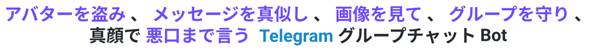

<div align="center">

<p><a href="../../README.md">简体中文</a> · <a href="../en/README.md">English</a> · <b>日本語</b></p>

<picture>
  <source media="(prefers-color-scheme: dark)" srcset="../../public/banner_dark.jpg">
  <source media="(prefers-color-scheme: light)" srcset="../../public/banner_light.jpg">
  
</picture>

<a id="copy-ninjia"></a>

<h1>
  <a href="https://t.me/copy_ninjia_bot" title="アバターをクリックしてサンプル Bot を開く"></a>
  
</h1>

<p><sub>アバターをクリックすると、サンプル Bot に移動できます：<a href="https://t.me/copy_ninjia_bot">@copy_ninjia_bot</a></sub></p>

<picture>
  <source media="(prefers-color-scheme: dark)" srcset="../../public/tagline_ja_dark.svg">
  <source media="(prefers-color-scheme: light)" srcset="../../public/tagline_ja_light.svg">
  
</picture>

**本番コード、テスト、ドキュメントをすべて AI が書く純 AI 開発プロジェクト** — 人間はアーキテクチャを設計し、AI と共同で全コミットをレビュー

<p align="center">
  <a href="https://bun.sh/"></a>
  <a href="https://www.typescriptlang.org/"></a>
  <a href="https://www.sqlite.org/"></a>
  <a href="https://grammy.dev/"></a>
  <a href="https://www.anthropic.com/"></a>
  <a href="https://platform.openai.com/docs/"></a>
  <a href="https://ai.google.dev/"></a>
</p>

<p align="center">
  <a href="#pure-ai-development"></a>
  <a href="#pure-ai-development"></a>
  <a href="05-dev-workflow.md"></a>
  <a href="05-dev-workflow.md"></a>
  <a href="../../LICENSES/LICENSE"></a>
</p>

メッセージの復唱と人格模倣は表面にすぎません。その下では、複数の Worker が、障害復旧、上限付きキャッシュ、競合対策を備えたグループチャット自動化システムを支えています。

---

🧬 [純 AI 開発](#pure-ai-development) • ✨ [機能](#features) • 🎮 [コマンドと権限](#commands-and-permissions) • 🚀 [クイックスタート](#quick-start) • 🤖 [BotFather 設定](#botfather-setup) • ❓ [よくある質問](11-faq.md) • 📚 [開発者ドキュメント](content-table.md)

</div>

---

<a id="pure-ai-development"></a>

## 🧬 純 AI 開発

このリポジトリの production コード、テストケース、そして README 自体も、すべて AI が書いています：

<table width="100%">
<thead>
  <tr>
    <th width="18%" align="left">工程</th>
    <th width="32%" align="left">担当者</th>
    <th width="50%" align="left">役割</th>
  </tr>
</thead>
<tbody>
  <tr>
    <td><nobr>📐 <b>設計</b></nobr></td>
    <td><b>Asashishi</b></td>
    <td>システム境界、Worker 分割、永続化・復元戦略の決定</td>
  </tr>
  <tr>
    <td><nobr>⌨️ <b>実装</b></nobr></td>
    <td><b>Claude Code</b> · <b>Codex</b> · <b>Antigravity</b></td>
    <td>100% の production コード、テスト、ドキュメントを作成</td>
  </tr>
  <tr>
    <td><nobr>🧾 <b>レビュー</b></nobr></td>
    <td><nobr><b>Asashishi</b> × AI</nobr></td>
    <td>全コミットを人間と AI が共同レビューしたうえで取り込み</td>
  </tr>
  <tr>
    <td><nobr>🔬 <b>監査</b></nobr></td>
    <td><b>GPT</b> · <b>Claude</b></td>
    <td>リポジトリ全体の交差レビューを重ね、指摘項目を堅牢化コミットへ即時還元</td>
  </tr>
  <tr>
    <td><nobr>🛰️ <b>安全演習</b></nobr></td>
    <td>同上の先端モデル群</td>
    <td>クラッシュ復元・競合・悪意ある入力・資源枯渇などのシナリオ演習をすべて通過</td>
  </tr>
</tbody>
</table>

毎回のコミットレビュー、先端モデルによるリポジトリ全体の監査、安全演習から得た知見を、新たな権威的不変条件としてコードへ直接反映しています。

<p align="right"><sub><a href="#copy-ninjia">⬆️ ページ上部へ</a></sub></p>

## 🧪 プロジェクト品質

<p align="center">
  <picture>
    <source media="(prefers-color-scheme: dark)" srcset="../../public/coverage_dark.svg">
    <source media="(prefers-color-scheme: light)" srcset="../../public/coverage_light.svg">
    
  </picture>
</p>

ベンチマークの計測値（コールド/ホットパス · 総スループットと総 I/O · エンドツーエンドのチェーン遅延）は **[📊 10 パフォーマンスベンチマーク](10-performance.md)** にあります。

<p align="right"><sub><a href="#copy-ninjia">⬆️ ページ上部へ</a></sub></p>

<a id="features"></a>

## ✨ 機能

<table width="100%">
<tr>
<td align="left" valign="top" width="33%">
  <p><b>🪞 高精度な復唱</b><br>
  <sub>特定の対象を固定し、発言を1件ずつ復唱しながらアバターもリアルタイム同期。</sub></p>
</td>
<td align="left" valign="top" width="33%">
  <p><b>🌐 多言語翻訳</b><br>
  <sub>グループごとに翻訳セッションを開始し、以後の発言を指定の複数言語へ自動翻訳。</sub></p>
</td>
<td align="left" valign="top" width="33%">
  <p><b>🥷 アバター盗用</b><br>
  <sub>復唱は開始せず、対象のアバターのみを即座に模倣・同期。</sub></p>
</td>
</tr>
<tr>
<td align="left" valign="top" width="33%">
  <p><b>🤖 AI チャット</b><br>
  <sub>自律的に発言の可否や使用ツールを判断し、自然に対話。</sub></p>
</td>
<td align="left" valign="top" width="33%">
  <p><b>👁️ マルチモーダル &amp; 創作</b><br>
  <sub>画像と音声を理解し、画像生成や音声メッセージを生成してグループへ送信。</sub></p>
</td>
<td align="left" valign="top" width="33%">
  <p><b>🔎 リアルタイム事実確認</b><br>
  <sub>最新情報が必要な際は Web 検索や天気ツールを自律的に呼び出し。</sub></p>
</td>
</tr>
<tr>
<td align="left" valign="top" width="33%">
  <p><b>🧠 コンテキスト記憶</b><br>
  <sub>直近の文脈を保持し、上限超過分を要約して効率的に引き継ぎ。</sub></p>
</td>
<td align="left" valign="top" width="33%">
  <p><b>🎭 気分と人間らしさ</b><br>
  <sub>時間経過で気分が推移し、入力中（typing）の待機を挟んで返信。</sub></p>
</td>
<td align="left" valign="top" width="33%">
  <p><b>💒 グループ内抽選</b><br>
  <sub>グループ内で発言歴のあるメンバーをランダムに抽選し、アバターを表示。</sub></p>
</td>
</tr>
<tr>
<td align="left" valign="top" width="33%">
  <p><b>🛡️ 参加認証</b><br>
  <sub>新規参加者が制限時間内に認証ボタンを押さない場合、自動退出処分。</sub></p>
</td>
<td align="left" valign="top" width="33%">
  <p><b>🚨 Anti-Raid</b><br>
  <sub>参加頻度異常を検知して非公開モードへ移行し、招待権限を自動回収。</sub></p>
</td>
<td align="left" valign="top" width="33%">
  <p><b>📮 広告検出</b><br>
  <sub>連続メッセージを束ねて広告判定し、該当メッセージを即時削除・処分。</sub></p>
</td>
</tr>
<tr>
<td align="left" valign="top" width="33%">
  <p><b>🎲 今日のおみくじ</b><br>
  <sub>Inline Mode で抽選。同一ユーザー・同一日は決定論的に結果を固定。</sub></p>
</td>
<td align="left" valign="top" width="33%">
  <p><b>🌐 複数グループ連携</b><br>
  <sub>1 つのコマンドで管理対象の複数グループを横断して BAN を実行。</sub></p>
</td>
<td align="left" valign="top" width="33%">
  <p><b>💬 グループ Q&amp;A</b><br>
  <sub>登録済みの質問に一致した場合、AI を介さず直接即答。</sub></p>
</td>
</tr>
<tr>
<td align="left" valign="top" width="33%">
  <p><b>🖼️ ランダム画像庫</b><br>
  <sub>/h_image でスポイラー（ネタバレ防止）付き画像をランダム送信。権限保持者は返信で画像を収集でき、内容ハッシュで重複を防止。</sub></p>
</td>
<td align="left" valign="top" width="33%">
  <p><b>⏰ 定時送信</b><br>
  <sub>タイムゾーンを指定してテキスト・ファイル・音声・Web要約・画像を定期送信。単発実行やランダム間隔にも対応。</sub></p>
</td>
<td align="left" valign="top" width="33%">
  <p><b>🎨 ペルソナと通知口調</b><br>
  <sub>内蔵のメスガキ口調を <code>prompt/persona.md</code> で差し替え可能（<a href="../../prompt_example/persona.md">例</a>）。通知口調は明示設定を優先し、省略時はカスタム設定なら標準、内蔵設定ならメスガキ口調を採用。</sub></p>
</td>
</tr>
<tr>
<td align="left" valign="top" width="33%">
  <p><b>🤐 発言制限</b><br>
  <sub>/gag の対象者は専用ボタンから変形テキストのみ送信可能。期限切れや解除で通常状態に復帰。</sub></p>
</td>
<td align="left" valign="top" width="33%">
  <p><b>🫧 CJK アクション</b><br>
  <sub>返信で /咬 や /贴贴 など漢字 1〜2 文字のアクションを実行。事前登録は不要。</sub></p>
</td>
<td align="left" valign="top" width="33%">
  <p><b>🌊 連投対策</b><br>
  <sub>グループごとに発言頻度を監視して一時ミュート。免除権限も個別設定可能。</sub></p>
</td>
</tr>
<tr>
<td align="left" valign="top" width="33%">
  <p><b>🔎 ID・プロフィールの照会</b><br>
  <sub>/info でユーザーやチャンネルの公開情報、アイコン、グループ情報を照会（結果は30秒で自動削除）。</sub></p>
</td>
<td align="left" valign="top" width="33%">
  <p><b>🔐 きめ細かな権限管理</b><br>
  <sub>機能切替・画像収集・Q&amp;A管理などの権限を身元ごとに割り当て、ダッシュボードで一覧確認。</sub></p>
</td>
<td align="left" valign="top" width="33%">
  <p><b>📨 プライベート中継</b><br>
  <sub>スーパー管理者が個別チャットで /send を開始し、指定グループへ代理送信や音声読み上げ転送を実行。</sub></p>
</td>
</tr>
</table>

### AI プロンプトのキャッシュ率（実測を踏まえた保守的な推定）

| モデル提供元 | 保守的な参考範囲 |
| --- | --- |
| Gemini | 60%–70% |
| OpenAI | 80%–90% |
| Claude | 80%–90% |

- **Gemini**：各応答の初回リクエストでは、利用可能な場合に固定プレフィックスの明示的キャッシュを再利用し、後続リクエストでは暗黙的キャッシュを使います。サービス側の暗黙的キャッシュの有効期限切れと、初回リクエストで暗黙的キャッシュが未準備であることがミスの原因になります。
- **Claude**：リクエストは固定位置に `cache_control` ブレークポイントを 1 つずつ置き、Messages API がブロック境界でキャッシュにヒットさせます。キャッシュ有効期間が終了した後のリクエストはヒットしません。
- **OpenAI**：すべてのリクエストに、安定したプレフィックスから算出した `prompt_cache_key` を付けます。初回の格納、プレフィックスの変更、新しい動的内容でミスが発生します。

### ボイス・画像・記憶

<table width="100%">
<thead>
  <tr>
    <th width="24%" align="left">機能</th>
    <th width="76%" align="left">現在の仕様と動作</th>
  </tr>
</thead>
<tbody>
  <tr>
    <td><nobr>🎙️ <b>AI ボイス</b></nobr></td>
    <td>音色と文ごとの口調を設定可能。1 ターンにつき最大 <code>MAX_VOICES_PER_REPLY</code> 件、セリフの長さの上限は <code>VOICE_TEXT_MAX_CHARS</code>（UTF-16 コード単位）。送信成功後にセリフを記憶。</td>
  </tr>
  <tr>
    <td><nobr>📢 <b>管理者・定時ボイス</b></nobr></td>
    <td><code>/send</code> と cron で TTS リソースを共有し、セリフの長さの上限は <code>VOICE_OPERATOR_TEXT_MAX_CHARS</code>（UTF-16 コード単位）。定時ボイスは 1 ターンにつき 1 回だけ合成し、Telegram <code>file_id</code> を再利用。</td>
  </tr>
  <tr>
    <td><nobr>🖼️ <b>画像の記憶</b></nobr></td>
    <td>AI 生成画像は実際の内容を記録。<code>/wed</code>、<code>/h_image</code>、定時画像はプレースホルダーを記録し、返信時に画像認識。</td>
  </tr>
</tbody>
</table>

- **TTS 音声設定**：`config/dynamic/agent.json` で `agent.tts` の明示設定が必要です（Google、OpenAI 互換 `audio/speech`、xAI Grok `/tts` に対応。Google は `base_url` と `headers` によるゲートウェイ経由も可能）。任意の `bot_language`（`en` / `zh` / `ja`、既定 `ja`）で AI ボイスのセリフの言語を指定できます。プロジェクトルートの `prompt/voice_tool.md` で AI `send_voice` のツール説明全体を置き換えられます（再起動後に反映。例は [`prompt_example/voice_tool.md`](../../prompt_example/voice_tool.md)）。AI 返信の合成には `bot_language` に従って読み上げ言語指定が自動で追加されます。`style` は `/send`・cron と共用で声質だけを書きます。`bot_language` を変えるときは `style` と `voice_tool.md` も同じ言語に変えることを推奨します。
- **枠の独立管理**：`daily_limit`（既定 100）のうち `daily_reserve_quota`（既定 25）を管理者と cron 用に予約し、残りを AI 音声に割り当てます。両方の回数は独立して数え、カウントウィンドウ（`TTS_USAGE_WINDOW_MS`）はその中の最初のリクエストから起算され、ウィンドウ終了後の次のリクエストで新しいウィンドウが始まり、まとめてゼロに戻ります。
- **コンテキスト記録規則**：`/send` による中継メッセージや定時テキスト/音声は AI 記憶に自動記録されません。画像の自動記録は、グループで AI が有効かつ非復唱状態の場合に動作します。詳細は [11 よくある質問](11-faq.md)。

各機能の挙動・設定・境界は **[📚 開発者ドキュメント](content-table.md)** を参照してください。

<p align="right"><sub><a href="#copy-ninjia">⬆️ ページ上部へ</a></sub></p>

<a id="commands-and-permissions"></a>

## 🎮 コマンドと権限

コマンドは入口と権限レベルで認可されます：

- **一般グループメンバー**：復唱、翻訳、アクション、`/info` 照会、`/wed` 抽選、`/h_image` 閲覧などの基本チャット機能。
- **身元権限キー（`isCanXxx`）**：グループ管理・運用コマンド。`/bot_status`、`/mute` / `/unmute`、`/gag`、`/block`、`/h_image add` および各機能スイッチ。
- **スーパー管理者（`SUPER_ADMIN_USER_ID`）**：`/init`、`/permission` の権限変更、`/white disable` によるホワイトリスト削除、現在のグループでの `/batch_kick`、個別チャットでの `/send` 中継。`isCanWhiteOther` を持つホワイトリストの身元も、`/white enable` でデフォルト権限のメンバーを追加できます。

画像ライブラリと cron タスクの設定・使い方は [08 画像ライブラリと定時タスク](08-images-and-cron.md)、コールド移行手順は [運用マニュアル](07-operations.md) を参照してください。

全コマンド一覧と権限マトリクスは **[📖 09 コマンドと挙動リファレンス](09-commands.md)** にあります。

<p align="right"><sub><a href="#copy-ninjia">⬆️ トップへ戻る</a></sub></p>

<a id="quick-start"></a>

## 🚀 クイックスタート

### 動作環境

- **OS**：Linux（`/proc` が読み取り可能であること。他の OS ではインスタンスロックが fail-closed になります）。
- **Telegram 資格情報**：BotFather 発行の Bot Token と、スーパー管理者の Telegram User ID。
- **ランタイム**：ソース実行には [Bun](https://bun.sh/) 1.4.2 が必要です。バイナリ配布パッケージにはランタイムが内蔵されています。
- **外部サービス**：有効化する AI 各機能の API Key。`/translate` には Google Cloud サービスアカウント JSON が必要です。ハードウェア目安は [07 運用マニュアル](07-operations.md#ハードウェアの目安) を参照してください。

### ワンショットインストール

```bash
# 環境を自動判別し、対話式設定を開始
curl -fsSL https://raw.githubusercontent.com/Asashishi/copy_ninjia/master/install.sh | bash

# 方式を明示指定する場合：--binary（バイナリ配布版、推奨）または --source（ソースコード）
curl -fsSL https://raw.githubusercontent.com/Asashishi/copy_ninjia/master/install.sh | bash -s -- --binary
```

> [!TIP]
> - **インストール方式**：通常は対話で選択します。`--binary` はシステム Bun と git を使わずに配布パッケージを取得します。`--source` はソースをクローンし、不足する git と Bun の導入を試みます。
> - **対話式ウィザード**：資格情報の設定、SQLite 身元データベースの初期化、systemd 常駐サービスへの登録を自動で行います。既存のデプロイは現在のバージョンを維持します。

### 手動ソースインストール

```bash
# 1. リポジトリをクローンし依存関係をインストール
git clone https://github.com/Asashishi/copy_ninjia.git
cd copy_ninjia
bun install

# 2. 設定ディレクトリを作成しテンプレートをコピー（不足分のみ）
mkdir -p config/static config/dynamic
for example in config_example/static/*.json config_example/dynamic/*.json; do
  case "${example##*/}" in g-auth.json | cron.json) ;; *) cp -n "$example" "config/${example#config_example/}" ;; esac
done

# 3. config/static/bot.json を編集し、bot_token と super_admin_user_id を記入
```

初回起動前に、BotFather 側で Privacy Mode の無効化と Inline Mode の有効化を行ってください（詳細は [BotFather とグループ権限の設定](#botfather-setup)）。各設定値の仕様は [`config_example/README/ja.md`](../../config_example/README/ja.md)、詳細手順は [01 環境構築と初回起動](01-getting-started.md) にあります。

設定と[身元データベースの初期化](01-getting-started.md#identity-storage-の初期化)が完了したら、品質ゲート検証と Bot の起動を行います：

```bash
bun run check                          # すべての品質ゲート（規約の自己検査、ESLint、TypeScript、テスト、ホットパスゲート）を実行
bun run start                          # ロングポーリングを開始
```

### グループ初期化

Bot をグループに追加後、スーパー管理者がグループ内で以下のコマンドを順次実行して有効化します：

```text
/init enable
/ai_chat enable
/antiraid enable
```

> [!NOTE]
> Bot のユーザー向け応答文言は簡体字中国語のみです。文言のカスタマイズ方法は [06 変更レシピ](06-modification-guide.md) を参照してください。

<p align="right"><sub><a href="#copy-ninjia">⬆️ トップへ戻る</a></sub></p>

## 📚 開発者ドキュメントとアーキテクチャガイド

Copy Ninjia のアーキテクチャ概要、モジュールマップ、実行時の正式な不変条件、テストフロー、運用マニュアルは、**[開発者ドキュメント TOP](content-table.md)** にまとめています：

<table width="100%">
<thead>
  <tr>
    <th width="24%" align="left">シナリオ</th>
    <th width="44%" align="left">おすすめパス</th>
    <th width="32%" align="center">直接リンク</th>
  </tr>
</thead>
<tbody>
  <tr>
    <td><nobr>🚀 <b>初回実行</b></nobr></td>
    <td>依存関係、deployment 設定、Telegram API 権限および初回起動</td>
    <td align="center"><nobr><a href="01-getting-started.md">📖 01 環境構築</a></nobr></td>
  </tr>
  <tr>
    <td><nobr>🏗️ <b>アーキテクチャ理解</b></nobr></td>
    <td>メインスレッドと Worker の協調モデル、メッセージ処理のライフサイクルと復元</td>
    <td align="center"><nobr><a href="02-architecture.md">📖 02 アーキテクチャ</a></nobr></td>
  </tr>
  <tr>
    <td><nobr>🗺️ <b>コード検索</b></nobr></td>
    <td>モジュール役割分担、ソース構造マップおよび配置規約</td>
    <td align="center"><nobr><a href="03-directory-map.md">📖 03 ディレクトリマップ</a></nobr></td>
  </tr>
  <tr>
    <td><nobr>⚡ <b>不変条件</b></nobr></td>
    <td>モジュール横断の正式な制約、並行性保護と状態規約</td>
    <td align="center"><nobr><a href="04-invariants.md">📖 04 正式な不変条件</a></nobr></td>
  </tr>
  <tr>
    <td><nobr>🧪 <b>開発とテスト</b></nobr></td>
    <td><code>bun run check</code> 品質ゲート、テスト隔離機構とカバレッジ</td>
    <td align="center"><nobr><a href="05-dev-workflow.md">📖 05 開発フロー</a></nobr></td>
  </tr>
  <tr>
    <td><nobr>🛠️ <b>機能の追加・変更</b></nobr></td>
    <td>コマンド追加、パラメータ調整、AI ツール追加および schema 変更のレシピ</td>
    <td align="center"><nobr><a href="06-modification-guide.md">📖 06 変更レシピ</a></nobr></td>
  </tr>
  <tr>
    <td><nobr>🛡️ <b>本番運用</b></nobr></td>
    <td>systemd デプロイ、ハードウェアの目安、<code>COPY_NINJIA_DATA_ROOT</code>、バックアップと障害対応</td>
    <td align="center"><nobr><a href="07-operations.md">📖 07 運用マニュアル</a></nobr></td>
  </tr>
  <tr>
    <td><nobr>🖼️ <b>画像庫と定時タスク</b></nobr></td>
    <td>画像収集・内容重複判定・アルバム・定時ボイス・タイムゾーン・パス基準</td>
    <td align="center"><nobr><a href="08-images-and-cron.md">📖 08 画像ライブラリと定時タスク</a></nobr></td>
  </tr>
  <tr>
    <td><nobr>🎮 <b>コマンドを調べる</b></nobr></td>
    <td>全コマンド、権限の読み方、挙動の詳細（ルート README には概要だけ）</td>
    <td align="center"><nobr><a href="09-commands.md">📖 09 コマンドリファレンス</a></nobr></td>
  </tr>
  <tr>
    <td><nobr>📊 <b>計測値を見る</b></nobr></td>
    <td>コールド/ホットパス、総スループットと総 I/O、エンドツーエンドのチェーン遅延のリリースベンチマーク</td>
    <td align="center"><nobr><a href="10-performance.md">📖 10 パフォーマンス</a></nobr></td>
  </tr>
  <tr>
    <td><nobr>❓ <b>返信がないとき</b></nobr></td>
    <td>Bot が動いているのに反応しないときの確認リスト</td>
    <td align="center"><nobr><a href="11-faq.md">📖 11 よくある質問</a></nobr></td>
  </tr>
</tbody>
</table>

<p align="right"><sub><a href="#copy-ninjia">⬆️ トップへ戻る</a></sub></p>

<a id="botfather-setup"></a>

## 🤖 BotFather とグループ権限の設定

### BotFather の設定

<table width="100%">
<thead>
  <tr>
    <th width="26%" align="left">設定</th>
    <th width="32%" align="left">@BotFather での操作</th>
    <th width="42%" align="left">用途と説明</th>
  </tr>
</thead>
<tbody>
  <tr>
    <td><nobr><b>グループのプライバシー無効化</b></nobr></td>
    <td><kbd>/setprivacy</kbd> → <b>Disable</b></td>
    <td>グループの通常メッセージを受信（復唱、翻訳、AI 割り込み、Q&A が依存）。<br><sub>*注：変更後は Bot を再追加。グループ管理者の場合は不要。*</sub></td>
  </tr>
  <tr>
    <td><nobr><b>Inline Mode を有効化</b></nobr></td>
    <td><kbd>/setinline</kbd></td>
    <td>今日の運勢（<code>@Bot 所求事項</code>）と <code>/gag</code> 発言ボタンに対応。</td>
  </tr>
  <tr>
    <td><nobr><b>インラインフィードバック 100%</b></nobr></td>
    <td><kbd>/setinlinefeedback</kbd> → <b>100%</b></td>
    <td>運勢結果の確認と永続化の主経路。</td>
  </tr>
  <tr>
    <td><nobr><b>グループ参加を許可</b></nobr></td>
    <td><kbd>/setjoingroups</kbd> → <b>Enable</b></td>
    <td>Bot をグループに追加できるようにします（既定で有効）。</td>
  </tr>
  <tr>
    <td><nobr><b>Bot-to-Bot 通信</b></nobr><br><sub>（任意モード）</sub></td>
    <td>Bot Settings → Bot-to-Bot</td>
    <td><code>/translate</code> や <code>/copy</code> の対象が別の Bot のときに必要です。</td>
  </tr>
</tbody>
</table>

BotFather で `/setcommands` を手動設定する必要はありません。Bot は起動時に設定された通知口調でコマンドメニューを自動登録します（通知口調を省略しカスタムペルソナを配置した場合は通常版メニューを使用）。メニューはグループチャットにのみ表示されます。個別チャットはスーパー管理者の `/send` のみ受け付けるため、通常メニューは表示されません。

> [!WARNING]
> **Bot-to-Bot 通信モードの注意点**：
> このモードを有効にすると、管理者権限を持つかプライバシーモードを無効にしたグループで他の Bot の通常メッセージを受信できます。他の Bot から届いたメッセージはグローバルな入口制限を通ります。継続して活動する各 Bot の最初の `BOT_MESSAGE_ACTIVITY_LIMIT` 件だけを業務処理へ渡し、それ以降は通知せずに無視します。発言が `BOT_MESSAGE_ACTIVITY_TTL_MS` なければカウントをリセットします。記録できる他の Bot は最大 `BOT_MESSAGE_ACTIVITY_MAX_ENTRIES` 件で、満杯の間は新しい Bot のメッセージを無視します。この Bot 自身のメッセージは記録も遮断もしません。詳しくは [dispatch の不変条件](04-invariants.md) を参照してください。

### グループ内の管理者権限

Bot をグループ管理者に昇格させ、利用したい機能に応じて以下の権限を付与してください：

<table width="100%">
<thead>
  <tr>
    <th width="28%" align="left">管理者権限</th>
    <th width="72%" align="left">対象機能</th>
  </tr>
</thead>
<tbody>
  <tr>
    <td><nobr>🗑️ <b>メッセージの削除</b></nobr></td>
    <td><code>/gag</code> 発言制限、広告検出による自動削除、ブロックリスト入りチャンネル identity の発言削除。</td>
  </tr>
  <tr>
    <td><nobr>🚫 <b>メンバーの制限と BAN</b></nobr></td>
    <td>参加認証未完了者のキック、Anti-Raid 非公開化、<code>/block enable|disable</code>、<code>/mute</code> / <code>/unmute</code>、<code>/batch_kick</code>、連投ミュート、広告処分 BAN。</td>
  </tr>
</tbody>
</table>

> [!TIP]
> - **参加イベント依存**：認証機能は管理者権限に依存します（Telegram はメンバーの入退出イベントを管理者の Bot にのみ配信）。
> - **診断フィードバック**：権限不足時は不足している項目を明示提示します。`isCanViewBotStatus` を持つメンバーは `/bot_status` で現在の権限スナップショットを確認できます。
> - Bot が動いているのに返答がない場合は [11 よくある質問](11-faq.md) を参照してください。


---

<div align="center">

<picture>
  <source media="(prefers-color-scheme: dark)" srcset="../../public/footer_ja_dark.svg">
  <source media="(prefers-color-scheme: light)" srcset="../../public/footer_ja_light.svg">
  
</picture>

*人間は 1 行もコードを書きませんが、決して舞台を降りませんでした。設計図を描いた後も、すべてのコミットを AI と共同でレビューしています。*

</div>
